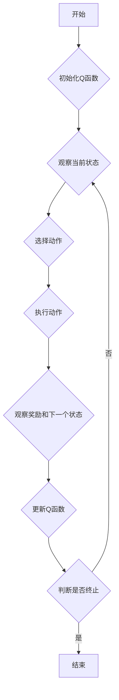

# 一切皆是映射：AI Q-learning博弈论视角解读

作者：禅与计算机程序设计艺术

## 1. 背景介绍

### 1.1 人工智能与博弈论的邂逅

人工智能（AI）发展至今，已在诸多领域取得了令人瞩目的成就。从图像识别到自然语言处理，从自动驾驶到医疗诊断，AI正以前所未有的速度改变着我们的生活。而在AI的众多研究方向中，强化学习（Reinforcement Learning, RL）作为一种模拟人类学习方式的机器学习方法，近年来备受关注。强化学习的核心思想是让智能体（Agent）通过与环境的交互，不断试错并学习最佳策略，最终实现目标最大化。

博弈论，作为研究理性个体之间策略互动的一门学科，与强化学习有着天然的联系。在多智能体系统中，每个智能体都可以看作是一个博弈参与者，它们的目标是通过与其他智能体的交互，最大化自身的利益。因此，将博弈论的思想引入强化学习，可以帮助我们更好地理解多智能体系统中的学习过程，并设计出更加智能的算法。

### 1.2 Q-learning：强化学习的基石

Q-learning作为一种经典的强化学习算法，其核心思想是学习一个状态-动作值函数（Q函数），该函数能够评估在当前状态下采取某个动作的长期价值。智能体通过不断地与环境交互，更新Q函数，最终学习到一个最优策略，使得在任何状态下都能选择价值最大的动作。

### 1.3 博弈论视角下的Q-learning

将博弈论的思想引入Q-learning，可以从以下几个方面进行解读：

* **智能体之间的相互影响**: 在多智能体环境下，每个智能体的行为都会影响其他智能体的收益。因此，每个智能体在学习过程中，都需要考虑其他智能体的策略，才能找到最优解。
* **纳什均衡与最优策略**: 博弈论中的纳什均衡是指一种策略组合，在该组合下，任何一个智能体都不能通过单方面改变策略来提高自身的收益。在多智能体Q-learning中，我们可以将每个智能体的最优策略看作是一个纳什均衡点。
* **合作与竞争**: 在某些情况下，智能体之间可以进行合作，共同完成目标；而在另一些情况下，智能体之间则会进行竞争，争夺有限的资源。博弈论可以帮助我们分析不同情况下智能体之间的关系，并设计相应的学习算法。

## 2. 核心概念与联系

### 2.1 强化学习的基本要素

* **智能体（Agent）**:  与环境交互并进行学习的主体。
* **环境（Environment）**:  智能体所处的外部世界，包括状态、动作和奖励等信息。
* **状态（State）**:  环境的当前状况，用于描述环境的特征。
* **动作（Action）**:  智能体在当前状态下可以采取的操作。
* **奖励（Reward）**:  环境对智能体动作的反馈，用于指导智能体学习。
* **策略（Policy）**:  智能体根据当前状态选择动作的规则。
* **值函数（Value Function）**:  用于评估状态或状态-动作对的长期价值。

### 2.2 Q-learning算法

Q-learning算法的核心是更新Q函数，其更新公式如下：

$$ Q(s_t, a_t) \leftarrow Q(s_t, a_t) + \alpha [r_{t+1} + \gamma \max_{a} Q(s_{t+1}, a) - Q(s_t, a_t)] $$

其中：

* $Q(s_t, a_t)$ 表示在状态 $s_t$ 下采取动作 $a_t$ 的价值。
* $\alpha$ 为学习率，控制学习速度。
* $r_{t+1}$ 为在状态 $s_t$ 下采取动作 $a_t$ 后获得的奖励。
* $\gamma$ 为折扣因子，用于平衡当前奖励和未来奖励的重要性。
* $s_{t+1}$ 为在状态 $s_t$ 下采取动作 $a_t$ 后转移到的下一个状态。

### 2.3 博弈论基本概念

* **博弈（Game）**:  多个理性个体之间进行的策略互动。
* **参与者（Player）**:  参与博弈的个体，对应于强化学习中的智能体。
* **策略（Strategy）**:  参与者在博弈中采取的行动方案，对应于强化学习中的策略。
* **收益（Payoff）**:  参与者在博弈结束后获得的回报，对应于强化学习中的奖励。
* **纳什均衡（Nash Equilibrium）**:  一种策略组合，在该组合下，任何一个参与者都不能通过单方面改变策略来提高自身的收益。

### 2.4 Q-learning与博弈论的联系

* 智能体在学习过程中，需要考虑其他智能体的策略，才能找到最优解，这与博弈论中理性个体的假设相符。
* 多智能体Q-learning的目标是找到一个纳什均衡点，使得所有智能体都能获得最大收益。
* 博弈论可以帮助我们分析不同情况下智能体之间的关系，例如合作、竞争等，并设计相应的学习算法。


## 3. 核心算法原理具体操作步骤

### 3.1  算法流程

Q-learning算法的流程如下：

1. 初始化Q函数，为所有状态-动作对赋予一个初始值。
2. 循环进行以下步骤，直到满足终止条件：
    * 观察当前状态 $s_t$。
    * 根据当前Q函数和探索策略，选择一个动作 $a_t$。
    * 执行动作 $a_t$，并观察环境的反馈，包括奖励 $r_{t+1}$ 和下一个状态 $s_{t+1}$。
    * 使用Q-learning更新公式更新Q函数：
        $$ Q(s_t, a_t) \leftarrow Q(s_t, a_t) + \alpha [r_{t+1} + \gamma \max_{a} Q(s_{t+1}, a) - Q(s_t, a_t)] $$
    * 将 $s_{t+1}$ 作为当前状态，进入下一步迭代。

### 3.2 探索与利用

在Q-learning算法中，探索和利用是两个重要的概念。

* **探索（Exploration）**:  尝试不同的动作，以发现环境中潜在的奖励。
* **利用（Exploitation）**:  根据当前的Q函数，选择价值最大的动作，以最大化累积奖励。

在算法执行过程中，需要平衡探索和利用之间的关系。

### 3.3  算法参数

Q-learning算法中，需要设置以下参数：

* **学习率（Learning rate）**: 控制学习速度，通常设置为一个较小的值，例如0.1。
* **折扣因子（Discount factor）**: 用于平衡当前奖励和未来奖励的重要性，通常设置为一个接近于1的值，例如0.99。
* **探索策略（Exploration policy）**: 用于控制探索的程度，常见的探索策略包括 $\epsilon$-greedy策略、softmax策略等。


## 4. 数学模型和公式详细讲解举例说明

### 4.1  Q函数的含义

Q函数 $Q(s, a)$ 表示在状态 $s$ 下采取动作 $a$ 的长期价值，也称为状态-动作值函数。

### 4.2  Q-learning更新公式推导

Q-learning更新公式的推导基于贝尔曼方程（Bellman Equation）。贝尔曼方程描述了状态值函数和动作值函数之间的关系：

$$ V(s) = \max_{a} [R(s, a) + \gamma \sum_{s'} P(s' | s, a) V(s')] $$

$$ Q(s, a) = R(s, a) + \gamma \sum_{s'} P(s' | s, a) \max_{a'} Q(s', a') $$

其中：

* $V(s)$ 表示状态 $s$ 的价值。
* $R(s, a)$ 表示在状态 $s$ 下采取动作 $a$ 后获得的即时奖励。
* $P(s' | s, a)$ 表示在状态 $s$ 下采取动作 $a$ 后转移到状态 $s'$ 的概率。

Q-learning更新公式可以看作是贝尔曼方程的增量更新形式。

### 4.3  举例说明

假设有一个迷宫环境，智能体的目标是找到迷宫的出口。迷宫环境可以用一个二维数组表示，数组中的每个元素表示一个格子，格子的值表示该格子的状态。智能体可以采取的动作包括向上、向下、向左、向右移动。

我们可以使用Q-learning算法来训练一个智能体，使其能够在迷宫中找到出口。

首先，我们需要定义Q函数。Q函数的输入是状态和动作，输出是该状态-动作对的价值。在本例中，状态可以用格子的坐标表示，动作可以用一个整数表示，例如0表示向上移动，1表示向下移动，2表示向左移动，3表示向右移动。

接下来，我们需要初始化Q函数。我们可以将所有状态-动作对的初始值设置为0。

然后，我们可以开始训练智能体。在每个训练回合中，智能体从迷宫的起点出发，根据当前Q函数和探索策略，选择一个动作，并执行该动作。执行动作后，智能体观察环境的反馈，包括奖励和下一个状态。如果智能体到达了迷宫的出口，则获得一个正奖励，否则获得一个负奖励。智能体根据Q-learning更新公式更新Q函数，并将下一个状态作为当前状态，进入下一步迭代。

## 5. 项目实践：代码实例和详细解释说明

### 5.1  迷宫环境代码

```python
import numpy as np

class Maze:
    def __init__(self, width, height, start, goal, obstacles):
        self.width = width
        self.height = height
        self.start = start
        self.goal = goal
        self.obstacles = obstacles
        self.reset()

    def reset(self):
        self.state = self.start

    def step(self, action):
        i, j = self.state
        if action == 0 and i > 0 and (i - 1, j) not in self.obstacles:
            i -= 1
        elif action == 1 and i < self.height - 1 and (i + 1, j) not in self.obstacles:
            i += 1
        elif action == 2 and j > 0 and (i, j - 1) not in self.obstacles:
            j -= 1
        elif action == 3 and j < self.width - 1 and (i, j + 1) not in self.obstacles:
            j += 1
        self.state = (i, j)
        if self.state == self.goal:
            reward = 1
        else:
            reward = -0.1
        return self.state, reward, self.state == self.goal
```

### 5.2  Q-learning算法代码

```python
import numpy as np

class QLearningAgent:
    def __init__(self, n_states, n_actions, learning_rate, discount_factor, epsilon):
        self.n_states = n_states
        self.n_actions = n_actions
        self.learning_rate = learning_rate
        self.discount_factor = discount_factor
        self.epsilon = epsilon
        self.q_table = np.zeros((n_states, n_actions))

    def choose_action(self, state):
        if np.random.uniform(0, 1) < self.epsilon:
            action = np.random.choice(self.n_actions)
        else:
            action = np.argmax(self.q_table[state, :])
        return action

    def learn(self, state, action, reward, next_state):
        self.q_table[state, action] += self.learning_rate * (reward + self.discount_factor * np.max(self.q_table[next_state, :]) - self.q_table[state, action])
```

### 5.3  训练代码

```python
# 初始化迷宫环境
width = 5
height = 5
start = (0, 0)
goal = (4, 4)
obstacles = [(1, 1), (2, 2), (3, 3)]
maze = Maze(width, height, start, goal, obstacles)

# 初始化Q-learning智能体
n_states = width * height
n_actions = 4
learning_rate = 0.1
discount_factor = 0.99
epsilon = 0.1
agent = QLearningAgent(n_states, n_actions, learning_rate, discount_factor, epsilon)

# 训练智能体
for episode in range(1000):
    maze.reset()
    state = maze.state
    total_reward = 0
    while True:
        action = agent.choose_action(state[0] * width + state[1])
        next_state, reward, done = maze.step(action)
        agent.learn(state[0] * width + state[1], action, reward, next_state[0] * width + next_state[1])
        total_reward += reward
        state = next_state
        if done:
            break
    print('Episode {}: Total reward = {}'.format(episode, total_reward))
```

## 6. 实际应用场景

### 6.1 游戏AI

Q-learning可以用于开发游戏AI，例如开发象棋、围棋等游戏的AI玩家。

### 6.2  机器人控制

Q-learning可以用于机器人控制，例如训练机器人完成抓取、导航等任务。

### 6.3  推荐系统

Q-learning可以用于开发推荐系统，例如根据用户的历史行为推荐商品或服务。

## 7. 总结：未来发展趋势与挑战

### 7.1  未来发展趋势

* **深度强化学习**: 将深度学习与强化学习相结合，可以处理更加复杂的学习任务。
* **多智能体强化学习**: 研究多个智能体之间的交互和学习，在机器人、自动驾驶等领域具有广泛的应用前景。
* **强化学习的可解释性**:  提高强化学习算法的可解释性，使其更容易被人类理解和信任。

### 7.2  挑战

* **样本效率**:  强化学习算法通常需要大量的训练数据才能收敛，如何提高样本效率是一个重要的研究方向。
* **泛化能力**:  强化学习算法在训练环境中表现良好，但在新的环境中可能表现不佳，如何提高泛化能力是一个重要的挑战。
* **安全性**:  强化学习算法可能会学习到一些不安全的行为，如何保证算法的安全性是一个重要的研究方向。

## 8. 附录：常见问题与解答

### 8.1  Q-learning和SARSA算法的区别是什么？

Q-learning和SARSA算法都是基于时序差分（TD）的强化学习算法，它们的主要区别在于Q函数的更新方式。Q-learning算法在更新Q函数时，使用的是下一个状态下所有动作的最大价值，而SARSA算法使用的是下一个状态下实际采取的动作的价值。

### 8.2  如何选择Q-learning算法的参数？

Q-learning算法的参数包括学习率、折扣因子和探索策略。学习率控制学习速度，通常设置为一个较小的值，例如0.1。折扣因子用于平衡当前奖励和未来奖励的重要性，通常设置为一个接近于1的值，例如0.99。探索策略用于控制探索的程度，常见的探索策略包括 $\epsilon$-greedy策略、softmax策略等。

### 8.3  Q-learning算法有哪些优缺点？

**优点**:

* 易于理解和实现。
* 可以处理离散状态和动作空间。
* 可以用于在线学习。

**缺点**:

* 样本效率低。
* 泛化能力差。
* 容易陷入局部最优解。


##  Mermaid流程图


