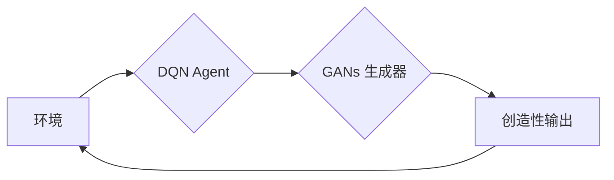

# 一切皆是映射：DQN 与 GANs 的结合应用：创造性学习模型

作者：禅与计算机程序设计艺术

## 1. 背景介绍

### 1.1 人工智能与创造力

人工智能（AI）一直致力于模仿和超越人类智能，而创造力被视为人类智能的巅峰之作。从艺术创作到科学发现，创造力推动着人类文明的进步。近年来，将 AI 应用于创造性任务领域，例如音乐生成、绘画创作、诗歌写作等，成为了研究热点。

### 1.2 深度学习与生成模型

深度学习的兴起为 AI 创造力带来了新的突破。其中，生成对抗网络 (Generative Adversarial Networks, GANs) 和深度强化学习 (Deep Reinforcement Learning, DRL) 是两个备受关注的领域。GANs 能够学习真实数据的分布，并生成逼真的新样本，例如图像、文本、音乐等。DRL 则赋予了 AI agent 在复杂环境中学习和决策的能力，例如游戏、机器人控制等。

### 1.3 DQN 与 GANs 的结合：创造性学习的新思路

将 DQN 与 GANs 相结合，可以构建一种全新的创造性学习模型。DQN 可以作为 agent 的“大脑”，通过与环境交互学习最优策略。GANs 则可以作为 agent 的“画笔”，将学到的策略转化为具体的创造性输出。这种结合可以使 AI agent 不仅能够学习如何完成任务，更能够学习如何创造性地完成任务。

## 2. 核心概念与联系

### 2.1 深度强化学习 (DRL)

#### 2.1.1 基本概念

DRL 是一种机器学习方法，让 AI agent 通过与环境交互学习最优策略。agent 会根据环境的反馈 (奖励或惩罚) 不断调整自己的行为，最终学会在复杂环境中做出最优决策。

#### 2.1.2 DQN (Deep Q-Network)

DQN 是一种经典的 DRL 算法，它使用深度神经网络来逼近 Q 函数。Q 函数用于评估在特定状态下采取特定行动的价值。DQN 通过最小化预测 Q 值与目标 Q 值之间的差异来训练神经网络。

### 2.2 生成对抗网络 (GANs)

#### 2.2.1 基本概念

GANs 由两个神经网络组成：生成器 (Generator) 和判别器 (Discriminator)。生成器试图生成逼真的数据样本，而判别器则试图区分真实数据和生成数据。两个网络在对抗训练中不断优化，最终生成器能够生成以假乱真的数据。

#### 2.2.2 GANs 的变体

近年来，出现了许多 GANs 的变体，例如：

* **DCGAN (Deep Convolutional GANs):** 使用卷积神经网络构建生成器和判别器，适用于图像生成任务。
* **WGAN (Wasserstein GANs):** 使用 Wasserstein 距离作为损失函数，解决了 GANs 训练不稳定问题。
* **CycleGAN:** 可以实现不同域之间的数据转换，例如将马的图像转换为斑马的图像。

### 2.3 DQN 与 GANs 的联系

DQN 和 GANs 都是基于深度学习的模型，它们可以相互结合，构建更强大的 AI 系统。DQN 可以作为 agent 的决策模块，而 GANs 可以作为 agent 的生成模块。

## 3. 核心算法原理具体操作步骤

### 3.1 结合 DQN 与 GANs 的创造性学习模型

该模型主要由三个部分组成：

1. **环境 (Environment):**  agent 与之交互的外部世界，例如游戏环境、绘画软件等。
2. **DQN Agent:**  接收环境状态作为输入，输出动作选择。
3. **GANs 生成器:**  接收 DQN agent 的动作选择作为输入，生成具体的创造性输出，例如游戏操作、绘画笔触等。

### 3.2 模型训练流程

1. **初始化:** 初始化 DQN agent 和 GANs 生成器。
2. **训练 DQN agent:**  
    - agent 在环境中进行交互，根据环境反馈 (奖励或惩罚) 更新 DQN 网络参数。
    - 使用经验回放机制 (Experience Replay) 提高训练效率。
3. **训练 GANs 生成器:**  
    - 使用 DQN agent 生成的动作序列作为训练数据。
    - 训练 GANs 生成器生成与 DQN agent 行为一致的创造性输出。
4. **迭代训练:**  重复步骤 2 和 3，直到模型收敛。

### 3.3 算法流程图



## 4. 数学模型和公式详细讲解举例说明

### 4.1 DQN 算法

#### 4.1.1 Q 函数

Q 函数用于评估在特定状态 $s$ 下采取特定行动 $a$ 的价值：

$$Q(s, a) = E[R_t + \gamma R_{t+1} + \gamma^2 R_{t+2} + ... | s_t = s, a_t = a]$$

其中：

* $R_t$ 表示在时间步 $t$ 获得的奖励。
* $\gamma$ 是折扣因子，用于平衡短期奖励和长期奖励。

#### 4.1.2 DQN 损失函数

DQN 使用深度神经网络来逼近 Q 函数，并使用以下损失函数进行训练：

$$L(\theta) = E[(r + \gamma \max_{a'} Q(s', a'; \theta^-) - Q(s, a; \theta))^2]$$

其中：

* $\theta$ 是 DQN 网络的参数。
* $\theta^-$ 是目标网络的参数，用于计算目标 Q 值。
* $(s, a, r, s')$ 是从经验回放缓冲区中采样的一个样本。

### 4.2 GANs 算法

#### 4.2.1 生成器损失函数

生成器的目标是生成能够欺骗判别器的样本，其损失函数可以表示为：

$$L_G = E_{z \sim p_z(z)}[\log(1 - D(G(z)))]$$

其中：

* $z$ 是随机噪声。
* $G(z)$ 是生成器生成的样本。
* $D(x)$ 是判别器对样本 $x$ 的判别结果，取值范围为 $[0, 1]$，表示样本是真实的概率。

#### 4.2.2 判别器损失函数

判别器的目标是区分真实样本和生成样本，其损失函数可以表示为：

$$L_D = E_{x \sim p_{data}(x)}[\log D(x)] + E_{z \sim p_z(z)}[\log(1 - D(G(z)))]$$

### 4.3 举例说明

假设我们想要训练一个 AI agent 玩“超级玛丽”游戏。

* **环境:** “超级玛丽”游戏环境。
* **DQN agent:** 接收游戏画面作为输入，输出控制玛丽移动的方向。
* **GANs 生成器:** 接收 DQN agent 的移动方向作为输入，生成具体的键盘操作指令。

在训练过程中：

1. DQN agent 通过与游戏环境交互学习如何控制玛丽移动，以获得更高的分数。
2. GANs 生成器学习如何将 DQN agent 的移动方向转化为具体的键盘操作指令。

最终，训练好的模型可以控制玛丽自动玩游戏，并且能够生成流畅、自然的键盘操作。

## 5. 项目实践：代码实例和详细解释说明

### 5.1 使用 TensorFlow 实现 DQN

```python
import tensorflow as tf
import gym

# 创建环境
env = gym.make('CartPole-v0')

# 定义 DQN 网络
class DQN(tf.keras.Model):
    def __init__(self, num_actions):
        super(DQN, self).__init__()
        self.dense1 = tf.keras.layers.Dense(32, activation='relu')
        self.dense2 = tf.keras.layers.Dense(32, activation='relu')
        self.dense3 = tf.keras.layers.Dense(num_actions)

    def call(self, inputs):
        x = self.dense1(inputs)
        x = self.dense2(x)
        return self.dense3(x)

# 创建 DQN agent
agent = DQN(env.action_space.n)

# 定义损失函数和优化器
loss_function = tf.keras.losses.MeanSquaredError()
optimizer = tf.keras.optimizers.Adam(learning_rate=0.001)

# 训练 DQN agent
def train_step(states, actions, rewards, next_states, dones):
    # 计算目标 Q 值
    next_q_values = agent(next_states)
    max_next_q_values = tf.reduce_max(next_q_values, axis=1)
    target_q_values = rewards + (1 - dones) * 0.99 * max_next_q_values

    # 计算预测 Q 值
    with tf.GradientTape() as tape:
        predicted_q_values = agent(states)
        predicted_q_values = tf.gather_nd(predicted_q_values, tf.stack([tf.range(states.shape[0]), actions], axis=1))
        loss = loss_function(target_q_values, predicted_q_values)

    # 更新 DQN 网络参数
    gradients = tape.gradient(loss, agent.trainable_variables)
    optimizer.apply_gradients(zip(gradients, agent.trainable_variables))

# 训练循环
for episode in range(1000):
    state = env.reset()
    episode_reward = 0

    while True:
        # 选择动作
        q_values = agent(state[np.newaxis, :])
        action = tf.math.argmax(q_values, axis=1).numpy()[0]

        # 执行动作
        next_state, reward, done, _ = env.step(action)

        # 存储经验
        # ...

        # 更新状态和奖励
        state = next_state
        episode_reward += reward

        # 训练 DQN agent
        train_step(states, actions, rewards, next_states, dones)

        if done:
            break

    print(f'Episode {episode + 1}, Reward: {episode_reward}')
```

### 5.2 使用 TensorFlow 实现 GANs

```python
import tensorflow as tf

# 定义生成器
class Generator(tf.keras.Model):
    def __init__(self):
        super(Generator, self).__init__()
        self.dense1 = tf.keras.layers.Dense(128, activation='relu')
        self.dense2 = tf.keras.layers.Dense(256, activation='relu')
        self.dense3 = tf.keras.layers.Dense(784, activation='sigmoid')

    def call(self, inputs):
        x = self.dense1(inputs)
        x = self.dense2(x)
        return self.dense3(x)

# 定义判别器
class Discriminator(tf.keras.Model):
    def __init__(self):
        super(Discriminator, self).__init__()
        self.dense1 = tf.keras.layers.Dense(128, activation='relu')
        self.dense2 = tf.keras.layers.Dense(1, activation='sigmoid')

    def call(self, inputs):
        x = self.dense1(inputs)
        return self.dense2(x)

# 创建生成器和判别器
generator = Generator()
discriminator = Discriminator()

# 定义损失函数和优化器
cross_entropy = tf.keras.losses.BinaryCrossentropy(from_logits=True)
generator_optimizer = tf.keras.optimizers.Adam(learning_rate=0.0002)
discriminator_optimizer = tf.keras.optimizers.Adam(learning_rate=0.0002)

# 定义训练步骤
def train_step(real_images):
    # 生成噪声数据
    noise = tf.random.normal([BATCH_SIZE, NOISE_DIM])

    # 生成图像
    generated_images = generator(noise)

    # 训练判别器
    with tf.GradientTape() as disc_tape:
        real_output = discriminator(real_images)
        fake_output = discriminator(generated_images)

        disc_loss = cross_entropy(tf.ones_like(real_output), real_output) + cross_entropy(tf.zeros_like(fake_output), fake_output)

    discriminator_gradients = disc_tape.gradient(disc_loss, discriminator.trainable_variables)
    discriminator_optimizer.apply_gradients(zip(discriminator_gradients, discriminator.trainable_variables))

    # 训练生成器
    with tf.GradientTape() as gen_tape:
        generated_images = generator(noise)
        fake_output = discriminator(generated_images)

        gen_loss = cross_entropy(tf.ones_like(fake_output), fake_output)

    generator_gradients = gen_tape.gradient(gen_loss, generator.trainable_variables)
    generator_optimizer.apply_gradients(zip(generator_gradients, generator.trainable_variables))

# 训练循环
for epoch in range(EPOCHS):
    for batch in dataset:
        train_step(batch)
```

## 6. 实际应用场景

### 6.1 游戏 AI

DQN 与 GANs 的结合可以用于开发更智能、更具创造力的游戏 AI，例如：

* 自动生成游戏关卡。
* 设计新的游戏角色和技能。
* 训练 AI agent 在游戏中进行合作或对抗。

### 6.2 艺术创作

该模型可以应用于音乐生成、绘画创作、诗歌写作等艺术创作领域，例如：

* 生成具有特定风格的音乐或绘画作品。
* 创作与特定主题相关的诗歌或小说。
* 为电影或游戏生成逼真的场景和角色。

### 6.3 数据增强

GANs 可以用于生成逼真的数据样本，从而扩充训练数据集，提高模型的泛化能力。

## 7. 总结：未来发展趋势与挑战

### 7.1 未来发展趋势

* **更强大的模型架构:**  研究更强大的 DRL 和 GANs 模型架构，例如 Transformer、图神经网络等。
* **多模态生成:**  开发能够生成多种类型数据 (例如图像、文本、音乐) 的模型。
* **可解释性和可控制性:**  提高模型的可解释性和可控制性，使人类能够更好地理解和指导 AI 的创造过程。

### 7.2 挑战

* **训练效率:**  DQN 和 GANs 的训练都需要大量的计算资源和时间。
* **评估指标:**  目前缺乏有效的评估指标来衡量 AI 创造力的水平。
* **伦理问题:**  AI 创造力的发展引发了版权、原创性等伦理问题。

## 8. 附录：常见问题与解答

### 8.1 DQN 和 GANs 的区别是什么？

DQN 是一种强化学习算法，用于训练 agent 在环境中做出最优决策。GANs 是一种生成模型，用于学习数据的分布并生成新的数据样本。

### 8.2 为什么将 DQN 与 GANs 结合？

将 DQN 与 GANs 结合可以构建一种全新的创造性学习模型。DQN 可以作为 agent 的决策模块，而 GANs 可以作为 agent 的生成模块。

### 8.3 该模型有哪些应用场景？

该模型可以应用于游戏 AI、艺术创作、数据增强等领域。
