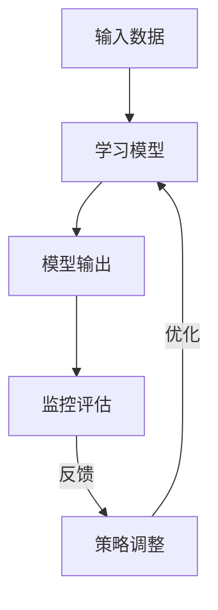
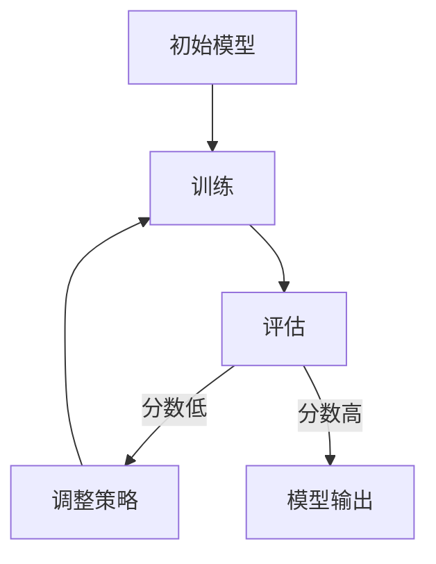

# 一切皆是映射：解构基于元认知的学习系统

## 1. 背景介绍

### 1.1 人工智能发展历程

人工智能(Artificial Intelligence, AI)作为一门富有前景的学科,已经在各个领域广泛应用并取得了巨大的成就。从最初的专家系统、机器学习,到深度学习和强化学习的兴起,AI技术不断推陈出新,给我们带来了无穷无尽的可能性。

### 1.2 元认知学习的崛起  

然而,传统的机器学习算法存在一些固有的局限性,例如:

- 需要大量的标注数据
- 缺乏泛化能力和理解能力
- 缺乏自我调节和反思能力

为了克服这些挑战,元认知学习(Meta-Cognitive Learning)应运而生。它借鉴了人类认知过程中的元认知机制,赋予了AI系统自我监控、评估和调节的能力,从而实现更高级别的学习。

### 1.3 元认知学习的重要性

元认知学习系统能够:

- 自主获取知识
- 持续优化自身
- 理解和解释自身行为
- 具有更强的泛化和迁移能力

这些特性使得元认知学习系统在复杂任务、数据缺乏和不确定环境中表现出色,成为AI发展的关键方向之一。

## 2. 核心概念与联系

### 2.1 元认知的定义

元认知(Metacognition)指的是认知关于认知本身的过程,包括:

- 监控(Monitoring):对自身认知过程的监控和评估
- 控制(Control):根据监控结果调节认知策略和行为

### 2.2 元认知循环

元认知学习建立在一个持续的元认知循环之上:



1. 输入数据被馈送到学习模型
2. 模型产生输出
3. 监控评估模块评估输出质量
4. 根据评估结果调整学习策略
5. 优化后的策略应用到学习模型

### 2.3 元认知能力

一个完整的元认知学习系统应该具备以下能力:

- 自我监控和评估
- 策略选择和调整
- 知识表示和理解
- 经验积累和迁移
- 自我解释和交互

这些能力相互关联、环环相扣,构成了元认知学习的核心。

## 3. 核心算法原理具体操作步骤

### 3.1 监控评估模块

监控评估模块是元认知学习的关键部分,它评估学习模型的输出质量,为后续的策略调整提供依据。常用的评估方法包括:

1. **基于规则的评估**

   根据预先定义的规则集合,检查模型输出是否满足特定条件。例如,在自然语言处理任务中,可以检查输出是否包含特定关键词、语法是否正确等。

   ```python
   def rule_based_eval(output, rules):
       for rule in rules:
           if not rule.check(output):
                return False
       return True
   ```

2. **基于监督的评估**

   将模型输出与人工标注的参考输出进行比较,计算相似性分数。这种方法通常应用于有明确参考答案的任务,例如机器翻译、问答等。

   ```python
   def supervised_eval(output, ref_output):
       return calc_similarity(output, ref_output)
   ```

3. **基于reward的评估**

   在强化学习场景下,将模型输出的行为在环境中执行,并根据获得的reward值评估其质量。

   ```python
   def reward_based_eval(output, env):
       state, reward, done = env.step(output)
       return reward
   ```

### 3.2 策略调整模块

根据监控评估的结果,策略调整模块需要对学习模型的参数、结构、优化方法等进行相应的调整,以提高其性能。常见的调整策略包括:

1. **参数微调(Fine-tuning)**

   通过继续训练,微调模型的参数,使其更适应当前任务。

   ```python
   def fine_tune(model, data, eval_fn):
       optimizer = get_optimizer(model)
       for epoch in range(num_epochs):
           for x, y in data:
               output = model(x)
               loss = loss_fn(output, y)
               loss.backward()
               optimizer.step()
           eval_score = eval_fn(model)
           if eval_score > threshold:
               break
   ```

2. **结构调整**

   根据评估结果,增加或减少模型的层数、调整网络宽度等,以匹配任务复杂度。

   ```python
   def adjust_structure(model, eval_score):
       if eval_score < threshold:
           model = deeper(model) # 增加层数
       else:
           model = wider(model) # 加宽网络
       return model
   ```

3. **优化器调整**

   尝试不同的优化算法(如SGD、Adam等)及其超参数,以加快模型收敛速度。

   ```python
   def adjust_optimizer(model, optim, eval_score):
       if eval_score < threshold:
           optim = get_new_optimizer(model) # 切换优化器
       else:
           optim.adjust_params() # 调整超参数
       return optim
   ```

4. **数据增强**

   根据评估结果,对训练数据进行扩充、清洗等操作,以提高数据质量。

   ```python
   def data_augment(data, eval_score):
       if eval_score < threshold:
           data = augment(data) # 增强数据
       else:
           data = clean(data) # 清洗数据
       return data
   ```

### 3.3 持续优化

策略调整并不是一蹴而就的,需要通过持续的监控评估与调整,不断优化学习系统。



1. 初始化一个基础模型
2. 在训练数据上训练模型
3. 评估模型输出质量
4. 如果评估分数低,调整策略并返回步骤2
5. 如果评估分数高,输出最终模型

通过不断迭代这个过程,模型的性能会持续提升,直至达到理想的水平。

## 4. 数学模型和公式详细讲解举例说明

在元认知学习系统中,数学模型和公式扮演着重要的角色,用于量化和优化各个模块。

### 4.1 监控评估指标

监控评估模块需要一些量化指标来衡量模型输出的质量,常用的指标包括:

1. **精确率(Precision)、召回率(Recall)、F1分数**

   $$
   \begin{aligned}
   Precision &= \frac{TP}{TP + FP}\\
   Recall &= \frac{TP}{TP + FN}\\
   F1 &= 2 \times \frac{Precision \times Recall}{Precision + Recall}
   \end{aligned}
   $$

   其中$TP$、$FP$、$FN$分别表示真正例、假正例和假反例的数量。

2. **平均准确率(Average Precision, AP)、平均召回率(Average Recall, AR)**

   $$
   \begin{aligned}
   AP &= \int_0^1 p(r) dr\\
   AR &= \int_0^1 r(p) dp
   \end{aligned}
   $$

   其中$p(r)$和$r(p)$分别表示精确率和召回率关于阈值的函数。

3. **交叉熵损失(Cross Entropy Loss)**

   $$
   L = -\sum_{i=1}^{N} y_i \log(\hat{y}_i)
   $$

   其中$y_i$和$\hat{y}_i$分别表示真实标签和模型预测值。

4. **均方误差(Mean Squared Error, MSE)**

   $$
   MSE = \frac{1}{N}\sum_{i=1}^{N}(y_i - \hat{y}_i)^2
   $$

这些指标可以根据具体任务进行选择和组合,为监控评估模块提供量化依据。

### 4.2 优化算法

策略调整模块通常需要优化模型参数,常用的优化算法包括:

1. **梯度下降(Gradient Descent)**

   $$
   \theta_{t+1} = \theta_t - \eta \nabla_\theta J(\theta_t)
   $$

   其中$\theta$表示模型参数,$J(\theta)$表示目标函数,如损失函数或负reward,$\eta$为学习率。

2. **动量优化(Momentum Optimization)**

   $$
   \begin{aligned}
   v_{t+1} &= \gamma v_t + \eta \nabla_\theta J(\theta_t)\\
   \theta_{t+1} &= \theta_t - v_{t+1}
   \end{aligned}
   $$

   其中$v_t$为上一步的动量向量,$\gamma$为动量系数。

3. **Adam优化(Adaptive Moment Estimation)**

   $$
   \begin{aligned}
   m_{t+1} &= \beta_1 m_t + (1 - \beta_1)\nabla_\theta J(\theta_t)\\
   v_{t+1} &= \beta_2 v_t + (1 - \beta_2)(\nabla_\theta J(\theta_t))^2\\
   \hat{m}_{t+1} &= \frac{m_{t+1}}{1 - \beta_1^{t+1}}\\
   \hat{v}_{t+1} &= \frac{v_{t+1}}{1 - \beta_2^{t+1}}\\
   \theta_{t+1} &= \theta_t - \frac{\eta}{\sqrt{\hat{v}_{t+1}} + \epsilon}\hat{m}_{t+1}
   \end{aligned}
   $$

   其中$m_t$和$v_t$分别为一阶和二阶动量向量,$\beta_1$和$\beta_2$为相应的衰减系数,$\epsilon$为一个很小的常数,避免除以0。

除了上述经典优化算法外,还有一些更加先进的优化方法,如基于二阶导数的方法(如L-BFGS)、基于概率的贝叶斯优化等,可以根据具体任务进行选择。

### 4.3 知识表示与推理

知识表示是元认知学习系统理解和解释自身行为的基础。常用的知识表示方法包括:

1. **符号表示**

   使用符号和逻辑规则来表示知识,例如一阶逻辑、谓词逻辑等。

   $$
   \forall x \in X, \exists y \in Y, P(x, y)
   $$

2. **概率图模型**

   使用概率图模型(如贝叶斯网络、马尔可夫网络)来表示不确定知识。

   $$
   P(X_1, X_2, \ldots, X_n) = \prod_{i=1}^n P(X_i | Pa(X_i))
   $$

3. **向量空间模型**

   将符号或概念映射到连续的向量空间中,利用向量之间的相似性表示知识关联。

   $$
   \vec{v}_i = f(w_i, c_i)
   $$

4. **神经符号模型**

   结合神经网络和符号系统的优点,使用神经模块来处理连续数据,使用符号模块来处理离散知识。

   $$
   y = g(f_\theta(x), \pi_\phi(x))
   $$

不同的知识表示方法适用于不同的场景,可以根据任务复杂度、可解释性需求等因素进行选择。基于知识表示,系统可以进行逻辑推理、规则匹配、相似性计算等操作,从而理解和解释自身的行为。

### 4.4 迁移学习

迁移学习是元认知学习系统实现泛化和知识迁移的关键技术。常见的迁移学习方法包括:

1. **特征迁移**

   在源域和目标域之间共享部分特征表示,降低目标域的训练难度。

   $$
   \min_{\theta_f, \theta_y} \mathcal{L}(D_t, f_{\theta_f}, y_{\theta_y}) + \lambda d(f_{\theta_f}, g_{\theta_g})
   $$

   其中$f_{\theta_f}$为特征提取器,$y_{\theta_y}$为分类器,$g_{\theta_g}$为源域的特征提取器,$d(\cdot, \cdot)$为特征分布距离。

2. **模型微调(Fine-tuning)**

   在源域预训练一个初始模型,然后在目标域上继续微调部分层的参数。

   $$
   \theta^* = \arg\min_\theta \mathcal{L}(D_t, f_\theta \circ g_{\theta_0})
   $$

   其中$f_\theta$为待优化