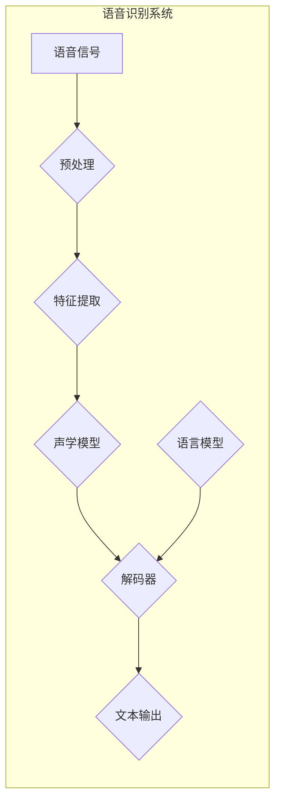

##  一切皆是映射：语音识别技术的AI转型

作者：禅与计算机程序设计艺术

## 1. 背景介绍

### 1.1 语音识别：从边缘走向核心

语音识别技术，简单来说，就是让机器“听懂”人类语言的技术。从早期的键盘输入到如今的语音助手，语音识别已经渗透到我们生活的方方面面。然而，传统的语音识别技术往往依赖于复杂的声学模型和语言模型，需要大量的人工标注数据进行训练，泛化能力和鲁棒性都存在一定的局限性。

### 1.2 AI浪潮下的技术革新

近年来，随着人工智能技术的飞速发展，深度学习技术开始被广泛应用于语音识别领域，并取得了突破性的进展。深度学习模型能够自动从海量数据中学习语音的特征表示，无需人工设计复杂的特征，极大地提升了语音识别的准确率和效率。

### 1.3 “一切皆是映射”：深度学习的新视角

深度学习的核心思想是将输入数据映射到输出空间，语音识别也不例外。我们可以将语音识别看作是一个从声学信号到文本序列的映射问题，而深度学习模型则充当了这个映射函数的角色。

## 2. 核心概念与联系

### 2.1 声学特征提取

#### 2.1.1 时频分析

语音信号是一种非平稳信号，其特征会随着时间发生变化。因此，在进行语音识别之前，需要先对语音信号进行时频分析，提取出能够表征语音内容的声学特征。常用的时频分析方法包括：

- 傅里叶变换（FT）
- 短时傅里叶变换（STFT）
- 小波变换（WT）

#### 2.1.2 声学特征

常用的声学特征包括：

- 梅尔频率倒谱系数（MFCC）
- 感知线性预测系数（PLP）
- 线性预测倒谱系数（LPCC）

### 2.2 声学模型

声学模型是语音识别系统的核心组件之一，其作用是将声学特征序列映射到音素序列。深度学习时代，常用的声学模型包括：

- 深度神经网络（DNN）
- 卷积神经网络（CNN）
- 循环神经网络（RNN）
- 长短时记忆网络（LSTM）
- 门控循环单元（GRU）

### 2.3 语言模型

语言模型的作用是评估一个词序列出现的概率，用于解码声学模型的输出，得到最终的识别结果。常用的语言模型包括：

- N-gram语言模型
- 神经网络语言模型（NNLM）

## 3. 核心算法原理具体操作步骤

### 3.1 基于深度学习的语音识别系统流程

一个典型的基于深度学习的语音识别系统通常包括以下步骤：

1. **预处理**: 对输入的语音信号进行预加重、分帧、加窗等预处理操作。
2. **特征提取**: 从预处理后的语音信号中提取声学特征，如MFCC。
3. **声学模型训练**: 使用标注好的语音数据训练声学模型，将声学特征序列映射到音素序列。
4. **语言模型训练**: 使用大量的文本数据训练语言模型，学习词语之间的概率关系。
5. **解码**: 将声学模型的输出和语言模型结合起来，找到最有可能的词序列作为识别结果。

### 3.2 声学模型训练

#### 3.2.1 数据准备

声学模型的训练需要大量的标注语音数据，通常包括语音信号和对应的文本标注。

#### 3.2.2 模型构建

根据具体的任务需求和数据特点，选择合适的深度学习模型，如DNN、CNN、RNN等。

#### 3.2.3 模型训练

使用准备好的训练数据对模型进行训练，调整模型参数，使模型能够将声学特征序列准确地映射到音素序列。

### 3.3 语言模型训练

#### 3.3.1 数据准备

语言模型的训练需要大量的文本数据，例如新闻语料、维基百科等。

#### 3.3.2 模型构建

常用的语言模型包括N-gram语言模型和神经网络语言模型。

#### 3.3.3 模型训练

使用准备好的文本数据对模型进行训练，学习词语之间的概率关系。

### 3.4 解码

解码阶段的目标是找到最有可能的词序列作为识别结果。常用的解码算法包括：

- 贪婪搜索
- 集束搜索

## 4. 数学模型和公式详细讲解举例说明

### 4.1 声学模型：循环神经网络（RNN）

循环神经网络（RNN）是一种能够处理序列数据的深度学习模型，非常适合用于语音识别等任务。RNN的隐藏状态可以存储历史信息的记忆，从而能够捕捉到语音信号中的时序依赖关系。

#### 4.1.1 RNN模型结构

一个简单的RNN单元可以表示为：

```
h_t = f(W_{xh} x_t + W_{hh} h_{t-1} + b_h)
y_t = g(W_{hy} h_t + b_y)
```

其中：

- $x_t$ 表示t时刻的输入特征向量
- $h_t$ 表示t时刻的隐藏状态向量
- $y_t$ 表示t时刻的输出向量
- $W_{xh}$、$W_{hh}$、$W_{hy}$ 分别表示输入到隐藏、隐藏到隐藏、隐藏到输出的权重矩阵
- $b_h$、$b_y$ 分别表示隐藏状态和输出的偏置向量
- $f$、$g$ 分别表示激活函数

#### 4.1.2 RNN前向传播

给定一个输入序列 $X = (x_1, x_2, ..., x_T)$，RNN 的前向传播过程如下：

1. 初始化隐藏状态 $h_0$
2. 对于 t = 1, 2, ..., T:
    - 计算隐藏状态 $h_t = f(W_{xh} x_t + W_{hh} h_{t-1} + b_h)$
    - 计算输出 $y_t = g(W_{hy} h_t + b_y)$

#### 4.1.3 RNN反向传播

RNN 的训练过程使用反向传播算法（BPTT）来更新模型参数。

### 4.2 语言模型：N-gram语言模型

N-gram语言模型是一种简单的统计语言模型，它假设一个词出现的概率只与其前面的 N-1 个词有关。

#### 4.2.1 N-gram概率计算

一个 N-gram 的概率可以表示为：

```
P(w_i|w_{i-1}, w_{i-2}, ..., w_{i-n+1})
```

其中：

- $w_i$ 表示第 i 个词
- $n$ 表示 N-gram 的阶数

#### 4.2.2 平滑技术

由于数据稀疏性问题，低频词的概率估计可能不准确。为了解决这个问题，通常会使用平滑技术，例如：

- 加法平滑
- 古德图灵平滑

## 5. 项目实践：代码实例和详细解释说明

### 5.1 使用 Python 实现简单的语音识别系统

```python
import speech_recognition as sr

# 初始化识别器
r = sr.Recognizer()

# 读取音频文件
with sr.AudioFile('audio.wav') as source:
    audio_data = r.record(source)

# 识别语音
text = r.recognize_google(audio_data)

# 打印识别结果
print(text)
```

### 5.2 使用 TensorFlow 训练简单的声学模型

```python
import tensorflow as tf

# 定义模型
model = tf.keras.Sequential([
    tf.keras.layers.Input(shape=(timesteps, feature_dim)),
    tf.keras.layers.LSTM(units=128),
    tf.keras.layers.Dense(units=num_classes, activation='softmax')
])

# 编译模型
model.compile(optimizer='adam',
              loss='sparse_categorical_crossentropy',
              metrics=['accuracy'])

# 训练模型
model.fit(x_train, y_train, epochs=10)
```

## 6. 实际应用场景

语音识别技术已经广泛应用于各个领域，例如：

- **智能语音助手**: Siri、Alexa、Google Assistant 等
- **语音输入法**: 讯飞输入法、搜狗输入法等
- **智能客服**: 电话客服、在线客服等
- **智能家居**: 语音控制家电、语音交互等
- **医疗健康**: 语音电子病历、语音问诊等
- **教育**: 语音评测、语音识别辅助学习等

## 7. 总结：未来发展趋势与挑战

### 7.1 未来发展趋势

- **端到端语音识别**: 将声学模型和语言模型融合成一个端到端的模型，简化训练流程，提升识别性能。
- **多语言、多方言语音识别**: 随着全球化的发展，多语言、多方言语音识别需求日益增长。
- **低资源语音识别**: 针对数据资源稀缺的语言或方言，研究低资源语音识别技术。
- **鲁棒性语音识别**: 提高语音识别系统在噪声、口音、语速等方面的鲁棒性。

### 7.2 面临的挑战

- **数据**: 高质量的标注数据是语音识别技术发展的关键。
- **模型**: 如何构建更加高效、准确的语音识别模型仍然是一个挑战。
- **应用**: 如何将语音识别技术更好地应用于实际场景，解决实际问题。

## 8. 附录：常见问题与解答

### 8.1  什么是语音识别中的“注意力机制”？

注意力机制是一种能够让模型关注输入序列中重要部分的机制，广泛应用于机器翻译、语音识别等领域。在语音识别中，注意力机制可以帮助模型更好地捕捉语音信号中的关键信息，提升识别性能。

### 8.2  什么是语音识别中的“解码”？

解码是指将声学模型的输出和语言模型结合起来，找到最有可能的词序列作为识别结果的过程。

### 8.3  什么是语音识别中的“语言模型”？

语言模型的作用是评估一个词序列出现的概率，用于解码声学模型的输出，得到最终的识别结果。


##  Mermaid流程图


