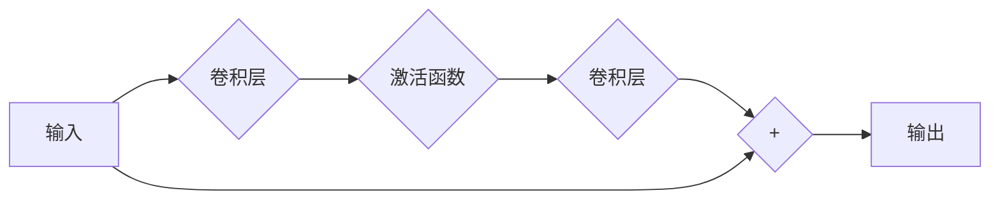

# 从零开始大模型开发与微调：ResNet残差模块的实现

作者：禅与计算机程序设计艺术

## 1. 背景介绍

### 1.1 深度学习的兴起与挑战

近年来，深度学习在计算机视觉、自然语言处理、语音识别等领域取得了突破性进展，这离不开深度神经网络的强大表达能力。然而，随着网络深度的不断增加，传统的深度神经网络面临着一些挑战：

* **梯度消失/爆炸：** 由于网络层数过多，反向传播过程中梯度信息容易出现消失或爆炸现象，导致模型难以训练。
* **过拟合：** 深度模型参数量巨大，容易在训练数据上过拟合，导致泛化能力下降。
* **计算资源消耗大：** 深度模型的训练和推理过程需要大量的计算资源，限制了其在实际场景中的应用。

### 1.2  ResNet的诞生与突破

为了解决上述问题，何恺明等人于2015年提出了深度残差网络（ResNet）。ResNet通过引入残差模块（Residual Block）的结构，成功地训练了超过150层的深度神经网络，并在ImageNet图像分类比赛中取得了突破性的成果。ResNet的提出，不仅解决了深度神经网络训练困难的问题，也为后续深度学习模型的发展奠定了基础。

### 1.3 本文目标与结构

本文旨在深入浅出地介绍ResNet残差模块的实现原理、代码实现以及应用场景。文章结构如下：

* **背景介绍：** 介绍深度学习的兴起与挑战，以及ResNet的诞生与突破。
* **核心概念与联系：** 介绍残差模块的核心概念，以及其与深度神经网络的关系。
* **核心算法原理具体操作步骤：** 详细解释残差模块的工作原理，并给出具体的操作步骤。
* **数学模型和公式详细讲解举例说明：** 从数学角度推导残差模块的有效性，并给出具体的例子进行说明。
* **项目实践：代码实例和详细解释说明：** 使用Python和深度学习框架实现残差模块，并给出详细的代码解释。
* **实际应用场景：** 介绍残差模块在图像分类、目标检测等领域的应用。
* **工具和资源推荐：** 推荐一些学习ResNet的工具和资源。
* **总结：未来发展趋势与挑战：** 总结ResNet的优势和不足，并展望其未来发展趋势。
* **附录：常见问题与解答：**  解答一些关于ResNet的常见问题。

## 2. 核心概念与联系

### 2.1 残差学习（Residual Learning）

残差学习的核心思想是：**与其直接学习目标函数的映射关系，不如学习目标函数与输入之间的残差映射关系。** 假设我们要学习一个函数 $H(x)$，我们可以将其分解为两个部分：

$$H(x) = F(x) + x$$

其中，$F(x)$ 表示我们要学习的残差函数，$x$ 表示输入。这样，我们就可以将学习目标从 $H(x)$ 转化为学习 $F(x)$。

### 2.2 残差模块（Residual Block）

残差模块是实现残差学习的基本单元。其结构如下图所示：



一个残差模块通常包含两个或多个卷积层，以及一个**跳跃连接（Shortcut Connection）**。跳跃连接将模块的输入直接加到模块的输出上，从而实现了残差学习的思想。

### 2.3 残差模块与深度神经网络的关系

残差模块可以看作是深度神经网络中的一种特殊的层。通过将多个残差模块堆叠在一起，就可以构建深度残差网络（ResNet）。ResNet的成功表明，残差学习可以有效地解决深度神经网络训练困难的问题，提高模型的性能。

## 3. 核心算法原理具体操作步骤

### 3.1 残差模块的前向传播过程

残差模块的前向传播过程可以分为以下几个步骤：

1. **输入：** 模块的输入为 $x$。
2. **卷积操作：** 对输入进行两次卷积操作，得到 $F(x)$。
3. **激活函数：** 对 $F(x)$ 应用激活函数，例如ReLU函数。
4. **跳跃连接：** 将模块的输入 $x$ 与 $F(x)$ 相加。
5. **输出：** 模块的输出为 $y = F(x) + x$。

### 3.2 残差模块的反向传播过程

残差模块的反向传播过程与普通卷积层的反向传播过程类似，只是需要考虑跳跃连接的影响。由于跳跃连接的存在，梯度信息可以直接从模块的输出传递到模块的输入，从而缓解了梯度消失/爆炸的问题。

## 4. 数学模型和公式详细讲解举例说明

### 4.1 残差学习的数学解释

假设我们要学习一个函数 $H(x)$，我们可以将其分解为两个部分：

$$H(x) = F(x) + x$$

其中，$F(x)$ 表示我们要学习的残差函数，$x$ 表示输入。

根据链式法则，我们可以得到 $H(x)$ 对 $x$ 的导数：

$$\frac{\partial H(x)}{\partial x} = \frac{\partial F(x)}{\partial x} + 1$$

如果 $\frac{\partial F(x)}{\partial x} \approx 0$，则 $\frac{\partial H(x)}{\partial x} \approx 1$。这意味着，即使网络层数很深，梯度信息也可以有效地反向传播，从而避免了梯度消失的问题。

### 4.2  举例说明

假设我们要训练一个深度神经网络来识别图像中的猫。我们可以将这个问题分解为两个子问题：

* **子问题1：** 判断图像中是否存在猫。
* **子问题2：** 如果图像中存在猫，则确定猫的位置和类别。

我们可以使用一个深度神经网络来解决子问题1，使用另一个深度神经网络来解决子问题2。但是，如果我们将这两个网络直接连接起来，就会面临梯度消失/爆炸的问题。

为了解决这个问题，我们可以使用残差学习。我们可以将第一个网络的输出作为第二个网络的输入，并使用残差模块来连接这两个网络。这样，第二个网络就可以利用第一个网络已经学习到的特征，从而更容易地解决子问题2。

## 5. 项目实践：代码实例和详细解释说明

```python
import torch
import torch.nn as nn

class ResidualBlock(nn.Module):
    def __init__(self, in_channels, out