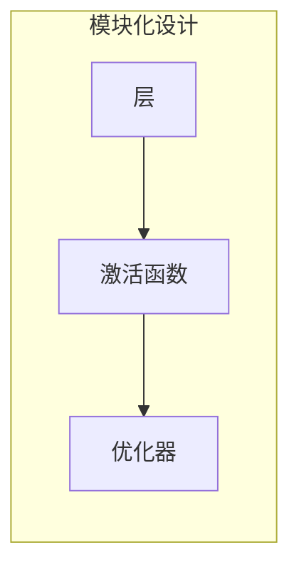
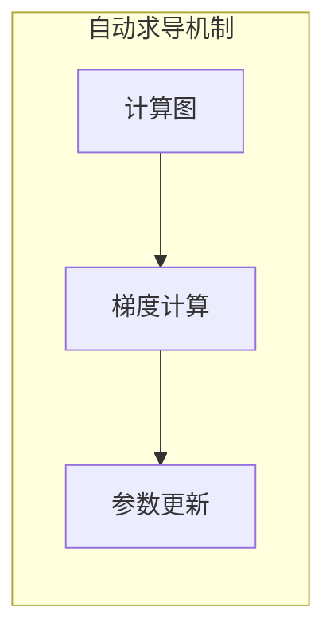
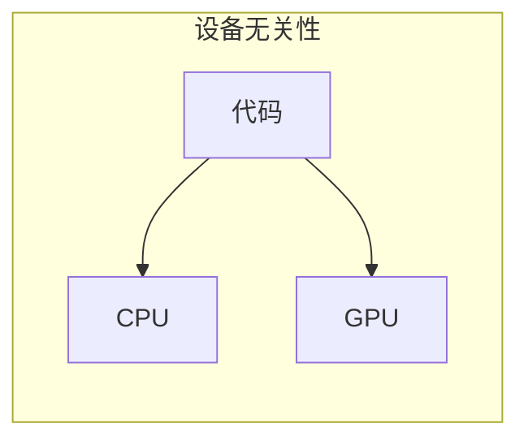
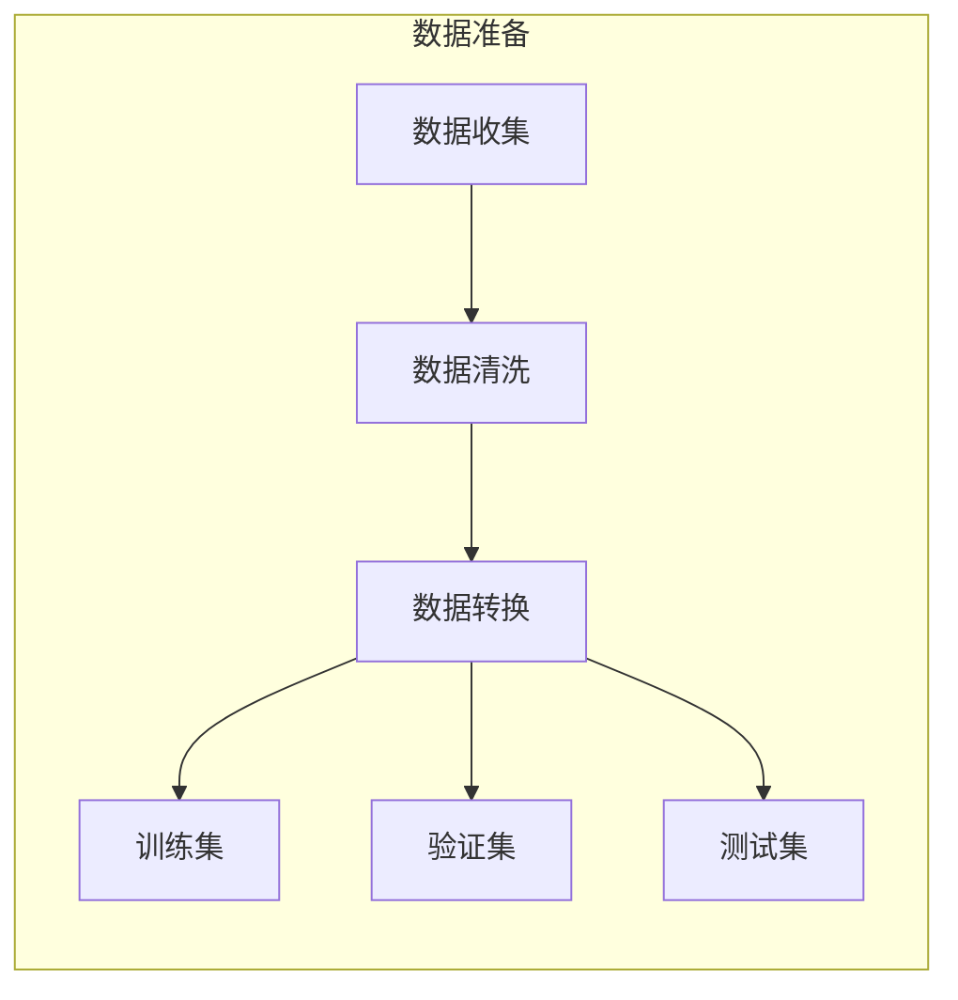
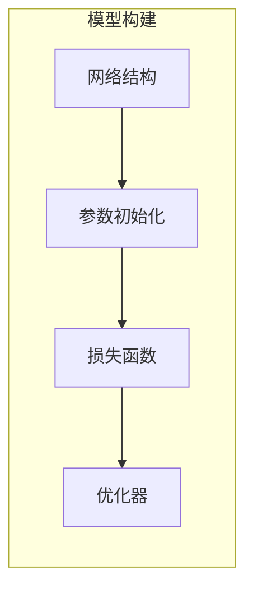
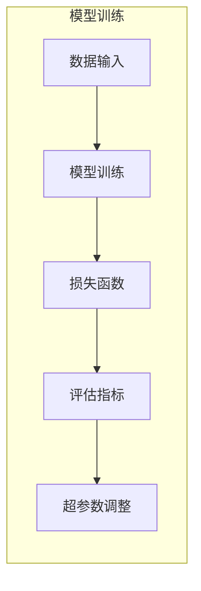
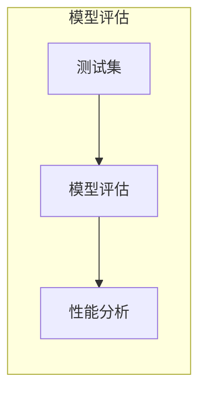

# 从零开始大模型开发与微调：自定义神经网络框架的基本设计

作者：禅与计算机程序设计艺术

## 1. 背景介绍

### 1.1 大模型时代的来临

近年来，随着深度学习技术的快速发展，以及硬件计算能力的不断提升，大规模预训练语言模型（Large Language Models，LLMs）如雨后春笋般涌现，例如 GPT-3、BERT、LaMDA 等。这些模型在海量文本数据上进行预训练，学习到了丰富的语言知识和世界知识，展现出惊人的语言理解和生成能力，并在自然语言处理的各个领域取得了突破性的进展。

### 1.2  自定义模型开发的需求

然而，通用的大模型并不总是能够满足特定领域或任务的需求。例如，在医疗领域，我们需要模型能够理解医学术语、诊断报告和病历信息；在金融领域，我们需要模型能够分析市场趋势、预测股票价格和识别金融风险。因此，针对特定领域或任务，开发自定义的大模型变得越来越重要。

### 1.3 本文目标

本文旨在介绍从零开始开发和微调大模型的基本原理和技术路线，并重点阐述自定义神经网络框架的设计思路和实现方法。通过本文的学习，读者将能够：

* 理解大模型开发的基本流程和关键技术；
* 掌握自定义神经网络框架的设计原则和实现方法；
* 了解如何对大模型进行微调以适应特定任务；
* 具备从零开始开发特定领域大模型的能力。

## 2. 核心概念与联系

### 2.1 神经网络基础

#### 2.1.1 神经元

神经元是神经网络的基本单元，它接收多个输入信号，对这些信号进行加权求和，并通过激活函数进行非线性变换，最终输出一个信号。

#### 2.1.2  激活函数

激活函数为神经元引入了非线性，使得神经网络能够拟合更复杂的函数。常用的激活函数包括 Sigmoid、ReLU、Tanh 等。

#### 2.1.3  神经网络

神经网络是由多个神经元按照一定的结构连接而成的网络。根据网络结构的不同，可以分为前馈神经网络、循环神经网络、卷积神经网络等。

### 2.2 深度学习框架

#### 2.2.1  计算图

计算图是一种用来描述神经网络结构和计算过程的有向无环图。

#### 2.2.2  自动求导

自动求导是指深度学习框架能够自动计算神经网络参数的梯度，从而方便地进行参数更新。

#### 2.2.3  常用框架

常见的深度学习框架包括 TensorFlow、PyTorch、JAX 等。

### 2.3 大模型训练

#### 2.3.1  数据预处理

数据预处理是指对原始数据进行清洗、转换和特征提取等操作，以使其适合作为神经网络的输入。

#### 2.3.2  模型训练

模型训练是指使用训练数据对神经网络的参数进行调整，使其能够在给定任务上取得较好的性能。

#### 2.3.3  模型评估

模型评估是指使用测试数据对训练好的模型进行性能评估，以衡量模型的泛化能力。

### 2.4 模型微调

#### 2.4.1  迁移学习

迁移学习是指将预训练好的模型迁移到新的任务上，并进行微调以适应新的任务。

#### 2.4.2  微调方法

常见的微调方法包括特征提取、微调所有层、冻结部分层等。

## 3. 核心算法原理具体操作步骤

### 3.1 自定义神经网络框架设计

#### 3.1.1  模块化设计

将神经网络的各个组成部分，例如层、激活函数、优化器等，设计成独立的模块，方便用户进行组合和扩展。



#### 3.1.2  自动求导机制

实现自动求导功能，方便用户进行模型训练。



#### 3.1.3  设备无关性

支持 CPU 和 GPU 等多种计算设备，方便用户进行模型训练和部署。



### 3.2 大模型训练流程

#### 3.2.1 数据准备

* 收集和清洗数据
* 将数据转换为模型可接受的格式
* 划分训练集、验证集和测试集




#### 3.2.2  模型构建

* 选择合适的网络结构
* 初始化模型参数
* 定义损失函数和优化器



#### 3.2.3  模型训练

* 将数据输入模型进行训练
* 监控训练过程中的损失函数和评估指标
* 调整超参数以优化模型性能



#### 3.2.4  模型评估

* 使用测试集评估模型性能
* 分析模型的优缺点



### 3.3 模型微调步骤

#### 3.3.1  加载预训练模型

* 下载预训练模型的参数
* 将预训练模型的参数加载到自定义模型中

#### 3.3.2  替换输出层

* 根据新的任务需求，修改模型的输出层

#### 3.3.3  冻结部分层参数

* 冻结预训练模型中部分层的参数，只训练新增的层或部分层的参数

#### 3.3.4  微调模型

* 使用新的训练数据对模型进行微调
* 监控微调过程中的损失函数和评估指标

## 4. 数学模型和公式详细讲解举例说明

### 4.1 前馈神经网络

前馈神经网络是一种单向信息传递的神经网络，信息从输入层传递到输出层，中间可以有多个隐藏层。

#### 4.1.1  数学模型

$$
y = f(Wx + b)
$$

其中：

* $x$ 为输入向量
* $W$ 为权重矩阵
* $b$ 为偏置向量
* $f$ 为激活函数
* $y$ 为输出向量

#### 4.1.2  举例说明

假设我们有一个包含两个输入神经元、一个隐藏层（包含三个神经元）和一个输出神经元的前馈神经网络，激活函数为 ReLU 函数，则该网络的数学模型可以表示为：

$$
\begin{aligned}
h &= ReLU(W_1x + b_1) \\
y &= W_2h + b_2
\end{aligned}
$$

其中：

* $x$ 为 $2 \times 1$ 的输入向量
* $W_1$ 为 $3 \times 2$ 的权重矩阵
* $b_1$ 为 $3 \times 1$ 的偏置向量
* $h$ 为 $3 \times 1$ 的隐藏层输出向量
* $W_2$ 为 $1 \times 3$ 的权重矩阵
* $b_2$ 为 $1 \times 1$ 的偏置向量
* $y$ 为 $1 \times 1$ 的输出向量

### 4.2 反向传播算法

反向传播算法是一种用于训练神经网络的常用算法，它通过计算损失函数对模型参数的梯度，并利用梯度下降法更新模型参数，从而使模型的输出更接近目标值。

#### 4.2.1  数学模型

$$
\begin{aligned}
\frac{\partial L}{\partial W} &= \frac{\partial L}{\partial y} \frac{\partial y}{\partial h} \frac{\partial h}{\partial W} \\
\frac{\partial L}{\partial b} &= \frac{\partial L}{\partial y} \frac{\partial y}{\partial h} \frac{\partial h}{\partial b}
\end{aligned}
$$

其中：

* $L$ 为损失函数
* $y$ 为模型输出
* $h$ 为隐藏层输出
* $W$ 为权重矩阵
* $b$ 为偏置向量

#### 4.2.2  举例说明

以上面的前馈神经网络为例，假设损失函数为均方误差函数：

$$
L = \frac{1}{2}(y - t)^2
$$

其中：

* $t$ 为目标值

则损失函数对 $W_2$ 的梯度可以计算为：

$$
\begin{aligned}
\frac{\partial L}{\partial W_2} &= \frac{\partial L}{\partial y} \frac{\partial y}{\partial h} \frac{\partial h}{\partial W_2} \\
&= (y - t) \cdot 1 \cdot h^T \\
&= (y - t)h^T
\end{aligned}
$$

## 5. 项目实践：代码实例和详细解释说明

```python
import torch
import torch.nn as nn

# 定义神经网络模型
class MyModel(nn.Module):
    def __init__(self, input_size, hidden_size, output_size):
        super(MyModel, self).__