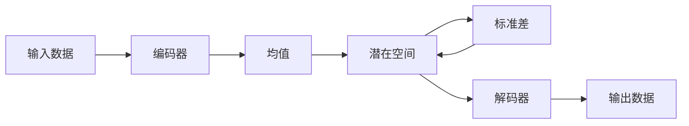

## 变分自编码器与生成模型原理与代码实战案例讲解

作者：禅与计算机程序设计艺术


## 1. 背景介绍

### 1.1 生成模型概述

近年来，随着深度学习的快速发展，生成模型在计算机视觉、自然语言处理等领域取得了显著的成果。生成模型的目标是学习真实数据的分布，从而生成新的、与真实数据相似的数据。与传统的判别模型不同，生成模型并不直接学习数据类别之间的边界，而是学习数据本身的特征和规律。

### 1.2 变分自编码器简介

变分自编码器（Variational Autoencoder，VAE）是一种强大的生成模型，它结合了深度学习和变分推断的思想。VAE 的核心思想是将数据编码到一个低维的潜在空间中，然后从该空间中采样生成新的数据。与传统的自编码器不同，VAE 对潜在空间的分布进行了约束，使其服从特定的先验分布，例如高斯分布。这种约束使得 VAE 能够生成更加多样化和真实的样本。

### 1.3 本文目标

本文旨在深入浅出地介绍变分自编码器的原理、算法和应用，并结合代码实例进行实战讲解。本文将首先介绍 VAE 的核心概念和网络结构，然后详细讲解其数学模型和训练过程，最后通过实际案例演示如何使用 VAE 进行图像生成。


## 2. 核心概念与联系

### 2.1 自编码器

自编码器是一种无监督学习算法，其目标是学习一个恒等函数，即将输入数据映射到自身。自编码器通常由编码器和解码器两部分组成。编码器将输入数据映射到一个低维的潜在表示，而解码器则将潜在表示映射回原始数据空间。

### 2.2 变分推断

变分推断是一种近似推断方法，用于估计难以直接计算的概率分布。在 VAE 中，变分推断被用于估计潜在变量的后验分布。

### 2.3 KL 散度

KL 散度是衡量两个概率分布之间差异的一种指标。在 VAE 中，KL 散度被用于衡量潜在变量的近似后验分布与先验分布之间的差异。

### 2.4 重参数化技巧

重参数化技巧是一种从服从特定分布的随机变量中采样样本的方法。在 VAE 中，重参数化技巧被用于从潜在变量的近似后验分布中采样样本。


## 3. 核心算法原理具体操作步骤

### 3.1 VAE 网络结构

VAE 的网络结构主要由编码器、解码器和潜在空间组成，如下图所示：



*   **编码器**: 将输入数据 $x$ 映射到潜在空间中的一个均值向量 $\mu$ 和一个标准差向量 $\sigma$。
*   **潜在空间**: 一个低维的连续空间，服从特定的先验分布，例如高斯分布。
*   **解码器**: 将潜在空间中的样本 $z$ 映射回原始数据空间。

### 3.2 VAE 训练过程

VAE 的训练过程可以分为以下几个步骤：

1.  **编码**: 将输入数据 $x$ 输入编码器，得到潜在变量的均值向量 $\mu$ 和标准差向量 $\sigma$。
2.  **采样**: 从以 $\mu$ 为均值，$\sigma$ 为标准差的高斯分布中采样一个样本 $z$。
3.  **解码**: 将样本 $z$ 输入解码器，得到重构数据 $\hat{x}$。
4.  **计算损失函数**: VAE 的损失函数由两部分组成：重构损失和 KL 散度损失。
    *   **重构损失**: 衡量重构数据 $\hat{x}$ 与原始数据 $x$ 之间的差异，可以使用均方误差（MSE）或交叉熵等指标。
    *   **KL 散度损失**: 衡量潜在变量的近似后验分布与先验分布之间的差异。
5.  **反向传播**: 根据损失函数计算梯度，并使用梯度下降算法更新网络参数。

### 3.3 重参数化技巧

为了使 VAE 的训练过程可导，需要使用重参数化技巧从潜在变量的近似后验分布中采样样本。具体来说，可以先生成一个服从标准正态分布的随机变量 $\epsilon$，然后通过以下公式计算样本 $z$：

$$z = \mu + \sigma \odot \epsilon$$

其中，$\odot$ 表示逐元素相乘。


## 4. 数学模型和公式详细讲解举例说明

### 4.1 VAE 的目标函数

VAE 的目标函数可以表示为以下形式：

$$
\mathcal{L}(\theta, \phi) = \mathbb{E}_{q_{\phi}(z|x)}[\log p_{\theta}(x|z)] - D_{KL}(q_{\phi}(z|x) || p(z))
$$

其中：

*   $\theta$ 和 $\phi$ 分别表示解码器和编码器的参数。
*   $q_{\phi}(z|x)$ 表示给定输入数据 $x$ 时，潜在变量 $z$ 的近似后验分布。
*   $p_{\theta}(x|z)$ 表示给定潜在变量 $z$ 时，输入数据 $x$ 的条件概率分布。
*   $p(z)$ 表示潜在变量 $z$ 的先验分布，通常假设为标准正态分布。
*   $D_{KL}$ 表示 KL 散度。

### 4.2 目标函数的推导

VAE 的目标函数可以从最大似然估计的角度进行推导。假设我们有一组观测数据 $X = \{x_1, x_2, ..., x_N\}$，我们希望找到一个模型能够最大化观测数据的似然概率 $p(X)$。根据概率论中的链式法则，可以将 $p(X)$ 表示为：

$$
\begin{aligned}
\log p(X) &= \log \prod_{i=1}^{N} p(x_i) \\
&= \sum_{i=1}^{N} \log p(x_i)
\end{aligned}
$$

由于我们无法直接观测到潜在变量 $z$，因此需要引入 $z$ 对 $p(x_i)$ 进行边缘化：

$$
\begin{aligned}
\log p(x_i) &= \log \int p(x_i, z) dz \\
&= \log \int p(x_i|z) p(z) dz
\end{aligned}
$$

由于积分难以计算，因此可以使用变分推断对 $p(z|x_i)$ 进行近似。假设 $q_{\phi}(z|x_i)$ 是 $p(z|x_i)$ 的一个近似分布，则可以使用 Jensen 不等式得到：

$$
\begin{aligned}
\log p(x_i) &= \log \int p(x_i|z) p(z) dz \\
&= \log \int q_{\phi}(z|x_i) \frac{p(x_i|z) p(z)}{q_{\phi}(z|x_i)} dz \\
&\ge \int q_{\phi}(z|x_i) \log \frac{p(x_i|z) p(z)}{q_{\phi}(z|x_i)} dz \\
&= \mathbb{E}_{q_{\phi}(z|x_i)}[\log p(x_i|z)] - D_{KL}(q_{\phi}(z|x_i) || p(z))
\end{aligned}
$$

将上式代入 $\log p(X)$ 的表达式中，可以得到 VAE 的目标函数：

$$
\begin{aligned}
\log p(X) &\ge \sum_{i=1}^{N} \left( \mathbb{E}_{q_{\phi}(z|x_i)}[\log p(x_i|z)] - D_{KL}(q_{\phi}(z|x_i) || p(z)) \right) \\
&= \mathbb{E}_{q_{\phi}(z|x)}[\log p_{\theta}(x|z)] - D_{KL}(q_{\phi}(z|x) || p(z))
\end{aligned}
$$

### 4.3 目标函数的解释

VAE 的目标函数可以看作是两个部分的权衡：

*   **第一部分** $\mathbb{E}_{q_{\phi}(z|x)}[\log p_{\theta}(x|z)]$ 表示重构损失，鼓励解码器能够从潜在变量中重构出原始数据。
*   **第二部分** $D_{KL}(q_{\phi}(z|x) || p(z))$ 表示 KL 散度损失，鼓励潜在变量的近似后验分布接近于先验分布。

通过最小化目标函数，VAE 能够学习到一个既能重构原始数据，又能生成新的、与原始数据相似的数据的模型。


## 5. 项目实践：代码实例和详细解释说明

### 5.1 MNIST 手写数字生成

本节将以 MNIST 手写数字数据集为例，演示如何使用 VAE 生成新的手写数字图像。

#### 5.1.1 数据集介绍

MNIST 数据集是一个包含 70000 张手写数字图像的数据集，其中 60000 张用于训练，10000 张用于测试。每张图像的大小为 28x28 像素，灰度值范围为 0-255。

#### 5.1.2 代码实现

```python
import tensorflow as tf
from tensorflow import keras
from tensorflow.keras import layers

# 定义编码器
def build_encoder(latent_dim):
    encoder_inputs = keras.Input(shape=(28, 28, 1))
    x = layers.Conv2D(32, 3, activation="relu", strides=2, padding="same")(encoder_inputs)
    x = layers