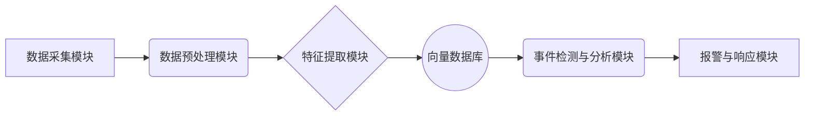

## 基于向量数据库的智慧城市监控系统

作者：禅与计算机程序设计艺术

## 1. 引言：智慧城市的眼睛

### 1.1 监控系统：从传统到智能

城市，是人类文明的中心，承载着数百万乃至数千万人口的生活、工作和娱乐。随着城市规模的不断扩大和人口密度的日益增加，城市的安全、交通、环境等问题日益突出，对城市管理提出了更高的要求。智慧城市的概念应运而生，它利用各种先进的信息技术，例如物联网、云计算、大数据和人工智能，来提高城市管理和服务的效率，改善城市居民的生活质量。

在智慧城市的建设中，监控系统扮演着至关重要的角色，它如同城市的“眼睛”，实时感知着城市的脉搏。传统的监控系统主要依赖于人工进行视频分析和事件识别，效率低下且容易出错。近年来，随着人工智能技术的快速发展，智能监控系统逐渐成为主流，它利用计算机视觉、机器学习等技术，自动识别和分析监控视频中的异常事件，例如交通事故、人群聚集、火灾等，并及时发出警报，大大提高了城市的安全性和管理效率。

### 1.2 向量数据库：释放海量数据的潜力

然而，传统的监控系统在处理海量视频数据时面临着巨大的挑战。海量视频数据不仅存储成本高昂，而且难以进行有效的检索和分析。传统的数据库技术，例如关系型数据库，在处理非结构化数据（例如图像和视频）时效率低下。

近年来，向量数据库应运而生，它专门设计用于存储、索引和查询高维向量数据，例如图像、视频、音频和文本的特征向量。与传统的数据库技术相比，向量数据库具有以下优势：

* **高效的相似性搜索:** 向量数据库可以快速找到与查询向量最相似的向量，从而实现高效的图像、视频检索。
* **可扩展性强:** 向量数据库可以轻松扩展到数十亿甚至数万亿个向量，满足海量数据存储和查询的需求。
* **支持复杂查询:** 向量数据库支持基于距离、范围、K近邻等复杂查询条件，满足不同场景下的数据分析需求。

### 1.3 本文目标：构建基于向量数据库的智慧城市监控系统

本文将探讨如何利用向量数据库构建高效、智能的智慧城市监控系统。我们将介绍向量数据库的基本概念、核心算法以及如何将其应用于智慧城市监控系统中。

## 2. 向量数据库：核心概念与联系

### 2.1 向量：数据的抽象表示

在计算机科学中，向量是一种表示数据的有效方式。简单来说，向量是一个有序的数字列表，每个数字代表一个特征或维度。例如，一个图像可以表示为一个像素值组成的向量，一个文本可以表示为一个单词频率组成的向量。

### 2.2 向量数据库：存储和查询向量的利器

向量数据库是一种专门设计用于存储、索引和查询高维向量的数据库。与传统的数据库不同，向量数据库使用向量之间的距离来度量它们的相似性。常见的距离度量方法包括欧几里得距离、余弦相似度等。

### 2.3 向量索引：加速向量搜索的关键

为了快速找到与查询向量最相似的向量，向量数据库通常使用索引技术来加速搜索过程。常见的向量索引技术包括：

* **基于树的索引:** 例如 k-d 树、R 树等，将向量空间递归地划分成多个子空间，并存储每个子空间中包含的向量。
* **基于哈希的索引:** 例如局部敏感哈希 (LSH)，将相似的向量映射到相同的哈希桶中，从而减少需要比较的向量数量。
* **基于图的索引:** 例如近似最近邻图 (ANNG)，构建一个图，其中节点表示向量，边表示向量之间的相似性，并使用图搜索算法来查找最近邻。

### 2.4 向量数据库的优势：

* **高效的相似性搜索:** 向量数据库可以快速找到与查询向量最相似的向量，即使在数十亿级别的数据库中，也能实现毫秒级的查询速度。
* **可扩展性强:** 向量数据库可以轻松扩展到数十亿甚至数万亿个向量，满足海量数据存储和查询的需求。
* **支持复杂查询:** 向量数据库支持基于距离、范围、K近邻等复杂查询条件，满足不同场景下的数据分析需求。

## 3. 基于向量数据库的智慧城市监控系统架构

### 3.1 系统概述

基于向量数据库的智慧城市监控系统主要由以下几个模块组成：

* **数据采集模块:** 负责从各种摄像头、传感器等设备采集实时数据，例如视频流、图像、传感器数据等。
* **数据预处理模块:** 负责对采集到的原始数据进行预处理，例如视频解码、图像去噪、数据清洗等，为后续的特征提取和分析做准备。
* **特征提取模块:** 负责从预处理后的数据中提取关键特征，例如人脸特征、车辆特征、行为特征等。这些特征将被转换为向量形式，存储在向量数据库中。
* **向量数据库:** 负责存储和索引提取到的特征向量，并提供高效的相似性搜索功能。
* **事件检测与分析模块:** 负责实时分析监控数据，识别异常事件，例如交通事故、人群聚集、火灾等。
* **报警与响应模块:** 负责在检测到异常事件时，及时发出警报，并通知相关部门进行处理。

### 3.2 数据流图



### 3.3 模块详解

**3.3.1 数据采集模块**

* 摄像头：部署在城市各个角落，例如道路、广场、商场等，用于采集实时视频数据。
* 传感器：部署在城市各个角落，例如温度传感器、湿度传感器、噪音传感器等，用于采集环境数据。
* 其他数据源：例如社交媒体数据、交通流量数据等。

**3.3.2 数据预处理模块**

* 视频解码：将视频流解码成图像序列。
* 图像去噪：去除图像中的噪声，提高图像质量。
* 数据清洗：去除异常数据和缺失数据。

**3.3.3 特征提取模块**

* 人脸识别：提取人脸特征，例如年龄、性别、表情等。
* 车辆识别：提取车辆特征，例如车型、颜色、车牌号等。
* 行为识别：提取行为特征，例如行走、奔跑、跌倒等。

**3.3.4 向量数据库**

* 存储特征向量：将提取到的特征向量存储在向量数据库中。
* 索引特征向量：为特征向量建立索引，加速相似性搜索。
* 提供相似性搜索接口：提供接口，根据查询向量查找最相似的特征向量。

**3.3.5 事件检测与分析模块**

* 实时分析监控数据：实时分析摄像头、传感器等设备采集到的数据。
* 识别异常事件：利用机器学习等技术，识别异常事件，例如交通事故、人群聚集、火灾等。
* 事件分类：对识别出的异常事件进行分类，例如交通拥堵、交通事故、火灾、盗窃等。

**3.3.6 报警与响应模块**

* 发出警报：在检测到异常事件时，及时发出警报，例如短信、邮件、电话等。
* 通知相关部门：将异常事件信息通知相关部门，例如公安、消防、医疗等。
* 记录事件信息：将异常事件信息记录下来，用于后续分析和处理。

## 4. 核心算法原理与操作步骤

### 4.1 特征提取算法

特征提取是智慧城市监控系统中至关重要的一环，它直接影响着后续事件检测和分析的准确性。常用的特征提取算法包括：

#### 4.1.1 人脸特征提取

* **主成分分析 (PCA):**  一种常用的降维方法，通过线性变换将高维数据投影到低维空间，保留数据的主要信息。
* **线性判别分析 (LDA):**  一种监督学习方法，通过最大化类间散度和最小化类内散度来找到最优的投影方向。
* **卷积神经网络 (CNN):**  一种深度学习模型，通过卷积层、池化层和全连接层，自动学习图像的层次化特征表示。

#### 4.1.2 车辆特征提取

* **方向梯度直方图 (HOG):**  一种常用的图像特征描述子，通过计算图像局部区域的梯度方向直方图来描述图像的纹理信息。
* **尺度不变特征变换 (SIFT):**  一种局部特征描述子，对图像的旋转、缩放和光照变化具有鲁棒性。
* **加速鲁棒特征 (SURF):**  一种比 SIFT 更快速的局部特征描述子。

#### 4.1.3 行为特征提取

* **光流法:**  通过计算图像序列中像素的运动速度和方向来描述物体的运动信息。
* **时空兴趣点 (STIP):**  一种三维特征描述子，通过计算视频中时空兴趣点的特征来描述物体的运动信息。
* **三维卷积神经网络 (3DCNN):**  一种深度学习模型，通过三维卷积操作来学习视频的时空特征表示。

### 4.2 相似性搜索算法

向量数据库的核心功能是高效地找到与查询向量最相似的向量。常用的相似性搜索算法包括：

#### 4.2.1 穷举搜索 (Brute-force Search)

穷举搜索是最简单的相似性搜索算法，它计算查询向量与数据库中所有向量之间的距离，并返回距离最近的向量。穷举搜索的时间复杂度为 O(n)，其中 n 是数据库中向量的数量，因此在大规模数据库中效率低下。

#### 4.2.2 近似最近邻搜索 (Approximate Nearest Neighbor Search, ANN)

近似最近邻搜索算法牺牲一定的精度来换取更快的搜索速度。常见的 ANN 算法包括：

* **局部敏感哈希 (Locality Sensitive Hashing, LSH):**  将相似的向量映射到相同的哈希桶中，从而减少需要比较的向量数量。
* **树索引:**  例如 k-d 树、R 树等，将向量空间递归地划分成多个子空间，并存储每个子空间中包含的向量。
* **图索引:**  例如近似最近邻图 (ANNG)，构建一个图，其中节点表示向量，边表示向量之间的相似性，并使用图搜索算法来查找最近邻。

### 4.3 事件检测算法

事件检测是智慧城市监控系统的核心功能之一，它负责识别监控视频中的异常事件。常用的事件检测算法包括：

#### 4.3.1 基于规则的事件检测

基于规则的事件检测方法根据预先定义的规则来识别异常事件。例如，可以通过设置速度阈值来检测超速车辆，通过设置人数阈值来检测人群聚集等。

#### 4.3.2 基于机器学习的事件检测

基于机器学习的事件检测方法利用机器学习算法来学习正常事件和异常事件之间的模式，并根据学习到的模式来识别异常事件。常用的机器学习算法包括：

* **支持向量机 (Support Vector Machine, SVM):**  一种监督学习模型，用于分类和回归分析。
* **隐马尔可夫模型 (Hidden Markov Model, HMM):**  一种统计模型，用于建模时间序列数据。
* **循环神经网络 (Recurrent Neural Network, RNN):**  一种深度学习模型，适用于处理序列数据。

## 5. 项目实践：代码实例和详细解释说明

### 5.1 环境搭建

#### 5.1.1 安装 Python 和必要的库

```bash
pip install numpy pandas scikit-learn faiss opencv-python
```

#### 5.1.2 下载预训练模型

从 TensorFlow Model Zoo 下载预训练的人脸检测和特征提取模型。

### 5.2 数据准备

#### 5.2.1 准备监控视频数据

从摄像头或视频文件中获取监控视频数据。

#### 5.2.2 标注数据

对监控视频数据进行标注，标记出正常事件和异常事件。

### 5.3 代码实现

#### 5.3.1 特征提取

```python
import cv2
import face_recognition

# 加载人脸检测模型
face_cascade = cv2.CascadeClassifier(cv2.data.haarcascades + 'haarcascade_frontalface_default.xml')

# 加载人脸特征提取模型
face_encoder = face_recognition.face_encodings

def extract_features(image):
    """
    提取图像中的人脸特征。

    Args:
        image: 输入图像。

    Returns:
        人脸特征向量列表。
    """

    # 检测人脸
    faces = face_cascade.detectMultiScale(image, 1.3, 5)

    # 提取人脸特征
    features = []
    for (x, y, w, h) in faces:
        face_image = image[y:y+h, x:x+w]
        face_encoding = face_encoder(face_image)[0]
        features.append(face_encoding)

    return features
```

#### 5.3.2 向量数据库构建

```python
import faiss

# 创建向量数据库
index = faiss.IndexFlatL2(128)  # 128 是特征向量的维度

# 添加特征向量到数据库
for feature in features:
    index.add(feature.reshape(1, -1))
```

#### 5.3.3 相似性搜索

```python
# 查询向量
query_feature = ...

# 搜索最近邻
D, I = index.search(query_feature.reshape(1, -1), k=10)  # k 是最近邻的数量

# 打印搜索结果
print(D)  # 距离
print(I)  # 索引
```

#### 5.3.4 事件检测

```python
def detect_event(features):
    """
    检测异常事件。

    Args:
        features: 特征向量列表。

    Returns:
        True 表示检测到异常事件，False 表示未检测到异常事件。
    """

    # 计算特征向量之间的平均距离
    mean_distance = np.mean(np.linalg.norm(features - np.mean(features, axis=0), axis=1))

    # 如果平均距离大于阈值，则认为检测到异常事件
    if mean_distance > threshold:
        return True
    else:
        return False
```

### 5.4 系统测试

使用准备好的监控视频数据对系统进行测试，评估系统的准确率、召回率和效率。

## 6. 实际应用场景

### 6.1 城市安全监控

* **人群聚集检测:**  检测公园、广场、车站等场所的人群聚集情况，及时发现潜在的安全隐患。
* **异常行为识别:**  识别打架斗殴、抢劫盗窃等异常行为，及时报警并提供线索。
* **失踪人员查找:**  根据人脸识别技术，帮助寻找走失儿童、老人等失踪人员。

### 6.2 交通管理

* **交通流量监测:**  实时监测道路交通流量，及时发现拥堵路段并进行疏导。
* **交通违章抓拍:**  识别超速、闯红灯、逆行等交通违章行为，并进行自动抓拍和处罚。
* **停车管理:**  监测停车场空余车位数量，引导车辆快速找到停车位。

### 6.3 环境监测

* **污染源追踪:**  通过分析空气质量数据，追踪污染源并进行治理。
* **自然灾害预警:**  通过监测气象数据、水文数据等，及时预警自然灾害。

## 7. 工具和资源推荐

### 7.1 向量数据库

* **Faiss:**  Facebook AI Research 推出的一种开源向量数据库，支持高效的相似性搜索和聚类。
* **Milvus:**  Zilliz 推出的一种开源向量数据库，专为大规模向量数据管理和分析而设计。
* **Pinecone:**  一种云原生向量数据库，提供高性能、可扩展性和易用性。

### 7.2 机器学习工具

* **TensorFlow:**  Google 推出的一种开源机器学习平台，提供丰富的机器学习算法和工具。
* **PyTorch:**  Facebook 推出的一种开源机器学习平台，以其灵活性和易用性而闻名。
* **Scikit-learn:**  Python 的一个开源机器学习库，提供各种机器学习算法和工具。

### 7.3 计算机视觉库

* **OpenCV:**  一个开源计算机视觉库，提供丰富的图像处理和计算机视觉算法。
* **Dlib:**  一个 C++ 库，提供机器学习和计算机视觉算法，包括人脸识别和目标检测。

## 8. 总结：未来发展趋势与挑战

### 8.1 未来发展趋势

* **更强大的向量数据库:**  随着硬件技术的不断发展和算法的不断优化，向量数据库的性能和可扩展性将进一步提升，能够处理更大规模的向量数据。
* **更智能的事件检测算法:**  深度学习等人工智能技术的不断发展将推动事件检测算法 towards 更高的准确率和更强的泛化能力。
* **更广泛的应用场景:**  随着智慧城市建设的不断推进，基于向量数据库的智慧城市监控系统将应用于更多领域，例如智慧医疗、智慧教育、智慧农业等。

### 8.2 面临的挑战

* **数据隐私和安全:**  智慧城市监控系统采集了大量的公民个人信息，如何保障数据隐私和安全是一个重要挑战。
* **算法的公平性和偏见:**  机器学习算法可能存在偏见，导致系统对某些群体产生不公平的结果，如何解决算法的公平性问题是一个重要挑战。
* **系统可靠性和稳定性:**  智慧城市监控系统是一个复杂的系统，如何保障系统的可靠性和稳定性是一个重要挑战。

## 9. 附录：常见问题与