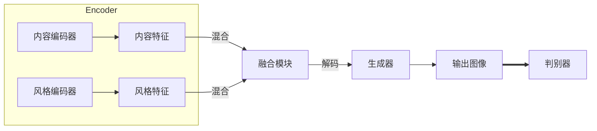

# 基于生成对抗网络的多风格图像转换模型研究

## 1.背景介绍

### 1.1 图像转换任务概述

图像转换是计算机视觉和图形学领域的一个核心任务,旨在将一种风格或特征的图像转换为另一种风格或特征。例如,将照片转换为素描画风格、将夏季景色转换为冬季景色、将黑白照片上色等。传统的基于规则或参数的方法往往需要手工设计复杂的算法和参数,难以适应多变的图像样式。

近年来,基于深度学习的图像转换方法取得了长足进展,特别是生成对抗网络(Generative Adversarial Networks, GANs)展现出了强大的图像生成能力。生成对抗网络通过生成器和判别器相互对抗的方式,可以学习到图像的潜在分布,并基于该分布生成逼真的图像。

### 1.2 多风格图像转换的重要性

然而,现有的GAN图像转换模型大多数只能完成单一风格的转换任务,例如将照片转换为素描画风格。在实际应用中,我们往往需要将一幅图像转换为多种不同的风格,以满足不同的使用场景需求。例如,在图像编辑软件中,用户可能希望将同一张照片转换为不同的艺术风格,以选择最理想的效果。因此,研究能够实现多风格图像转换的生成模型就显得尤为重要。

多风格图像转换技术的发展可以促进图像编辑、计算机辅助设计、增强现实、视觉娱乐等领域的创新应用。同时,这项技术也为研究图像表示学习、风格迁移等计算机视觉前沿问题提供了新的视角和方法。

## 2.核心概念与联系

### 2.1 生成对抗网络(GANs)

生成对抗网络是当前最成功的生成模型之一,由一个生成器网络(Generator)和一个判别器网络(Discriminator)组成。生成器的目标是生成逼真的样本以欺骗判别器,而判别器则试图区分生成器产生的样本和真实数据之间的差异。两个网络通过下面的对抗过程相互训练:

1. 生成器从噪声分布中采样,并将其输入到一个多层感知机中,生成一个伪样本。
2. 判别器从真实数据和生成器产生的伪样本中各取一个样本,并输入到另一个多层感知机中,输出一个概率值,代表该样本是真实数据的概率。
3. 生成器的目标是最小化判别器判别为伪样本的概率,而判别器则是最大化判别为真实数据的概率。

生成对抗网络的目标函数可以形式化为:

$$\min_G \max_D V(D,G) = \mathbb{E}_{x\sim p_\text{data}(x)}[\log D(x)] + \mathbb{E}_{z\sim p_z(z)}[\log(1-D(G(z)))]$$

其中, $G$是生成器的函数,将噪声$z$映射到数据空间。$D$是判别器,对于真实数据$x$和生成数据$G(z)$给出了源的判别结果。对于生成器$G$,目标是使$D(G(z))$的值尽可能接近1,而对于判别器$D$,目标是使$D(x)$的值尽可能接近1,使$D(G(z))$的值尽可能接近0。

GANs已经在图像生成、图像转换、图像超分辨率等任务中展现出了优异的性能。然而,训练GANs往往存在模式崩溃、收敛不稳定等挑战,需要一些技巧和改进方法来提高训练的稳定性和生成质量。

### 2.2 图像风格转换

图像风格转换是指将一幅图像的内容保持不变,但将其风格(如笔触、颜色、纹理等)转换为另一种风格。这种任务通常被建模为将一幅内容图像和一幅风格图像作为输入,输出一幅保留了内容图像内容并融合了风格图像风格的新图像。

早期的风格转换方法主要是基于图像处理和计算机图形学技术,如图像分割、纹理合成等。随着深度学习的发展,基于卷积神经网络(CNN)的算法在这一任务上取得了突破性进展。Gatys等人提出了基于CNN的神经风格迁移算法,能够高保真地迁移风格图像的风格到内容图像上。该算法的关键是构造了一个损失函数,使输出图像在CNN的不同层上分别匹配内容图像和风格图像的特征响应。

此后,研究人员进一步将GANs应用到图像风格转换任务中。通过对抗训练,生成器可以直接生成融合了所需风格的图像,避免了显式的特征迁移过程。CycleGAN、UNIT、MUNIT等工作成功将GANs应用到了图像风格迁移任务中,取得了很好的效果。

### 2.3 多风格图像转换

尽管单一风格的图像转换已经取得了长足进展,但实现多风格转换的目标依然具有挑战性。一种直接的思路是为每一对源风格和目标风格训练一个独立的模型,但这种方法的缺点是需要训练大量模型,并且不能实现任意风格之间的互转。

另一种更有前景的方法是设计一个统一的多风格转换框架,使模型能够在单个前馈过程中完成任意风格之间的转换。这种框架通常包括以下几个关键组成部分:

1. **内容编码器(Content Encoder)**: 将输入图像编码为内容特征表示,确保输出图像的内容保持不变。

2. **风格编码器(Style Encoder)**: 将风格示例图像编码为风格特征表示,捕获目标风格的特征。

3. **风格融合模块(Style Fusion Module)**: 将内容特征和风格特征融合,生成融合了目标风格的新特征表示。

4. **生成器(Generator)**: 将融合后的特征解码为最终的输出图像。

5. **判别器(Discriminator)**: 判别输出图像是否为真实图像,为生成器提供对抗训练信号。

不同的多风格转换模型主要在于对上述模块的具体设计和实现方式。我们将在下一节对其中的核心算法原理进行详细介绍。

## 3.核心算法原理具体操作步骤

在这一节,我们将详细介绍一种基于生成对抗网络的多风格图像转换框架MUNIT及其算法原理。MUNIT(Multimodal Unsupervised Image-to-Image Translation)是一种无监督的多模态图像转换框架,能够在单个模型中实现任意风格之间的转换。

### 3.1 MUNIT框架概述

MUNIT的整体框架如下图所示:

该框架主要包括以下几个模块:

1. **内容编码器(Content Encoder)**: 一个卷积神经网络,将输入图像编码为内容特征表示。
2. **风格编码器(Style Encoder)**: 另一个卷积神经网络,将风格示例图像编码为风格特征表示。
3. **融合模块(Style Fusion Module)**: 将内容特征和风格特征融合,生成融合了目标风格的新特征表示。
4. **生成器(Generator)**: 一个转置卷积网络,将融合后的特征解码为最终的输出图像。
5. **判别器(Discriminator)**: 判别输出图像是否为真实图像,为生成器提供对抗训练信号。

在训练过程中,MUNIT的目标是最小化以下多项损失函数:

$$\mathcal{L} = \mathcal{L}_\text{GAN} + \lambda_1\mathcal{L}_\text{feat} + \lambda_2\mathcal{L}_\text{FM}$$

其中:

- $\mathcal{L}_\text{GAN}$是标准的生成对抗损失,确保生成图像的真实性。
- $\mathcal{L}_\text{feat}$是特征重构损失,确保生成图像保留了输入内容图像的内容。
- $\mathcal{L}_\text{FM}$是特征映射损失,确保生成图像融合了目标风格。

我们将在下面详细介绍这些损失函数的计算方式和作用。

### 3.2 生成对抗损失

生成对抗损失$\mathcal{L}_\text{GAN}$是标准的GAN损失,包括生成器损失和判别器损失两部分:

$$\begin{aligned}
\mathcal{L}_\text{GAN}^G &= \mathbb{E}_{x,y}[-\log D(G(x, y))] \\
\mathcal{L}_\text{GAN}^D &= \mathbb{E}_{x,y}[-\log D(x, y)] + \mathbb{E}_{x,y}[-\log(1 - D(G(x, y)))]
\end{aligned}$$

其中$x$表示输入内容图像,$y$表示目标风格示例图像。生成器$G$的目标是生成能够欺骗判别器$D$的逼真图像,而判别器$D$则试图区分生成图像和真实图像。通过这种对抗训练,生成器可以学习生成高质量、真实的图像。

### 3.3 特征重构损失

为了确保生成图像保留了输入内容图像的内容,MUNIT引入了特征重构损失$\mathcal{L}_\text{feat}$。具体来说,我们首先使用内容编码器提取输入内容图像$x$和生成图像$G(x, y)$的特征表示$f(x)$和$f(G(x, y))$。然后计算这两个特征表示之间的均方误差作为重构损失:

$$\mathcal{L}_\text{feat} = \|f(x) - f(G(x, y))\|_2^2$$

通过最小化这一损失项,生成器被迫保留输入图像的内容信息。

### 3.4 特征映射损失

为了使生成图像融合目标风格,MUNIT设计了特征映射损失$\mathcal{L}_\text{FM}$。具体来说,我们首先使用风格编码器提取风格示例图像$y$的风格特征表示$s(y)$。然后,我们期望生成图像$G(x, y)$的特征表示$f(G(x, y))$在某种映射$M$下,能够重构风格特征$s(y)$。特征映射损失即为这一重构误差:

$$\mathcal{L}_\text{FM} = \|s(y) - M(f(G(x, y)))\|_1$$

其中$M$是一个可学习的映射函数,可以是一个简单的线性映射或者更复杂的非线性映射。通过最小化这一损失项,生成器被迫生成融合了目标风格的图像。

### 3.5 训练过程

MUNIT的训练过程包括以下几个步骤:

1. 从内容图像域和风格图像域分别采样一批内容图像$x$和风格图像$y$。
2. 使用内容编码器提取内容特征表示$f(x)$,使用风格编码器提取风格特征表示$s(y)$。
3. 将内容特征和风格特征融合,输入生成器生成融合后的图像$G(x, y)$。
4. 使用判别器判别生成图像$G(x, y)$是否为真实图像,计算生成对抗损失$\mathcal{L}_\text{GAN}$。
5. 计算特征重构损失$\mathcal{L}_\text{feat}$和特征映射损失$\mathcal{L}_\text{FM}$。
6. 将三项损失相加,得到总损失$\mathcal{L}$。
7. 使用反向传播算法,分别更新生成器、判别器和映射函数$M$的参数,最小化总损失$\mathcal{L}$。

通过上述对抗训练过程,MUNIT可以学习到一个统一的生成器,能够将任意内容图像转换为任意风格,实现多风格图像转换的目标。

## 4.数学模型和公式详细讲解举例说明

在前面的章节中,我们已经介绍了MUNIT框架的核心算法原理和损失函数形式。在这一节