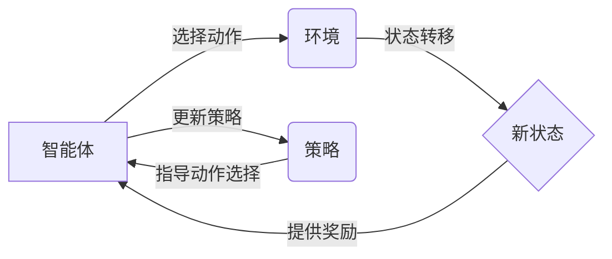

## 1. 背景介绍

### 1.1 人工智能简史与发展方向
人工智能 (Artificial Intelligence, AI) 的目标是使机器能够像人类一样思考和行动。自 20 世纪 50 年代诞生以来，人工智能经历了符号主义、连接主义和深度学习等多个发展阶段，并在近年来取得了突破性进展，如图像识别、自然语言处理和游戏博弈等领域。当前，人工智能正朝着更加通用、自主和智能的方向发展，而增强学习作为实现这一目标的重要途径之一，正受到越来越多的关注。

### 1.2 增强学习的定义与特点
增强学习 (Reinforcement Learning, RL) 是一种机器学习范式，它关注智能体 (Agent) 如何在一个环境 (Environment) 中通过与环境交互来学习最优策略 (Policy)。与其他机器学习方法不同，增强学习的特点在于：

* **试错学习 (Trial-and-Error Learning):** 智能体通过不断尝试不同的动作并观察环境的反馈来学习最佳策略，而无需预先提供任何标签数据。
* **延迟奖励 (Delayed Reward):** 智能体的目标是最大化长期累积奖励，而不是仅仅关注眼前的利益。
* **探索与利用 (Exploration vs. Exploitation):** 智能体需要在探索新的动作和利用已知信息之间进行权衡，以找到最佳策略。

### 1.3 增强学习的应用领域
增强学习在许多领域都有着广泛的应用，例如：

* **游戏博弈:** AlphaGo、AlphaZero 等人工智能程序利用增强学习在围棋、国际象棋等游戏中战胜了人类顶尖选手。
* **机器人控制:** 增强学习可以用于训练机器人完成各种复杂任务，如抓取物体、行走和导航等。
* **推荐系统:** 增强学习可以根据用户的历史行为和偏好，推荐个性化的商品或服务。
* **金融交易:** 增强学习可以用于构建自动交易系统，以最大化投资回报。


## 2. 核心概念与联系

### 2.1 智能体 (Agent)
智能体是增强学习的核心组成部分，它负责感知环境状态、选择动作并接收环境反馈。智能体的目标是学习一个最优策略，以最大化长期累积奖励。

### 2.2 环境 (Environment)
环境是指智能体所处的外部世界，它可以是真实世界也可以是虚拟世界。环境会根据智能体的动作改变自身状态，并向智能体提供奖励信号。

### 2.3 状态 (State)
状态是指环境在某一时刻的具体情况，它包含了所有影响环境未来演化的信息。智能体根据当前状态来选择动作。

### 2.4 动作 (Action)
动作是指智能体可以采取的操作，不同的动作会导致环境状态发生不同的变化。

### 2.5 奖励 (Reward)
奖励是环境对智能体动作的评价，它可以是正面的也可以是负面的。智能体的目标是最大化长期累积奖励。

### 2.6 策略 (Policy)
策略是指智能体在每个状态下选择动作的规则，它可以是一个确定性的函数也可以是一个概率分布。

### 2.7 值函数 (Value Function)
值函数是指从某个状态开始，遵循某个策略所能获得的长期累积奖励的期望值。

### 2.8 模型 (Model)
模型是指对环境的模拟，它可以预测环境状态的转移和奖励函数。

### 2.9 核心概念之间的联系
下图展示了增强学习中各个核心概念之间的联系：



## 3. 核心算法原理具体操作步骤

### 3.1 基于价值的算法 (Value-Based Methods)
基于价值的算法主要包括以下几种：

#### 3.1.1 Q-Learning
Q-Learning 是一种 model-free 的增强学习算法，它通过学习一个 Q 函数来估计每个状态-动作对的价值。Q 函数的更新公式如下：

$$Q(s_t, a_t) \leftarrow Q(s_t, a_t) + \alpha [r_{t+1} + \gamma \max_{a} Q(s_{t+1}, a) - Q(s_t, a_t)]$$

其中：

* $Q(s_t, a_t)$ 表示在状态 $s_t$ 下采取动作 $a_t$ 的价值估计。
* $\alpha$ 是学习率，控制着每次更新的幅度。
* $r_{t+1}$ 是在状态 $s_t$ 下采取动作 $a_t$ 后获得的奖励。
* $\gamma$ 是折扣因子，用于平衡当前奖励和未来奖励的重要性。
* $s_{t+1}$ 是采取动作 $a_t$ 后环境转移到的新状态。

#### 3.1.2 SARSA
SARSA (State-Action-Reward-State-Action) 是一种 on-policy 的增强学习算法，它与 Q-Learning 的区别在于更新 Q 函数时使用的动作是实际执行的动作，而不是根据 Q 函数选择的贪婪动作。SARSA 的更新公式如下：

$$Q(s_t, a_t) \leftarrow Q(s_t, a_t) + \alpha [r_{t+1} + \gamma Q(s_{t+1}, a_{t+1}) - Q(s_t, a_t)]$$

#### 3.1.3  DQN (Deep Q-Network)
DQN 是一种将深度学习与 Q-Learning 相结合的算法，它使用神经网络来逼近 Q 函数。DQN 的主要创新在于引入了经验回放 (Experience Replay) 和目标网络 (Target Network) 等机制，以提高算法的稳定性和效率。

### 3.2 基于策略的算法 (Policy-Based Methods)
基于策略的算法直接学习策略函数，而不需要计算价值函数。

#### 3.2.1 REINFORCE
REINFORCE 是一种经典的基于策略的算法，它使用梯度上升法来更新策略参数，以最大化长期累积奖励的期望值。REINFORCE 的更新公式如下：

$$\theta \leftarrow \theta + \alpha \nabla_\theta \mathbb{E}[R|\theta]$$

其中：

* $\theta$ 是策略函数的参数。
* $\alpha$ 是学习率。
* $R$ 是长期累积奖励。
* $\nabla_\theta \mathbb{E}[R|\theta]$ 是长期累积奖励期望值关于策略参数的梯度。

#### 3.2.2 A2C (Advantage Actor-Critic)
A2C 是一种结合了价值函数和策略函数的算法，它使用 Actor-Critic 架构来同时学习策略和价值函数。A2C 的优势在于可以减少方差，提高学习效率。

#### 3.2.3 PPO (Proximal Policy Optimization)
PPO 是一种改进的基于策略的算法，它通过限制策略更新的幅度来保证学习过程的稳定性。PPO 在 OpenAI Five 等复杂游戏中取得了优异的表现。

## 4. 数学模型和公式详细讲解举例说明

### 4.1 马尔可夫决策过程 (Markov Decision Process, MDP)
马尔可夫决策过程是增强学习的数学基础，它可以用来描述智能体与环境交互的过程。一个 MDP 通常由以下几个元素组成：

* 状态空间 $S$：所有可能状态的集合。
* 动作空间 $A$：所有可能动作的集合。
* 状态转移概率 $P(s'|s, a)$：在状态 $s$ 下采取动作 $a$ 后转移到状态 $s'$ 的概率。
* 奖励函数 $R(s, a, s')$：在状态 $s$ 下采取动作 $a$ 并转移到状态 $s'$ 后获得的奖励。
* 折扣因子 $\gamma$：用于平衡当前奖励和未来奖励的重要性。

### 4.2  Bellman 方程
Bellman 方程是增强学习中的一个重要公式，它描述了价值函数和 Q 函数之间的关系。

#### 4.2.1 状态价值函数的 Bellman 方程
$$V^\pi(s) = \sum_{a \in A} \pi(a|s) \sum_{s' \in S} P(s'|s, a) [R(s, a, s') + \gamma V^\pi(s')]$$

其中：

* $V^\pi(s)$ 表示在状态 $s$ 下遵循策略 $\pi$ 的价值。
* $\pi(a|s)$ 表示在状态 $s$ 下选择动作 $a$ 的概率。

#### 4.2.2  动作价值函数的 Bellman 方程
$$Q^\pi(s, a) = \sum_{s' \in S} P(s'|s, a) [R(s, a, s') + \gamma \sum_{a' \in A} \pi(a'|s') Q^\pi(s', a')]$$

其中：

* $Q^\pi(s, a)$ 表示在状态 $s$ 下采取动作 $a$ 并随后遵循策略 $\pi$ 的价值。

### 4.3 举例说明
假设有一个迷宫环境，智能体的目标是从起点走到终点，每走一步会得到 -1 的奖励，到达终点会得到 100 的奖励。

* 状态空间 $S$：迷宫中所有格子的集合。
* 动作空间 $A$：{上，下，左，右}。
* 状态转移概率 $P(s'|s, a)$：如果动作 $a$ 可以使智能体从状态 $s$ 移动到状态 $s'$，则 $P(s'|s, a) = 1$，否则 $P(s'|s, a) = 0$。
* 奖励函数 $R(s, a, s')$：如果 $s'$ 是终点，则 $R(s, a, s') = 100$，否则 $R(s, a, s') = -1$。
* 折扣因子 $\gamma$：0.9。

可以使用 Q-Learning 算法来解决这个迷宫问题。

## 5. 项目实践：代码实例和详细解释说明

### 5.1 使用 Q-Learning 解决迷宫问题
```python
import numpy as np
import random

# 定义迷宫环境
class Maze:
    def __init__(self):
        self.action_space = ['u', 'd', 'l', 'r']
        self.n_actions = len(self.action_space)
        self.n_states = 9
        self.maze = np.array([
            [0, 0, 0],
            [0, -1, 0],
            [0, 0, 1]
        ])
        self.state = (0, 0)

    def reset(self):
        self.state = (0, 0)
        return self.state

    def step(self, action):
        state = self.state
        if action == 'u':
            next_state = (state[0] - 1, state[1])
        elif action == 'd':
            next_state = (state[0] + 1, state[1])
        elif action == 'l':
            next_state = (state[0], state[1] - 1)
        elif action == 'r':
            next_state = (state[0], state[1] + 1)
        else:
            raise ValueError('Invalid action.')

        # 检查是否越界
        if next_state[0] < 0 or next_state[0] >= self.maze.shape[0] or next_state[1] < 0 or next_state[1] >= self.maze.shape[1]:
            next_state = state

        # 检查是否遇到障碍物
        if self.maze[next_state] == -1:
            next_state = state

        self.state = next_state

        # 计算奖励
        if self.maze[next_state] == 1:
            reward = 100
            done = True
        else:
            reward = -1
            done = False

        return next_state, reward, done

# 定义 Q-Learning 算法
class QLearning:
    def __init__(self, actions, learning_rate=0.01, reward_decay=0.9, e_greedy=0.9):
        self.actions = actions
        self.lr = learning_rate
        self.gamma = reward_decay
        self.epsilon = e_greedy
        self.q_table = {}

    def choose_action(self, state):
        if np.random.uniform() < self.epsilon:
            # 选择 Q 值最大的动作
            if state in self.q_table:
                action = self.actions[np.argmax(self.q_table[state])]
            else:
                action = np.random.choice(self.actions)
        else:
            # 随机选择动作
            action = np.random.choice(self.actions)
        return action

    def learn(self, state, action, reward, next_state):
        if state not in self.q_table:
            self.q_table[state] = np.zeros(len(self.actions))
        if next_state not in self.q_table:
            self.q_table[next_state] = np.zeros(len(self.actions))

        q_predict = self.q_table[state][self.actions.index(action)]
        q_target = reward + self.gamma * np.max(self.q_table[next_state])
        self.q_table[state][self.actions.index(action)] += self.lr * (q_target - q_predict)

# 创建迷宫环境和 Q-Learning 算法
maze = Maze()
RL = QLearning(actions=maze.action_space)

# 训练
for episode in range(1000):
    state = maze.reset()
    while True:
        # 选择动作
        action = RL.choose_action(str(state))

        # 执行动作
        next_state, reward, done = maze.step(action)

        # 更新 Q 表
        RL.learn(str(state), action, reward, str(next_state))

        # 更新状态
        state = next_state

        # 判断是否结束
        if done:
            break

# 测试
state = maze.reset()
while True:
    # 选择动作
    action = RL.choose_action(str(state))

    # 执行动作
    next_state, reward, done = maze.step(action)

    # 打印路径
    print(state, '->', next_state)

    # 更新状态
    state = next_state

    # 判断是否结束
    if done:
        break
```

### 5.2 代码解释
* 首先，我们定义了迷宫环境 `Maze`，它包含了迷宫的结构、状态空间、动作空间、奖励函数等信息。
* 然后，我们定义了 Q-Learning 算法 `QLearning`，它包含了选择动作、更新 Q 表等方法。
* 在训练过程中，我们创建了迷宫环境和 Q-Learning 算法，并进行迭代训练。
* 在测试过程中，我们使用训练好的 Q 表来控制智能体在迷宫中行走，并打印出智能体走过的路径。


## 6. 实际应用场景

### 6.1 游戏博弈
* AlphaGo、AlphaZero 等人工智能程序利用增强学习在围棋、国际象棋等游戏中战胜了人类顶尖选手。

### 6.2 机器人控制
* 增强学习可以用于训练机器人完成各种复杂任务，如抓取物体、行走和导航等。例如，Boston Dynamics 公司开发的 Atlas 机器人利用增强学习技术实现了后空翻等高难度动作。

### 6.3 推荐系统
* 增强学习可以根据用户的历史行为和偏好，推荐个性化的商品或服务。例如，Netflix、YouTube 等公司使用增强学习技术来优化其推荐系统。

### 6.4 金融交易
* 增强学习可以用于构建自动交易系统，以最大化投资回报。例如，一些对冲基金使用增强学习技术来开发高频交易策略。


## 7. 工具和资源推荐

### 7.1 Python 库
* **TensorFlow:** 一个开源的机器学习平台，提供了丰富的 API 用于构建和训练增强学习模型。
* **PyTorch:** 另一个开源的机器学习平台，也提供了丰富的 API 用于构建和训练增强学习模型。
* **Gym:** 一个用于开发和比较增强学习算法的工具包，提供了许多经典的测试环境。
* **Stable Baselines3:** 一个基于 PyTorch 的增强学习库，提供了许多常用的增强学习算法的实现。

### 7.2 在线课程
* **Deep Reinforcement Learning by David Silver:** 由 DeepMind 的 David Silver 主讲的深度增强学习课程，内容全面深入。
* **Reinforcement Learning Specialization by University of Alberta:** 由 Alberta 大学主讲的增强学习专项课程，包含了多个子课程，涵盖了增强学习的基础知识和高级应用。

### 7.3 书籍
* **Reinforcement Learning: An Introduction by Richard S. Sutton and Andrew G. Barto:** 增强学习领域的经典教材，全面介绍了增强学习的基础知识和算法。
* **Deep Learning by Ian Goodfellow, Yoshua Bengio, and Aaron Courville:** 深度学习领域的经典教材，其中也包含了关于增强学习的章节。

## 8. 总结：未来发展趋势与挑战

### 8.1 未来发展趋势
* **更加高效的算法:** 研究更加高效的增强学习算法，以解决高维状态空间、稀疏奖励等问题。
* **更加鲁棒的学习:** 提高增强学习算法的