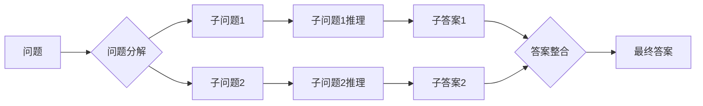

## 1. 背景介绍

### 1.1 大语言模型的兴起与挑战

近年来，随着深度学习技术的快速发展，大语言模型（LLM，Large Language Model）在自然语言处理领域取得了突破性进展。这些模型拥有庞大的参数量和复杂的网络结构，能够学习和理解海量的文本数据，并在各种自然语言处理任务中展现出惊人的性能，例如：

* **文本生成**:  撰写高质量的文章、诗歌、剧本等。
* **机器翻译**: 实现不同语言之间的准确翻译。
* **问答系统**:  对用户提出的问题提供精准的答案。
* **代码生成**:  根据自然语言描述生成可执行的代码。

然而，尽管大语言模型取得了令人瞩目的成就，但它们在推理能力方面仍然存在局限性。传统的语言模型主要依赖于统计模式识别，缺乏对逻辑推理和常识知识的理解。这导致它们在处理需要多步骤推理、复杂逻辑和背景知识的任务时表现不佳。

### 1.2  思维链：增强推理能力的新思路

为了解决大语言模型推理能力不足的问题，研究人员提出了**思维链（Chain-of-Thought，CoT）**这一新兴技术。思维链的核心思想是引导模型生成一系列中间推理步骤，类似于人类思考问题时的思维过程，从而提高模型的推理能力和可解释性。

## 2. 核心概念与联系

### 2.1 思维链的基本原理

思维链的核心在于将复杂的任务分解成一系列简单的子任务，并引导模型逐步解决每个子任务，最终推导出最终答案。具体来说，思维链通常包含以下步骤：

1. **问题分解**: 将复杂问题分解成一系列简单的子问题。
2. **子问题推理**:  利用模型对每个子问题进行推理，并给出相应的答案或解释。
3. **答案整合**: 将所有子问题的答案整合起来，推导出最终答案。

### 2.2 思维链的类型

根据实现方式的不同，思维链可以分为以下几种类型：

* **基于提示的思维链**: 通过在输入中添加一些提示词或示例，引导模型生成推理步骤。
* **基于模型的思维链**:  训练专门的模型来生成推理步骤，例如，使用Seq2Seq模型将问题映射到推理步骤序列。
* **基于知识的思维链**:  将外部知识库整合到模型中，帮助模型进行更准确的推理。

### 2.3  思维链与其他技术的联系

思维链与其他自然语言处理技术密切相关，例如：

* **Prompt Engineering**: 思维链可以看作是一种高级的提示工程技术，通过设计更复杂的提示词来引导模型生成推理步骤。
* **Reasoning with Language Models**: 思维链是增强语言模型推理能力的重要方向之一，其他相关技术还包括知识图谱、逻辑推理等。
* **Explainable AI**: 思维链可以提高模型的可解释性，因为它能够提供模型推理过程的中间步骤。

## 3. 核心算法原理具体操作步骤

### 3.1 基于提示的思维链

基于提示的思维链是最简单易用的思维链实现方式，其核心思想是在输入中添加一些提示词或示例，引导模型生成推理步骤。

**操作步骤**:

1. **设计提示词**:  选择合适的提示词，例如 "Let's think step by step"、"Let's break down this problem" 等，引导模型生成推理步骤。
2. **构建输入**: 将提示词添加到原始输入中，例如：
   ```
   Question: A cat is chasing a mouse. The mouse runs into a hole. What will the cat do next?
   Prompt: Let's think step by step: The mouse ran into the hole because...
   ```
3. **模型预测**:  将构建好的输入送入语言模型，让模型预测后续内容。
4. **提取答案**: 从模型生成的文本中提取推理步骤和最终答案。

**示例**:

```
Question: John has 8 apples. He gives 3 apples to Mary. How many apples does John have left?
Prompt: Let's think step by step: John starts with 8 apples...

Output: 
Let's think step by step: 
John starts with 8 apples. 
He gives 3 apples to Mary. 
8 - 3 = 5. 
Therefore, John has 5 apples left.
```

### 3.2 基于模型的思维链

基于模型的思维链使用专门的模型来生成推理步骤，例如，使用Seq2Seq模型将问题映射到推理步骤序列。

**操作步骤**:

1. **数据准备**: 准备包含问题、推理步骤和答案的数据集。
2. **模型训练**: 使用Seq2Seq模型将问题编码成向量，并解码成推理步骤序列。
3. **模型预测**: 将问题输入训练好的模型，生成推理步骤序列。
4. **答案提取**: 从推理步骤序列中提取最终答案。

**示例**:

```python
# 使用Seq2Seq模型生成推理步骤
from transformers import AutoModelForSeq2SeqLM, AutoTokenizer

# 加载预训练模型和词表
model_name = "google/flan-t5-base"
model = AutoModelForSeq2SeqLM.from_pretrained(model_name)
tokenizer = AutoTokenizer.from_pretrained(model_name)

# 构建输入
question = "John has 8 apples. He gives 3 apples to Mary. How many apples does John have left?"
input_text = f"Question: {question} Generate reasoning steps:"

# 模型预测
input_ids = tokenizer.encode(input_text, return_tensors="pt")
outputs = model.generate(input_ids)
reasoning_steps = tokenizer.decode(outputs[0], skip_special_tokens=True)

# 打印推理步骤
print(reasoning_steps)
```

### 3.3 基于知识的思维链

基于知识的思维链将外部知识库整合到模型中，帮助模型进行更准确的推理。

**操作步骤**:

1. **知识库构建**: 构建包含相关领域知识的知识库。
2. **知识检索**:  根据问题从知识库中检索相关知识。
3. **知识整合**:  将检索到的知识整合到模型的输入中。
4. **模型预测**:  将整合了知识的输入送入语言模型，进行预测。

**示例**:

```python
# 使用知识图谱增强推理能力
import openai

# 设置 OpenAI API 密钥
openai.api_key = "YOUR_API_KEY"

# 构建问题
question = "What is the capital of France?"

# 从知识图谱中检索相关知识
knowledge = get_knowledge_from_kg(question)

# 将知识整合到问题中
prompt = f"""
Question: {question}
Knowledge: {knowledge}
Answer:
"""

# 调用 OpenAI API 获取答案
response = openai.Completion.create(
    engine="text-davinci-003",
    prompt=prompt,
    max_tokens=50,
    n=1,
    stop=None,
    temperature=0.5,
)

# 打印答案
print(response.choices[0].text)
```

## 4. 数学模型和公式详细讲解举例说明

### 4.1 概率语言模型

大语言模型通常基于概率语言模型（Probability Language Model）构建。概率语言模型的目标是学习一个能够预测下一个词出现的概率的函数。

$$
P(w_1, w_2, ..., w_n) = \prod_{i=1}^{n} P(w_i | w_1, w_2, ..., w_{i-1})
$$

其中，$w_1, w_2, ..., w_n$ 表示一个句子中的词序列，$P(w_i | w_1, w_2, ..., w_{i-1})$ 表示在已知前面词的情况下，第 $i$ 个词出现的概率。

### 4.2  神经网络语言模型

现代大语言模型通常使用神经网络来实现概率语言模型。神经网络语言模型使用神经网络来学习词的向量表示，并根据这些向量表示来计算词出现的概率。

**示例**:

```python
# 使用循环神经网络构建语言模型
import torch
import torch.nn as nn

class RNNLM(nn.Module):
    def __init__(self, vocab_size, embedding_dim, hidden_dim):
        super().__init__()
        self.embedding = nn.Embedding(vocab_size, embedding_dim)
        self.rnn = nn.RNN(embedding_dim, hidden_dim)
        self.fc = nn.Linear(hidden_dim, vocab_size)

    def forward(self, x):
        embedded = self.embedding(x)
        output, hidden = self.rnn(embedded)
        logits = self.fc(output)
        return logits
```

### 4.3  注意力机制

注意力机制（Attention Mechanism）是近年来自然语言处理领域的一项重要技术，它可以让模型在处理序列数据时，关注到与当前任务最相关的部分。

**公式**:

$$
Attention(Q, K, V) = softmax(\frac{QK^T}{\sqrt{d_k}})V
$$

其中，$Q$ 表示查询向量，$K$ 表示键向量，$V$ 表示值向量，$d_k$ 表示键向量的维度。

**示例**:

```python
# 使用注意力机制增强语言模型
class AttentionRNNLM(nn.Module):
    def __init__(self, vocab_size, embedding_dim, hidden_dim):
        super().__init__()
        self.embedding = nn.Embedding(vocab_size, embedding_dim)
        self.rnn = nn.RNN(embedding_dim, hidden_dim)
        self.attention = nn.MultiheadAttention(hidden_dim, num_heads=8)
        self.fc = nn.Linear(hidden_dim, vocab_size)

    def forward(self, x):
        embedded = self.embedding(x)
        output, hidden = self.rnn(embedded)
        attended_output, _ = self.attention(output, output, output)
        logits = self.fc(attended_output)
        return logits
```

## 5. 项目实践：代码实例和详细解释说明

### 5.1 使用思维链解决数学推理问题

以下代码演示了如何使用基于提示的思维链解决简单的数学推理问题：

```python
import openai

# 设置 OpenAI API 密钥
openai.api_key = "YOUR_API_KEY"

# 定义问题
question = "John has 8 apples. He gives 3 apples to Mary. How many apples does John have left?"

# 构建提示词
prompt = f"Question: {question}\nLet's think step by step:"

# 调用 OpenAI API 获取答案
response = openai.Completion.create(
    engine="text-davinci-003",
    prompt=prompt,
    max_tokens=50,
    n=1,
    stop=None,
    temperature=0.5,
)

# 打印答案
print(response.choices[0].text)
```

**代码解释**:

* 首先，我们使用 `openai.Completion.create()` 函数调用 OpenAI API。
* 在 `prompt` 参数中，我们构建了一个包含问题和提示词的字符串。
* `engine` 参数指定了要使用的语言模型，这里我们使用的是 `text-davinci-003`。
* 其他参数用于控制模型的生成过程，例如 `max_tokens` 指定了生成文本的最大长度。
* 最后，我们打印了模型生成的答案。

### 5.2 使用思维链进行代码生成

以下代码演示了如何使用思维链进行代码生成：

```python
import openai

# 设置 OpenAI API 密钥
openai.api_key = "YOUR_API_KEY"

# 定义代码生成任务
task = "Write a Python function that takes a list of numbers as input and returns the sum of all even numbers in the list."

# 构建提示词
prompt = f"""
```python
def sum_even_numbers(numbers):
  \"\"\"
  {task}
  \"\"\"
  # Let's think step by step:
  # 1. Initialize a variable `sum` to 0.
  # 2. Iterate over the list of numbers.
  # 3. For each number, check if it is even.
  # 4. If the number is even, add it to `sum`.
  # 5. Return `sum`.
```
"""

# 调用 OpenAI API 生成代码
response = openai.Completion.create(
    engine="code-davinci-002",
    prompt=prompt,
    max_tokens=100,
    n=1,
    stop=None,
    temperature=0.5,
)

# 打印生成的代码
print(response.choices[0].text)
```

**代码解释**:

* 在这个例子中，我们首先定义了要生成的代码的功能。
* 然后，我们构建了一个包含函数签名、文档字符串和思维链提示词的字符串。
* 注意，我们在思维链提示词中将代码生成任务分解成了多个步骤。
* 最后，我们调用 OpenAI API 生成代码，并打印生成的代码。

## 6. 实际应用场景

### 6.1  问答系统

思维链可以显著提高问答系统的性能，特别是在处理需要多步骤推理或复杂逻辑的问题时。例如，可以使用思维链来解决以下问题：

* "John went to the store and bought a loaf of bread for $2 and a gallon of milk for $3. He paid with a $10 bill. How much change did he get back?"
* "A train leaves New York City at 10:00 AM traveling at 60 mph. Another train leaves Chicago at 11:00 AM traveling at 70 mph. If the two cities are 800 miles apart, at what time will the trains pass each other?"

### 6.2  文本摘要

思维链可以用于生成更准确、更连贯的文本摘要。例如，可以使用思维链来识别文本中的关键信息，并将其组织成一个简洁的摘要。

### 6.3  机器翻译

思维链可以提高机器翻译的质量，特别是在处理语言差异较大或需要理解上下文才能准确翻译的句子时。

### 6.4  代码生成

思维链可以用于生成更复杂、更符合逻辑的代码。例如，可以使用思维链来生成完整的函数、类或程序。


## 7. 工具和资源推荐

### 7.1  OpenAI API

OpenAI API 提供了强大的语言模型，可以通过 API 调用使用这些模型进行各种自然语言处理任务，包括思维链。

### 7.2  Hugging Face Transformers

Hugging Face Transformers 是一个开源的自然语言处理库，提供了各种预训练的语言模型和工具，可以方便地实现思维链。

### 7.3  LangChain

LangChain 是一个用于构建语言模型应用的框架，它提供了一些工具和抽象，可以更方便地实现思维链和其他高级语言模型应用。

## 8. 总结：未来发展趋势与挑战

### 8.1  未来发展趋势

* **更强大的语言模型**: 随着计算能力的提升和数据的积累，我们可以期待看到更强大、更通用的语言模型出现。
* **更先进的思维链技术**: 研究人员正在探索更先进的思维链技术，例如，将知识图谱、逻辑推理等技术与思维链相结合。
* **更广泛的应用场景**: 思维链将在更多领域得到应用，例如，医疗诊断、金融分析、法律咨询等。

### 8.2  挑战

* **模型的可解释性**: 尽管思维链可以提高模型的可解释性，但仍然难以完全理解模型的推理过程。
* **数据偏差**: 语言模型的训练数据可能存在偏差，这可能导致模型生成有偏见的结果。
* **伦理问题**: 随着语言模型变得越来越强大，我们需要更加关注其伦理影响，例如，如何防止语言模型被用于恶意目的。

## 9. 附录：常见问题与解答

### 9.1  什么是思维链？

思维链是一种引导语言模型生成一系列中间推理步骤的技术，类似于人类思考问题时的思维过程。

### 9.2  思维链的优点是什么？

思维链可以提高语言模型的推理能力、可解释性和性能。

### 9.3  如何实现思维链？

思维链可以通过多种方式实现，包括基于提示的思维链、基于模型的思维链和基于知识的思维链。

### 9.4  思维链的应用场景有哪些？

思维链可以应用于各种自然语言处理任务，包括问答系统、文本摘要、机器翻译和代码生成等。


##  10.  思维链的 Mermaid 流程图


