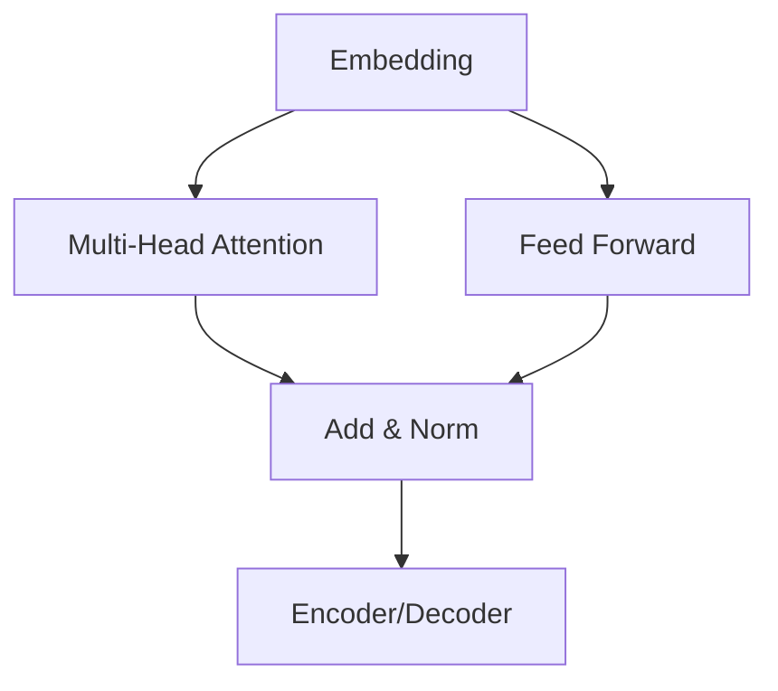

# 大语言模型应用指南：机器学习的过程

## 1. 背景介绍

### 1.1 什么是大语言模型？

大语言模型（Large Language Models，LLMs）是一种基于深度学习的自然语言处理（NLP）模型，能够理解和生成人类语言。它们通过在大规模文本数据上进行训练，学习语言的模式和规则，从而获得对语言的深入理解。

大语言模型的出现代表了 NLP 领域的一个重大突破。传统的 NLP 系统通常依赖于手工设计的规则和特征,而大语言模型则能够自动从数据中学习语言知识,从而显著提高了系统的性能和泛化能力。

### 1.2 大语言模型的应用

大语言模型在各种自然语言处理任务中展现出了卓越的性能,包括但不限于:

- 文本生成(如新闻撰写、创作写作、对话系统等)
- 机器翻译
- 问答系统
- 文本摘要
- 情感分析
- 实体识别和关系抽取
- 等等

除了在 NLP 领域的应用,大语言模型还在其他领域产生了广泛影响,如代码生成、蛋白质结构预测等。

### 1.3 本文概述

本文将重点介绍如何将大语言模型应用于机器学习的各个环节,包括数据预处理、模型训练、模型评估、模型部署等。我们将探讨大语言模型在这些环节中的作用、挑战和最佳实践。

通过本文,读者将能够全面了解大语言模型在机器学习过程中的应用,为将大语言模型引入自己的项目做好准备。

## 2. 核心概念与联系 

### 2.1 大语言模型的架构

大多数大语言模型都采用了 Transformer 架构,这是一种基于自注意力机制的序列到序列模型。Transformer 架构能够有效捕获输入序列中的长程依赖关系,从而显著提高了模型的性能。

其核心组件包括:

- **嵌入层**: 将输入的文本tokens转换为向量表示
- **编码器**: 对输入序列进行编码,捕获上下文信息
- **解码器**: 根据编码器的输出和先前生成的tokens,预测下一个token
- **自注意力机制**: 计算输入序列中每个位置与其他位置的关联程度

下图展示了 Transformer 模型的基本架构:

### 2.2 预训练与微调

大语言模型通常采用两阶段的训练方式:

1. **预训练 (Pretraining)**: 在大规模无标注文本数据上进行自监督训练,学习通用的语言知识。常用的预训练目标包括 Masked Language Modeling 和 Next Sentence Prediction 等。
2. **微调 (Finetuning)**: 在特定的下游任务数据上进行有监督训练,将通用语言知识迁移到目标任务。

预训练和微调的分离使得大语言模型能够在不同任务之间共享知识,从而大大提高了训练效率和性能。

### 2.3 提示学习

提示学习(Prompt Learning)是指通过设计合适的提示(Prompt),引导大语言模型生成所需的输出。提示可以是一些指令性的短语,也可以是一些相关的上下文信息。

提示学习的关键在于,如何设计高质量的提示,使其能够最大限度地激发大语言模型的潜力。这通常需要一定的技巧和经验,也是当前的一个研究热点。

### 2.4 大语言模型与机器学习

大语言模型在机器学习的各个环节都发挥着重要作用:

- **数据预处理**: 利用大语言模型生成高质量的数据扩充,或对原始数据进行清洗和标注。
- **特征工程**: 将文本数据映射为大语言模型的嵌入向量,作为机器学习模型的输入特征。
- **模型训练**: 通过提示学习等方式,将大语言模型知识迁移到目标任务。
- **模型评估**: 生成测试用例,评估模型的泛化能力。
- **模型解释**: 分析大语言模型捕获的语义信息,解释模型的行为和决策。

总的来说,大语言模型为机器学习注入了全新的能力,开辟了广阔的应用前景。

## 3. 核心算法原理具体操作步骤

在本节中,我们将深入探讨大语言模型中使用的核心算法原理及其具体操作步骤。

### 3.1 Transformer 自注意力机制

Transformer 架构的核心是自注意力(Self-Attention)机制,它能够有效捕获输入序列中的长程依赖关系。自注意力机制的计算过程如下:

1. 计算查询(Query)、键(Key)和值(Value)向量:

$$\begin{aligned}
Q &= XW_Q \\
K &= XW_K \\
V &= XW_V
\end{aligned}$$

其中 $X$ 是输入序列的嵌入向量, $W_Q$、$W_K$ 和 $W_V$ 是可学习的权重矩阵。

2. 计算注意力分数:

$$\text{Attention}(Q, K, V) = \text{softmax}\left(\frac{QK^T}{\sqrt{d_k}}\right)V$$

其中 $d_k$ 是缩放因子,用于防止内积过大导致梯度消失。

3. 多头注意力(Multi-Head Attention):通过线性投影,将注意力分数从不同的表示子空间进行捕获,然后将它们concat起来,形成最终的注意力输出。

4. 残差连接和层归一化:注意力输出与输入进行残差连接,然后进行层归一化,以保持梯度稳定性。

自注意力机制的优势在于,它可以同时关注输入序列中的所有位置,而不受序列长度的限制。这使得 Transformer 能够有效地处理长序列输入,显著提高了模型的性能。

### 3.2 Masked Language Modeling

Masked Language Modeling (MLM) 是一种常用的大语言模型预训练目标。它的目的是根据上下文,预测被掩码的单词。具体操作步骤如下:

1. 从输入序列中随机选择 15% 的 token 位置进行掩码。
2. 将被掩码的 token 替换为特殊的 [MASK] 标记,或者以 80% 的概率保留原始 token,10% 的概率替换为随机 token,10% 的概率替换为 [MASK] 标记。
3. 使用编码器对输入序列进行编码,得到每个位置的上下文表示。
4. 对于被掩码的位置,使用解码器根据上下文表示预测原始 token。
5. 计算预测值与真实值之间的交叉熵损失,并使用该损失进行模型参数的更新。

MLM 任务迫使大语言模型学习双向语境,从而获得更加通用和强大的语言理解能力。它是当前最成功的大语言模型预训练目标之一。

### 3.3 Next Sentence Prediction

Next Sentence Prediction (NSP) 是另一种常见的大语言模型预训练目标。它的目的是判断两个句子是否为连续的句子对。具体操作步骤如下:

1. 从语料库中抽取句子对,其中 50% 为真实的连续句子对,50% 为随机构造的不连续句子对。
2. 将两个句子拼接为单个序列,在中间添加一个特殊的分隔符 [SEP]。
3. 将拼接后的序列输入到编码器中,得到句子对的上下文表示。
4. 使用二分类器,根据上下文表示预测句子对是否为连续的句子对。
5. 计算二分类损失,并使用该损失进行模型参数的更新。

NSP 任务有助于大语言模型学习捕获句子之间的关系和语义连贯性,从而提高模型对长文本的理解能力。

### 3.4 反向语言模型

除了 MLM 和 NSP,反向语言模型(Reverse Language Model)也是一种常用的大语言模型预训练目标。它的目的是根据上下文,预测序列中的下一个 token。具体操作步骤如下:

1. 将输入序列反向,例如 "我爱机器学习" 变为 "习学器机爱我"。
2. 使用编码器对反向序列进行编码,得到每个位置的上下文表示。
3. 使用解码器根据上下文表示,预测序列中的下一个 token。
4. 计算预测值与真实值之间的交叉熵损失,并使用该损失进行模型参数的更新。

反向语言模型任务迫使大语言模型学习捕获文本中的语序信息,从而增强模型对语法和句子结构的理解能力。

### 3.5 生成式预训练

除了上述基于遮掩和预测的预训练目标,生成式预训练(Generative Pretraining)也是一种有效的方法。它的目的是让大语言模型直接生成连贯的文本。具体操作步骤如下:

1. 从语料库中抽取一段文本作为输入提示(Prompt)。
2. 使用编码器对输入提示进行编码,得到上下文表示。
3. 使用解码器基于上下文表示,生成连贯的文本序列。
4. 计算生成序列与真实序列之间的损失(如交叉熵损失),并使用该损失进行模型参数的更新。

生成式预训练任务迫使大语言模型学习捕获文本的语义和逻辑连贯性,从而提高模型的文本生成能力。它在创作写作、对话系统等领域具有广泛的应用前景。

通过上述各种预训练目标的组合,大语言模型能够获得全面的语言理解和生成能力,为下游任务的应用奠定坚实的基础。

## 4. 数学模型和公式详细讲解举例说明

在本节中,我们将详细介绍大语言模型中使用的数学模型和公式,并通过具体示例加深理解。

### 4.1 词嵌入

词嵌入(Word Embedding)是将词映射到连续的向量空间中的技术。它是大语言模型的基础,也是当前 NLP 任务中最常用的表示方法之一。

假设我们有一个词汇表 $\mathcal{V}$,其中包含 $|\mathcal{V}|$ 个词。我们可以使用一个 $|\mathcal{V}| \times d$ 的嵌入矩阵 $E$,将每个词 $w$ 映射到一个 $d$ 维的向量 $\vec{w}$:

$$\vec{w} = E_{i,:}$$

其中 $i$ 是词 $w$ 在词汇表中的索引。

词嵌入矩阵 $E$ 通常是一个可学习的参数,在模型训练过程中不断地更新和优化。通过这种方式,相似的词会被映射到向量空间中的相近位置,从而捕获了词与词之间的语义关系。

### 4.2 注意力机制

注意力机制是 Transformer 架构的核心,它能够有效地捕获输入序列中的长程依赖关系。我们以 Scaled Dot-Product Attention 为例,介绍其数学原理:

给定一个查询(Query) $Q$、一个键(Key) $K$ 和一个值(Value) $V$,注意力计算过程如下:

1. 计算注意力分数:

$$\text{Attention}(Q, K, V) = \text{softmax}\left(\frac{QK^T}{\sqrt{d_k}}\right)V$$

其中 $d_k$ 是缩放因子,用于防止内积过大导致梯度消失。

2. 多头注意力机制:

$$\begin{aligned}
\text{MultiHead}(Q, K, V) &= \text{Concat}(head_1, \dots, head_h)W^O \\
\text{where } head_i &= \text{Attention}(QW_i^Q, KW_i^K, VW_i^V)
\end{aligned}$$

其中 $W_i^Q$、$W_i^K$、$W_i^V$ 和 $W^O$ 都是可学习的线性投影矩阵,用于将 $Q$、$K$、$V$ 映射到不同的表示子空间。

注意力机制的优势在于,它可以自动学习输入序列中不同位置之间的关联程度