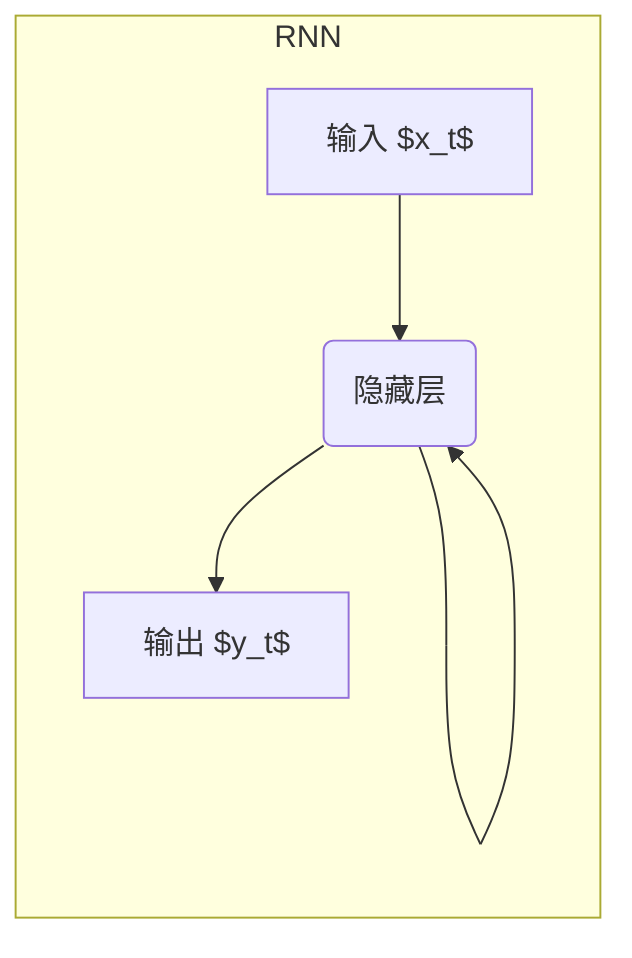
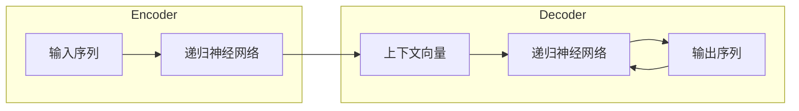
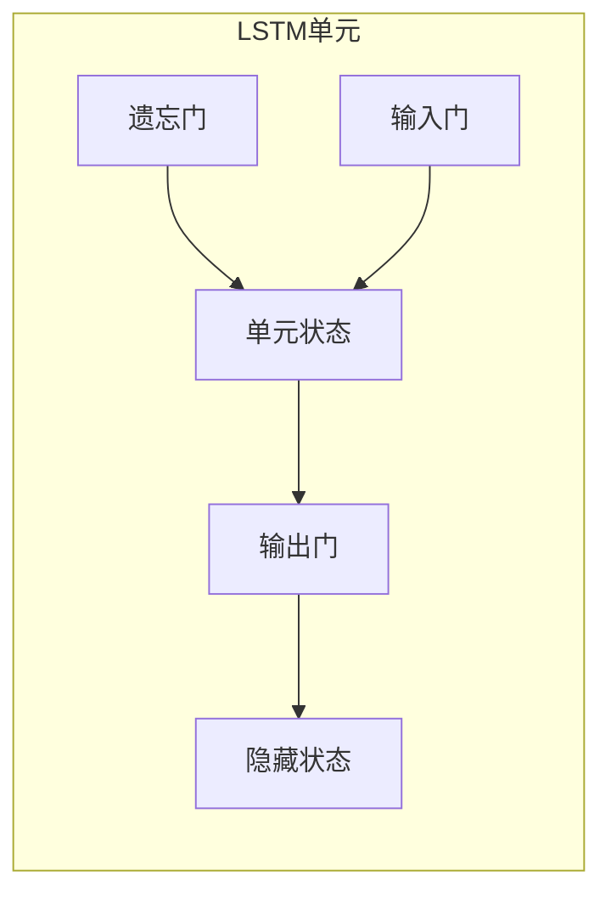
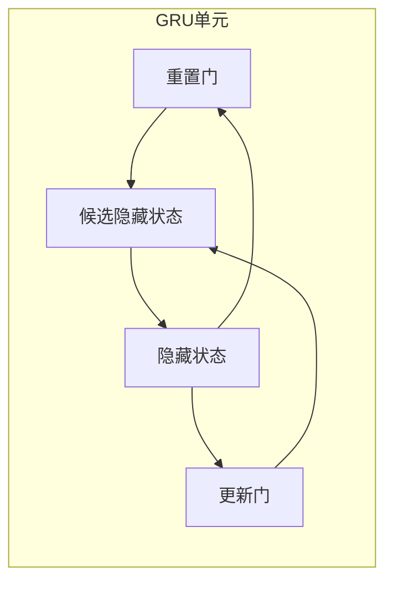

# 递归神经网络 原理与代码实例讲解

## 1.背景介绍

### 1.1 什么是递归神经网络？

递归神经网络(Recurrent Neural Networks, RNNs)是一种特殊类型的人工神经网络,能够处理序列数据,如自然语言文本、语音信号、视频等。与传统的前馈神经网络不同,RNNs在隐藏层之间存在循环连接,使得它们能够捕捉输入数据序列中的动态时间模式。

### 1.2 为什么需要递归神经网络?

许多实际问题涉及序列数据,如自然语言处理(NLP)、语音识别、机器翻译等。传统的前馈神经网络只能对固定长度的向量进行操作,无法有效地处理可变长度的序列数据。RNNs通过内部循环连接,能够对任意长度的序列进行建模,从而在处理序列数据任务中发挥重要作用。

### 1.3 递归神经网络的应用场景

递归神经网络已广泛应用于以下领域:

- 自然语言处理(NLP):语言模型、机器翻译、文本生成、情感分析等
- 语音识别与合成
- 时间序列预测:股票预测、天气预报等
- 机器人控制与规划
- 生物信息学:DNA序列分析、蛋白质结构预测等

## 2.核心概念与联系  

### 2.1 递归神经网络的基本结构

一个典型的RNN由以下部分组成:

- **输入层(Input Layer)**: 接收当前时间步的输入数据 $x_t$。
- **隐藏层(Hidden Layer)**: 包含一组循环连接的神经元,用于捕捉序列数据的动态模式。隐藏状态 $h_t$ 由当前输入 $x_t$ 和上一时间步的隐藏状态 $h_{t-1}$ 确定。
- **输出层(Output Layer)**: 根据当前隐藏状态 $h_t$ 输出预测结果 $y_t$。

RNN通过以下基本方程进行参数更新:

$$h_t = f_H(x_t, h_{t-1})$$
$$y_t = f_O(h_t)$$

其中, $f_H$ 和 $f_O$ 分别是隐藏层和输出层的激活函数,可以是非线性函数如 tanh 或 ReLU。

### 2.2 梯度消失和梯度爆炸问题

在训练RNN时,经常会遇到梯度消失(vanishing gradients)和梯度爆炸(exploding gradients)的问题。这是由于反向传播算法中的梯度乘积导致的。对于较长的序列,梯度会以指数级衰减或爆炸,使得RNN很难捕捉长期依赖关系。

为解决这一问题,研究人员提出了以下改进方案:

1. **长短期记忆网络(LSTM)**: 引入门控机制,允许有选择地遗忘或记住信息,从而缓解梯度消失/爆炸问题。
2. **门控循环单元(GRU)**: 与LSTM类似,但结构更简单,参数更少。
3. **残差连接**: 在循环连接中添加残差(shortcut)连接,使梯度能更直接地传播。

### 2.3 序列到序列(Seq2Seq)架构

Seq2Seq架构是一种常用的RNN结构,广泛应用于机器翻译、文本摘要等任务。它由两个RNN组成:

1. **编码器(Encoder)**: 读取源序列,产生上下文向量表示。
2. **解码器(Decoder)**: 根据上下文向量和已生成的输出序列,预测下一个输出。

编码器和解码器通过上下文向量相互关联。注意力机制(Attention Mechanism)可用于增强解码器对输入序列的选择性关注。

## 3.核心算法原理具体操作步骤

### 3.1 基本RNN的前向传播

给定输入序列 $\{x_1, x_2, \dots, x_T\}$,RNN的前向计算步骤如下:

1. 初始化隐藏状态 $h_0$,通常设为全零向量。
2. 对于每个时间步 $t=1, 2, \dots, T$:
    - 计算当前隐藏状态: $h_t = f_H(W_{xh}x_t + W_{hh}h_{t-1} + b_h)$
    - 计算当前输出: $y_t = f_O(W_{hy}h_t + b_y)$
3. 返回所有输出 $\{y_1, y_2, \dots, y_T\}$

其中,
- $W_{xh}$、$W_{hh}$、$W_{hy}$ 是权重矩阵
- $b_h$、$b_y$ 是偏置向量
- $f_H$、$f_O$ 是非线性激活函数

### 3.2 基本RNN的反向传播

反向传播通过计算损失函数关于模型参数的梯度,并使用优化算法(如SGD)更新参数值。对于给定的目标序列 $\{y_1^*, y_2^*, \dots, y_T^*\}$,反向传播步骤如下:

1. 初始化输出层梯度:
   $$\frac{\partial L}{\partial y_T} = \frac{\partial L}{\partial y_T}(y_T - y_T^*)$$
   其中 $L$ 是损失函数。

2. 对于每个时间步 $t=T, T-1, \dots, 1$:
    - 计算隐藏层梯度: 
      $$\frac{\partial L}{\partial h_t} = \frac{\partial L}{\partial y_t}\frac{\partial y_t}{\partial h_t} + \frac{\partial L}{\partial h_{t+1}}\frac{\partial h_{t+1}}{\partial h_t}$$
    - 计算权重梯度:
      $$\frac{\partial L}{\partial W_{hy}} = \frac{\partial L}{\partial y_t}\frac{\partial y_t}{\partial W_{hy}}$$
      $$\frac{\partial L}{\partial W_{xh}} = \frac{\partial L}{\partial h_t}\frac{\partial h_t}{\partial W_{xh}}$$
      $$\frac{\partial L}{\partial W_{hh}} = \frac{\partial L}{\partial h_t}\frac{\partial h_t}{\partial W_{hh}}$$
    - 计算偏置梯度:
      $$\frac{\partial L}{\partial b_y} = \frac{\partial L}{\partial y_t}\frac{\partial y_t}{\partial b_y}$$
      $$\frac{\partial L}{\partial b_h} = \frac{\partial L}{\partial h_t}\frac{\partial h_t}{\partial b_h}$$

3. 使用优化算法更新模型参数。

### 3.3 长短期记忆网络(LSTM)

LSTM通过引入门控机制解决梯度消失/爆炸问题。每个LSTM单元包含一个单元状态 $c_t$,以及三个门:遗忘门、输入门和输出门。

LSTM的计算步骤如下:

1. 遗忘门决定遗忘多少过去信息:
   $$f_t = \sigma(W_f \cdot [h_{t-1}, x_t] + b_f)$$

2. 输入门决定记录多少新信息:
   $$i_t = \sigma(W_i \cdot [h_{t-1}, x_t] + b_i)$$
   $$\tilde{c}_t = \tanh(W_c \cdot [h_{t-1}, x_t] + b_c)$$

3. 更新单元状态:
   $$c_t = f_t \odot c_{t-1} + i_t \odot \tilde{c}_t$$

4. 输出门决定输出什么信息:
   $$o_t = \sigma(W_o \cdot [h_{t-1}, x_t] + b_o)$$
   $$h_t = o_t \odot \tanh(c_t)$$

其中,
- $\sigma$ 是 sigmoid 函数
- $\odot$ 是元素级乘积
- $W$ 和 $b$ 是可训练参数

LSTM能够有效地捕捉长期依赖关系,并减轻梯度消失/爆炸问题。

### 3.4 门控循环单元(GRU)

GRU是一种与LSTM类似但结构更简单的门控RNN变体。每个GRU单元包含一个重置门和一个更新门。

GRU的计算步骤如下:

1. 计算重置门:
   $$r_t = \sigma(W_r \cdot [h_{t-1}, x_t] + b_r)$$

2. 计算候选隐藏状态:
   $$\tilde{h}_t = \tanh(W_h \cdot [r_t \odot h_{t-1}, x_t] + b_h)$$

3. 计算更新门:
   $$z_t = \sigma(W_z \cdot [h_{t-1}, x_t] + b_z)$$

4. 更新隐藏状态:
   $$h_t = (1 - z_t) \odot h_{t-1} + z_t \odot \tilde{h}_t$$

GRU相较于LSTM参数更少、计算更高效,在许多任务上表现也相当出色。

## 4.数学模型和公式详细讲解举例说明

### 4.1 RNN的数学表示

考虑一个基本的RNN,其隐藏层的激活函数为 $f_H$,输出层的激活函数为 $f_O$。给定输入序列 $\{x_1, x_2, \dots, x_T\}$,RNN在时间步 $t$ 的隐藏状态 $h_t$ 和输出 $y_t$ 由以下公式计算:

$$h_t = f_H(W_{xh}x_t + W_{hh}h_{t-1} + b_h)$$
$$y_t = f_O(W_{hy}h_t + b_y)$$

其中,
- $x_t$ 是时间步 $t$ 的输入
- $h_{t-1}$ 是上一时间步的隐藏状态
- $W_{xh}$、$W_{hh}$、$W_{hy}$ 是权重矩阵
- $b_h$、$b_y$ 是偏置向量

这个公式体现了RNN的核心思想:当前时间步的隐藏状态 $h_t$ 不仅取决于当前输入 $x_t$,还取决于上一时间步的隐藏状态 $h_{t-1}$。通过这种循环连接,RNN能够捕捉序列数据中的动态模式。

### 4.2 前向传播和反向传播

为了训练RNN模型,我们需要计算损失函数 $L$ 关于模型参数的梯度,然后使用优化算法(如随机梯度下降)更新参数值。这一过程通过前向传播和反向传播算法实现。

**前向传播**:给定输入序列 $\{x_1, x_2, \dots, x_T\}$,前向传播按时间步迭代计算隐藏状态 $\{h_1, h_2, \dots, h_T\}$ 和输出 $\{y_1, y_2, \dots, y_T\}$。

**反向传播**:给定目标输出序列 $\{y_1^*, y_2^*, \dots, y_T^*\}$,反向传播从最后一个时间步开始,依次计算每个时间步的梯度,并累积到模型参数的梯度中。

例如,对于输出层权重矩阵 $W_{hy}$,其梯度由以下公式给出:

$$\frac{\partial L}{\partial W_{hy}} = \sum_{t=1}^T \frac{\partial L}{\partial y_t}\frac{\partial y_t}{\partial W_{hy}}$$

通过链式法则,我们可以计算出其他参数的梯度。然后,使用优化算法(如SGD)根据梯度更新参数值。

### 4.3 梯度消失和梯度爆