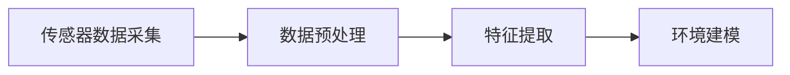
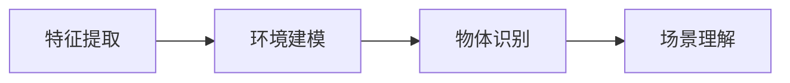
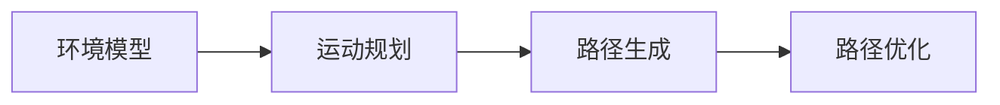
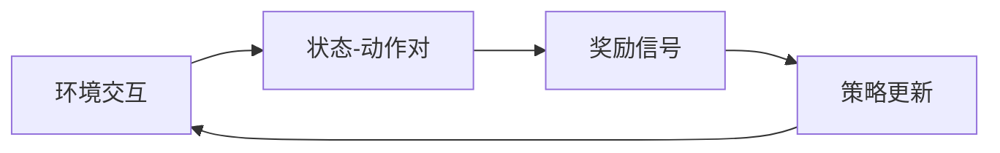

# AI Agent: AI的下一个风口 具身智能的核心概念

作者：禅与计算机程序设计艺术

## 1.背景介绍

### 1.1 人工智能的发展历程

人工智能（AI）作为计算机科学的一个重要分支，自20世纪50年代诞生以来，经历了多次起伏。最早的AI研究集中在符号处理和逻辑推理上，这一阶段被称为“符号AI”或“GOFAI”（Good Old-Fashioned AI）。随着计算能力的提升和数据量的增加，基于统计和概率的机器学习方法逐渐兴起，特别是深度学习在2010年代的爆发，使得AI技术在图像识别、语音识别和自然语言处理等领域取得了显著进展。

### 1.2 具身智能的兴起

尽管AI在感知和认知任务上取得了巨大进展，但在实际应用中，AI系统仍然面临许多挑战。传统的AI系统缺乏对物理世界的理解和互动能力，这限制了其在机器人、自动驾驶和智能家居等领域的应用。具身智能（Embodied Intelligence）作为AI的下一个风口，旨在通过赋予AI系统物理存在和感知能力，使其能够与现实世界进行更自然、更高效的互动。

### 1.3 具身智能的定义

具身智能是一种依赖于物理身体和环境交互的智能形式。具身智能系统不仅能够感知和理解环境，还能够通过物理动作对环境进行反馈和影响。这种智能形式强调感知、认知和行动的紧密结合，通常涉及机器人技术、传感器技术和控制算法的综合应用。

## 2.核心概念与联系

### 2.1 感知与认知

感知是具身智能的基础，涉及对环境的实时感知和数据采集。认知则是对感知数据进行处理和理解的过程。感知与认知的紧密结合，使得具身智能系统能够在复杂的环境中做出智能决策。

### 2.2 动作与控制

具身智能系统不仅需要感知和认知能力，还需要能够对环境进行物理操作。动作与控制涉及机器人技术中的运动规划、路径规划和控制算法，使得系统能够执行复杂的任务。

### 2.3 学习与适应

具身智能系统需要具备自我学习和适应能力，以应对动态变化的环境。通过不断学习和优化，系统能够提升其感知、认知和控制能力，从而在复杂环境中表现出更高的智能水平。

### 2.4 人机交互

具身智能系统通常需要与人类进行交互，因此人机交互技术也是其核心组成部分。自然语言处理、手势识别和情感识别等技术，使得具身智能系统能够更自然地与人类沟通和合作。

## 3.核心算法原理具体操作步骤

### 3.1 感知算法

#### 3.1.1 传感器数据处理

感知算法的第一步是从传感器获取数据，这些传感器可以包括摄像头、雷达、激光雷达、触觉传感器等。传感器数据通常需要进行预处理，如去噪、滤波和数据融合。



#### 3.1.2 特征提取

特征提取是从传感器数据中提取有用信息的过程。例如，在图像处理任务中，可以使用卷积神经网络（CNN）从图像中提取特征。

```python
import cv2
import numpy as np

# 读取图像
image = cv2.imread('image.jpg', 0)

# 使用Canny边缘检测
edges = cv2.Canny(image, 100, 200)

# 显示结果
cv2.imshow('Edges', edges)
cv2.waitKey(0)
cv2.destroyAllWindows()
```

### 3.2 认知算法

#### 3.2.1 环境理解

环境理解是对感知数据进行处理和分析，以构建环境模型。例如，可以使用SLAM（Simultaneous Localization and Mapping）算法进行环境建模和定位。



#### 3.2.2 决策制定

决策制定是根据环境模型和任务要求，选择最优的行动策略。常用的决策算法包括马尔可夫决策过程（MDP）和强化学习（RL）算法。

```python
import gym

# 创建环境
env = gym.make('CartPole-v1')

# 初始化环境
state = env.reset()

# 执行动作
for _ in range(1000):
    env.render()
    action = env.action_space.sample()  # 随机选择动作
    state, reward, done, info = env.step(action)
    if done:
        state = env.reset()

env.close()
```

### 3.3 动作与控制算法

#### 3.3.1 运动规划

运动规划是为机器人生成从起点到目标点的路径。常用的运动规划算法包括A*算法和RRT（Rapidly-exploring Random Tree）算法。



#### 3.3.2 路径跟踪

路径跟踪是使机器人沿着规划路径移动的过程。常用的路径跟踪算法包括PID控制和纯追踪算法。

```python
class PIDController:
    def __init__(self, kp, ki, kd):
        self.kp = kp
        self.ki = ki
        self.kd = kd
        self.prev_error = 0
        self.integral = 0

    def control(self, error, dt):
        self.integral += error * dt
        derivative = (error - self.prev_error) / dt
        output = self.kp * error + self.ki * self.integral + self.kd * derivative
        self.prev_error = error
        return output

# 创建PID控制器
pid = PIDController(kp=1.0, ki=0.1, kd=0.01)

# 控制机器人
error = 0.5  # 假设当前误差为0.5
dt = 0.1  # 时间步长
control_signal = pid.control(error, dt)
print(f'Control Signal: {control_signal}')
```

### 3.4 学习与适应算法

#### 3.4.1 强化学习

强化学习（RL）是一种通过与环境交互来学习最优策略的算法。常用的RL算法包括Q-learning和深度Q网络（DQN）。



```python
import numpy as np

class QLearningAgent:
    def __init__(self, n_states, n_actions, alpha, gamma, epsilon):
        self.n_states = n_states
        self.n_actions = n_actions
        self.alpha = alpha
        self.gamma = gamma
        self.epsilon = epsilon
        self.q_table = np.zeros((n_states, n_actions))

    def choose_action(self, state):
        if np.random.uniform(0, 1) < self.epsilon:
            action = np.random.choice(self.n_actions)
        else:
            action = np.argmax(self.q_table[state, :])
        return action

    def learn(self, state, action, reward, next_state):
        predict = self.q_table[state, action]
        target = reward + self.gamma * np.max(self.q_table[next_state, :])
        self.q_table[state, action] += self.alpha * (target - predict)

# 创建Q-learning代理
agent = QLearningAgent(n_states=5, n_actions=3, alpha=0.1, gamma=0.9, epsilon=0.1)

# 代理进行学习
state = 0
action = agent.choose_action(state)
reward = 1
next_state = 1
agent.learn(state, action, reward, next_state)
```

## 4.数学模型和公式详细讲解举例说明

### 4.1 马尔可夫决策过程（MDP）

马尔可夫决策过程（MDP）是具身智能中常用的决策模型。MDP由五元组 $(S, A, P, R, \gamma)$ 组成，其中：
- $S$ 是状态空间
- $A$ 是动作空间
- $P(s'|s, a)$ 是状态转移概率
- $R(s, a)$ 是奖励函数
- $\gamma