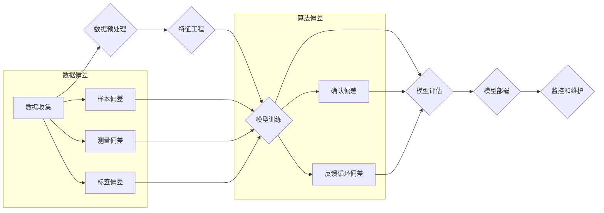

## 1. 背景介绍

### 1.1 人工智能的承诺与挑战

人工智能(AI)正以惊人的速度改变着我们的世界，从自动驾驶汽车到个性化医疗，AI 的应用正在不断扩大。然而，随着 AI 系统在越来越多的领域得到应用，一个不容忽视的问题也逐渐浮出水面：AI 偏差（AI Bias）。

### 1.2 AI 偏差的定义与影响

AI 偏差指的是 AI 系统在决策过程中，系统性地、不公平地偏袒某些群体或个体，而歧视另一些群体或个体。这种偏差可能源于训练数据中的偏见，也可能源于算法设计本身的缺陷。

AI 偏差会带来一系列严重后果：

* **加剧社会不平等:** 例如，基于有偏差的 AI 系统进行招聘，可能会导致某些群体在就业市场上处于劣势。
* **侵犯个人权利:** 例如，基于有偏差的 AI 系统进行犯罪风险评估，可能会导致某些群体被错误地判定为高风险人群，从而受到不公正的对待。
* **损害 AI 系统的可信度:**  AI 偏差会降低人们对 AI 系统的信任，从而阻碍 AI 技术的进一步发展和应用。

### 1.3 本文目标

本文旨在深入探讨 AI 偏差的原理，并结合代码实例，帮助读者理解 AI 偏差产生的原因、表现形式以及应对策略。

## 2. 核心概念与联系

### 2.1 数据偏差

数据偏差是指训练数据中存在的系统性偏差，它会导致 AI 系统学习到错误的模式，从而产生偏差。常见的数据偏差类型包括：

* **样本偏差 (Sampling Bias):**  训练数据不能代表真实世界的数据分布。例如，用于训练人脸识别系统的图像数据集中，白人面孔的比例过高，就会导致系统在识别黑人面孔时准确率较低。
* **测量偏差 (Measurement Bias):**  数据收集过程中存在系统性误差。例如，使用某个特定品牌的体重秤收集体重数据，可能会导致数据存在系统性的偏差。
* **标签偏差 (Labeling Bias):**  数据标注过程中存在主观性或错误。例如，对同一张图片，不同的标注员可能会给出不同的标签，从而导致数据标签存在偏差。

### 2.2 算法偏差

算法偏差是指 AI 算法本身的设计缺陷导致的偏差。常见算法偏差类型包括：

* **确认偏差 (Confirmation Bias):**  算法倾向于寻找能够 подтвердить existing beliefs 的数据，而忽略与之相悖的数据。
* **反馈循环偏差 (Feedback Loop Bias):**  算法的输出结果会反过来影响输入数据，从而形成一个不断强化的偏差循环。

### 2.3 数据偏差与算法偏差的联系

数据偏差和算法偏差 often interact and reinforce each other. 例如，如果训练数据中存在样本偏差，那么即使使用无偏差的算法，也无法消除偏差的影响。反之，如果算法本身存在偏差，那么即使使用无偏差的数据，也无法保证输出结果的公平性。

## 3. 核心算法原理具体操作步骤

为了更直观地理解 AI 偏差，本节将以一个具体的机器学习算法——逻辑回归为例，介绍 AI 偏差是如何产生的。

### 3.1 逻辑回归算法简介

逻辑回归是一种用于二分类问题的机器学习算法。它通过学习输入特征与输出标签之间的关系，构建一个预测模型。

逻辑回归模型的核心是一个 sigmoid 函数：

$$
h_{\theta}(x) = \frac{1}{1 + e^{-\theta^{T}x}}
$$

其中，$x$ 是输入特征向量，$\theta$ 是模型参数向量。sigmoid 函数的输出值介于 0 和 1 之间，表示样本属于正类的概率。

### 3.2 逻辑回归中的数据偏差

假设我们要构建一个逻辑回归模型，用于预测贷款申请者的信用风险。我们收集了以下数据：

| 特征 | 描述 |
|---|---|
| 年龄 | 申请者的年龄 |
| 性别 | 申请者的性别 |
| 种族 | 申请者的种族 |
| 收入 | 申请者的年收入 |
| 贷款违约 | 是否违反贷款协议 |

如果训练数据中存在样本偏差，例如黑人申请者的贷款违约率被高估了，那么逻辑回归模型就会学习到“黑人申请者更容易违约”的模式。

### 3.3 逻辑回归中的算法偏差

即使训练数据是无偏差的，逻辑回归算法本身也可能存在偏差。例如，如果模型过于依赖“种族”这个特征进行预测，那么即使“种族”与“贷款违约”之间没有真实的因果关系，模型也会将“种族”视为一个重要的预测因素，从而导致偏差。

## 4. 数学模型和公式详细讲解举例说明

为了更深入地理解 AI 偏差，本节将介绍一些用于量化和评估 AI 偏差的数学模型和指标。

### 4.1 混淆矩阵 (Confusion Matrix)

混淆矩阵是用于评估分类模型性能的常用工具。它将模型的预测结果与真实标签进行比较，统计出以下四种情况的数量：

* 真阳性 (TP): 模型预测为正类，实际也为正类。
* 假阳性 (FP): 模型预测为正类，实际为负类。
* 真阴性 (TN): 模型预测为负类，实际也为负类。
* 假阴性 (FN): 模型预测为负类，实际为正类。

|  | 预测为正类 | 预测为负类 |
|---|---|---|
| 实际为正类 | TP | FN |
| 实际为负类 | FP | TN |

### 4.2 准确率 (Accuracy)

准确率是指模型预测正确的样本数量占总样本数量的比例：

$$
Accuracy = \frac{TP + TN}{TP + FP + TN + FN}
$$

准确率是一个常用的评估指标，但它在数据类别不平衡的情况下可能会产生误导性。

### 4.3 精确率 (Precision)

精确率是指模型预测为正类的样本中，实际为正类的样本数量占预测为正类样本数量的比例：

$$
Precision = \frac{TP}{TP + FP}
$$

精确率侧重于衡量模型在预测为正类时的准确性。

### 4.4 召回率 (Recall)

召回率是指实际为正类的样本中，被模型正确预测为正类的样本数量占实际为正类样本数量的比例：

$$
Recall = \frac{TP}{TP + FN}
$$

召回率侧重于衡量模型能够找到所有正类样本的能力。

### 4.5 F1 分数 (F1-score)

F1 分数是精确率和召回率的调和平均数：

$$
F1 = \frac{2 * Precision * Recall}{Precision + Recall}
$$

F1 分数是一个综合考虑了精确率和召回率的指标。

### 4.6 AI 偏差评估指标

除了上述指标外，还有一些专门用于评估 AI 偏差的指标，例如：

* **组间差异 (Group Disparity):**  比较不同群体之间的模型性能差异，例如不同种族之间的贷款审批通过率差异。
* **预测差异 (Predictive Parity):**  比较不同群体之间模型预测结果的差异，例如不同种族之间的贷款违约概率差异。

## 5. 项目实践：代码实例和详细解释说明

本节将通过一个具体的代码实例，演示如何使用 Python 语言和 scikit-learn 库构建一个简单的逻辑回归模型，并评估模型是否存在偏差。

### 5.1 数据集介绍

我们使用 UCI 机器学习库中的 Adult 数据集进行演示。该数据集包含了美国成年人的收入水平和一些人口统计学特征，例如年龄、性别、种族、教育程度等。

### 5.2 代码实现

```python
import pandas as pd
from sklearn.model_selection import train_test_split
from sklearn.linear_model import LogisticRegression
from sklearn.metrics import accuracy_score, precision_score, recall_score, f1_score

# 加载数据集
data = pd.read_csv("adult.csv")

# 数据预处理
# ...

# 将数据集拆分为训练集和测试集
X_train, X_test, y_train, y_test = train_test_split(
    data.drop("income", axis=1), data["income"], test_size=0.2
)

# 创建逻辑回归模型
model = LogisticRegression()

# 训练模型
model.fit(X_train, y_train)

# 在测试集上进行预测
y_pred = model.predict(X_test)

# 评估模型性能
print("Accuracy:", accuracy_score(y_test, y_pred))
print("Precision:", precision_score(y_test, y_pred))
print("Recall:", recall_score(y_test, y_pred))
print("F1-score:", f1_score(y_test, y_pred))

# 评估模型偏差
# ...
```

### 5.3 代码解释

* 首先，我们使用 `pandas` 库加载数据集，并进行必要的数据预处理。
* 然后，我们使用 `train_test_split` 函数将数据集拆分为训练集和测试集。
* 接下来，我们创建了一个 `LogisticRegression` 对象，并使用训练集数据训练模型。
* 训练完成后，我们使用测试集数据对模型进行评估，计算了准确率、精确率、召回率和 F1 分数等指标。
* 最后，我们可以使用前面介绍的 AI 偏差评估指标，对模型进行偏差评估。

## 6. 实际应用场景

AI 偏差在许多实际应用场景中都可能出现，例如：

* **招聘:** 基于 AI 的招聘系统可能会对某些群体产生偏见，例如女性、少数族裔等。
* **贷款审批:** 基于 AI 的贷款审批系统可能会对某些群体产生偏见，例如低收入人群、少数族裔等。
* **刑事司法:** 基于 AI 的犯罪风险评估系统可能会对某些群体产生偏见，例如黑人、拉丁美洲裔等。
* **医疗诊断:** 基于 AI 的医疗诊断系统可能会对某些群体产生偏见，例如女性、老年人等。

## 7. 工具和资源推荐

以下是一些用于检测和缓解 AI 偏差的工具和资源：

* **IBM AI Fairness 360:**  一个开源工具包，提供了各种算法和指标，用于检测和缓解 AI 偏差。
* **Google What-If Tool:**  一个交互式工具，允许用户探索机器学习模型的行为，并识别潜在的偏差。
* **Microsoft Fairlearn:**  一个 Python 库，提供了算法和指标，用于评估和缓解 AI 系统中的不公平现象。

## 8. 总结：未来发展趋势与挑战

### 8.1 未来发展趋势

* **可解释 AI (Explainable AI):**  开发能够解释其决策过程的 AI 系统，从而更容易识别和纠正偏差。
* **对抗训练 (Adversarial Training):**  使用对抗样本训练 AI 模型，使其对数据中的偏差更加鲁棒。
* **数据增强 (Data Augmentation):**  通过生成合成数据来增加训练数据的数量和多样性，从而减少数据偏差。

### 8.2  挑战

* **数据收集和标注:**  获取高质量、无偏差的训练数据仍然是一项挑战。
* **偏差的复杂性:**  AI 偏差是一个复杂的问题，涉及多个方面，例如数据、算法、社会因素等。
* **伦理和社会影响:**  解决 AI 偏差问题需要考虑伦理和社会影响，例如公平性、透明度、责任制等。

## 9. 附录：常见问题与解答

### 9.1 如何判断我的 AI 系统是否存在偏差？

可以使用前面介绍的 AI 偏差评估指标，对 AI 系统进行评估。

### 9.2 如何缓解 AI 系统中的偏差？

可以使用前面介绍的工具和技术，例如可解释 AI、对抗训练、数据增强等。

### 9.3 如何避免在开发 AI 系统时引入偏差？

在开发 AI 系统时，需要注意以下几点：

* 使用高质量、无偏差的训练数据。
* 选择合适的算法，并 carefully tune its parameters.
* 定期评估 AI 系统的性能，并识别潜在的偏差。
* 与领域专家合作，了解潜在的偏差来源。


## 10.  Mermaid流程图


