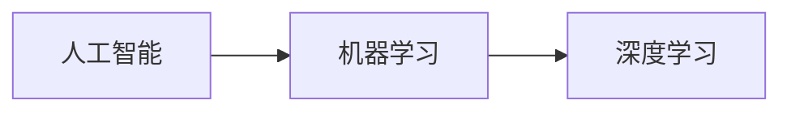
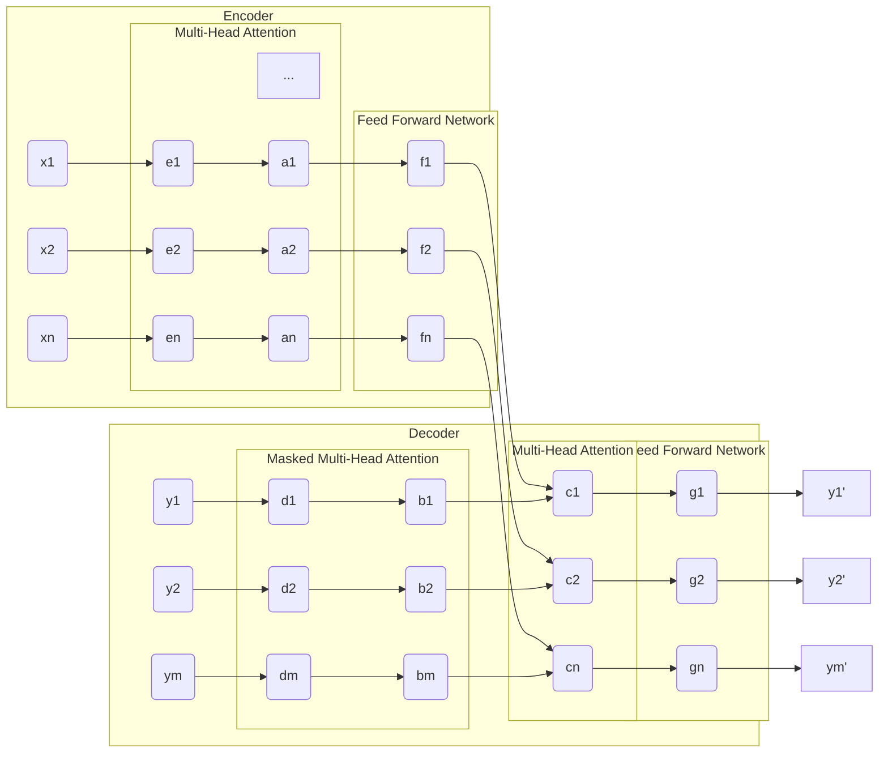

# AIGC从入门到实战：历史上人工智能科学发展史的三个阶段

作者：禅与计算机程序设计艺术

## 1. 背景介绍

### 1.1 人工智能的起源与发展

人工智能（Artificial Intelligence，AI）旨在使机器能够像人类一样思考、学习和行动。它的起源可以追溯到古希腊神话中能工巧匠代达罗斯创造的机械人和古埃及人制造的人形机械装置。然而，现代人工智能的概念直到20世纪50年代才被正式提出。

1950年，英国数学家艾伦·图灵发表了题为《计算机器与智能》的论文，提出了著名的“图灵测试”，为人工智能的研究奠定了基础。1956年，在美国达特茅斯学院举行的一次会议上，约翰·麦卡锡、马文·明斯基、克劳德·香农等科学家共同探讨了“用机器模拟人类智能”的可能性，并首次提出了“人工智能”这一术语。

### 1.2 人工智能发展的三大阶段

自诞生以来，人工智能的发展经历了三个主要阶段：

* **第一阶段（20世纪50年代至70年代末）：符号主义阶段**。这一阶段的主要特征是利用符号和逻辑推理来模拟人类智能。代表性成果包括：
    * 1959年，阿瑟·塞缪尔开发了第一个西洋跳棋程序，并成功击败了一位人类冠军。
    * 1966年，约瑟夫·维森鲍姆开发了第一个聊天机器人ELIZA，能够模拟心理治疗师与患者的对话。
    * 1972年，爱德华·费根鲍姆等人开发了第一个专家系统DENDRAL，能够根据质谱数据推断有机化合物的结构。
* **第二阶段（20世纪80年代至21世纪初）：连接主义阶段**。这一阶段的主要特征是利用人工神经网络来模拟人类大脑的神经元连接和信息处理机制。代表性成果包括：
    * 1986年，杰弗里·辛顿等人提出了反向传播算法，有效解决了多层神经网络的训练问题。
    * 1997年，IBM的超级计算机“深蓝”战胜了国际象棋世界冠军加里·卡斯帕罗夫。
    * 2006年，杰弗里·辛顿等人提出了深度学习的概念，为人工智能的第三次浪潮奠定了基础。
* **第三阶段（21世纪初至今）：深度学习阶段**。这一阶段的主要特征是利用深度神经网络和大规模数据集进行训练，实现了人工智能在图像识别、语音识别、自然语言处理等领域的突破性进展。代表性成果包括：
    * 2011年，IBM的超级计算机“沃森”在智力竞赛节目《危险边缘》中战胜了两位人类冠军。
    * 2016年，Google DeepMind开发的AlphaGo程序战胜了围棋世界冠军李世石。
    * 2019年，OpenAI开发的GPT-3模型在自然语言生成领域取得了突破性进展。

### 1.3 AIGC的兴起与发展

AIGC（Artificial Intelligence Generated Content，人工智能生成内容）是指利用人工智能技术自动生成各种类型的内容，例如文本、图像、音频、视频等。近年来，随着深度学习技术的快速发展，AIGC技术取得了显著进步，并逐渐应用于各个领域。

## 2. 核心概念与联系

### 2.1 人工智能、机器学习与深度学习的关系

* **人工智能**是一个广泛的概念，涵盖了所有使机器能够像人类一样思考、学习和行动的技术。
* **机器学习**是人工智能的一个分支，其核心思想是让机器通过学习数据来自动提升性能。
* **深度学习**是机器学习的一个分支，其核心思想是利用多层神经网络来学习数据的复杂表示。

三者之间的关系可以用下图表示：



### 2.2 AIGC的关键技术

AIGC技术的核心是深度学习，其主要技术包括：

* **自然语言处理（NLP）**: 用于处理和分析文本数据，例如文本生成、机器翻译、情感分析等。
* **计算机视觉（CV）**: 用于处理和分析图像和视频数据，例如图像识别、目标检测、图像生成等。
* **语音识别**: 用于将语音信号转换为文本，例如语音助手、语音搜索等。
* **强化学习**: 用于训练智能体在与环境交互的过程中学习最佳策略，例如游戏AI、机器人控制等。

## 3. 核心算法原理具体操作步骤

本节以文本生成为例，介绍AIGC的核心算法原理和具体操作步骤。

### 3.1 循环神经网络（RNN）

循环神经网络（Recurrent Neural Network，RNN）是一种专门用于处理序列数据的神经网络结构。与传统的前馈神经网络不同，RNN的隐藏层神经元之间存在连接，可以将信息从序列的前一部分传递到后一部分，从而能够捕捉到序列数据中的时间依赖关系。

RNN的基本结构如下图所示：

```mermaid
graph LR
subgraph t-1
    x(x[t-1]) --> h(h[t-1])
end
subgraph t
    x(x[t]) --> h(h[t])
    h[t-1] --> h
end
h --> y(y[t])
```

其中：

* $x[t]$ 表示时刻 $t$ 的输入。
* $h[t]$ 表示时刻 $t$ 的隐藏状态，它包含了前面所有时刻的信息。
* $y[t]$ 表示时刻 $t$ 的输出。

RNN的计算过程如下：

1. 在时刻 $t=1$，初始化隐藏状态 $h[0]$。
2. 对于每个时刻 $t=1,2,...,T$：
    * 计算当前时刻的隐藏状态：$h[t] = f(W_{xh}x[t] + W_{hh}h[t-1] + b_h)$，其中 $f$ 是激活函数，$W_{xh}$、$W_{hh}$ 和 $b_h$ 是参数。
    * 计算当前时刻的输出：$y[t] = g(W_{hy}h[t] + b_y)$，其中 $g$ 是激活函数，$W_{hy}$ 和 $b_y$ 是参数。

### 3.2 长短期记忆网络（LSTM）

长短期记忆网络（Long Short-Term Memory，LSTM）是一种特殊的RNN结构，能够解决RNN存在的梯度消失和梯度爆炸问题，从而能够更好地处理长序列数据。

LSTM的基本结构如下图所示：

```mermaid
graph LR
subgraph t-1
    x(x[t-1]) --> h(h[t-1])
    h[t-1] --> c(c[t-1])
end
subgraph t
    x(x[t]) --> h(h[t])
    h[t-1] --> h
    c[t-1] --> c(c[t])
    h --> c
end
c --> y(y[t])
```

其中：

* $c[t]$ 表示时刻 $t$ 的细胞状态，它用于存储长期信息。
* $i[t]$、$f[t]$、$o[t]$ 分别表示输入门、遗忘门和输出门，它们用于控制信息的流动。

LSTM的计算过程如下：

1. 在时刻 $t=1$，初始化隐藏状态 $h[0]$ 和细胞状态 $c[0]$。
2. 对于每个时刻 $t=1,2,...,T$：
    * 计算输入门、遗忘门和输出门：
        * $i[t] = \sigma(W_{xi}x[t] + W_{hi}h[t-1] + b_i)$
        * $f[t] = \sigma(W_{xf}x[t] + W_{hf}h[t-1] + b_f)$
        * $o[t] = \sigma(W_{xo}x[t] + W_{ho}h[t-1] + b_o)$
    * 计算候选细胞状态：$\tilde{c}[t] = \tanh(W_{xc}x[t] + W_{hc}h[t-1] + b_c)$
    * 更新细胞状态：$c[t] = f[t] \odot c[t-1] + i[t] \odot \tilde{c}[t]$
    * 更新隐藏状态：$h[t] = o[t] \odot \tanh(c[t])$
    * 计算当前时刻的输出：$y[t] = g(W_{hy}h[t] + b_y)$

### 3.3 Transformer

Transformer是一种基于自注意力机制的神经网络结构，它不需要像RNN那样依赖于前一时刻的隐藏状态，因此可以并行处理序列数据，训练速度更快。

Transformer的基本结构如下图所示：



其中：

* Encoder用于将输入序列编码成一个上下文向量。
* Decoder用于根据上下文向量生成输出序列。
* Multi-Head Attention用于计算序列中不同位置之间的注意力权重。
* Feed Forward Network用于对每个位置的特征进行非线性变换。

### 3.4 AIGC文本生成的操作步骤

利用上述深度学习算法，可以实现AIGC文本生成，具体操作步骤如下：

1. **数据准备**: 收集和清洗大量的文本数据，用于训练模型。
2. **模型训练**: 选择合适的深度学习模型（例如RNN、LSTM、Transformer等），利用准备好的数据进行训练。
3. **文本生成**: 将一个初始文本输入到训练好的模型中，模型会根据学习到的语言模型生成后续的文本。
4. **结果评估**: 对生成的文本进行评估，例如流畅度、连贯性、信息量等。

## 4. 数学模型和公式详细讲解举例说明

本节以LSTM为例，详细讲解其数学模型和公式。

### 4.1 LSTM的数学模型

LSTM的数学模型可以表示为：

* **输入门**: $i[t] = \sigma(W_{xi}x[t] + W_{hi}h[t-1] + b_i)$
* **遗忘门**: $f[t] = \sigma(W_{xf}x[t] + W_{hf}h[t-1] + b_f)$
* **输出门**: $o[t] = \sigma(W_{xo}x[t] + W_{ho}h[t-1] + b_o)$
* **候选细胞状态**: $\tilde{c}[t] = \tanh(W_{xc}x[t] + W_{hc}h[t-1] + b_c)$
* **细胞状态**: $c[t] = f[t] \odot c[t-1] + i[t] \odot \tilde{c}[t]$
* **隐藏状态**: $h[t] = o[t] \odot \tanh(c[t])$
* **输出**: $y[t] = g(W_{hy}h[t] + b_y)$

其中：

* $x[t]$ 表示时刻 $t$ 的输入向量。
* $h[t]$ 表示时刻 $t$ 的隐藏状态向量。
* $c[t]$ 表示时刻 $t$ 的细胞状态向量。
* $W_{xi}$、$W_{hi}$、$b_i$、$W_{xf}$、$W_{hf}$、$b_f$、$W_{xo}$、$W_{ho}$、$b_o$、$W_{xc}$、$W_{hc}$、$b_c$、$W_{hy}$、$b_y$ 是参数矩阵和偏置向量。
* $\sigma$ 表示 sigmoid 函数。
* $\tanh$ 表示双曲正切函数。
* $\odot$ 表示逐元素相乘。

### 4.2 公式详细讲解

* **输入门**: 控制当前时刻的输入信息有多少被保留到细胞状态中。
* **遗忘门**: 控制上一时刻的细胞状态有多少被保留到当前时刻的细胞状态中。
* **输出门**: 控制当前时刻的细胞状态有多少被输出到隐藏状态中。
* **候选细胞状态**: 计算当前时刻的候选细胞状态。
* **细胞状态**: 根据输入门、遗忘门和候选细胞状态更新当前时刻的细胞状态。
* **隐藏状态**: 根据输出门和细胞状态更新当前时刻的隐藏状态。
* **输出**: 根据隐藏状态计算当前时刻的输出。

### 4.3 举例说明

假设我们要利用LSTM生成一个句子，句子包含三个词语：“我”、“爱”、“你”。

1. **初始化**: 首先，我们需要初始化隐藏状态 $h[0]$ 和细胞状态 $c[0]$，通常将它们初始化为零向量。
2. **时刻 t=1**: 输入第一个词语“我”，计算输入门、遗忘门、输出门、候选细胞状态、细胞状态和隐藏状态，得到 $h[1]$。
3. **时刻 t=2**: 输入第二个词语“爱”，利用 $h[1]$ 计算输入门、遗忘门、输出门、候选细胞状态、细胞状态和隐藏状态，得到 $h[2]$。
4. **时刻 t=3**: 输入第三个词语“你”，利用 $h[2]$ 计算输入门、遗忘门、输出门、候选细胞状态、细胞状态和隐藏状态，得到 $h[3]$。
5. **输出**: 利用 $h[3]$ 计算输出，得到生成的句子：“我 爱 你”。

## 5. 项目实践：代码实例和详细解释说明

### 5.1 使用Python和TensorFlow实现LSTM文本生成

```python
import tensorflow as tf

# 定义LSTM模型
class LSTMModel(tf.keras.Model):
    def __init__(self, vocab_size, embedding_dim, hidden_dim):
        super(LSTMModel, self).__init__()
        self.embedding = tf.keras.layers.Embedding(vocab_size, embedding_dim)
        self.lstm = tf.keras.layers.LSTM(hidden_dim, return_sequences=True, return_state=True)
        self.dense = tf.keras.layers.Dense(vocab_size)

    def call(self, inputs, states=None):
        x = self.embedding(inputs)
        x, state_h, state_c = self.lstm(x, initial_state=states)
        x = self.dense(x)
        return x, state_h, state_c

# 定义超参数
vocab_size = 10000
embedding_dim = 128
hidden_dim = 256
seq_length = 50
batch_size = 64

# 创建模型
model = LSTMModel(vocab_size, embedding_dim, hidden_dim)

# 定义优化器和损失函数
optimizer = tf.keras.optimizers.Adam()
loss_fn = tf.keras.losses.SparseCategoricalCrossentropy(from_logits=True)

# 定义训练步骤
@tf.function
def train_step(inputs, targets):
    with tf.GradientTape() as tape:
        predictions, _, _ = model(inputs)
        loss = loss_fn(targets, predictions)
    gradients = tape.gradient(loss, model.trainable_variables)
    optimizer.apply_gradients(zip(gradients, model.trainable_variables))
    return loss

# 加载数据
(x_train, y_train), (x_test, y_test) = tf.keras.datasets.imdb.load_data(num_words=vocab_size)

# 将数据转换为TensorFlow Dataset
train_dataset = tf.data.Dataset.from_tensor_slices((x_train, y_train)).batch(batch_size)

# 训练模型
epochs = 10
for epoch in range(epochs):
    for inputs, targets in train_dataset:
        loss = train_step(inputs, targets)
    print(f"Epoch {epoch+1}, Loss: {loss.numpy()}")

# 生成文本
def generate_text(start_string, num_generate=100):
    # 将起始字符串转换为数字序列
    input_eval = [word_index[s