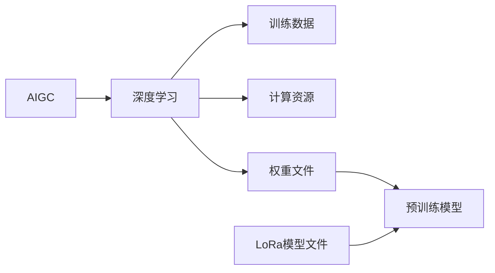

# AIGC从入门到实战：安装权重文件和 LoRa 模型文件

作者：禅与计算机程序设计艺术

## 1. 背景介绍

### 1.1 AIGC的兴起与发展
近年来，人工智能生成内容（AIGC，AI Generated Content）技术发展迅速，从简单的文本生成、图像生成，发展到如今的视频生成、代码生成，甚至是科学发现等领域，AIGC正逐渐改变着我们的生活和工作方式。AIGC的兴起，得益于深度学习技术的突破、大数据的积累以及计算能力的提升。

### 1.2 权重文件和LoRa模型文件的重要性
在AIGC的实际应用中，权重文件和LoRa模型文件扮演着至关重要的角色。权重文件存储了训练好的神经网络模型的参数，而LoRa模型文件则是一种轻量级的模型文件，可以用于对预训练模型进行微调。正确安装和使用这些文件，是进行AIGC创作的基础。

### 1.3 本文目标和结构
本文旨在为AIGC的初学者提供一份详细的指南，帮助读者理解权重文件和LoRa模型文件的作用，并学会如何正确安装和使用它们。

本文结构如下：

- **第二章：核心概念与联系**：介绍AIGC、权重文件、LoRa模型文件等核心概念，并阐述它们之间的联系。
- **第三章：安装权重文件**：详细讲解安装权重文件的步骤，并提供常见问题的解决方案。
- **第四章：安装LoRa模型文件**：介绍LoRa模型文件的概念和作用，并讲解如何安装和使用LoRa模型文件。
- **第五章：项目实践**：通过一个具体的AIGC项目，演示如何使用权重文件和LoRa模型文件进行创作。
- **第六章：实际应用场景**：介绍AIGC在各个领域的应用场景，例如文本创作、图像生成、代码生成等。
- **第七章：工具和资源推荐**：推荐一些常用的AIGC工具和资源，帮助读者更高效地进行AIGC创作。
- **第八章：总结：未来发展趋势与挑战**：总结AIGC技术的发展现状，并展望其未来发展趋势和挑战。
- **第九章：附录：常见问题与解答**：解答一些读者在学习和使用AIGC过程中可能会遇到的常见问题。

## 2. 核心概念与联系

### 2.1 AIGC概述
AIGC是指利用人工智能技术自动生成内容，例如文本、图像、音频、视频、代码等。AIGC的核心技术是深度学习，通过训练大规模的神经网络模型，使其能够学习和模拟人类的创作过程，从而生成高质量的内容。

### 2.2 权重文件
权重文件是存储神经网络模型参数的文件，通常以`.pth`、`.ckpt`等格式保存。在训练神经网络模型时，模型会根据输入的数据不断调整自身的参数，最终得到一组能够较好地拟合数据的参数，这些参数就被保存在权重文件中。

### 2.3 LoRa模型文件
LoRa（Low-Rank Adaptation of Large Language Models）是一种轻量级的模型文件，可以用于对预训练的大语言模型进行微调。LoRa模型文件只存储了模型参数的一小部分，因此文件体积非常小，可以方便地进行分享和部署。

### 2.4 核心概念之间的联系
如下图所示，AIGC的实现依赖于深度学习技术，而深度学习模型的训练需要大量的训练数据和计算资源。训练好的模型参数存储在权重文件中，可以使用权重文件来加载预训练的模型。LoRa模型文件可以用于对预训练模型进行微调，使其适应特定的任务或领域。



## 3. 安装权重文件

### 3.1 下载权重文件
首先，需要从Hugging Face Model Hub等网站下载所需的权重文件。在下载权重文件时，需要注意选择与所使用的模型和框架相匹配的文件。

### 3.2 将权重文件移动到项目目录
下载完成后，将权重文件移动到项目的根目录或指定的模型目录下。

### 3.3 加载权重文件
在Python代码中，可以使用以下代码加载权重文件：

```python
import torch
from transformers import AutoModelForSequenceClassification

# 加载预训练模型
model_name = "bert-base-uncased"
model = AutoModelForSequenceClassification.from_pretrained(model_name)

# 加载权重文件
model_path = "path/to/model.pth"
model.load_state_dict(torch.load(model_path))

# 将模型设置为评估模式
model.eval()
```

### 3.4 常见问题及解决方案

**问题1：** 无法加载权重文件，报错"RuntimeError: Error(s) in loading state_dict for ...".

**解决方案：** 

- 检查权重文件路径是否正确。
- 检查权重文件是否与所使用的模型和框架相匹配。
- 尝试使用`strict=False`参数加载权重文件，例如：`model.load_state_dict(torch.load(model_path), strict=False)`。

**问题2：** 加载权重文件后，模型的性能没有提升。

**解决方案：**

- 检查训练数据和测试数据是否一致。
- 尝试使用不同的超参数进行训练。
- 尝试使用更大的数据集进行训练。


## 4. 安装LoRa模型文件

### 4.1 LoRa模型文件概述
LoRa (Low-Rank Adaptation of Large Language Models) 是一种高效微调大型语言模型的技术，它冻结了预训练模型的大部分参数，只训练一小部分参数，从而大大减少了计算资源和存储空间的需求。LoRa 的核心思想是将模型参数矩阵分解为低秩矩阵的乘积，并只训练低秩矩阵。

### 4.2 安装LoRa模型文件
安装 LoRa 模型文件与安装普通权重文件类似，只需将 LoRa 模型文件下载到本地，然后在代码中加载即可。

```python
from peft import PeftModel, LoraConfig, get_peft_model

# 加载预训练模型
model_name = "bert-base-uncased"
model = AutoModelForSequenceClassification.from_pretrained(model_name)

# 加载 LoRa 模型文件
lora_model_path = "path/to/lora_model"
model = PeftModel.from_pretrained(model, lora_model_path)

# 将模型设置为评估模式
model.eval()
```

### 4.3 LoRa模型文件的优势

- **高效性:** LoRa 只训练一小部分参数，因此训练速度更快，需要的计算资源更少。
- **轻量级:** LoRa 模型文件只存储了模型参数的一小部分，因此文件体积更小，更易于分享和部署。
- **可移植性:** LoRa 模型文件可以用于不同的任务和领域，只需进行少量的微调即可。

## 5. 项目实践：代码实例和详细解释说明

```python
# 导入必要的库
import torch
from transformers import AutoModelForSequenceClassification, AutoTokenizer
from peft import PeftModel, LoraConfig, get_peft_model

# 定义模型名称、权重文件路径和 LoRa 模型文件路径
model_name = "bert-base-uncased"
checkpoint_path = "path/to/model.pth"
lora_model_path = "path/to/lora_model"

# 加载预训练模型和分词器
model = AutoModelForSequenceClassification.from_pretrained(model_name)
tokenizer = AutoTokenizer.from_pretrained(model_name)

# 加载权重文件
model.load_state_dict(torch.load(checkpoint_path))

# 加载 LoRa 模型文件
model = PeftModel.from_pretrained(model, lora_model_path)

# 定义输入文本
text = "This is a test sentence."

# 对输入文本进行编码
inputs = tokenizer(text, return_tensors="pt")

# 使用模型进行预测
with torch.no_grad():
    outputs = model(**inputs)

# 获取预测结果
logits = outputs.logits
predicted_class = logits.argmax().item()

# 打印预测结果
print(f"Predicted class: {predicted_class}")
```

**代码解释:**

1. 首先，我们导入必要的库，包括 `torch`、`transformers` 和 `peft`。
2. 然后，我们定义模型名称、权重文件路径和 LoRa 模型文件路径。
3. 接下来，我们使用 `AutoModelForSequenceClassification.from_pretrained()` 和 `AutoTokenizer.from_pretrained()` 加载预训练模型和分词器。
4. 然后，我们使用 `model.load_state_dict()` 加载权重文件。
5. 接下来，我们使用 `PeftModel.from_pretrained()` 加载 LoRa 模型文件。
6. 然后，我们定义输入文本，并使用分词器对其进行编码。
7. 接下来，我们使用模型对编码后的输入文本进行预测，并获取预测结果。
8. 最后，我们打印预测结果。

## 6. 实际应用场景

AIGC有着广泛的应用场景，以下列举一些常见的应用场景:

* **文本生成:** 
    * 写作助手：辅助写作，提供写作灵感、润色文字等。
    * 聊天机器人：与用户进行自然语言交互，提供信息、娱乐等服务。
    * 新闻报道：自动生成新闻报道，提高新闻生产效率。
* **图像生成:** 
    * 艺术创作：生成各种风格的绘画作品、摄影作品等。
    * 广告设计：根据用户需求自动生成广告素材。
    * 游戏开发：生成游戏场景、角色、道具等。
* **代码生成:** 
    * 代码补全：根据上下文自动补全代码。
    * 代码生成：根据用户需求自动生成代码。
    * 代码翻译：将一种编程语言的代码翻译成另一种编程语言的代码。

## 7. 工具和资源推荐

* **Hugging Face Transformers:** 提供了大量的预训练模型和工具，方便用户进行AIGC开发。
* **Google Colab:** 提供了免费的GPU资源，方便用户进行AIGC模型训练和测试。
* **Paperswithcode:** 收集了大量的AIGC论文和代码，方便用户学习和研究。

## 8. 总结：未来发展趋势与挑战

### 8.1 未来发展趋势
* **更加智能化:** 随着技术的进步，AIGC将会越来越智能化，能够生成更加复杂、更有创意的内容。
* **更加个性化:** AIGC将会更加注重用户的个性化需求，能够根据用户的喜好生成定制化的内容。
* **更加普及化:** 随着AIGC技术的成熟和成本的降低，AIGC将会更加普及化，走进千家万户。

### 8.2 面临的挑战
* **伦理问题:** AIGC的应用可能会带来一些伦理问题，例如版权问题、虚假信息传播等。
* **技术瓶颈:** AIGC技术还存在一些技术瓶颈，例如生成内容的可控性、多样性等问题。
* **社会影响:** AIGC的应用可能会对就业市场、教育体系等产生一定的影响。

## 9. 附录：常见问题与解答

### 9.1  如何选择合适的权重文件？

选择权重文件时，需要考虑以下因素：

* **任务类型:** 不同的任务需要使用不同的模型和权重文件。
* **数据集:** 训练数据集的规模和质量会影响模型的性能。
* **硬件资源:** 模型的大小和计算量会影响模型的训练和推理速度。

### 9.2 如何解决LoRa模型文件训练过程中出现的过拟合问题？

可以通过以下方法解决LoRa模型文件训练过程中出现的过拟合问题：

* **使用更大的数据集:** 使用更大的数据集可以提高模型的泛化能力。
* **使用正则化技术:** 例如dropout、weight decay等正则化技术可以防止模型过拟合。
* **早停法:**  在训练过程中，监控模型在验证集上的性能，当性能不再提升时，停止训练。

### 9.3 AIGC的未来发展方向是什么？

AIGC的未来发展方向包括：

* **多模态生成:**  例如同时生成文本、图像、音频等多种类型的内容。
* **可控生成:**  例如控制生成内容的风格、情感等。
* **人机协同:**  例如人与机器共同创作内容。

## 10. 结束语

AIGC作为一项新兴的技术，正在深刻地改变着我们的生活和工作方式。相信在不久的将来，AIGC将会在各个领域发挥更加重要的作用。