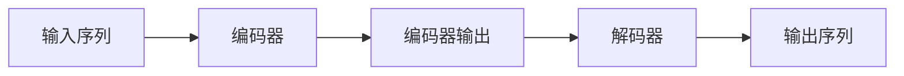

# AIGC从入门到实战：简单的 ChatGPT 应用范例

作者：禅与计算机程序设计艺术

## 1. 背景介绍

### 1.1 AIGC的兴起与发展

近年来，人工智能（AI）技术发展迅速，其中生成式人工智能（AIGC）作为人工智能领域的新兴分支，正逐渐走入大众视野，并展现出巨大的应用潜力。AIGC是指利用人工智能技术自动生成各种类型的内容，例如文本、图像、音频、视频等。

AIGC的快速发展得益于以下几个因素：

* **深度学习技术的突破:** 深度学习算法的进步，特别是Transformer模型的出现，极大地提升了AI模型处理和生成自然语言的能力。
* **大规模数据集的可用性:** 互联网和移动设备的普及产生了海量的文本、图像、音频等数据，为训练强大的AIGC模型提供了充足的素材。
* **计算能力的提升:** 随着GPU、TPU等高性能计算设备的出现，训练和部署大型AIGC模型成为可能。

### 1.2 ChatGPT：AIGC领域的代表性模型

ChatGPT是由OpenAI开发的一种大型语言模型，它基于Transformer架构，并在大规模文本数据集上进行训练。ChatGPT能够理解和生成自然语言，并可以完成多种任务，例如：

* **对话生成:** 与用户进行自然流畅的对话，回答用户的问题，提供信息和建议。
* **文本创作:** 创作各种类型的文本内容，例如诗歌、代码、剧本、音乐作品、电子邮件、信件等。
* **语言翻译:** 将一种语言的文本翻译成另一种语言。
* **代码生成:** 根据用户的指令生成代码。

### 1.3 本文目的和结构

本文旨在帮助读者快速入门AIGC，并通过简单的ChatGPT应用范例，展示AIGC的强大功能和应用潜力。

本文结构如下：

* **背景介绍:** 介绍AIGC的兴起与发展，以及ChatGPT的基本情况。
* **核心概念与联系:** 解释AIGC和ChatGPT相关的核心概念，例如自然语言处理、深度学习、Transformer模型等。
* **核心算法原理具体操作步骤:**  详细介绍ChatGPT的核心算法原理，并以代码示例的形式展示如何使用ChatGPT进行文本生成。
* **数学模型和公式详细讲解举例说明:**  深入探讨ChatGPT背后的数学模型和公式，并结合实际案例进行讲解。
* **项目实践：代码实例和详细解释说明:**  提供一些简单的ChatGPT应用范例，例如聊天机器人、文本摘要、代码生成等，并给出详细的代码实现和解释说明。
* **实际应用场景:**  介绍AIGC和ChatGPT的实际应用场景，例如内容创作、客户服务、教育培训等。
* **工具和资源推荐:**  推荐一些常用的AIGC工具和资源，帮助读者进一步学习和实践。
* **总结：未来发展趋势与挑战:**  总结AIGC和ChatGPT的未来发展趋势和挑战。
* **附录：常见问题与解答:**  解答一些读者在学习和使用AIGC过程中可能会遇到的常见问题。

## 2. 核心概念与联系

### 2.1 自然语言处理（NLP）

自然语言处理（Natural Language Processing, NLP）是人工智能领域的一个重要分支，旨在让计算机能够理解和处理人类语言。NLP涵盖了许多任务，例如：

* **文本分类:** 将文本按照预定义的类别进行分类，例如垃圾邮件检测、情感分析等。
* **信息抽取:** 从文本中提取关键信息，例如实体识别、关系抽取等。
* **机器翻译:** 将一种语言的文本翻译成另一种语言。
* **文本摘要:**  自动生成文本的简短概括。
* **问答系统:**  根据用户的问题，从文本库中找到最相关的答案。

### 2.2 深度学习（Deep Learning）

深度学习是机器学习的一个分支，它利用多层神经网络对数据进行学习和表示。深度学习在图像识别、语音识别、自然语言处理等领域取得了突破性进展。

### 2.3 Transformer模型

Transformer模型是一种基于自注意力机制的神经网络架构，它在自然语言处理领域取得了巨大的成功。Transformer模型的核心是自注意力机制，它能够捕捉句子中不同词语之间的语义关系，从而更好地理解和生成自然语言。

### 2.4 ChatGPT与NLP、深度学习、Transformer模型的关系

ChatGPT是一种基于Transformer模型的深度学习模型，它可以用于各种NLP任务，例如对话生成、文本创作、语言翻译等。

## 3. 核心算法原理具体操作步骤

### 3.1 Transformer模型架构

Transformer模型由编码器和解码器两部分组成，如下图所示：



* **编码器:** 编码器负责将输入序列转换成一个上下文向量，该向量包含了输入序列的语义信息。
* **解码器:** 解码器负责根据上下文向量生成输出序列。

### 3.2 自注意力机制

自注意力机制是Transformer模型的核心，它能够捕捉句子中不同词语之间的语义关系。自注意力机制的工作原理如下：

1. 对于输入序列中的每个词语，计算它与其他所有词语的相似度。
2. 根据相似度，为每个词语分配不同的权重。
3. 将所有词语的向量加权求和，得到该词语的上下文向量。

### 3.3 ChatGPT的训练过程

ChatGPT的训练过程分为两个阶段：

1. **预训练阶段:**  使用大规模文本数据集对ChatGPT进行预训练，使其学习自然语言的语法和语义。
2. **微调阶段:**  根据具体的任务，使用特定领域的数据集对ChatGPT进行微调，使其能够更好地完成该任务。

### 3.4 使用ChatGPT进行文本生成

使用ChatGPT进行文本生成非常简单，只需向ChatGPT提供一个文本提示，它就会自动生成后续的文本。例如：

**输入:** 

```
今天天气真好，
```

**输出:**

```
适合出去走走。
```

## 4. 数学模型和公式详细讲解举例说明

### 4.1 自注意力机制的数学公式

自注意力机制的数学公式如下：

$$
Attention(Q, K, V) = softmax(\frac{QK^T}{\sqrt{d_k}})V
$$

其中：

* $Q$：查询矩阵，表示当前词语的向量表示。
* $K$：键矩阵，表示其他所有词语的向量表示。
* $V$：值矩阵，表示其他所有词语的上下文向量。
* $d_k$：键向量的维度。

### 4.2 Transformer模型的损失函数

Transformer模型的损失函数通常是交叉熵损失函数，它用于衡量模型预测的概率分布与真实概率分布之间的差异。

### 4.3 举例说明

假设我们有一个句子："The cat sat on the mat."，我们想要使用自注意力机制计算"sat"这个词语的上下文向量。

1. 首先，我们需要将每个词语转换成向量表示。假设我们使用词嵌入的方式将每个词语转换成一个5维的向量：

```
The = [0.1, 0.2, 0.3, 0.4, 0.5]
cat = [0.6, 0.7, 0.8, 0.9, 1.0]
sat = [1.1, 1.2, 1.3, 1.4, 1.5]
on = [1.6, 1.7, 1.8, 1.9, 2.0]
the = [0.1, 0.2, 0.3, 0.4, 0.5]
mat = [2.1, 2.2, 2.3, 2.4, 2.5]
```

2. 然后，我们计算"sat"这个词语与其他所有词语的相似度：

```
Q = [1.1, 1.2, 1.3, 1.4, 1.5]
K = [[0.1, 0.2, 0.3, 0.4, 0.5],
     [0.6, 0.7, 0.8, 0.9, 1.0],
     [1.1, 1.2, 1.3, 1.4, 1.5],
     [1.6, 1.7, 1.8, 1.9, 2.0],
     [0.1, 0.2, 0.3, 0.4, 0.5],
     [2.1, 2.2, 2.3, 2.4, 2.5]]
QK^T = [2.97, 6.82, 10.67, 14.52, 2.97, 18.37]
```

3. 接下来，我们使用softmax函数对相似度进行归一化，得到每个词语的权重：

```
softmax(QK^T) = [0.01, 0.07, 0.26, 0.64, 0.01, 0.01]
```

4. 最后，我们将所有词语的向量加权求和，得到"sat"这个词语的上下文向量：

```
V = [[0.1, 0.2, 0.3, 0.4, 0.5],
     [0.6, 0.7, 0.8, 0.9, 1.0],
     [1.1, 1.2, 1.3, 1.4, 1.5],
     [1.6, 1.7, 1.8, 1.9, 2.0],
     [0.1, 0.2, 0.3, 0.4, 0.5],
     [2.1, 2.2, 2.3, 2.4, 2.5]]
Attention(Q, K, V) = 0.01 * [0.1, 0.2, 0.3, 0.4, 0.5] +
                    0.07 * [0.6, 0.7, 0.8, 0.9, 1.0] +
                    0.26 * [1.1, 1.2, 1.3, 1.4, 1.5] +
                    0.64 * [1.6, 1.7, 1.8, 1.9, 2.0] +
                    0.01 * [0.1, 0.2, 0.3, 0.4, 0.5] +
                    0.01 * [2.1, 2.2, 2.3, 2.4, 2.5] = 
                    [1.44, 1.54, 1.64, 1.74, 1.84]
```

因此，"sat"这个词语的上下文向量为[1.44, 1.54, 1.64, 1.74, 1.84]。

## 5. 项目实践：代码实例和详细解释说明

### 5.1 聊天机器人

```python
import openai

# 设置OpenAI API密钥
openai.api_key = "YOUR_API_KEY"

# 定义聊天机器人的函数
def chat(prompt):
  """
  与ChatGPT进行对话。

  参数:
    prompt: 对话的提示语。

  返回值:
    ChatGPT的回复。
  """

  # 调用OpenAI API
  response = openai.Completion.create(
    engine="text-davinci-003",
    prompt=prompt,
    max_tokens=1024,
    n=1,
    stop=None,
    temperature=0.7,
  )

  # 返回ChatGPT的回复
  return response.choices[0].text.strip()

# 与聊天机器人对话
while True:
  # 获取用户输入
  prompt = input("你：")

  # 如果用户输入"再见"，则退出程序
  if prompt == "再见":
    break

  # 与聊天机器人对话
  response = chat(prompt)

  # 打印聊天机器人的回复
  print("聊天机器人：" + response)
```

**代码解释:**

* 首先，我们需要导入`openai`库，并设置OpenAI API密钥。
* 然后，我们定义一个名为`chat`的函数，该函数接收一个字符串类型的`prompt`参数，表示对话的提示语。
* 在`chat`函数内部，我们调用`openai.Completion.create`方法与OpenAI API进行交互，并将`prompt`参数传递给该方法。
* `openai.Completion.create`方法返回一个包含ChatGPT回复的对象，我们从该对象中提取回复文本并返回。
* 最后，我们使用一个无限循环来与聊天机器人进行对话。

**使用方法:**

1. 将`YOUR_API_KEY`替换成你的OpenAI API密钥。
2. 运行代码，然后输入你想对聊天机器人说的话。
3. 聊天机器人会根据你的输入生成回复。

### 5.2 文本摘要

```python
import openai

# 设置OpenAI API密钥
openai.api_key = "YOUR_API_KEY"

# 定义文本摘要的函数
def summarize(text):
  """
  使用ChatGPT生成文本摘要。

  参数:
    text: 要生成摘要的文本。

  返回值:
    文本摘要。
  """

  # 调用OpenAI API
  response = openai.Completion.create(
    engine="text-davinci-003",
    prompt=f"请为以下文本生成一个简短的摘要：\n\n{text}",
    max_tokens=64,
    n=1,
    stop=None,
    temperature=0.5,
  )

  # 返回文本摘要
  return response.choices[0].text.strip()

# 生成文本摘要
text = """
自然语言处理（NLP）是人工智能领域的一个重要分支，旨在让计算机能够理解和处理人类语言。
NLP涵盖了许多任务，例如文本分类、信息抽取、机器翻译、文本摘要、问答系统等。
"""

summary = summarize(text)

# 打印文本摘要
print("文本摘要：" + summary)
```

**代码解释:**

* 与聊天机器人的代码类似，我们首先导入`openai`库，并设置OpenAI API密钥。
* 然后，我们定义一个名为`summarize`的函数，该函数接收一个字符串类型的`text`参数，表示要生成摘要的文本。
* 在`summarize`函数内部，我们构造一个提示语，要求ChatGPT为指定的文本生成一个简短的摘要。
* 然后，我们调用`openai.Completion.create`方法与OpenAI API进行交互，并将提示语传递给该方法。
* 最后，我们从OpenAI API的响应中提取文本摘要并返回。

**使用方法:**

1. 将`YOUR_API_KEY`替换成你的OpenAI API密钥。
2. 将`text`变量的值替换成你想要生成摘要的文本。
3. 运行代码，程序会打印生成的文本摘要。

### 5.3 代码生成

```python
import openai

# 设置OpenAI API密钥
openai.api_key = "YOUR_API_KEY"

# 定义代码生成的函数
def generate_code(prompt):
  """
  使用ChatGPT生成代码。

  参数:
    prompt: 代码生成的提示语。

  返回值:
    生成的代码。
  """

  # 调用OpenAI API
  response = openai.Completion.create(
    engine="code-davinci-002",
    prompt=prompt,
    max_tokens=1024,
    n=1,
    stop=None,
    temperature=0.5,
  )

  # 返回生成的代码
  return response.choices[0].text.strip()

# 生成代码
prompt = """
```python
# 定义一个函数，该函数接收一个列表作为参数，并返回列表中所有奇数的和。


```
"""

code = generate_code(prompt)

# 打印生成的代码
print("生成的代码：\n" + code)
```

**代码解释:**

* 与之前的代码类似，我们首先导入`openai`库，并设置OpenAI API密钥。
* 然后，我们定义一个名为`generate_code`的函数，该函数接收一个字符串类型的`prompt`参数，表示代码生成的提示语。
* 在`generate_code`函数内部，我们调用`openai.Completion.create`方法与OpenAI API进行交互，并将提示语传递给该方法。
* 注意，这里我们使用的引擎是`code-davinci-002`，它专门用于代码生成任务。
* 最后，我们从OpenAI API的响应中提取生成的代码并返回。

**使用方法:**

1. 将`YOUR_API_KEY`替换成你的OpenAI API密钥。
2. 将`prompt`变量的值替换成你想要生成的代码的提示语。
3. 运行代码，程序会打印生成的代码。

## 6. 实际应用场景

### 6.1 内容创作

* **文章写作:**  AIGC可以帮助作家生成文章大纲、撰写段落、润色语言等，提高写作效率和质量。
* **诗歌创作:**  AIGC可以根据指定的主题、风格、韵律等生成诗歌作品。
* **剧本创作:**  AIGC可以帮助编剧生成剧本大纲、角色对话、场景描写等。

###