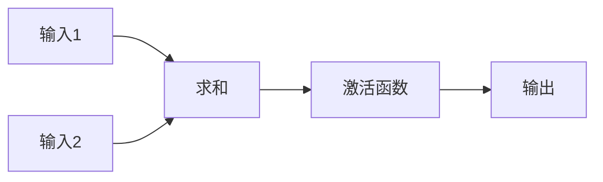

# AI人工智能深度学习算法：学习与适应的算法框架

作者：禅与计算机程序设计艺术

## 1. 背景介绍

### 1.1 人工智能的复兴与深度学习的崛起

人工智能，这一曾经只存在于科幻小说中的概念，如今正以前所未有的速度走进现实，并深刻地改变着我们的生活。从自动驾驶汽车到智能语音助手，从精准医疗诊断到个性化推荐系统，人工智能的应用已经渗透到各个领域，为人类社会带来了巨大的进步和便利。

而深度学习，作为人工智能领域近年来最受瞩目的技术突破之一，无疑是推动人工智能发展的重要引擎。其核心思想是通过构建多层神经网络，模拟人脑学习机制，从海量数据中自动学习特征表示，并进行预测和决策。深度学习的出现，突破了传统机器学习算法在处理高维、非线性数据方面的瓶颈，使得人工智能在图像识别、语音识别、自然语言处理等领域取得了突破性进展，甚至在某些方面已经超越了人类水平。

### 1.2 深度学习算法的核心特点与优势

深度学习算法之所以能够取得如此巨大的成功，与其独特的算法特点和优势密不可分：

* **强大的特征学习能力:** 深度学习算法能够自动从原始数据中学习到层次化的特征表示，无需人工进行复杂的特征工程，极大地提高了算法的效率和泛化能力。
* **端到端的学习方式:** 深度学习算法采用端到端的学习方式，直接从输入数据学习到输出结果，无需进行复杂的中间步骤，简化了模型训练过程。
* **强大的非线性拟合能力:** 深度学习算法通过多层神经网络的非线性变换，能够拟合复杂的非线性函数，从而更好地逼近真实世界的复杂关系。
* **海量数据的驱动:** 深度学习算法的性能高度依赖于数据的规模和质量，海量数据的出现为深度学习算法的训练和应用提供了强大的支撑。

### 1.3 本文的研究内容与意义

本文旨在深入探讨深度学习算法的核心原理、算法框架以及实际应用，帮助读者更好地理解和掌握这一前沿技术。本文将从以下几个方面展开论述：

* 深度学习算法的核心概念与联系
* 常用的深度学习算法原理及操作步骤
* 深度学习算法的数学模型和公式
* 深度学习算法的项目实践：代码实例和详细解释说明
* 深度学习算法的实际应用场景
* 深度学习算法的工具和资源推荐
* 深度学习算法的未来发展趋势与挑战
* 深度学习算法的常见问题与解答

通过本文的学习，读者将能够：

* 掌握深度学习算法的基本概念、原理和算法框架
* 了解常用的深度学习算法类型及其应用场景
* 具备使用深度学习算法解决实际问题的能力
* 了解深度学习算法的未来发展趋势和挑战

## 2. 核心概念与联系

### 2.1 人工神经网络 (ANN)

人工神经网络 (ANN) 是深度学习的基础，其灵感来自于生物神经系统的信息处理方式。人工神经网络由大量的人工神经元 (节点) 组成，这些神经元通过相互连接形成网络结构。每个连接都具有一个权重，表示两个神经元之间连接的强度。

#### 2.1.1 神经元模型

神经元是人工神经网络的基本单元，其结构如下图所示:



* **输入:** 神经元接收来自其他神经元的输入信号。
* **权重:** 每个输入信号都与一个权重相乘，表示该输入信号对神经元输出的影响程度。
* **求和:** 神经元将所有输入信号与其对应的权重相乘后的结果进行求和。
* **激活函数:** 求和结果经过激活函数的非线性变换，得到神经元的输出信号。

#### 2.1.2 激活函数

激活函数是神经元模型中至关重要的组成部分，它为神经网络引入了非线性因素，使得神经网络能够学习和表示复杂的非线性函数。常用的激活函数包括:

* **Sigmoid 函数:** 将输入值映射到 0 到 1 之间的连续值，常用于二分类问题。
* **ReLU 函数:**  保留正值部分，将负值部分置为 0，具有计算简单、收敛速度快的优点。
* **Tanh 函数:** 将输入值映射到 -1 到 1 之间的连续值，具有数据中心化的特点。

#### 2.1.3 网络结构

人工神经网络可以根据神经元之间的连接方式，分为不同的网络结构，常见的网络结构包括:

* **前馈神经网络 (FNN):** 信息从输入层单向传递到输出层，没有反馈连接。
* **循环神经网络 (RNN):** 具有反馈连接，能够处理序列数据，例如文本、语音等。
* **卷积神经网络 (CNN):**  专门用于处理具有网格结构的数据，例如图像数据，具有局部连接、权值共享等特点。

### 2.2 深度学习 (Deep Learning)

深度学习是指使用具有多个隐藏层的人工神经网络进行学习的机器学习方法。深度学习的“深度”是指神经网络中隐藏层的层数。

### 2.3 损失函数 (Loss Function)

损失函数用于衡量模型预测值与真实值之间的差异，是模型训练过程中优化的目标函数。常用的损失函数包括:

* **均方误差 (MSE):** 用于回归问题，计算预测值与真实值之间差的平方的平均值。
* **交叉熵 (Cross Entropy):** 用于分类问题，衡量预测概率分布与真实概率分布之间的差异。

### 2.4 优化算法 (Optimization Algorithm)

优化算法用于在模型训练过程中，根据损失函数的值，不断调整模型参数，使得损失函数的值最小化。常用的优化算法包括:

* **梯度下降法 (Gradient Descent):**  沿着损失函数梯度的反方向更新模型参数。
* **随机梯度下降法 (Stochastic Gradient Descent):**  每次只使用一个样本或一小批样本计算梯度，更新模型参数。
* **Adam 算法:**  结合了动量和自适应学习率的优化算法，具有收敛速度快、泛化性能好的优点。

## 3. 核心算法原理具体操作步骤

### 3.1 前馈神经网络 (FNN)

前馈神经网络 (FNN) 是最简单的一种人工神经网络，信息从输入层单向传递到输出层，没有反馈连接。

#### 3.1.1 算法原理

前馈神经网络的算法原理是，通过多层神经元的非线性变换，将输入数据映射到输出空间，从而实现对输入数据的分类或回归预测。

#### 3.1.2 具体操作步骤

前馈神经网络的训练过程可以分为以下几个步骤:

1. **数据预处理:** 对输入数据进行归一化、标准化等处理，将数据转换为模型可以处理的格式。
2. **模型构建:**  定义神经网络的层数、每层的神经元个数、激活函数等。
3. **模型训练:**  使用训练数据对模型进行训练，通过优化算法不断调整模型参数，使得损失函数的值最小化。
4. **模型评估:**  使用测试数据对训练好的模型进行评估，计算模型的准确率、精确率、召回率等指标。
5. **模型预测:**  使用训练好的模型对新的数据进行预测。

### 3.2 循环神经网络 (RNN)

循环神经网络 (RNN) 是一种具有反馈连接的神经网络，能够处理序列数据，例如文本、语音等。

#### 3.2.1 算法原理

循环神经网络的算法原理是，每个神经元不仅接收当前时刻的输入，还接收来自上一时刻的隐藏状态信息，从而能够学习到数据之间的时序关系。

#### 3.2.2 具体操作步骤

循环神经网络的训练过程与前馈神经网络类似，主要区别在于需要将数据按照时间顺序输入到网络中。

### 3.3 卷积神经网络 (CNN)

卷积神经网络 (CNN) 是一种专门用于处理具有网格结构的数据的神经网络，例如图像数据，具有局部连接、权值共享等特点。

#### 3.3.1 算法原理

卷积神经网络的算法原理是，通过卷积层和池化层，提取输入数据的特征，然后将提取到的特征输入到全连接层进行分类或回归预测。

#### 3.3.2 具体操作步骤

卷积神经网络的训练过程与前馈神经网络类似，主要区别在于需要定义卷积层、池化层等网络结构。

## 4. 数学模型和公式详细讲解举例说明

### 4.1 前馈神经网络的数学模型

前馈神经网络的数学模型可以表示为:

$$
y = f(W_n \cdot f(W_{n-1} \cdot ... \cdot f(W_1 \cdot x + b_1) + b_{n-1}) + b_n)
$$

其中:

* $x$ 表示输入向量
* $y$ 表示输出向量
* $W_i$ 表示第 $i$ 层的权重矩阵
* $b_i$ 表示第 $i$ 层的偏置向量
* $f()$ 表示激活函数

### 4.2 反向传播算法

反向传播算法是训练神经网络的核心算法，其作用是根据损失函数的值，计算损失函数对每个参数的梯度，然后根据梯度更新参数。

#### 4.2.1 算法原理

反向传播算法的原理是链式法则，即一个函数的导数等于该函数的各个中间变量的导数的乘积。

#### 4.2.2 公式推导

以一个简单的前馈神经网络为例，推导反向传播算法的公式。假设该神经网络只有一层隐藏层，激活函数为 sigmoid 函数，损失函数为均方误差 (MSE)。

1. **前向传播:**

$$
z_1 = W_1 \cdot x + b_1
$$

$$
a_1 = sigmoid(z_1)
$$

$$
z_2 = W_2 \cdot a_1 + b_2
$$

$$
\hat{y} = sigmoid(z_2)
$$

$$
L = \frac{1}{2} (\hat{y} - y)^2
$$

2. **反向传播:**

$$
\frac{\partial L}{\partial \hat{y}} = \hat{y} - y
$$

$$
\frac{\partial \hat{y}}{\partial z_2} = \hat{y} (1 - \hat{y})
$$

$$
\frac{\partial z_2}{\partial W_2} = a_1
$$

$$
\frac{\partial z_2}{\partial b_2} = 1
$$

$$
\frac{\partial z_2}{\partial a_1} = W_2
$$

$$
\frac{\partial a_1}{\partial z_1} = a_1 (1 - a_1)
$$

$$
\frac{\partial z_1}{\partial W_1} = x
$$

$$
\frac{\partial z_1}{\partial b_1} = 1
$$

根据链式法则，可以计算损失函数对每个参数的梯度:

$$
\frac{\partial L}{\partial W_2} = \frac{\partial L}{\partial \hat{y}} \cdot \frac{\partial \hat{y}}{\partial z_2} \cdot \frac{\partial z_2}{\partial W_2}
$$

$$
\frac{\partial L}{\partial b_2} = \frac{\partial L}{\partial \hat{y}} \cdot \frac{\partial \hat{y}}{\partial z_2} \cdot \frac{\partial z_2}{\partial b_2}
$$

$$
\frac{\partial L}{\partial W_1} = \frac{\partial L}{\partial \hat{y}} \cdot \frac{\partial \hat{y}}{\partial z_2} \cdot \frac{\partial z_2}{\partial a_1} \cdot \frac{\partial a_1}{\partial z_1} \cdot \frac{\partial z_1}{\partial W_1}
$$

$$
\frac{\partial L}{\partial b_1} = \frac{\partial L}{\partial \hat{y}} \cdot \frac{\partial \hat{y}}{\partial z_2} \cdot \frac{\partial z_2}{\partial a_1} \cdot \frac{\partial a_1}{\partial z_1} \cdot \frac{\partial z_1}{\partial b_1}
$$

3. **参数更新:**

根据计算得到的梯度，使用梯度下降法更新参数:

$$
W_2 = W_2 - \alpha \cdot \frac{\partial L}{\partial W_2}
$$

$$
b_2 = b_2 - \alpha \cdot \frac{\partial L}{\partial b_2}
$$

$$
W_1 = W_1 - \alpha \cdot \frac{\partial L}{\partial W_1}
$$

$$
b_1 = b_1 - \alpha \cdot \frac{\partial L}{\partial b_1}
$$

其中 $\alpha$ 为学习率。

## 5. 项目实践：代码实例和详细解释说明

### 5.1 手写数字识别

本节将以手写数字识别为例，演示如何使用 Python 和 TensorFlow 构建一个简单的前馈神经网络，对 MNIST 数据集进行分类。

#### 5.1.1 数据集介绍

MNIST 数据集是一个包含 70000 张手写数字图片的数据集，每张图片的大小为 28x28 像素，灰度值范围为 0 到 255。数据集被分成训练集 (60000 张图片) 和测试集 (10000 张图片)。

#### 5.1.2 代码实现

```python
import tensorflow as tf

# 加载 MNIST 数据集
(x_train, y_train), (x_test, y_test) = tf.keras.datasets.mnist.load_data()

# 数据预处理
x_train = x_train.astype('float32') / 255.0
x_test = x_test.astype('float32') / 255.0
y_train = tf.keras.utils.to_categorical(y_train, num_classes=10)
y_test = tf.keras.utils.to_categorical(y_test, num_classes=10)

# 构建模型
model = tf.keras.models.Sequential([
  tf.keras.layers.Flatten(input_shape=(28, 28)),
  tf.keras.layers.Dense(128, activation='relu'),
  tf.keras.layers.Dense(10, activation='softmax')
])

# 编译模型
model.compile(optimizer='adam',
              loss='categorical_crossentropy',
              metrics=['accuracy'])

# 训练模型
model.fit(x_train, y_train, epochs=5)

# 评估模型
loss, accuracy = model.evaluate(x_test, y_test, verbose=0)
print('Test loss:', loss)
print('Test accuracy:', accuracy)
```

#### 5.1.3 代码解释

* **加载 MNIST 数据集:** 使用 `tf.keras.datasets.mnist.load_data()` 函数加载 MNIST 数据集。
* **数据预处理:** 将图片数据转换为浮点型，并将像素值缩放到 0 到 1 之间。将标签数据转换为 one-hot 编码。
* **构建模型:**  构建一个包含一个输入层、一个隐藏层和一个输出层的前馈神经网络。
* **编译模型:**  使用 `adam` 优化算法，`categorical_crossentropy` 损失函数和 `accuracy` 指标编译模型。
* **训练模型:**  使用训练数据对模型进行训练，训练 5 个 epoch。
* **评估模型:**  使用测试数据对训练好的模型进行评估，计算损失值和准确率。

## 6. 实际应用场景

### 6.1 计算机视觉

* **图像分类:**  对图像进行分类，例如识别图像中的物体、场景等。
* **目标检测:**  检测图像中的物体，并确定物体的位置和类别。
* **图像分割:**  将图像分割成不同的区域，例如将人物从背景中分割出来。

### 6.2 自然语言处理

* **文本分类:**  对文本进行分类，例如识别垃圾邮件、情感分析等。
* **机器翻译:**  将一种语言的文本翻译成另一种语言的文本。
* **问答系统:**  回答用户提出的问题。

### 6.3 语音识别

* **语音转文本:**  将语音信号转换为文本。
* **语音识别:**  识别语音中的文字内容。

## 7. 工具和资源推荐

### 7.1 深度学习框架

* **TensorFlow:**  由 Google 开发的开源深度学习框架，支持多种平台和编程语言。
* **PyTorch:**  由 Facebook 开发的开源深度学习框架，以其灵活性和易用性著称。
* **Keras:**  高级神经网络 API，可以运行在 TensorFlow、Theano 和 CNTK 之上，易于使用和快速原型设计。

### 7.2 数据集

* **ImageNet:**  包含超过 1400 万张图片的数据集，用于图像分类、目标检测等任务。
* **COCO:**  包含超过 33 万张图片的数据集，用于目标检测、图像分割等任务。
* **GLUE:**  自然语言理解任务的基准数据集，包含多个不同的任务，例如文本分类、问答等。

### 7.3 学习资源

* **Coursera:**  在线学习平台，提供大量关于机器学习和深度学习的课程。
* **Udacity:**  在线学习平台，提供纳米学位课程，专注于人工智能、机器学习等领域。
* **CS2