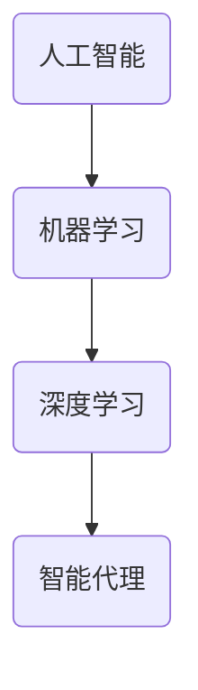

# AI人工智能深度学习算法：智能代理在智慧城市中的实践

## 1.背景介绍

### 1.1 智慧城市的概念

智慧城市是一种新型城市发展模式,旨在利用物联网、大数据、云计算等新兴信息技术,提高城市运营效率、促进经济可持续发展、优化公共服务和资源配置、提升城市管理水平和市民生活质量。简单来说,智慧城市就是将先进的信息通信技术与城市管理和运营充分融合,形成一个高效、智能、绿色、人性化、安全的城市系统。

### 1.2 智能代理在智慧城市中的作用

智能代理是人工智能领域中的一个重要概念,指能够感知环境、持续规划、自主行为并与人或其他代理交互的智能软件实体。在智慧城市建设中,智能代理可以广泛应用于交通管理、公共安全、环境监测、能源优化等诸多领域,发挥着不可或缺的作用。

#### 1.2.1 交通管理

通过部署智能交通代理系统,可以实时监测路况、优化信号时序、引导车辆精准导航,从而缓解拥堵、减少污染排放、提高通行效率。

#### 1.2.2 公共安全

智能安防代理系统能够通过摄像头、传感器等设备收集视频、图像和环境数据,结合人工智能技术进行智能识别、预警和决策,提高案件防控和应急响应能力。

#### 1.2.3 环境监测

环境监测代理可实时采集空气、水、噪音等环境数据,分析污染来源,并为制定治理方案提供决策支持。

#### 1.2.4 能源优化

智能能源代理可根据用能大数据,优化供需平衡,提高能源利用效率,促进节能减排。

### 1.3 人工智能与深度学习在智能代理中的应用

人工智能技术为智能代理系统赋能,使其具备环境感知、模式识别、决策推理等智能化功能。其中,深度学习作为人工智能的一个重要分支,在计算机视觉、自然语言处理、数据挖掘等领域发挥着关键作用,为构建高效智能代理奠定了坚实基础。

## 2.核心概念与联系 

### 2.1 人工智能

人工智能(Artificial Intelligence,AI)是一门致力于研究和发展能够模仿人类智能行为的理论、方法、技术及应用系统的学科。人工智能系统通过获取信息和规则推理,能够感知环境、学习经验、分析问题、制定计划并作出决策。

### 2.2 机器学习

机器学习(Machine Learning)是人工智能的一个重要分支,它赋予计算机在没有明确程序的情况下,通过利用数据或经验自动分析获得规律,并利用规律对新数据进行预测或决策的能力。常见的机器学习算法包括决策树、支持向量机、贝叶斯分类、聚类分析等。

### 2.3 深度学习

深度学习(Deep Learning)是机器学习中一种基于对数据的表征学习能力的方法。它通过构建神经网络模型对原始输入数据进行特征提取和转换,形成更加抽象的高层次数据表示,从而使模型具备更强的数据泛化能力。深度学习有助于解决复杂的问题,如计算机视觉、自然语言处理、语音识别等。

### 2.4 智能代理

智能代理(Intelligent Agent)是能够感知环境、规划行为路径并执行操作以达成既定目标的一种智能实体。智能代理具备环境感知、知识推理、行为规划、学习优化等功能,可以广泛应用于各种复杂系统的控制和决策场景。

上述概念之间的关系可以用下图表示:

人工智能是一个宏大的学科,机器学习和深度学习都属于人工智能的重要分支。深度学习为构建高效智能代理系统提供了强大的技术支撑。

## 3.核心算法原理与具体操作步骤

构建智能代理系统通常需要结合多种算法模型,本节将重点介绍其中的关键算法原理和具体实现步骤。

### 3.1 深度神经网络

深度神经网络(Deep Neural Network,DNN)是深度学习的核心模型,它通过构建多层神经网络对原始输入数据进行特征提取和转换,形成高层次的数据表征,从而完成分类、回归等任务。

#### 3.1.1 算法原理

深度神经网络由多个层级组成,每一层由多个神经元节点构成。各层节点通过加权连接与激活函数相连,对输入数据进行非线性变换。在训练过程中,通过反向传播算法不断调整连接权重和偏置值,使网络对训练数据的预测值与真实值之间的误差最小化,从而学习到最优模型参数。

对于给定的训练数据集$\mathcal{D}=\{(x_1,y_1),(x_2,y_2),...,(x_m,y_m)\}$,其中$x_i$为输入特征向量,$y_i$为对应的标签或目标值。我们希望通过训练得到一个模型$f(x;\theta)$,使其能够很好地拟合训练数据,即对新的输入$x^*$,模型预测值$f(x^*;\theta)$与真实值$y^*$之间的误差最小。

对于分类任务,通常采用交叉熵作为损失函数:

$$J(\theta)=-\frac{1}{m}\sum_{i=1}^m\sum_{j=1}^Ky_{ij}\log(p_{ij})$$

其中$y_{ij}$为样本$i$的真实标签,如果属于类别$j$则为1,否则为0;$p_{ij}$为模型对样本$i$预测为类别$j$的概率输出。

对于回归任务,常用均方误差作为损失函数:

$$J(\theta)=\frac{1}{2m}\sum_{i=1}^m\Vert y_i-f(x_i;\theta)\Vert_2^2$$

在训练过程中,通过反向传播算法计算损失函数关于各层参数的梯度,并采用优化算法(如梯度下降)不断迭代更新网络参数$\theta$,直至收敛为止。

#### 3.1.2 具体操作步骤

1. **数据预处理**:对原始数据进行清洗、归一化等预处理,将其转换为模型可以接受的格式。
2. **定义网络结构**:根据任务复杂程度设计合理的网络层数和神经元数量,选择合适的激活函数。
3. **初始化参数**:对权重矩阵和偏置向量进行初始化,通常采用小的随机值。
4. **设置超参数**:确定学习率、批次大小、正则化参数等超参数的取值。
5. **构建训练集和验证集**:从原始数据中分割出用于模型训练和验证的数据集。
6. **定义损失函数和优化算法**:选择合适的损失函数(如交叉熵或均方误差)和优化算法(如梯度下降)。
7. **模型训练**:使用训练集对模型进行训练,通过反向传播算法更新网络参数。可采用验证集对模型进行评估,防止过拟合。
8. **模型评估**:在测试集上对训练好的模型进行评估,计算相关指标(如准确率、F1分数等)。
9. **模型部署**:将训练好的模型集成到实际的系统或场景中,用于执行预测和决策任务。

### 3.2 卷积神经网络

卷积神经网络(Convolutional Neural Network,CNN)是一种常用于计算机视觉任务的深度神经网络模型,它在图像、视频等数据上表现出极好的性能。

#### 3.2.1 算法原理

卷积神经网络由一系列卷积层、池化层和全连接层构成。其中,卷积层通过滑动卷积核在局部区域内提取特征,池化层则用于降低特征维度;最终通过全连接层对提取的高层次特征进行分类或回归。

卷积运算的数学原理为:
$$s(i,j)=(I*K)(i,j)=\sum_{m}\sum_{n}I(i+m,j+n)K(m,n)$$

其中,$I$为输入特征图,$K$为卷积核,$m、n$为卷积核的维度,$i、j$为输出特征图的位置索引。通过在输入特征图上滑动卷积核并进行点乘累加操作,可以得到新的特征图$s$。

池化层则通过在特征图上滑动窗口,取窗口内元素的最大值或均值,从而实现降维和特征压缩。

最后,将提取得到的高层次特征输入全连接层,进行分类或回归等任务。

#### 3.2.2 具体操作步骤

1. **数据预处理**:对图像数据进行标准化等预处理,将其转换为模型可接受的格式。
2. **定义网络结构**:根据任务复杂程度,设计合理的卷积层、池化层和全连接层的层数及参数(如卷积核尺寸、步长等)。
3. **初始化参数**:对卷积核权重和全连接层参数进行初始化,通常采用小的随机值。
4. **设置超参数**:确定学习率、批次大小、正则化参数等超参数取值。
5. **构建训练集和验证集**:从原始数据中分割出用于模型训练和验证的数据集。
6. **定义损失函数和优化算法**:选择合适的损失函数(如交叉熵或均方误差)和优化算法(如Adam)。
7. **模型训练**:使用训练集对模型进行训练,通过反向传播算法更新网络参数。可采用验证集对模型进行评估,防止过拟合。
8. **模型评估**:在测试集上对训练好的模型进行评估,计算相关指标(如准确率、mAP等)。
9. **模型部署**:将训练好的模型集成到实际系统中,用于执行图像识别、目标检测等计算机视觉任务。

### 3.3 循环神经网络

循环神经网络(Recurrent Neural Network,RNN)是一种用于处理序列数据(如文本、语音、时间序列等)的深度学习模型。

#### 3.3.1 算法原理

与前馈神经网络不同,循环神经网络在隐藏层之间引入了循环连接,使得网络具有"记忆"能力,可以很好地捕捉序列数据中的长期依赖关系。RNN在处理序列数据时,通过不断传递"状态向量",将历史信息编码到内部状态中。

在时间步$t$处,RNN的隐藏状态$h_t$由上一时刻的隐藏状态$h_{t-1}$和当前输入$x_t$计算得到:

$$h_t=\phi(W_{hh}h_{t-1}+W_{xh}x_t+b_h)$$

其中,$\phi$为激活函数,$W_{hh}、W_{xh}、b_h$分别为隐藏层到隐藏层、输入层到隐藏层的权重矩阵和偏置向量。

在序列建模任务中,RNN通过学习一个状态到输出的映射函数$f$,对序列中每个时间步的输出$y_t$进行预测:

$$y_t=f(h_t,y_{t-1})$$

在训练过程中,通过反向传播算法计算损失函数关于各参数的梯度,并采用优化算法(如Adam)不断迭代更新网络参数。

#### 3.3.2 具体操作步骤

1. **数据预处理**:对序列数据(如文本)进行分词、编码等预处理,将其转换为模型可接受的格式。
2. **定义网络结构**:设计合理的RNN网络层数、隐藏层神经元数量,选择合适的激活函数。
3. **初始化参数**:对权重矩阵和偏置向量进行初始化,通常采用小的随机值。
4. **设置超参数**:确定学习率、批次大小、正则化参数等超参数取值。
5. **构建训练集和验证集**:从原始数据中分割出用于模型训练和验证的数据集。
6. **定义