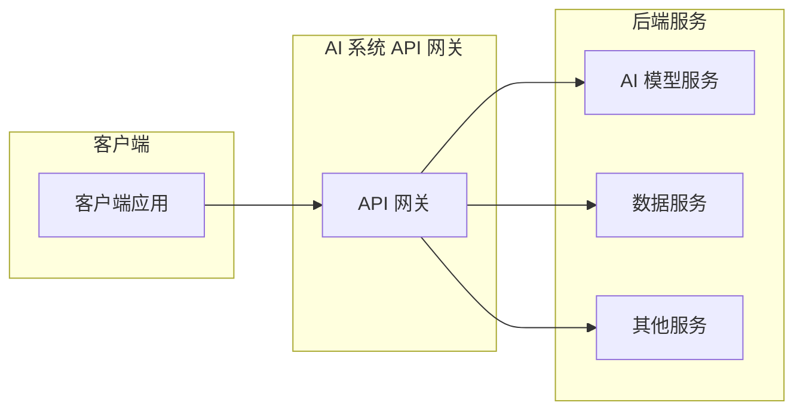

## 1. 背景介绍

### 1.1  AI 应用开发的挑战

近年来，人工智能（AI）技术发展迅速，并已渗透到各行各业。从图像识别、自然语言处理到推荐系统，AI 正在改变着我们的生活和工作方式。然而，随着 AI 应用的普及，开发者们也面临着诸多挑战：

* **复杂性：**构建和部署 AI 模型需要专业的知识和技能，涉及数据预处理、模型训练、模型评估等多个环节。
* **可扩展性：**随着用户量和数据量的增长，AI 应用需要具备高并发、高可用的能力。
* **安全性：**AI 模型和数据是企业的核心资产，需要得到妥善的保护。
* **可维护性：**AI 应用需要不断迭代更新，以适应不断变化的业务需求。

为了应对这些挑战，越来越多的企业开始采用 API 网关来管理和发布 AI 服务。

### 1.2 API 网关的优势

API 网关作为连接客户端和后端服务的桥梁，可以为 AI 应用提供以下优势：

* **简化开发：**开发者只需关注 AI 模型本身的开发，而无需关心底层的服务部署、负载均衡、安全认证等问题。
* **提高效率：**API 网关可以将 AI 服务封装成标准的 API 接口，方便客户端调用，提高开发效率。
* **增强安全性：**API 网关可以提供身份验证、授权、流量控制等安全机制，保护 AI 服务免受攻击。
* **提升可维护性：**API 网关可以集中管理 API 版本、文档等信息，方便维护和更新。

### 1.3 本文目标

本文将深入探讨 AI 系统 API 网关的原理，并结合代码实战案例，帮助读者理解如何使用 API 网关构建安全、高效、可扩展的 AI 应用。

## 2. 核心概念与联系

### 2.1 什么是 API 网关？

API 网关是位于客户端和后端服务之间的一层软件，它充当着反向代理的角色，接收客户端请求并将其转发到相应的服务上。同时，API 网关还可以执行一些附加功能，例如：

* **路由：**根据请求路径或其他规则，将请求转发到不同的后端服务。
* **身份验证和授权：**验证客户端身份并检查其是否有权访问请求的资源。
* **流量控制：**限制客户端的请求频率，防止服务过载。
* **缓存：**缓存 frequently accessed 数据，以减少响应时间和服务器负载。
* **监控和日志记录：**收集 API 调用相关的指标和日志，用于性能分析和故障排除。

### 2.2 AI 系统 API 网关的特点

与传统的 API 网关相比，AI 系统 API 网关具有以下特点：

* **支持多种 AI 模型部署方式：**可以部署 TensorFlow、PyTorch、ONNX 等多种格式的 AI 模型。
* **提供模型推理优化：**例如模型压缩、量化等，以提高模型推理速度。
* **支持 GPU 加速：**可以利用 GPU 资源加速模型推理，提高服务性能。
* **提供模型版本管理：**方便开发者管理和部署不同版本的 AI 模型。

### 2.3 核心概念之间的联系

下图展示了 AI 系统 API 网关、客户端和后端服务之间的关系：



客户端通过 API 网关访问 AI 服务，API 网关负责将请求转发到相应的 AI 模型服务、数据服务或其他服务。

## 3. 核心算法原理与具体操作步骤

### 3.1 请求处理流程

AI 系统 API 网关的请求处理流程一般包括以下步骤：

1. **接收请求：**API 网关接收客户端发送的 HTTP 请求。
2. **路由：**根据请求路径或其他规则，将请求转发到相应的服务。
3. **身份验证和授权：**验证客户端身份并检查其是否有权访问请求的资源。
4. **流量控制：**限制客户端的请求频率，防止服务过载。
5. **请求转发：**将请求转发到后端服务。
6. **响应处理：**接收后端服务的响应，并将其返回给客户端。

### 3.2 核心算法

AI 系统 API 网关的核心算法包括：

* **路由算法：**用于根据请求路径或其他规则，将请求转发到相应的服务。常见的路由算法包括：
    * 静态路由：根据预先定义的规则进行路由。
    * 动态路由：根据服务注册中心的信息进行路由。
* **负载均衡算法：**用于将请求分发到多个后端服务实例，以提高服务的可用性和性能。常见的负载均衡算法包括：
    * 轮询：依次将请求分发到每个服务实例。
    * 加权轮询：根据服务实例的权重分配请求。
    * 最少连接数：将请求分发到连接数最少的服务实例。

### 3.3 具体操作步骤

以使用 Kong 网关为例，演示如何构建 AI 系统 API 网关：

1. **安装 Kong 网关：**参考 Kong 官方文档进行安装。
2. **创建 API 服务：**使用 Kong 提供的命令行工具或管理界面，创建 API 服务并配置路由规则。
3. **配置插件：**根据需要配置身份验证、流量控制等插件。
4. **部署 AI 模型服务：**将 AI 模型服务部署到后端服务器。
5. **测试 API 服务：**使用测试工具或客户端调用 API 服务，验证其是否正常工作。

## 4. 数学模型和公式详细讲解举例说明

### 4.1 性能指标

评估 API 网关性能的常用指标包括：

* **吞吐量（Throughput）：**单位时间内处理的请求数量，例如每秒请求数（RPS）。
* **延迟（Latency）：**从发送请求到接收到响应的时间间隔，例如平均响应时间。
* **错误率（Error Rate）：**请求失败的比例。

### 4.2 性能优化

提高 API 网关性能的常见方法包括：

* **使用缓存：**缓存 frequently accessed 数据，以减少响应时间和服务器负载。
* **启用连接池：**减少与后端服务的连接建立和关闭开销。
* **优化路由规则：**减少路由匹配的次数，提高路由效率。
* **使用更高效的负载均衡算法：**例如使用加权轮询或最少连接数算法。

### 4.3 举例说明

假设有一个 AI 图像识别服务，需要处理大量的图片识别请求。为了提高服务的可用性和性能，可以使用 API 网关和负载均衡来构建服务架构。

**数学模型：**

假设 API 网关的吞吐量为 $T$，后端服务实例的吞吐量为 $t$，服务实例的数量为 $n$，则系统的吞吐量为：

$$
System Throughput = min(T, n * t)
$$

**公式推导：**

当 API 网关的吞吐量小于后端服务实例的总吞吐量时，系统的吞吐量受限于 API 网关的处理能力。当 API 网关的吞吐量大于后端服务实例的总吞吐量时，系统的吞吐量受限于后端服务实例的处理能力。

**举例说明：**

假设 API 网关的吞吐量为 1000 RPS，后端服务实例的吞吐量为 100 RPS。如果部署 10 个服务实例，则系统的吞吐量为：

$$
System Throughput = min(1000, 10 * 100) = 1000 RPS
$$

如果部署 20 个服务实例，则系统的吞吐量为：

$$
System Throughput = min(1000, 20 * 100) = 1000 RPS
$$

由此可见，当服务实例的数量足够多时，系统的吞吐量不再随着服务实例数量的增加而提升，此时系统的性能瓶颈在于 API 网关。

## 5. 项目实践：代码实例和详细解释说明

### 5.1 项目背景

假设我们需要构建一个 AI 图像识别 API 服务，该服务接收用户上传的图片，并返回识别结果。

### 5.2 技术选型

* **API 网关：**Kong 网关
* **AI 模型服务：**TensorFlow Serving
* **编程语言：**Python

### 5.3 代码实例

**1. 定义 Kong API 服务**

```bash
curl -i -X POST \
  --url http://localhost:8001/services/ \
  --header "Content-Type: application/json" \
  --data '{
    "name": "image-recognition",
    "url": "http://localhost:8501/v1/models/image_classifier:predict"
  }'
```

**2. 定义路由规则**

```bash
curl -i -X POST \
  --url http://localhost:8001/services/image-recognition/routes \
  --header "Content-Type: application/json" \
  --data '{
    "paths": ["/predict"],
    "methods": ["POST"]
  }'
```

**3. 配置插件**

```bash
# 配置身份验证插件
curl -i -X POST \
  --url http://localhost:8001/services/image-recognition/plugins \
  --header "Content-Type: application/json" \
  --data '{
    "name": "key-auth"
  }'

# 配置流量控制插件
curl -i -X POST \
  --url http://localhost:8001/services/image-recognition/plugins \
  --header "Content-Type: application/json" \
  --data '{
    "name": "rate-limiting",
    "config": {
      "second": 10,
      "hour": 1000
    }
  }'
```

**4. Python 客户端代码**

```python
import requests

url = "http://localhost:8000/predict"
headers = {"apikey": "your_api_key"}
files = {"image": open("image.jpg", "rb")}

response = requests.post(url, headers=headers, files=files)

print(response.json())
```

### 5.4 代码解释

* **定义 Kong API 服务：**指定 API 服务的名称和后端服务的地址。
* **定义路由规则：**指定 API 服务的路径和 HTTP 方法。
* **配置插件：**配置身份验证和流量控制插件，以增强服务的安全性。
* **Python 客户端代码：**使用 Python requests 库发送 HTTP 请求，并处理响应结果。

## 6. 实际应用场景

AI 系统 API 网关可以应用于各种 AI 应用场景，例如：

* **图像识别：**构建图像识别 API 服务，用于人脸识别、物体识别等场景。
* **自然语言处理：**构建文本分类、情感分析、机器翻译等 API 服务。
* **推荐系统：**构建个性化推荐 API 服务，用于电商、新闻等场景。

## 7. 总结：未来发展趋势与挑战

### 7.1 未来发展趋势

* **更加智能化：**API 网关将集成更多的 AI 技术，例如自动路由、智能限流等。
* **更加云原生：**API 网关将更加适应云原生环境，例如支持 Kubernetes 部署、Serverless 计算等。
* **更加安全可靠：**API 网关将提供更加完善的安全机制，例如零信任安全、AI 安全等。

### 7.2 面临挑战

* **性能和可扩展性：**随着 AI 应用的普及，API 网关需要处理更大的请求量，并提供更高的性能和可扩展性。
* **安全性：**AI 系统 API 网关面临着更加严峻的安全挑战，需要更加完善的安全机制来保护 AI 服务。
* **生态建设：**AI 系统 API 网关需要更加完善的生态系统，以支持更多的 AI 模型格式、部署方式和工具。

## 8. 附录：常见问题与解答

### 8.1 如何选择合适的 API 网关？

选择 API 网关时需要考虑以下因素：

* **功能需求：**不同的 API 网关提供不同的功能，例如路由、身份验证、流量控制等。
* **性能要求：**不同的 API 网关具有不同的性能表现，需要根据实际需求选择合适的网关。
* **部署方式：**API 网关可以部署在本地、云端或混合环境中。
* **成本：**不同的 API 网关具有不同的价格和收费模式。

### 8.2 如何保证 API 网关的安全性？

保证 API 网关安全性的措施包括：

* **使用 HTTPS 协议：**加密客户端和 API 网关之间的通信。
* **启用身份验证和授权：**验证客户端身份并检查其是否有权访问请求的资源。
* **配置流量控制：**限制客户端的请求频率，防止服务过载。
* **定期更新软件版本：**修复已知的安全漏洞。

### 8.3 如何监控 API 网关的性能？

可以使用监控工具监控 API 网关的性能指标，例如：

* **吞吐量**
* **延迟**
* **错误率**

同时，还可以收集 API 网关的日志，用于性能分析和故障排除。
