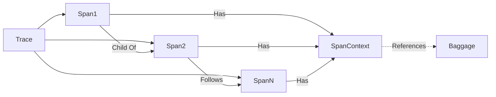
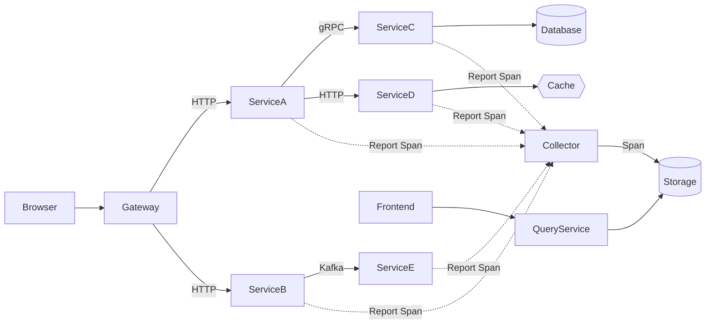

# AI系统Jaeger原理与代码实战案例讲解

作者：禅与计算机程序设计艺术

## 1. 背景介绍

### 1.1 分布式系统追踪的重要性

在现代微服务架构和云原生应用中,分布式系统追踪技术扮演着至关重要的角色。系统由众多服务组成,彼此之间通过网络进行通信。当系统出现性能瓶颈或错误时,定位问题变得异常困难。分布式追踪为解决这一难题提供了有力手段。

### 1.2 OpenTracing规范的诞生

为了统一分布式追踪的实现方式,OpenTracing规范应运而生。它定义了一套平台无关、厂商无关的API,为各种分布式追踪系统提供了统一的抽象和概念,便于开发者集成和扩展。

### 1.3 Jaeger追踪系统简介

Jaeger是Uber开源的一款端到端分布式追踪系统,遵循OpenTracing规范,提供了分布式上下文传播、分布式事务监控、故障根源分析等重要功能。它支持多种语言客户端,部署灵活,已成为云原生领域分布式追踪的事实标准之一。

## 2. 核心概念与联系

### 2.1 Trace 

一个Trace代表一次完整的请求或事务,贯穿多个服务,由一系列有因果关系的Span组成。Trace记录了请求从开始到结束的完整历程。

### 2.2 Span

Span是分布式追踪的最小跟踪单位,代表请求中的一个逻辑单元,例如一次方法调用、一次数据库查询等。每个Span都有开始和结束时间,以及一些元数据如操作名称、标签等。

### 2.3 SpanContext

SpanContext携带Trace和Span的上下文信息,包含TraceID、SpanID、采样标志等,用于关联Trace中的各个Span。SpanContext在服务调用时随请求一同传播。

### 2.4 Baggage 

Baggage用于在Trace中传递额外的元数据,它是一组键值对,与Trace相伴而行。Baggage中的内容对所有下游服务可见。

### 2.5 概念关系

下图展示了这些核心概念之间的关系:



## 3. 核心算法原理与具体操作步骤

### 3.1 Trace构建算法

Jaeger在构建一次完整的Trace时,主要经历以下步骤:

1. 对于每一个请求,生成全局唯一的TraceID。
2. 从请求中提取SpanContext。若不存在则新建,并生成SpanID。
3. 创建Span对象,设置Span的属性如操作名称、开始时间等。将SpanContext关联到Span。
4. 处理请求,在适当的位置记录日志。
5. 请求处理完毕,设置Span的结束时间,并上报Span数据。
6. 从所有上报的Span数据,构建出完整的Trace。

### 3.2 Trace采样策略

当请求量很大时,对所有请求都进行追踪会带来巨大开销。Jaeger支持对Trace进行采样,只对一部分请求进行追踪。常见的采样策略有:

1. Constant采样：对所有Trace都进行采样,或都不采样。 
2. Probabilistic采样：以一定概率对Trace进行采样,如采样率为1/1000。
3. Rate Limiting采样：限制每秒被采样的Trace数量,如最多1000个/秒。
4. Adaptive采样：动态调整采样率,在资源紧张时降低采样率。

### 3.3 SpanContext传播机制

为了能够关联同一Trace内的Span,需要在服务调用时传播SpanContext。常见的传播方式有:

1. HTTP Headers：将SpanContext编码到HTTP请求头中,如`X-B3-TraceId`和`X-B3-SpanId`。
2. 二进制协议：将SpanContext编码到二进制协议的元数据中,如gRPC Metadata。
3. 数据库查询参数：将SpanContext编码为数据库查询参数。

接收方从相应位置提取SpanContext,并创建子Span,从而将分散的Span关联起来。

## 4. 数学模型和公式详细讲解举例说明

### 4.1 Trace数据模型

Jaeger将一次Trace抽象为一个有向无环图(DAG),Trace是图的根,Span是图的节点。Span之间的关系用边表示。Trace的数学定义如下:

$$
G = (V, E) \\
V = \{S_0, S_1, ..., S_n\} \\
E = \{(S_i, S_j) | S_i \rightarrow S_j\}
$$

其中,$G$表示一次Trace,$V$表示Trace中的Span集合,$E$代表Span之间的关系。$S_0$代表Trace的根Span。Span之间的关系分为:
- Child Of：$S_i$是$S_j$的子Span。
- Follows From：$S_i$是$S_j$的后续Span,但并非直接父子关系。

### 4.2 Trace采样模型

假设系统的请求率为$\lambda$,目标采样率为$\alpha$,则采样后的请求率$\lambda'$为:

$$
\lambda' = \alpha \times \lambda
$$

进一步,若系统允许的最大采样请求数为$K$,则动态计算的采样率$\alpha'$为:

$$
\alpha' = min(\frac{K}{\lambda}, \alpha) 
$$

实际采样时,可对每个请求生成一个$[0,1)$区间内的随机数$r$,当$r <= \alpha'$时对该请求进行采样。

## 5. 项目实践：代码实例和详细解释说明

下面以一个简单的Spring Boot应用为例,演示如何集成Jaeger进行分布式追踪。

### 5.1 添加依赖

在`pom.xml`中添加Jaeger的客户端依赖:

```xml
<dependency>
    <groupId>io.jaegertracing</groupId>
    <artifactId>jaeger-client</artifactId>
    <version>1.6.0</version>
</dependency>
```

### 5.2 配置Tracer

创建一个`Tracer`实例,用于创建和发送Span:

```java
public class JaegerConfig {
    @Bean
    public Tracer getTracer() {
        Configuration.SamplerConfiguration samplerConfig = Configuration.SamplerConfiguration.fromEnv()
                .withType(ConstSampler.TYPE)
                .withParam(1);
        Configuration.ReporterConfiguration reporterConfig = Configuration.ReporterConfiguration.fromEnv()
                .withLogSpans(true);
        Configuration config = new Configuration("my-service")
                .withSampler(samplerConfig)
                .withReporter(reporterConfig);
        return config.getTracer();
    }
}
```

这里配置了一个固定采样率为1的`ConstSampler`,即对所有Trace都进行采样。生产环境可根据需要调整采样率。

### 5.3 创建Span

在请求处理的适当位置创建Span:

```java
@RestController
public class HelloController {
    @Autowired
    private Tracer tracer;

    @GetMapping("/hello")
    public String hello() {
        Span span = tracer.buildSpan("hello").start();
        try (Scope scope = tracer.scopeManager().activate(span)) {
            // 业务逻辑
            Thread.sleep(1000);
            return "hello";
        } catch (Exception e) {
            span.setTag("error", true);
            throw e;
        } finally {
            span.finish();
        }
    }
}
```

`tracer.buildSpan`方法创建了一个新的Span,并将其设置为当前Span。在try语句块中处理业务逻辑,并捕获异常。finally语句块中调用`span.finish`方法结束该Span。

### 5.4 跨线程追踪

在异步场景下跨线程传播Span上下文:

```java
@Async
public void asyncMethod() {
    Span parentSpan = tracer.activeSpan();
    Span childSpan = tracer.buildSpan("asyncMethod").asChildOf(parentSpan).start();
    try (Scope scope = tracer.scopeManager().activate(childSpan)) {
        // 异步逻辑      
    } finally {
        childSpan.finish();
    }
}
```

使用`asChildOf`方法创建一个新的子Span,将当前活跃Span作为其父Span,从而将跨线程的Span关联起来。

### 5.5 Span采样

除了在初始化时配置采样器,也可以在创建Span时指定是否采样:

```java
Span span = tracer.buildSpan("hello")
                .withTag(Tags.SAMPLING_PRIORITY, 1)
                .start();
```

将采样优先级设为1,保证该Span一定会被采样。反之设为0则一定不会采样。

## 6. 实际应用场景

分布式追踪在以下场景中大放异彩:

1. 性能优化：通过分布式追踪剖析系统瓶颈,例如定位高延迟服务、数据库查询等。
2. 故障排查：当系统发生错误时,快速定位问题根源,找出异常服务。
3. 依赖梳理：通过Trace分析服务之间的调用关系和依赖拓扑。
4. 链路告警：当某个调用链路出现异常,触发告警通知相关人员。

一个应用Jaeger的实际系统架构如下图所示:



Browser发起请求,由Gateway将请求路由到下游服务。各服务处理请求,同时上报Span数据到Collector。Collector将Span数据持久化到Storage。用户通过Frontend查询Trace数据,Frontend从QueryService获取数据并展示。整个请求流程的Trace信息被采集和展现,方便定位问题。

## 7. 工具和资源推荐 

除Jaeger外,社区中还有其他优秀的分布式追踪方案和学习资源:

1. Zipkin: Twitter开源的分布式追踪系统,提供了Web UI。
2. SkyWalking: 针对微服务的APM系统,提供分布式追踪、性能指标分析、应用和服务拓扑分析等能力。
3. 《Mastering Distributed Tracing》:系统讲解分布式追踪原理和实操的书籍。
4. Jaeger官方文档：提供了使用指南、最佳实践、API文档等。
5. OpenTracing官网：了解OpenTracing规范详情,包含各语言的使用手册。

开发者可结合实际场景,选择合适的追踪方案和工具。

## 8. 总结：未来发展趋势与挑战

### 8.1 标准化和规范化

OpenTracing和OpenCensus等规范的发展,有助于提高不同追踪系统的互操作性,减轻开发人员的集成负担。未来分布式追踪领域将向标准化和规范化的方向发展。

### 8.2 云原生支持

在云原生的背景下,分布式追踪已成为可观测性的重要组成部分。各大云平台如AWS X-Ray,GCP Cloud Trace等,都提供了一站式的分布式追踪解决方案。未来分布式追踪与云原生的结合将更加紧密。

### 8.3 实时性和数据处理

当前分布式追踪系统大多采用异步上报的方式,Trace数据有一定的延迟。为了支持实时的Trace分析和告警,需要采用流式计算等技术,提高Trace数据的实时处理能力。

### 8.4 数据存储和分析

海量Trace数据对存储和分析提出了挑战,需要采用合适的数据模型和存储引擎。同时借助机器学习等技术,从Trace数据中挖掘更多的价值,如异常检测、根因分析等。

总之,解决这些挑战需要理论和实践的结合,也离不开开源社区的贡献。让我们携手共建分布式追踪的美好未来。

## 9. 附录：常见问题与解答

### Q1: Jaeger支持哪些语言的客户端?

Jaeger官方支持Java、Go、Python、Node.js、C++、C#等多种语言的客户端库。社区