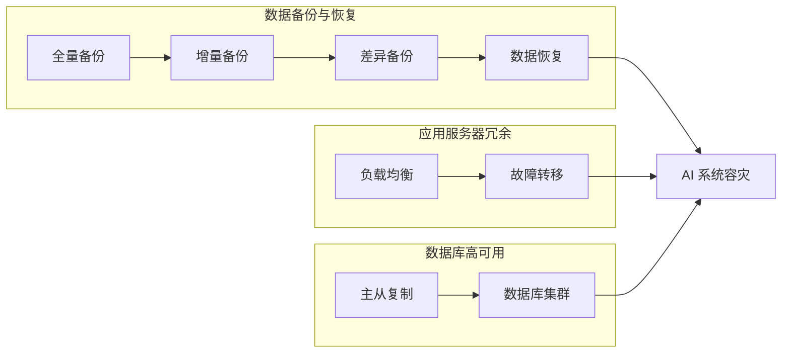

# AI系统容灾设计原理与代码实战案例讲解

作者：禅与计算机程序设计艺术

## 1. 背景介绍

### 1.1  AI 系统面临的挑战

近年来，人工智能(AI)发展迅猛，其应用已渗透到各行各业，从自动驾驶到医疗诊断，从金融风控到智能家居。然而，随着 AI 系统规模和复杂性的不断提升，其对可靠性和稳定性的要求也越来越高。任何不可预测的故障或中断都可能导致巨大的经济损失和社会影响。因此，构建具备高可用性和容灾能力的 AI 系统已成为一项至关重要的任务。

### 1.2  容灾的重要性

容灾是指在发生灾难性事件时，确保系统能够快速恢复并继续提供服务的能力。对于 AI 系统而言，容灾尤为重要，因为：

- **数据依赖性:**  AI 系统通常依赖于海量数据进行训练和推理，数据的丢失或损坏可能导致模型失效。
- **计算密集性:**  AI 模型的训练和推理过程往往需要消耗大量的计算资源，任何硬件故障都可能导致服务中断。
- **实时性要求:**  许多 AI 应用场景对实时性要求极高，例如自动驾驶和金融交易，任何延迟都可能造成严重后果。

### 1.3  本文目标

本文旨在探讨 AI 系统容灾设计的原理和最佳实践，并结合代码实战案例，帮助读者深入理解和掌握相关技术。

## 2. 核心概念与联系

在深入探讨 AI 系统容灾设计之前，我们先来明确一些核心概念及其之间的联系。

### 2.1  灾难恢复(DR)与业务连续性(BC)

- **灾难恢复(Disaster Recovery)**: 指的是在灾难发生后，将系统恢复到可运行状态的过程。灾难恢复的重点是**恢复时间目标(RTO)**，即系统从故障中恢复所需的时间。
- **业务连续性(Business Continuity)**: 指的是在发生灾难性事件时，确保业务能够持续运营的能力。业务连续性的重点是**恢复点目标(RPO)**，即系统能够容忍的数据丢失量。

灾难恢复是业务连续性的一个子集，其目标是尽可能缩短 RTO，而业务连续性的目标是尽可能降低 RPO。

### 2.2  容灾级别

根据 RTO 和 RPO 的不同要求，容灾级别可以分为以下几类：

- **热备(Hot Standby):**  实时同步数据和应用程序，RTO 和 RPO 都接近于零。
- **温备(Warm Standby):**  定期同步数据，RTO 和 RPO 较短。
- **冷备(Cold Standby):**  仅备份数据，RTO 和 RPO 较长。

### 2.3  容灾架构

常见的容灾架构包括：

- **主备架构:**  一个主节点和一个或多个备用节点，主节点发生故障时，备用节点接管服务。
- **双活架构:**  两个或多个节点同时提供服务，任何一个节点发生故障，其他节点可以接管其负载。
- **多地多中心架构:**  将系统部署在多个地理位置，实现跨区域容灾。

## 3. 核心算法原理具体操作步骤

### 3.1 数据备份与恢复

数据是 AI 系统的核心资产，因此数据备份和恢复是容灾设计的重中之重。

#### 3.1.1  数据备份策略

- **全量备份:**  定期备份所有数据，优点是恢复速度快，缺点是占用存储空间大。
- **增量备份:**  仅备份自上次备份以来发生变化的数据，优点是节省存储空间，缺点是恢复速度较慢。
- **差异备份:**  备份自上次全量备份以来发生变化的数据，优点是恢复速度较快，缺点是占用存储空间较大。

#### 3.1.2  数据恢复流程

1. 从备份存储中恢复数据。
2. 验证数据完整性。
3. 将数据导入到目标系统。

### 3.2  应用服务器冗余

为了避免单点故障，需要实现应用服务器的冗余部署。

#### 3.2.1  负载均衡

负载均衡可以将请求分发到多个服务器上，提高系统的吞吐量和可用性。

- **硬件负载均衡:**  使用专用硬件设备实现负载均衡，性能高，成本也较高。
- **软件负载均衡:**  使用软件实现负载均衡，成本较低，性能相对较低。

#### 3.2.2  故障转移

当某个服务器发生故障时，需要将请求自动转移到其他可用的服务器上。

- **心跳检测:**  定期检测服务器的健康状态。
- **故障转移策略:**  定义当服务器发生故障时如何进行转移，例如主备切换、轮询等。

### 3.3  数据库高可用

数据库是 AI 系统中存储和管理数据的关键组件，需要实现数据库的高可用性。

#### 3.3.1  主从复制

主从复制可以将主数据库的数据实时同步到一个或多个从数据库，当主数据库发生故障时，可以将从数据库提升为主数据库。

#### 3.3.2  数据库集群

数据库集群可以将多个数据库节点组成一个逻辑数据库，实现数据冗余和负载均衡。

## 4. 数学模型和公式详细讲解举例说明

### 4.1  RTO 和 RPO 的计算

- **RTO (Recovery Time Objective):**  系统从故障中恢复所需的时间。
- **RPO (Recovery Point Objective):**  系统能够容忍的数据丢失量。

假设：

- 系统每天产生 10GB 数据。
- 备份频率为每天一次。
- 恢复时间为 2 小时。

则：

- RPO = 10GB (一天的数据量)
- RTO = 2 小时

### 4.2  可用性计算

可用性是指系统在规定时间内正常运行的概率。

$$
可用性 = (正常运行时间) / (总时间)
$$

假设：

- 系统一年运行 365 天，每天 24 小时。
- 系统每年宕机时间为 5 分钟。

则：

$$
可用性 = ((365 * 24 * 60) - 5) / (365 * 24 * 60) = 99.9994%
$$

## 5. 项目实践：代码实例和详细解释说明

### 5.1  使用 Kubernetes 实现 AI 模型服务的容灾部署

```yaml
apiVersion: apps/v1
kind: Deployment
meta
  name: my-ai-model
spec:
  replicas: 3
  selector:
    matchLabels:
      app: my-ai-model
  template:
    meta
      labels:
        app: my-ai-model
    spec:
      containers:
      - name: my-ai-model
        image: my-ai-model:latest
        ports:
        - containerPort: 8080
---
apiVersion: v1
kind: Service
meta
  name: my-ai-model-service
spec:
  selector:
    app: my-ai-model
  type: LoadBalancer
  ports:
  - protocol: TCP
    port: 80
    targetPort: 8080
```

**代码解释：**

- Deployment: 定义了 AI 模型服务的部署，replicas: 3 表示部署 3 个副本，实现冗余。
- Service: 定义了服务的访问入口，type: LoadBalancer 表示使用负载均衡器。

### 5.2  使用 Redis 实现模型参数的备份和恢复

```python
import redis

# 连接 Redis
r = redis.Redis(host='localhost', port=6379, db=0)

# 保存模型参数
r.hmset('model_params', model.state_dict())

# 恢复模型参数
state_dict = r.hgetall('model_params')
model.load_state_dict(state_dict)
```

**代码解释：**

- 使用 Redis 的 hmset 方法保存模型参数。
- 使用 hgetall 方法获取模型参数，并使用 load_state_dict 方法加载到模型中。

## 6. 实际应用场景

### 6.1  自动驾驶系统

自动驾驶系统对实时性和可靠性要求极高，任何故障都可能导致严重事故。容灾设计可以确保系统在传感器故障、网络中断等情况下仍能安全运行。

### 6.2  金融风控系统

金融风控系统需要实时分析海量数据，识别和防范风险。容灾设计可以确保系统在硬件故障、网络攻击等情况下仍能正常运行，避免造成经济损失。

### 6.3  智能医疗诊断系统

智能医疗诊断系统利用 AI 技术辅助医生进行疾病诊断。容灾设计可以确保系统在数据丢失、模型失效等情况下仍能提供可靠的诊断结果。

## 7. 总结：未来发展趋势与挑战

### 7.1  未来发展趋势

- **云原生容灾:**  随着云计算的普及，云原生容灾解决方案将成为主流。
- **AI 驱动的容灾:**  利用 AI 技术实现智能化的容灾管理，例如故障预测、自动恢复等。
- **零 RTO 和 RPO:**  追求极致的容灾能力，实现零 RTO 和 RPO。

### 7.2  挑战

- **复杂性:**  AI 系统的复杂性不断提升，对容灾设计提出了更高的要求。
- **成本:**  高可用性和容灾能力通常伴随着较高的成本。
- **技术演进:**  AI 技术快速发展，需要不断更新容灾策略和技术方案。

## 8. 附录：常见问题与解答

### 8.1  如何选择合适的容灾方案？

选择合适的容灾方案需要考虑以下因素：

- **业务需求:**  RTO 和 RPO 的要求。
- **成本预算:**  不同的容灾方案成本差异较大。
- **技术架构:**  系统的技术架构会影响容灾方案的选择。

### 8.2  如何测试容灾方案的有效性？

可以通过以下方式测试容灾方案的有效性：

- **模拟演练:**  模拟各种灾难场景，测试系统的恢复能力。
- **数据恢复测试:**  测试数据的备份和恢复流程。
- **故障注入测试:**  人为制造故障，测试系统的容错能力。


##  Mermaid 流程图


