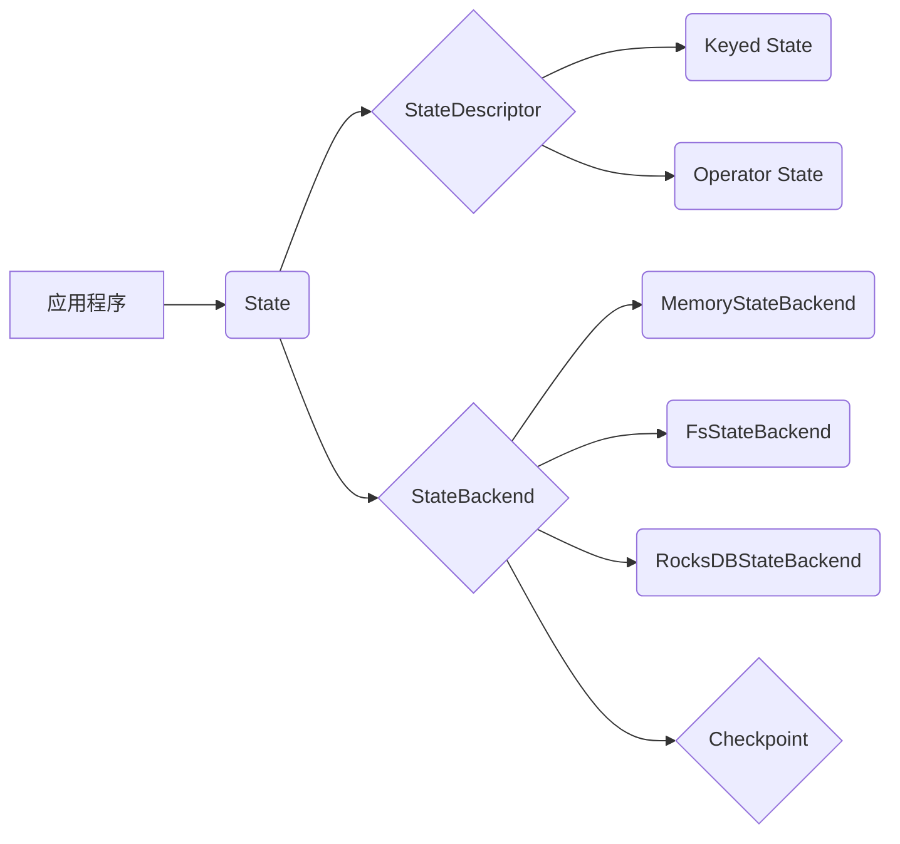

# Flink StateBackend原理与代码实例讲解

作者：禅与计算机程序设计艺术

## 1. 背景介绍

在当今大数据时代，实时流处理已经成为了许多企业和组织的关键需求。Apache Flink作为一个开源的分布式流处理框架，以其高吞吐、低延迟、容错性强等特点，在实时流处理领域得到了广泛的应用。状态管理作为流处理中的核心问题之一，直接影响着应用程序的正确性、一致性和容错性。Flink提供了灵活的状态管理机制，允许开发者根据实际需求选择不同的StateBackend来存储和管理应用程序的状态。

### 1.1 流处理中的状态管理

与传统的批处理不同，流处理应用程序需要持续不断地处理数据流，并在处理过程中维护和更新应用程序的状态。这些状态可以是简单的计数器，也可以是复杂的机器学习模型参数。高效的状态管理对于流处理应用程序至关重要，因为它直接影响着：

* **应用程序的正确性：**  状态的正确性决定了应用程序计算结果的准确性。
* **应用程序的一致性：**  在分布式环境下，如何保证状态的一致性是一个挑战。
* **应用程序的容错性：**  当节点发生故障时，如何保证状态不丢失，并能够快速恢复。

### 1.2 Flink StateBackend概述

Flink提供了三种不同的StateBackend来满足不同的应用场景：

* **MemoryStateBackend：**  将状态存储在内存中，速度最快，但不适用于大状态或需要高可用性的场景。
* **FsStateBackend：**  将状态存储在文件系统中，例如HDFS，速度较慢，但可以存储更大规模的状态，并提供一定的容错性。
* **RocksDBStateBackend：**  将状态存储在嵌入式的RocksDB数据库中，兼顾了性能和可扩展性，适用于大多数应用场景。

## 2. 核心概念与联系

在深入了解Flink StateBackend的原理之前，我们需要先了解一些核心概念：

### 2.1 State & StateDescriptor

* **State：** 指的是Flink应用程序在运行过程中需要维护和更新的数据，例如计数器、窗口聚合结果、机器学习模型参数等。
* **StateDescriptor：** 用于描述状态的名称、类型、序列化/反序列化方式等信息，用于创建和访问状态。

### 2.2 Keyed State & Operator State

* **Keyed State：** 与特定的Key相关联的状态，例如每个用户的点击次数。
* **Operator State：** 与算子实例相关联的状态，例如数据源读取的偏移量。

### 2.3 StateBackend & Checkpoint

* **StateBackend：** 定义了状态的存储方式和管理机制。
* **Checkpoint：** 定期将应用程序的状态异步持久化到外部存储中，用于故障恢复。

### 2.4 核心概念联系

下图展示了Flink StateBackend中各个核心概念之间的联系：



## 3. 核心算法原理具体操作步骤

### 3.1 MemoryStateBackend

MemoryStateBackend将状态存储在TaskManager的内存中，是最简单的StateBackend实现。当执行checkpoint时，会将状态数据复制到JobManager的内存中。

**优点：**

* 速度最快，因为所有状态操作都在内存中完成。

**缺点：**

* 状态大小受限于TaskManager的内存大小。
* 不支持高可用性，当TaskManager或JobManager失败时，状态会丢失。

**操作步骤：**

1. 配置MemoryStateBackend：

```java
env.setStateBackend(new MemoryStateBackend());
```

2. 使用StateDescriptor创建状态：

```java
ValueStateDescriptor<Long> stateDescriptor = new ValueStateDescriptor<>(
    "myState", // 状态名称
    Long.class  // 状态类型
);
```

3. 获取状态句柄：

```java
ValueState<Long> state = context.getState(stateDescriptor);
```

4. 更新状态：

```java
state.update(newState);
```

### 3.2 FsStateBackend

FsStateBackend将状态存储在文件系统中，例如HDFS。当执行checkpoint时，会将状态数据写入到文件系统中。

**优点：**

* 可以存储更大规模的状态。
* 提供一定的容错性，当TaskManager失败时，可以从文件系统中恢复状态。

**缺点：**

* 速度较慢，因为状态操作需要进行磁盘IO。
* 不支持增量checkpoint，每次checkpoint都需要将所有状态数据写入文件系统。

**操作步骤：**

1. 配置FsStateBackend：

```java
env.setStateBackend(new FsStateBackend("/path/to/checkpoint"));
```

2. 使用StateDescriptor创建状态：

```java
ValueStateDescriptor<Long> stateDescriptor = new ValueStateDescriptor<>(
    "myState", // 状态名称
    Long.class  // 状态类型
);
```

3. 获取状态句柄：

```java
ValueState<Long> state = context.getState(stateDescriptor);
```

4. 更新状态：

```java
state.update(newState);
```

### 3.3 RocksDBStateBackend

RocksDBStateBackend将状态存储在嵌入式的RocksDB数据库中。RocksDB是一个高性能的键值存储引擎，支持快速读写和增量checkpoint。

**优点：**

* 兼顾了性能和可扩展性。
* 支持增量checkpoint，可以减少checkpoint的时间和存储空间。

**缺点：**

* 配置和管理比其他StateBackend复杂一些。

**操作步骤：**

1. 配置RocksDBStateBackend：

```java
RocksDBStateBackend backend = new RocksDBStateBackend(
    "file:///path/to/checkpoint", // checkpoint目录
    true                            // 是否启用增量checkpoint
);
env.setStateBackend(backend);
```

2. 使用StateDescriptor创建状态：

```java
ValueStateDescriptor<Long> stateDescriptor = new ValueStateDescriptor<>(
    "myState", // 状态名称
    Long.class  // 状态类型
);
```

3. 获取状态句柄：

```java
ValueState<Long> state = context.getState(stateDescriptor);
```

4. 更新状态：

```java
state.update(newState);
```

## 4. 数学模型和公式详细讲解举例说明

Flink StateBackend的容错机制依赖于checkpoint机制。checkpoint机制的核心思想是定期将应用程序的状态异步持久化到外部存储中，以便在发生故障时能够从checkpoint点恢复应用程序的状态。

### 4.1 Checkpoint算法

Flink使用Chandy-Lamport算法来实现分布式checkpoint。该算法的核心思想是在应用程序中插入特殊的“标记”消息，并利用这些标记消息来协调不同节点上的checkpoint过程。

**算法步骤：**

1. **初始化：** JobManager选择一个checkpoint coordinator节点，并向所有TaskManager发送“触发checkpoint”消息。
2. **传播标记：** 每个TaskManager收到“触发checkpoint”消息后，会将当前状态写入到本地存储中，并将“标记”消息广播到所有下游TaskManager。
3. **状态收集：** 当一个TaskManager收到来自所有上游TaskManager的“标记”消息后，表示它已经处理完所有来自上游的数据，可以开始将本地状态异步上传到外部存储中。
4. **checkpoint完成：** 当checkpoint coordinator节点收到所有TaskManager的“checkpoint完成”消息后，表示checkpoint过程完成。

### 4.2 Checkpoint恢复

当应用程序发生故障时，Flink会从最近一次成功的checkpoint点恢复应用程序的状态。

**恢复步骤：**

1. **选择checkpoint点：** JobManager选择最近一次成功的checkpoint点。
2. **状态加载：** TaskManager从外部存储中加载checkpoint点对应的状态数据。
3. **状态恢复：** TaskManager将加载的状态数据应用到应用程序中，并从checkpoint点开始继续处理数据。

## 5. 项目实践：代码实例和详细解释说明

### 5.1 WordCount示例

下面我们以经典的WordCount示例来说明如何使用Flink StateBackend。

**需求：** 统计实时数据流中每个单词出现的次数。

**代码实现：**

```java
import org.apache.flink.api.common.functions.FlatMapFunction;
import org.apache.flink.api.common.functions.ReduceFunction;
import org.apache.flink.api.java.tuple.Tuple2;
import org.apache.flink.streaming.api.datastream.DataStream;
import org.apache.flink.streaming.api.environment.StreamExecutionEnvironment;
import org.apache.flink.streaming.api.windowing.time.Time;
import org.apache.flink.util.Collector;

public class WordCount {

    public static void main(String[] args) throws Exception {
        // 创建执行环境
        StreamExecutionEnvironment env = StreamExecutionEnvironment.getExecutionEnvironment();

        // 设置StateBackend
        env.setStateBackend(new FsStateBackend("file:///path/to/checkpoint"));

        // 创建数据源
        DataStream<String> text = env.socketTextStream("localhost", 9999, "\n");

        // 处理数据
        DataStream<Tuple2<String, Integer>> counts = text
                .flatMap(new Tokenizer())
                .keyBy(0)
                .timeWindow(Time.seconds(5))
                .reduce(new WordCountReducer());

        // 打印结果
        counts.print();

        // 执行程序
        env.execute("WordCount");
    }

    // 分词函数
    public static class Tokenizer implements FlatMapFunction<String, Tuple2<String, Integer>> {
        @Override
        public void flatMap(String value, Collector<Tuple2<String, Integer>> out) {
            for (String word : value.split("\\s+")) {
                out.collect(new Tuple2<>(word, 1));
            }
        }
    }

    // 单词计数函数
    public static class WordCountReducer implements ReduceFunction<Tuple2<String, Integer>> {
        @Override
        public Tuple2<String, Integer> reduce(Tuple2<String, Integer> a, Tuple2<String, Integer> b) {
            return new Tuple2<>(a.f0, a.f1 + b.f1);
        }
    }
}
```

**代码解释：**

1. 首先，我们创建了一个FsStateBackend，并将checkpoint目录设置为"file:///path/to/checkpoint"。
2. 然后，我们创建了一个socketTextStream作为数据源，并使用flatMap函数将每行文本分割成单词。
3. 接着，我们使用keyBy函数按照单词进行分组，并使用timeWindow函数创建5秒钟的滚动窗口。
4. 在每个窗口内，我们使用reduce函数对单词进行计数。
5. 最后，我们使用print函数将结果打印到控制台。

### 5.2 代码关键点解释

* **StateBackend配置：**  我们使用`env.setStateBackend()`方法来配置StateBackend。
* **状态创建：**  我们没有显式地创建状态，而是使用Flink内置的窗口机制来管理状态。
* **状态更新：**  Flink会自动在窗口结束时更新状态。
* **checkpoint机制：**  Flink会定期执行checkpoint，并将状态数据写入到文件