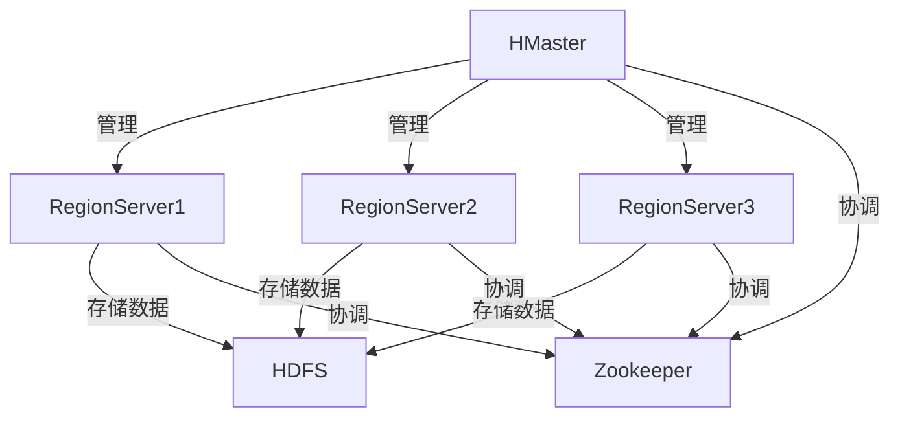

# HBase原理与代码实例讲解

作者：禅与计算机程序设计艺术

## 1. 背景介绍

### 1.1 大数据时代的挑战

在大数据时代，数据量的爆炸式增长对传统的关系型数据库提出了巨大的挑战。传统的关系型数据库在处理海量数据、高并发读写请求时，往往会遇到性能瓶颈。为了应对这些挑战，NoSQL数据库应运而生，其中HBase作为一种分布式、可扩展的NoSQL数据库，因其高效的读写性能和良好的扩展性，逐渐成为大数据处理领域的重要工具。

### 1.2 HBase简介

HBase是一个基于Hadoop的分布式、可扩展的NoSQL数据库，提供了对大规模数据的随机读写访问能力。它是一个列式存储的数据库，适用于存储和管理非结构化和半结构化的数据。HBase的设计灵感来自Google的Bigtable，旨在处理大规模数据存储和查询需求。

### 1.3 HBase的应用场景

HBase在很多大数据应用场景中得到了广泛应用，例如：
- **实时数据分析**：HBase可以处理高吞吐量的实时数据写入和查询，适用于实时数据分析和处理。
- **日志数据存储**：HBase可以高效地存储和查询大量的日志数据，适用于日志分析和监控系统。
- **推荐系统**：HBase可以存储和处理用户行为数据，支持实时推荐和个性化服务。

## 2. 核心概念与联系

### 2.1 表和行

HBase中的数据存储在表（Table）中，每个表由行（Row）组成。每行有一个唯一的行键（Row Key），用于标识该行的数据。行键是HBase中数据存储和检索的基础。

### 2.2 列族和列

HBase中的表由列族（Column Family）和列（Column）组成。列族是列的逻辑分组，每个列族包含一个或多个列。列族在表定义时确定，而列则可以动态添加。列族的设计对性能有重要影响，因为HBase的数据存储是以列族为单位进行的。

### 2.3 时间戳

每个单元格（Cell）在存储数据时会带有一个时间戳（Timestamp），用于标识数据的版本。HBase支持对同一单元格存储多个版本的数据，通过时间戳可以实现数据的历史版本管理。

### 2.4 HBase架构

HBase的架构包括以下几个核心组件：
- **HMaster**：负责管理HBase集群的元数据和负载均衡。
- **RegionServer**：负责存储和管理HBase表中的数据。
- **Zookeeper**：用于协调HBase集群中的节点，提供分布式锁和元数据管理。

以下是HBase架构的Mermaid流程图：



## 3. 核心算法原理具体操作步骤

### 3.1 数据写入流程

数据写入HBase的流程如下：
1. **客户端写请求**：客户端向RegionServer发送写请求。
2. **MemStore缓存**：RegionServer将数据写入MemStore（内存存储）。
3. **WAL日志**：同时，数据会被写入WAL（Write-Ahead Log）日志，以保证数据的持久性。
4. **数据刷盘**：当MemStore达到一定大小时，数据会被刷写到HFile（HBase文件）中，存储在HDFS上。

### 3.2 数据读取流程

数据读取HBase的流程如下：
1. **客户端读请求**：客户端向RegionServer发送读请求。
2. **MemStore查询**：RegionServer首先在MemStore中查找数据。
3. **HFile查询**：如果MemStore中没有找到数据，RegionServer会在HFile中查找数据。
4. **数据返回**：找到数据后，RegionServer将数据返回给客户端。

### 3.3 Region分裂与合并

HBase中的表是由多个Region组成的，每个Region存储表的一部分数据。当Region的数据量达到一定阈值时，会触发Region分裂，将数据分成两个新的Region。Region分裂可以提高数据访问的并发性和性能。当数据量减少时，HBase也支持Region的合并操作，以减少资源占用。

## 4. 数学模型和公式详细讲解举例说明

### 4.1 数据分布模型

HBase的数据分布模型基于行键（Row Key）的哈希值。行键通过哈希函数映射到不同的Region中，以实现数据的均匀分布。假设行键的哈希函数为 $H(k)$，则行键 $k$ 被映射到Region的公式为：

$$
Region = H(k) \mod N
$$

其中，$N$ 是Region的数量。

### 4.2 读写性能模型

HBase的读写性能受多个因素影响，包括MemStore的大小、WAL日志的写入速度、HFile的存储结构等。假设MemStore的大小为 $M$，WAL日志的写入速度为 $W$，HFile的存储结构为 $F$，则HBase的写入性能可以表示为：

$$
Write Performance = f(M, W, F)
$$

其中，$f$ 是一个综合函数，表示MemStore、WAL日志和HFile对写入性能的综合影响。

### 4.3 数据版本管理模型

HBase支持对同一单元格存储多个版本的数据，每个版本的数据带有一个时间戳 $T$。假设单元格的数据为 $D$，时间戳为 $T$，则单元格的数据版本管理模型可以表示为：

$$
D = \{(T_1, V_1), (T_2, V_2), \ldots, (T_n, V_n)\}
$$

其中，$T_i$ 是时间戳，$V_i$ 是对应时间戳的数据值。

## 5. 项目实践：代码实例和详细解释说明

### 5.1 环境搭建

在进行HBase项目实践之前，我们需要搭建HBase的运行环境。以下是搭建HBase环境的步骤：

1. **下载HBase**：从HBase官方网站下载HBase的安装包。
2. **解压安装包**：将下载的安装包解压到指定目录。
3. **配置HBase**：修改HBase的配置文件 `hbase-site.xml`，设置HBase的相关参数。
4. **启动HBase**：运行HBase的启动脚本，启动HBase服务。

### 5.2 创建表和插入数据

以下是使用Java API创建HBase表和插入数据的示例代码：

```java
import org.apache.hadoop.hbase.HBaseConfiguration;
import org.apache.hadoop.hbase.client.Connection;
import org.apache.hadoop.hbase.client.ConnectionFactory;
import org.apache.hadoop.hbase.client.Table;
import org.apache.hadoop.hbase.client.Put;
import org.apache.hadoop.hbase.client.Admin;
import org.apache.hadoop.hbase.TableName;
import org.apache.hadoop.hbase.HTableDescriptor;
import org.apache.hadoop.hbase.HColumnDescriptor;

public class HBaseExample {
    public static void main(String[] args) throws Exception {
        // 创建HBase配置
        org.apache.hadoop.conf.Configuration config = HBaseConfiguration.create();

        // 创建HBase连接
        Connection connection = ConnectionFactory.createConnection(config);

        // 创建HBase管理员
        Admin admin = connection.getAdmin();

        // 创建表描述符
        HTableDescriptor tableDescriptor = new HTableDescriptor(TableName.valueOf("my_table"));
        tableDescriptor.addFamily(new HColumnDescriptor("my_family"));

        // 创建表
        if (!admin.tableExists(tableDescriptor.getTableName())) {
            admin.createTable(tableDescriptor);
        }

        // 获取表
        Table table = connection.getTable(TableName.valueOf("my_table"));

        // 创建数据
        Put put = new Put("row1".getBytes());
        put.addColumn("my_family".getBytes(), "my_column".getBytes(), "my_value".getBytes());

        // 插入数据
        table.put(put);

        // 关闭资源
        table.close();
        connection.close();
    }
}
```

### 5.3 查询数据

以下是使用Java API查询HBase数据的示例代码：

```java
import org.apache.hadoop.hbase.HBaseConfiguration;
import org.apache.hadoop.hbase.client.Connection;
import org