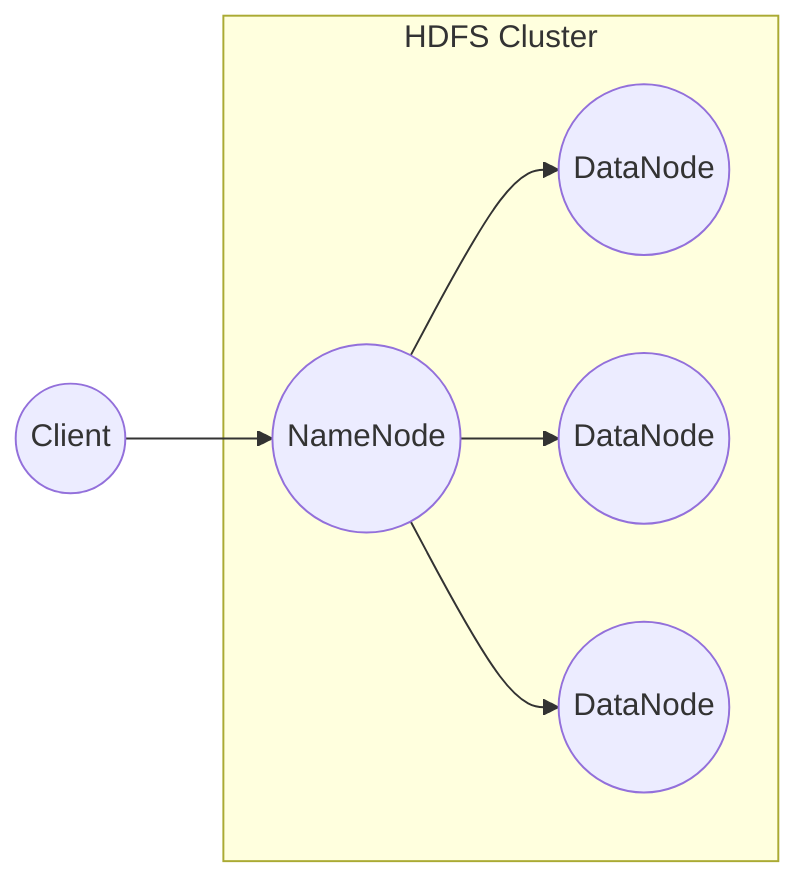

# HDFS原理与代码实例讲解

作者：禅与计算机程序设计艺术

## 1. 背景介绍

### 1.1 大数据时代的存储挑战

随着互联网和移动互联网的快速发展，全球数据量呈现爆炸式增长，传统的存储系统已经无法满足海量数据的存储需求。主要挑战包括：

* **数据量巨大:**  PB级甚至EB级的数据量对存储系统的容量提出了极高的要求。
* **数据类型多样化:**  除了传统的结构化数据，还包括大量的半结构化和非结构化数据，如文本、图片、视频等。
* **高并发读写需求:**  大数据应用通常需要对数据进行高并发的读写操作。
* **数据可靠性和可用性:**  海量数据的存储需要保证数据的可靠性和可用性，避免数据丢失或服务中断。

### 1.2 分布式文件系统应运而生

为了应对大数据时代的存储挑战，分布式文件系统应运而生。与传统的集中式存储系统相比，分布式文件系统具有以下优势：

* **高容量、高扩展性:** 通过将数据分布存储在多台服务器上，可以轻松扩展存储容量和性能。
* **高可用性:**  数据冗余存储，即使部分服务器出现故障，也不会影响数据访问。
* **高容错性:**  系统能够自动检测和处理节点故障，保证数据的一致性和完整性。
* **易于管理:**  提供统一的命名空间和访问接口，简化数据管理。

### 1.3 HDFS: Hadoop生态系统的基石

HDFS (Hadoop Distributed File System) 是 Apache Hadoop 生态系统中的一个分布式文件系统，用于存储海量数据。它具有高容错性、高吞吐量、高扩展性等特点，是大数据存储的理想选择。

## 2. 核心概念与联系

### 2.1 HDFS架构

HDFS 采用 Master/Slave 架构，主要由 NameNode、DataNode 和 Client 三部分组成：

* **NameNode:**  集群的主节点，负责管理文件系统的命名空间、数据块的映射关系以及 DataNode 的状态信息。
* **DataNode:**  集群的从节点，负责存储实际的数据块，并根据 Client 或 NameNode 的指令执行读写操作。
* **Client:**  访问 HDFS 的客户端，可以是用户应用程序或其他 Hadoop 组件。



### 2.2 数据组织方式

HDFS 将文件存储为数据块(block)，每个数据块默认大小为 128MB。文件被分割成多个数据块后，分别存储在不同的 DataNode 上，并进行冗余备份，以保证数据可靠性。

### 2.3 核心概念

* **命名空间(Namespace):** HDFS 支持层次化的文件目录结构，类似于 Linux 文件系统。
* **数据块(Block):** 文件被分割成的基本存储单元，默认大小为 128MB。
* **副本(Replica):**  每个数据块在集群中存储多个副本，默认副本数为 3。
* **机架感知(Rack Awareness):** HDFS 会尽量将数据块的副本存储在不同的机架上，以提高数据可靠性和访问性能。
* **心跳机制(Heartbeat):** DataNode 定期向 NameNode 发送心跳信息，报告自身状态，NameNode 通过心跳机制监控 DataNode 的健康状况。

## 3. 核心算法原理具体操作步骤

### 3.1 文件写入流程

1. **客户端向 NameNode 请求写入文件。**
2. **NameNode 检查文件是否存在，如果文件不存在，则创建文件元数据，并为文件分配数据块。**
3. **NameNode 返回数据块存放的 DataNode 列表给客户端。**
4. **客户端将数据写入 DataNode。** 数据写入采用管道(pipeline)的方式，数据先写入第一个 DataNode，然后复制到第二个 DataNode，最后复制到第三个 DataNode。
5. **数据写入完成后，客户端向 NameNode 发送文件关闭请求。**
6. **NameNode 收到文件关闭请求后，更新文件元数据，并将文件状态改为“已关闭”。**

### 3.2 文件读取流程

1. **客户端向 NameNode 请求读取文件。**
2. **NameNode 返回文件的数据块列表和存放 DataNode 的信息给客户端。**
3. **客户端根据 DataNode 信息，选择距离最近的 DataNode 读取数据块。**
4. **客户端读取完所有数据块后，合并数据并返回给用户。**

### 3.3 数据块副本管理

HDFS 采用机架感知策略进行数据块副本放置，以最大程度地保证数据可靠性和访问性能。

* **第一个副本:**  放置在客户端所在的机架上的 DataNode 上。
* **第二个副本:**  放置在与第一个副本不同的机架上的 DataNode 上。
* **第三个副本:**  放置在与第二个副本相同的机架上的 DataNode 上。

当 DataNode 出现故障时，NameNode 会根据副本放置策略选择新的 DataNode 重新复制数据块，以保证数据块的副本数始终满足配置要求。

## 4. 数学模型和公式详细讲解举例说明

HDFS 中没有复杂的数学模型和公式，主要涉及一些数据存储和访问的计算，例如：

* **数据块大小计算:**  根据文件大小和数据块大小计算文件占用的数据块数量。
* **副本数量计算:**  根据配置的副本数量和数据块数量计算总的副本数量。
* **数据块放置计算:**  根据机架感知策略计算数据块副本的放置位置。
* **数据读写带宽计算:**  根据网络带宽、磁盘读写速度等因素计算数据读写带宽。

## 5. 项目实践：代码实例和详细解释说明

### 5.1 Java API 操作 HDFS

```java
import org.apache.hadoop.conf.Configuration;
import org.apache.hadoop.fs.FileSystem;
import org.apache.hadoop.fs.Path;

import java.io.IOException;

public class HdfsDemo {

    public static void main(String[] args) throws IOException {

        // 创建 HDFS 文件系统的配置信息
        Configuration conf = new Configuration();
        conf.set("fs.defaultFS", "hdfs://namenode:9000");

        // 创建 HDFS 文件系统对象
        FileSystem fs = FileSystem.get(conf);

        // 创建 HDFS 文件路径
        Path filePath = new Path("/user/hadoop/test.txt");

        // 判断文件是否存在
        if (fs.exists(filePath)) {
            System.out.println("文件已存在");
        } else {
            // 创建文件
            fs.createNewFile(filePath);
            System.out.println("文件创建成功");
        }

        // 关闭 HDFS 文件系统
        fs.close();
    }
}
```

### 5.2 代码解释

* 首先，需要创建一个 `Configuration` 对象，用于配置 HDFS 文件系统的地址和其他参数。
* 然后，使用 `FileSystem.get(conf)` 方法获取 `FileSystem` 对象，该对象表示 HDFS 文件系统。
* 创建 `Path` 对象，表示要操作的 HDFS 文件路径。
* 使用 `fs.exists(filePath)` 方法判断文件是否存在。
* 如果文件不存在，可以使用 `fs.createNewFile(filePath)` 方法创建文件。
* 最后，使用 `fs.close()` 方法关闭 HDFS 文件系统。

## 6. 实际应用场景

### 6.1 数据存储

* **存储海量日志数据:**  例如，网站访问日志、应用程序日志等。
* **存储电子商务数据:**  例如，商品信息、用户信息、订单信息等。
* **存储社交网络数据:**  例如，用户信息、好友关系、发布内容等。
* **存储科学计算数据:**  例如，气象数据、基因数据、天文数据等。

### 6.2 数据分析

* **离线数据分析:**  使用 Hadoop 生态系统中的 MapReduce、Hive、Spark 等组件对 HDFS 中的数据进行离线分析。
* **实时数据分析:**  使用 Spark Streaming、Flink 等流式计算框架对 HDFS 中的数据进行实时分析。

## 7. 总结：未来发展趋势与挑战

### 7.1 未来发展趋势

* **更高性能、更低延迟:**  随着硬件技术的发展，HDFS 的性能和延迟将不断提升，以满足日益增长的数据存储和访问需求。
* **更智能化、更易用:**  HDFS 将集成更多智能化功能，例如自动数据分层、数据预处理等，以简化数据管理和分析工作。
* **与云计算深度融合:**  HDFS 将与云计算平台深度融合，提供更灵活、更便捷的数据存储和分析服务。

### 7.2 面临的挑战

* **数据安全和隐私保护:**  随着数据量的不断增长，数据安全和隐私保护问题日益突出，需要采取更有效的措施保障数据安全。
* **数据一致性和可靠性:**  在分布式环境下，保证数据的一致性和可靠性是一项挑战，需要不断优化 HDFS 的架构和算法。
* **与其他生态系统的兼容性:**  HDFS 需要与其他大数据生态系统保持良好的兼容性，以方便用户使用各种工具和框架进行数据分析。

## 8. 附录：常见问题与解答

### 8.1 HDFS 与本地文件系统的区别？

* **存储位置:**  HDFS 将数据存储在分布式集群中，而本地文件系统将数据存储在本地磁盘上。
* **数据可靠性:**  HDFS 通过数据冗余备份保证数据可靠性，而本地文件系统容易受到磁盘故障的影响。
* **数据访问方式:**  HDFS 提供统一的命名空间和访问接口，而本地文件系统需要通过网络访问其他节点上的数据。

### 8.2 HDFS 如何保证数据一致性？

HDFS 通过以下机制保证数据一致性：

* **数据块校验和:**  每个数据块都有一个校验和，用于验证数据块的完整性。
* **写操作日志:**  NameNode 会记录所有写操作日志，用于数据恢复。
* **数据块副本管理:**  HDFS 会自动维护数据块的副本数量，以保证数据可靠性。

### 8.3 如何选择合适的数据块大小？

选择合适的数据块大小需要考虑以下因素：

* **数据类型:**  对于小文件，可以选择较小的数据块大小，以减少存储空间浪费。
* **数据访问模式:**  如果数据访问以顺序读写为主，可以选择较大的数据块大小，以提高读写效率。
* **硬件配置:**  数据块大小应该与磁盘块大小和网络带宽相匹配，以获得最佳性能。


## 9. 结束语

HDFS 作为 Hadoop 生态系统的基石，在大数据存储和分析领域发挥着重要作用。随着大数据技术的不断发展，HDFS 也在不断进化，以满足日益增长的数据存储和分析需求。