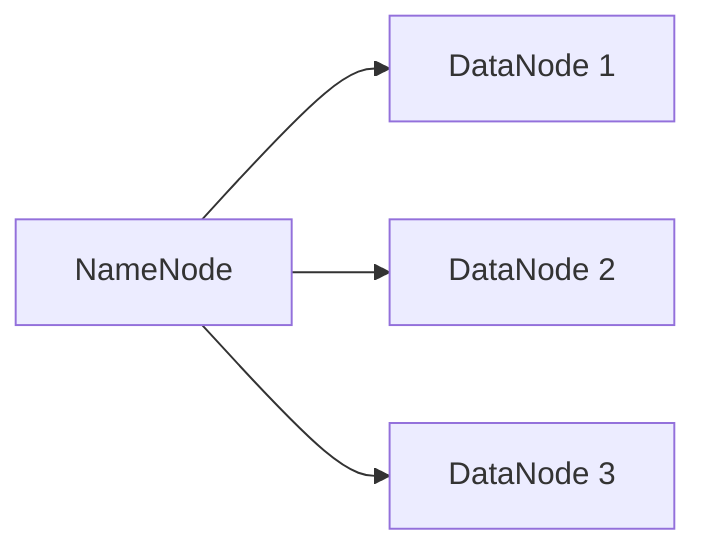
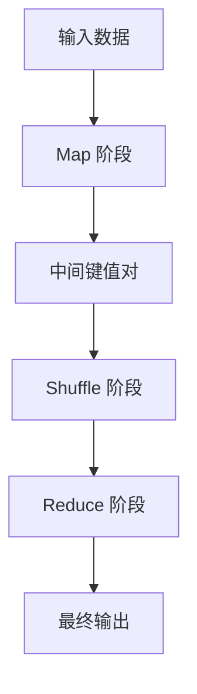
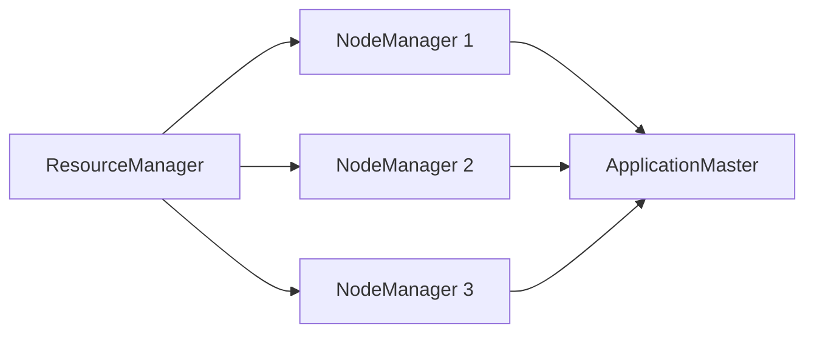
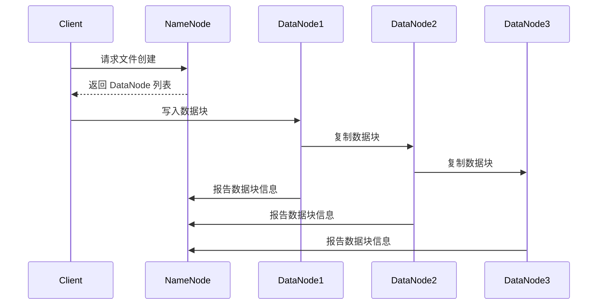
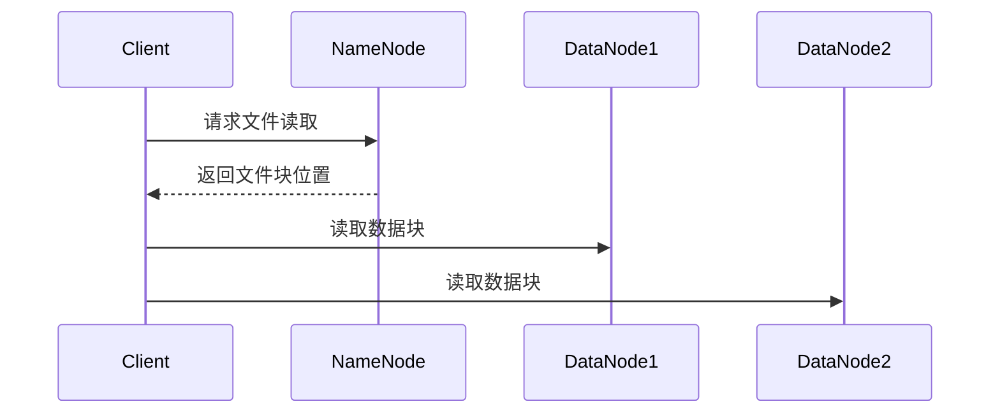

# Hadoop 原理与代码实例讲解

作者：禅与计算机程序设计艺术

## 1. 背景介绍

### 1.1 大数据时代的挑战

在当今数据驱动的世界中，数据的爆炸式增长给传统的数据处理系统带来了巨大的压力。传统的关系型数据库和数据仓库在处理大规模数据时，往往显得力不从心。数据的多样性、体量和速度（即所谓的3V特性：Volume, Variety, Velocity）使得新的数据处理框架应运而生。

### 1.2 Hadoop 的诞生

Hadoop 是由 Apache 软件基金会开发的开源框架，旨在解决大规模数据存储和处理的问题。它的核心由两个主要部分组成：Hadoop 分布式文件系统 (HDFS) 和 MapReduce 编程模型。HDFS 提供了高容错性和高吞吐量的数据存储，而 MapReduce 则用于并行处理大规模数据集。

### 1.3 Hadoop 的发展历程

Hadoop 的发展可以追溯到 Google 的三篇论文：《Google 文件系统》、《MapReduce：简化大规模数据处理》和《Bigtable：结构化数据的分布式存储系统》。这些论文奠定了 Hadoop 的理论基础。2006 年，Doug Cutting 和 Mike Cafarella 开始开发 Hadoop，并将其作为 Apache Nutch 项目的一部分。2008 年，Hadoop 成为 Apache 的顶级项目，并迅速在大数据领域获得广泛应用。

## 2. 核心概念与联系

### 2.1 Hadoop 分布式文件系统 (HDFS)

#### 2.1.1 HDFS 的架构

HDFS 是一个分布式文件系统，旨在以高吞吐量存储大规模数据。它采用主从架构，由一个 NameNode 和多个 DataNode 组成。

#### 2.1.2 NameNode 和 DataNode 的角色

- **NameNode**: 负责管理文件系统的元数据，如文件名、目录结构和文件块的位置。
- **DataNode**: 负责实际存储数据块，并定期向 NameNode 发送心跳信号和块报告。

### 2.2 MapReduce 编程模型

#### 2.2.1 MapReduce 的基本原理

MapReduce 是一种编程模型，用于处理大规模数据集。它分为两个阶段：Map 阶段和 Reduce 阶段。

- **Map 阶段**: 将输入数据拆分为一系列键值对，并对每个键值对应用用户定义的 Map 函数。
- **Reduce 阶段**: 将具有相同键的中间结果合并，生成最终输出。

#### 2.2.2 MapReduce 的执行流程

1. **输入分片**: 将输入数据拆分为多个分片，每个分片由一个 Map 任务处理。
2. **Map 任务**: 每个 Map 任务读取输入分片，生成中间键值对。
3. **Shuffle 和 Sort**: 将中间键值对按照键进行分组和排序。
4. **Reduce 任务**: 每个 Reduce 任务处理一个键的所有中间值，生成最终输出。

### 2.3 YARN (Yet Another Resource Negotiator)

YARN 是 Hadoop 2.x 引入的资源管理框架，旨在提高集群资源的利用率和调度效率。它将资源管理和任务调度分离，使得 Hadoop 能够运行多种类型的分布式计算框架。

#### 2.3.1 YARN 的架构

YARN 采用主从架构，由 ResourceManager、NodeManager 和 ApplicationMaster 组成。

#### 2.3.2 ResourceManager、NodeManager 和 ApplicationMaster 的角色

- **ResourceManager**: 负责全局资源管理和任务调度。
- **NodeManager**: 负责管理各个节点上的资源和任务执行。
- **ApplicationMaster**: 负责管理单个应用程序的生命周期，包括资源请求和任务调度。

## 3. 核心算法原理具体操作步骤

### 3.1 HDFS 的文件存储过程

#### 3.1.1 文件写入

1. 客户端向 NameNode 请求文件创建。
2. NameNode 检查文件是否存在，并返回 DataNode 列表。
3. 客户端将数据块写入 DataNode。
4. DataNode 将数据块复制到其他 DataNode。
5. DataNode 向 NameNode 报告数据块信息。

#### 3.1.2 文件读取

1. 客户端向 NameNode 请求文件读取。
2. NameNode 返回文件块的位置。
3. 客户端从 DataNode 读取数据块。

### 3.2 MapReduce 的执行过程

#### 3.2.1 Map 阶段

1. 输入数据拆分为多个分片。
2. 每个分片由一个 Map 任务处理。
3. Map 任务生成中间键值对。

#### 3.2.2 Shuffle 和 Sort 阶段

1. 将中间键值对按照键进行分组。
2. 对每个键的中间值进行排序。

#### 3.2.3 Reduce 阶段

1. 每个 Reduce 任务处理一个键的所有中间值。
2. 生成最终输出。

### 3.3 YARN 的资源调度过程

#### 3.3.1 资源请求

1. ApplicationMaster 向 ResourceManager 请求资源。
2. ResourceManager 分配资源给 ApplicationMaster。

#### 3.3.2 任务调度

1. ApplicationMaster 将任务分配给 NodeManager。
2. NodeManager 启动任务容器。

## 4. 数学模型和公式详细讲解举例说明

### 4.1 HDFS 的副本放置策略

HDFS 采用副本放置策略来提高数据的可靠性和读取效率。假设集群中有 $N$ 个节点，每个数据块有 $R$ 个副本，副本放置策略如下：

1. 第一个副本放置在写入数据的节点上。
2. 第二个副本放置在与第一个副本不同的机架上的节点上。
3. 第三个副本放置在与前两个副本不同的机架上的节点上。

这种策略确保了数据的高可用性和容错性。

### 4.2 MapReduce 的数据分区策略

MapReduce 采用数据分区策略来平衡任务负载。假设输入数据集有 $M$ 个分片，每个分片由一个 Map 任务处理，生成 $K$ 个中间键值对。中间键值对按照键进行分区，每个分区由一个 Reduce 任务处理。

$$
P_i = \{(k, v) | h(k) \mod R = i\}
$$

其中，$P_i$ 表示第 $i$ 个分区，$h(k)$ 是键 $k$ 的哈希值，$R$ 是 Reduce 任务的数量。

### 4.3 YARN 的资源分配模型

YARN 采用资源分配模型来优化集群资源的利用率。假设集群中有 $N$ 个