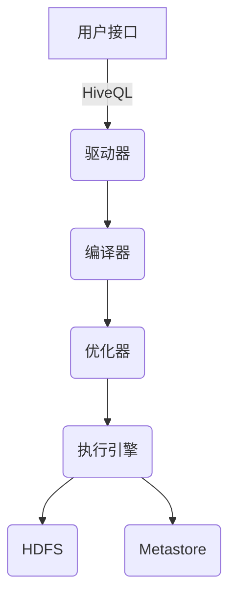
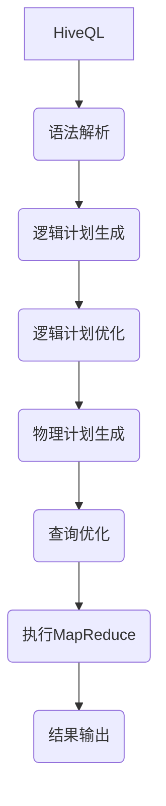

# Hive原理与代码实例讲解

## 1.背景介绍

Apache Hive是建立在Hadoop之上的数据仓库基础构件,它提供了一种类似SQL的查询语言HiveQL,使得熟悉SQL开发人员也能快速上手,能够使用声明式语言轻松地分析存储在Hadoop分布式文件系统(HDFS)中的海量数据。

Hive最初由Facebook开发,后来捐赠给Apache软件基金会。它为结构化的数据文件提供了读、写和管理等功能,并添加了查询语言、数据存储和执行引擎等组件,使得数据仓库工作能够在Hadoop上运行。Hive的设计目标是将结构化的数据文件映射为数据库表,并将SQL类的查询语句转换为MapReduce作业在Hadoop集群上执行。

### 1.1 Hive的优势

- **易用性**:Hive采用类SQL语法,可以方便地将结构化的数据文件映射为一张数据库表,并提供类SQL的查询语句HQL。
- **可扩展性**:Hive利用Hadoop的可扩展性,可以在大量廉价服务器集群上运行,存储大规模数据,查询性能可线性扩展。
- **容错性**:Hive基于Hadoop构建,可以利用Hadoop的容错机制,自动维护数据和计算的容错。
- **统一资源管理**:Hive与Hadoop集成,可以有效地组织管理分布在大规模集群上的计算资源。

### 1.2 Hive的应用场景

- **数据仓库**: Hive可以作为数据仓库软件使用,用于存储和查询海量数据。
- **ETL工具**: Hive可以作为ETL工具,提取数据、转换和加载数据到Hadoop中。
- **大数据分析**: Hive可以用于对存储在Hadoop中的大数据进行分析,如网页日志分析、基因数据分析等。

## 2.核心概念与联系  

### 2.1 Hive架构

Hive的架构主要由以下几个组件组成:

1. **用户接口(CLI/Web UI)**: 用户可以通过命令行(CLI)或Web UI向Hive提交HiveQL查询。
2. **驱动器(Driver)**: 驱动器负责将HiveQL查询语句转换为查询计划。
3. **编译器(Compiler)**: 编译器将查询计划转换为一系列的MapReduce任务。
4. **优化器(Optimizer)**: 优化器负责优化查询计划,以提高执行效率。
5. **执行引擎(Execution Engine)**: 执行引擎负责在Hadoop集群上执行MapReduce任务。
6. **元数据存储(Metastore)**: 元数据存储用于存储Hive中表、视图、分区等元数据信息。

下面是Hive的架构图:



### 2.2 Hive的数据模型

Hive中的数据模型与传统的关系型数据库类似,包括以下几个主要概念:

1. **数据库(Database)**: 与传统数据库类似,Hive中也有数据库的概念,用于存放相关的表。
2. **表(Table)**: 表是Hive中存储数据的核心概念,每个表对应于HDFS中的一个目录。
3. **分区(Partition)**: 分区是对表进行虚拟子目录划分,提高查询效率。
4. **桶(Bucket)**: 桶是对数据进行哈希取值,并将数据存储在同一个文件中,提高samplying的效率。

### 2.3 Hive与Hadoop的关系

Hive是建立在Hadoop之上的数据仓库工具,它依赖于Hadoop提供的HDFS存储和MapReduce计算框架。Hive将HiveQL查询语句转换为MapReduce任务,然后在Hadoop集群上执行。Hive利用了Hadoop的可扩展性和容错性,使得数据仓库工作可以在海量数据和大规模集群上高效运行。

## 3.核心算法原理具体操作步骤

### 3.1 Hive查询执行流程

当用户提交一个HiveQL查询时,Hive的执行流程如下:

1. **语法解析**: 驱动器(Driver)将HiveQL查询字符串解析为抽象语法树(AST)。
2. **逻辑计划生成**: 编译器(Compiler)根据AST生成初始的逻辑执行计划。
3. **逻辑计划优化**: 优化器(Optimizer)对逻辑执行计划进行一系列规则优化,如投影剪裁、分区剪裁等。
4. **物理计划生成**: 编译器根据优化后的逻辑计划生成物理执行计划。
5. **查询优化**: 优化器对物理执行计划进行一系列优化,如MapJoin、ReduceShuffle等。
6. **执行**: 执行引擎将优化后的物理计划转换为一个或多个MapReduce任务,并在Hadoop集群上执行。

下面是Hive查询执行流程的示意图:



### 3.2 MapReduce执行原理

Hive将查询任务转换为一个或多个MapReduce任务在Hadoop集群上执行。MapReduce是Hadoop的核心计算模型,它将任务分为Map阶段和Reduce阶段。

1. **Map阶段**:
   - 输入数据被划分为多个数据块(Split)
   - 每个Split由一个Map Task处理
   - Map Task读取输入数据,执行用户定义的Map函数,生成键值对
   - Map输出结果会进行分区(Partition)和排序(Sort)

2. **Reduce阶段**:
   - Reduce Task从Map输出结果中获取相同Key的值
   - 对每个Key,Reduce Task执行用户定义的Reduce函数
   - Reduce输出最终结果写入HDFS

下面是MapReduce执行流程的示意图:


在Hive中,大多数查询任务都可以转换为一个或多个MapReduce Job。例如,SELECT查询通常可以转换为一个MapReduce Job,JOIN查询则可能需要多个MapReduce Job。

## 4.数学模型和公式详细讲解举例说明

在Hive中,有一些常用的数学模型和公式,用于优化查询执行和数据处理。

### 4.1 MapReduce成本模型

MapReduce成本模型是用于估计MapReduce任务执行成本的数学模型,它考虑了输入数据大小、Map数量、Reduce数量等因素。

MapReduce成本模型的公式如下:

$$
Cost = C_M \times \sum_{map}size(map\_input) + C_R \times \sum_{reduce}size(reduce\_input) + C_R \times size(result)
$$

其中:

- $C_M$是Map成本常数
- $C_R$是Reduce成本常数
- $size(map\_input)$是每个Map任务的输入数据大小
- $size(reduce\_input)$是每个Reduce任务的输入数据大小
- $size(result)$是最终结果的大小

Hive会根据这个成本模型,选择最优的执行计划。

### 4.2 MapJoin算法

MapJoin是Hive中优化JOIN操作的一种算法,它将较小的表加载到内存中,避免了Reduce阶段的数据传输和排序。

MapJoin算法的步骤如下:

1. 将较小的表加载到内存中构建哈希表
2. 扫描较大的表,根据JOIN键在哈希表中查找匹配项
3. 输出匹配结果,无需Reduce阶段

MapJoin算法的优点是避免了Reduce阶段的开销,但缺点是内存消耗较大。

### 4.3 采样算法

在处理大规模数据时,采样是一种常用的技术,它可以从大量数据中抽取一小部分数据进行分析,从而提高查询效率。

Hive中常用的采样算法包括:

1. **随机采样**:从数据集中随机选取一部分数据,公式如下:

$$
P(x) = \frac{1}{N}
$$

其中$N$是数据集大小,$P(x)$是抽取任意一条记录的概率。

2. **分桶采样**:将数据划分为多个桶,然后随机选取部分桶进行采样,公式如下:

$$
P(x) = \frac{n}{N}
$$

其中$N$是桶的总数,$n$是选取的桶数,$P(x)$是任意一条记录被抽取的概率。

采样算法可以有效减少数据量,提高查询效率,但需要注意采样结果的准确性和代表性。

## 4.项目实践:代码实例和详细解释说明

在本节中,我们将通过实际代码示例来演示Hive的使用方法。

### 4.1 创建数据库和表

首先,我们创建一个名为`mydb`的数据库,然后在该数据库中创建一个名为`employees`的表。

```sql
-- 创建数据库
CREATE DATABASE IF NOT EXISTS mydb;

-- 使用数据库
USE mydb;

-- 创建表
CREATE TABLE employees (
  emp_id INT,
  emp_name STRING,
  emp_dept STRING,
  emp_salary DOUBLE
)
ROW FORMAT DELIMITED
FIELDS TERMINATED BY ',';
```

上面的代码首先创建了一个名为`mydb`的数据库,然后在该数据库中创建了一个名为`employees`的表。`employees`表包含四个列:`emp_id`(员工ID)、`emp_name`(员工姓名)、`emp_dept`(员工部门)和`emp_salary`(员工薪资)。

`ROW FORMAT DELIMITED FIELDS TERMINATED BY ','`语句指定了表的数据格式,即每行数据由逗号分隔。

### 4.2 加载数据

接下来,我们将一些数据加载到`employees`表中。假设我们有一个名为`employees.txt`的文本文件,其中包含员工数据,每行代表一条记录,字段由逗号分隔。

```
1,John Doe,Sales,50000.0
2,Jane Smith,Marketing,60000.0
3,Bob Johnson,Engineering,70000.0
4,Alice Williams,HR,55000.0
5,Tom Davis,Sales,52000.0
```

我们可以使用以下命令将数据加载到`employees`表中:

```sql
LOAD DATA LOCAL INPATH '/path/to/employees.txt' 
OVERWRITE INTO TABLE employees;
```

`LOAD DATA LOCAL INPATH`语句指定了要加载的本地文件路径,`OVERWRITE INTO TABLE`语句指定了要加载数据的目标表。

### 4.3 查询数据

加载数据后,我们可以使用HiveQL查询语句来查询和分析数据。

```sql
-- 查询所有员工信息
SELECT * FROM employees;

-- 查询工资大于60000的员工
SELECT emp_name, emp_salary 
FROM employees
WHERE emp_salary > 60000;

-- 按部门分组,统计每个部门的员工数量
SELECT emp_dept, COUNT(*) AS emp_count
FROM employees
GROUP BY emp_dept;
```

上面的代码展示了几个常见的查询操作,包括:

1. 查询所有员工信息
2. 查询工资大于60000的员工姓名和薪资
3. 按部门分组,统计每个部门的员工数量

### 4.4 分区和桶

Hive支持对表进行分区和桶操作,以提高查询效率。

```sql
-- 按部门分区
ALTER TABLE employees ADD PARTITION (emp_dept='Sales') 
LOCATION '/path/to/sales_data';

ALTER TABLE employees ADD PARTITION (emp_dept='Marketing')
LOCATION '/path/to/marketing_data';

-- 创建桶表
CREATE TABLE employees_bucketed (
  emp_id INT,
  emp_name STRING,
  emp_dept STRING,
  emp_salary DOUBLE
)
CLUSTERED BY (emp_dept) 
INTO 4 BUCKETS;

INSERT OVERWRITE TABLE employees_bucketed
SELECT * FROM employees;
```

上面的代码首先按`emp_dept`列对`employees`表进行分区,将不同部门的数据存储在不同的路径下。然后,它创建了一个名为`employees_bucketed`的桶表,按`emp_dept`列进行哈希分桶,将数据划分为4个桶。最后,它将`employees`表中的数据插入到`employees_bucketed`桶表中。

分区和桶操作可以提高查询效率,因为Hive在执行查询时只需要扫