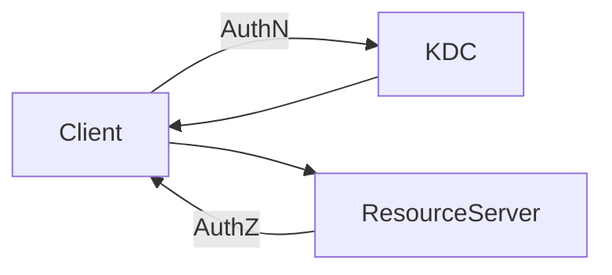
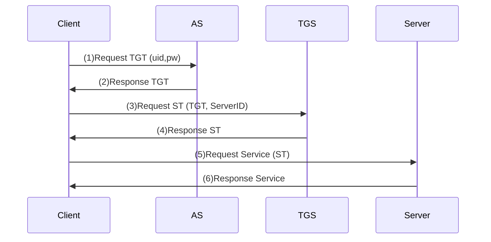

# Kerberos原理与代码实例讲解

作者：禅与计算机程序设计艺术

## 1. 背景介绍

### 1.1 认证与授权的重要性
在当今高度互联的计算机网络世界中,系统与服务的安全性至关重要。其中,用户身份认证和授权访问控制是两个最基本也是最关键的安全机制。没有可靠的身份认证,系统无法确定访问者的真实身份;而缺乏有效的授权机制,则可能导致未经授权的访问泄露敏感信息或破坏系统。

### 1.2 分布式环境下的安全挑战
传统的单机系统中,身份认证相对简单,通常通过用户名密码或其他本地验证手段即可实现。而在分布式系统环境下,由于涉及多个物理节点,每个节点都需要验证访问者身份并授权访问,  这就带来了新的安全挑战:
1. 不安全的网络环境,认证信息在节点间传输可能被窃听篡改
2. 单点登录,用户需要频繁地在不同节点进行身份认证,影响使用体验
3. 不同节点各自采用不同的身份认证机制,无法打通形成统一的安全体系

### 1.3 Kerberos的诞生
为了解决这些分布式环境下的安全难题,麻省理工学院(MIT)在上世纪80年代设计并实现了Kerberos认证协议。Kerberos采用对称密钥加密技术,通过引入一个集中的密钥分发中心(KDC),使得分布式节点之间能够安全地进行身份认证,实现单点登录,并提供授权机制。Kerberos已经成为一个广泛使用的企业级安全认证与授权解决方案。

## 2. 核心概念与联系

### 2.1 Ticket 票据
Ticket是Kerberos体系中一个非常核心的概念。本质上, Ticket是一个经过KDC签名加密的数据结构,内含客户端身份,目标服务器,有效期等信息。客户端持有Ticket 向服务器发起请求,服务器验证Ticket有效性后提供服务,从而实现身份认证。

### 2.2 symmetric key & key distribution 对称密钥与密钥分发
Kerberos采用对称加密算法(如AES)来加密网络传输和签名Ticket。在对称加密中,通信双方共享同一个 secret key 用于加密解密,而生成和分发密钥的任务则由Key Distribution Center (KDC)来完成。

### 2.3 KDC: AS & TGS
Key Distribution Center由两个服务组成:
- Authentication Service(AS):   
  AS负责验证用户身份并下发 Ticket Granting Ticket(TGT),用户后继可使用TGT请求访问具体服务的 Service Ticket。
- Ticket Granting Service(TGS):
  TGS负责签发用于访问具体服务器的Service Ticket。用户需出示有效的TGT才能申请Service Ticket。

## 3. 核心架构与协议流程

### 3.1 总体架构


Kerberos涉及三类实体:
1. Client : 需要访问资源或服务的客户端
2. KDC : 负责密钥管理与分发、颁发Ticket的可信任第三方
3. Resource Server : 提供受保护资源或服务访问的服务器

### 3.2 协议交互流程


Kerberos认证与授权访问主要包含以下6个步骤:
1. Client 向 AS 请求TGT,提供自身uid和pw
2. AS 验证uid/pw,返回加密的TGT
3. Client携带TGT向TGS申请访问特定Server的Service Ticket
4. TGS验证TGT有效性,返回加密的Service Ticket
5. Client携带Service Ticket向Server发起服务请求
6. Server验证Service Ticket,提供相应服务访问

## 4. 数学原理

### 4.1 对称加密算法 
Kerberos中的数据加密签名主要采用对称加密算法,即加密和解密使用相同的密钥 $K$,典型算法如DES、3DES、AES等。对称加密的基本过程可表示为:     
加密: $C = E_K(M)$     
解密: $M = D_K(C)$   
其中, $M$为明文, $C$为密文, $E$ 为加密算法, $D$为解密算法, 通常 $D$ 就是 $E$的逆过程。

### 4.2 Ticket生成与验证
以Service Ticket为例,其生成与验证过程涉及以下步骤:
1. TGS生成一个随机的Session Key $SK$
2. TGS生成Service Ticket $ST$,典型结构为: 
$$ST=E_{SK}\{ \text{uid}, \text{addr}, \text{validity}, \text{TGS-id} \}$$
3. TGS使用Server的密钥 $K_S$加密 $SK$,连同明文的$ST$返回给Client:
$$TGS \rightarrow Client : ST, E_{K_S}(SK) $$
4. Client将 $ST$与$E_{K_S}(SK)$ 转发给Server
5. Server使用自己的密钥 $K_S$ 解开 $SK$: $D_{K_S}( E_{K_S}(SK) ) = SK$
6. Server使用 $SK$解密 $ST$ 并验证各字段,确认客户端身份与权限

可见,在这个过程中,客户端本身无法解读Ticket内容,避免了在客户端暴露敏感的密钥信息。

## 5. 代码实例 

这里给出一个简化的Python代码实现,演示了Kerberos认证与授权的核心流程:

```python
import hashlib
from Crypto.Cipher import AES

class Kerberos:
    # 客户端类
    class Client:
      def __init__(self, uid, pw, addr):
        self.uid = uid
        self.pw = pw  
        self.addr = addr
      
      def req_tgt(self, as_url):
        # 请求 TGT
        msg = f"req_tgt:{self.uid},{self.pw}" 
        return requests.get(as_url, data=msg)
      
      def req_st(self, tgs_url, server_id, tgt):
        # 请求 Service Ticket
        msg = f"req_st:{server_id}"
        return requests.get(tgs_url, data=msg, headers={"Authorization": tgt})
   
      def req_service(self, server_url, st):  
        # 携带ST请求服务
        return requests.get(server_url, headers={"Authorization": st})

    # 认证服务器 AS
    class AS:
      def __init__(self, db):
        # 用户数据库  
        self.db = db
      
      def gen_tgt(self, uid, pw):
        real_pw = self.db.get(uid)
        if real_pw == pw:
          return f"TGT:{uid}"
        else:
          return None
        
    # Ticket 授予服务器 TGS  
    class TGS:
      def __init__(self, clients, servers):
        self.clients = clients
        self.servers = servers
      
      def gen_st(self, server_id, tgt):
        uid = tgt.split(':')[1] 
        client = self.clients.get(uid)
        server = self.servers.get(server_id)
        
        if client and server:
          session_key = get_random_key()
          st = {
            "uid" : uid,
            "addr": client.addr,
            "validity": get_current_time() + 1800,  # ticket 有效期30分钟
            "session_key": session_key
          }
          enc_st = AES.new(server.secret, AES.MODE_EAX).encrypt(st)
          return enc_st, AES.new(server.secret, AES.MODE_EAX).encrypt(session_key)   
        else:
          return None, None
        
     # 资源服务器
     class Server:
       def __init__(self, secret):
         self.secret = secret
       
       def validate_st(self, enc_st, enc_sk):
         sk = AES.new(self.secret, AES.MODE_EAX).decrypt(enc_sk)
         st = AES.new(sk, AES.MODE_EAX).decrypt(enc_st)        
         return st['validity'] > get_current_time()  # 检查 service ticket 是否过期
        
```

以上代码抽象了Kerberos涉及的4个实体(Client、AS、TGS、Server)的核心功能,通过 uid/pw维护简单的用户信息, 并使用AES算法生成和验证加密的Ticket。实际的Kerberos实现要复杂得多,但基本原理与此类似。

## 6. 应用场景 

Kerberos目前已在企业级系统中得到广泛应用,一些典型的场景包括:

1. Windows Active Directory (AD) 域环境
   AD作为Windows Server的核心组件,提供了基于Kerberos的单点登录与访问控制,用户通过AD验证后即可访问域内的各种资源,如文件共享、Exchange邮件等。

2. 大数据平台 Hadoop
   Hadoop多个子项目如HDFS、Yarn等的认证都可以通过集成Kerberos来实现。用户只需通过Kerberos认证一次,即可访问Hadoop集群的各个服务。  

3. 跨平台的单点登录
   对于异构环境,可以通过Kerberos来打通不同系统间的身份认证。用户在一个系统登录后,即可自动获得访问其他系统的权限,实现不同平台间的SSO。

## 7. 工具与资源

1. Kerberos 官网 : http://kerberos.org   提供了Kerberos的规范文档、源码以及部署指南等
2. Heimdal : https://www.h5l.org  开源的Kerberos实现
3. Kerberos Wiki : https://en.wikipedia.org/wiki/Kerberos_(protocol) 关于Kerberos原理的权威介绍
4. Kerberos: The Definitive Guide : 深入讲解Kerberos原理,来自Kerberos主要设计者之一

## 8. 未来展望

在未来,Kerberos有望得到更广泛的应用,尤其是在多云环境下,Kerberos有望成为打通不同云平台的重要安全基础设施。同时,Kerberos在IOT、移动互联网时代也需要不断改进,以支持更多样化的认证场景与协议。未来Kerberos可能会融合新的密码学技术,如非对称加密、零知识证明等,以进一步提升安全性与性能。

总之,Kerberos作为一个历经考验的安全协议,在未来分布式环境中仍将扮演重要角色。深入理解Kerberos原理,对于从事系统、网络、云计算等领域的工程师和研究人员来说,都是一项宝贵的技能。

## 附录:常见问题

1. Kerberos Ticket 与 HTTP Cookie的区别?
   Cookie由服务器签发给客户端,用于维护会话状态;而Kerberos Ticket由KDC签发,用于身份认证与授权。Cookie一般未加密,而Ticket经过多重加密,安全性更高。

2. Kerberos支持哪些加密算法?   
   Kerberos支持多种对称加密算法,典型如DES、3DES、AES、Camellia等。默认使用AES-128。  

3. Kerberos的单点故障问题?
   KDC作为集中的认证服务器,一旦宕机会导致整个系统瘫痪。因此需要通过主备、负载均衡等机制提高KDC的可用性。

4. Kerberos能防御哪些攻击?
   Kerberos能有效防御网络窃听、重放攻击等。但并不能防御暴力破解、社会工程学等针对弱口令的攻击。