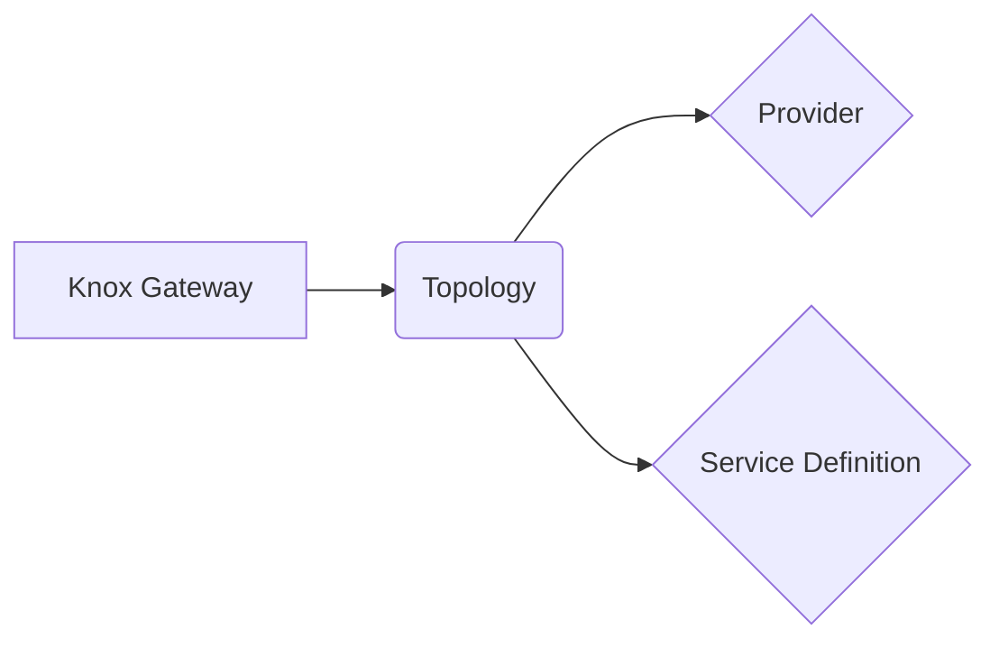

# Knox原理与代码实例讲解

作者：禅与计算机程序设计艺术

## 1. 背景介绍

### 1.1 大数据安全需求日益增长

随着互联网和物联网技术的快速发展，全球数据量呈爆炸式增长，大数据时代已经到来。海量数据的存储、处理和分析为企业和机构带来了前所未有的机遇，同时也带来了巨大的安全挑战。如何保障大数据安全，已经成为学术界和工业界共同关注的焦点问题。

### 1.2 Hadoop安全机制的局限性

Hadoop作为目前最流行的大数据处理平台之一，其安全机制尚存在一些局限性：

* **集中式密钥管理:** Hadoop使用集中式的密钥管理方式，所有用户共享相同的密钥，存在单点失效和密钥泄露的风险。
* **粗粒度的访问控制:** Hadoop的访问控制机制比较粗糙，只能控制用户对整个文件的访问权限，无法实现细粒度的访问控制，例如控制用户只能访问文件的某些部分。
* **数据加密性能瓶颈:** Hadoop的数据加密功能主要依赖于Java自带的加密库，性能较低，难以满足大规模数据加密的需求。

### 1.3 Knox的诞生背景和目标

为了解决Hadoop安全机制的局限性，Apache社区推出了Knox项目。Knox是一个开源的系统，旨在为Hadoop提供统一的安全访问入口，增强Hadoop的安全性。

Knox的主要目标包括：

* **提供统一的安全访问入口:** Knox作为Hadoop集群的网关，所有对Hadoop集群的访问都需要经过Knox的认证和授权。
* **简化Hadoop安全配置:** Knox提供了一套简单易用的API和工具，方便用户配置和管理Hadoop集群的安全性。
* **增强Hadoop安全特性:** Knox支持多种身份验证机制、细粒度的访问控制、数据加密等安全特性，可以有效提升Hadoop集群的安全性。

## 2. 核心概念与联系

### 2.1 Knox Gateway

Knox Gateway是Knox的核心组件，它是一个Web应用程序，充当Hadoop集群的反向代理和网关。所有对Hadoop集群的请求都需要经过Knox Gateway的转发，Knox Gateway会对请求进行身份验证、授权和审计。

### 2.2 Topology

Topology是Knox中的一个重要概念，它定义了Hadoop集群的服务和资源，以及如何访问这些服务和资源。Knox Gateway使用Topology来路由请求到后端的Hadoop服务。

### 2.3 Provider

Provider是Knox中用于实现身份验证、授权和审计等安全功能的模块。Knox支持多种Provider，例如LDAP、Kerberos、OAuth等。

### 2.4 Service Definition

Service Definition定义了Knox Gateway如何将请求转发到后端的Hadoop服务，包括服务的URL、HTTP方法、请求头和请求体等信息。

### 2.5 核心概念关系图



## 3. 核心算法原理具体操作步骤

### 3.1 Knox Gateway工作流程

1. 用户发送请求到Knox Gateway。
2. Knox Gateway根据请求的URL和Topology配置，找到对应的Service Definition。
3. Knox Gateway根据Service Definition中的配置，对请求进行身份验证和授权。
4. 如果身份验证和授权通过，Knox Gateway将请求转发到后端的Hadoop服务。
5. Hadoop服务处理请求并返回响应给Knox Gateway。
6. Knox Gateway将响应返回给用户。

### 3.2 身份验证流程

1. 用户发送请求到Knox Gateway，请求中包含身份验证信息。
2. Knox Gateway根据Topology配置，找到对应的Authentication Provider。
3. Authentication Provider验证用户的身份信息。
4. 如果身份验证通过，Authentication Provider生成一个身份令牌（Token）。
5. Knox Gateway将身份令牌存储在用户的Session中，并将请求转发到后端的Hadoop服务。

### 3.3 授权流程

1. Knox Gateway收到来自后端Hadoop服务的请求。
2. Knox Gateway根据Topology配置，找到对应的Authorization Provider。
3. Authorization Provider根据用户的身份信息和请求的资源，判断用户是否拥有访问权限。
4. 如果用户拥有访问权限，Authorization Provider允许请求通过。
5. 如果用户没有访问权限，Authorization Provider拒绝请求。

## 4. 数学模型和公式详细讲解举例说明

Knox本身并没有涉及复杂的数学模型和算法，其核心原理是基于反向代理和安全策略配置。

## 5. 项目实践：代码实例和详细解释说明

### 5.1 安装和配置Knox

```
# 下载Knox安装包
wget http://archive.apache.org/dist/knox/0.14.0/knox-0.14.0.tar.gz

# 解压Knox安装包
tar -xzvf knox-0.14.0.tar.gz

# 进入Knox安装目录
cd knox-0.14.0

# 修改conf/gateway.xml配置文件
# 配置Knox Gateway监听的端口号
<property>
  <name>gateway.port</name>
  <value>8443</value>
</property>

# 配置Topology
<topology>
  <gateway>
    <provider>
      <role>authentication</role>
      <name>ShiroProvider</name>
      <enabled>true</enabled>
      <param>
        <name>main.ldapRealm.contextFactory.url</name>
        <value>ldap://localhost:389</value>
      </param>
    </provider>
  </gateway>
</topology>

# 启动Knox Gateway
./bin/gateway.sh start
```

### 5.2 创建Topology

```xml
<?xml version="1.0" encoding="UTF-8" standalone="yes"?>
<topology>
  <gateway>
    <provider>
      <role>authentication</role>
      <name>ShiroProvider</name>
      <enabled>true</enabled>
      <param>
        <name>main.ldapRealm.contextFactory.url</name>
        <value>ldap://localhost:389</value>
      </param>
    </provider>
  </gateway>
  <service>
    <role>WEBHDFS</role>
    <url>http://localhost:50070/webhdfs/v1</url>
  </service>
</topology>
```

### 5.3 访问Hadoop服务

```
# 通过Knox Gateway访问WebHDFS服务
curl -k https://localhost:8443/gateway/default/webhdfs/v1/user/root?op=LISTSTATUS
```

## 6. 实际应用场景

### 6.1 多租户环境

在多租户环境下，可以使用Knox为每个租户创建独立的Topology，并配置不同的安全策略，实现租户之间的安全隔离。

### 6.2 混合云环境

在混合云环境下，可以使用Knox作为统一的安全访问入口，将本地Hadoop集群和云上的Hadoop服务整合在一起，方便用户统一管理和访问。

### 6.3 数据安全合规

Knox可以帮助企业和机构满足数据安全合规要求，例如GDPR、HIPAA等。

## 7. 总结：未来发展趋势与挑战

### 7.1 未来发展趋势

* **更细粒度的访问控制:** Knox未来将会支持更细粒度的访问控制，例如基于标签的访问控制、基于属性的访问控制等。
* **更强大的安全特性:** Knox将会集成更多的安全特性，例如数据脱敏、数据防泄漏等。
* **更易于使用:** Knox将会提供更简单易用的API和工具，方便用户配置和管理Hadoop集群的安全性。

### 7.2 面临的挑战

* **性能优化:** Knox作为Hadoop集群的网关，需要处理大量的请求，因此性能优化是一个重要的挑战。
* **安全性:** Knox自身也需要保证安全性，防止自身成为攻击目标。
* **生态系统:** Knox需要与Hadoop生态系统中的其他组件进行集成，例如Ranger、Atlas等。


## 8. 附录：常见问题与解答

### 8.1 如何配置Knox使用LDAP进行身份验证？

在gateway.xml配置文件中配置ShiroProvider，并指定LDAP服务器的地址、用户名和密码等信息。

### 8.2 如何配置Knox实现细粒度的访问控制？

可以使用Ranger或Apache Sentry等工具与Knox集成，实现基于标签或策略的细粒度访问控制。

### 8.3 如何监控Knox Gateway的运行状态？

可以使用Knox提供的REST API或JMX接口监控Knox Gateway的运行状态。


## 9. 结束语

Knox是一个强大的安全工具，可以帮助企业和机构提升Hadoop集群的安全性。本文详细介绍了Knox的原理、架构、配置和使用，并结合实际应用场景，希望能够帮助读者更好地理解和使用Knox。
