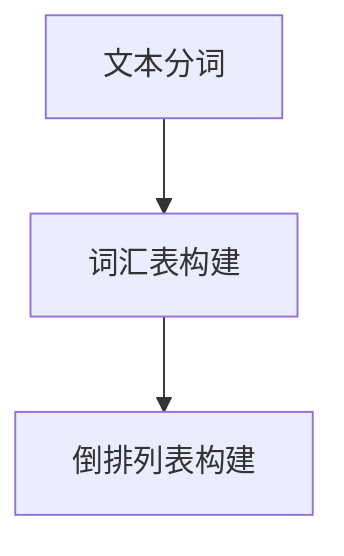
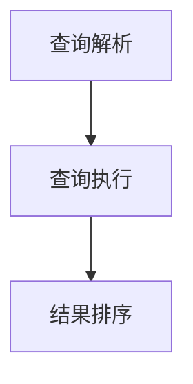

# Lucene搜索原理与代码实例讲解

作者：禅与计算机程序设计艺术

## 1. 背景介绍

### 1.1 Lucene简介

Apache Lucene 是一个高性能、全功能的搜索引擎库。它是一个开源项目，由 Apache Software Foundation 维护。Lucene 提供了强大的搜索功能，包括全文搜索、关键字搜索、范围搜索等，广泛应用于各类信息检索系统中。

### 1.2 Lucene的历史

Lucene 由 Doug Cutting 在 1999 年开发，最初是一个 Java 应用程序。经过多年的发展，Lucene 已经成为搜索引擎领域的一个标准，许多知名企业和项目都在使用 Lucene，如 Elasticsearch、Solr 等。

### 1.3 Lucene的应用领域

Lucene 被广泛应用于各种需要搜索功能的应用场景中，包括但不限于：

- 网站搜索
- 企业信息检索
- 数据分析
- 电子商务平台
- 文档管理系统

## 2. 核心概念与联系

### 2.1 索引（Index）

索引是 Lucene 的核心概念之一，它类似于数据库中的索引，通过索引可以快速查找到相关信息。Lucene 的索引是倒排索引（Inverted Index），即将文档中的词汇映射到文档 ID。

### 2.2 文档（Document）

在 Lucene 中，文档是信息存储的基本单位。一个文档可以包含多个字段（Field），每个字段包含一个名称和一个值。例如，一个文档可以表示一篇文章，字段可以是标题、内容、作者等。

### 2.3 字段（Field）

字段是文档中的一个组成部分，每个字段都有一个名称和值。字段可以是存储的（Stored）、索引的（Indexed）或者是分析的（Analyzed）。

### 2.4 分析器（Analyzer）

分析器用于将文本分解成词汇单元（Token）。Lucene 提供了多种分析器，如标准分析器（StandardAnalyzer）、简单分析器（SimpleAnalyzer）等，不同的分析器适用于不同的应用场景。

### 2.5 查询（Query）

查询是用户用来检索信息的手段。Lucene 提供了丰富的查询类型，如布尔查询（BooleanQuery）、短语查询（PhraseQuery）、范围查询（RangeQuery）等。通过组合不同的查询，可以实现复杂的搜索需求。

### 2.6 打分（Scoring）

打分是 Lucene 中用于评估文档与查询匹配程度的机制。Lucene 使用 TF-IDF（Term Frequency-Inverse Document Frequency）算法来计算文档的相关性得分。得分越高，表示文档与查询越相关。

## 3. 核心算法原理具体操作步骤

### 3.1 倒排索引的构建

倒排索引是 Lucene 的核心数据结构。构建倒排索引的过程包括以下几个步骤：

1. **文本分词**：将文档的内容分解成词汇单元（Token）。
2. **词汇表构建**：将所有词汇单元存储在词汇表中。
3. **倒排列表构建**：为每个词汇单元创建一个倒排列表，存储包含该词汇单元的文档 ID。



### 3.2 查询处理

查询处理是 Lucene 的另一个核心过程，包括以下步骤：

1. **查询解析**：将用户输入的查询解析成 Lucene 能够理解的查询对象。
2. **查询执行**：在倒排索引中查找匹配的文档。
3. **结果排序**：根据打分机制对查询结果进行排序。



## 4. 数学模型和公式详细讲解举例说明

### 4.1 TF-IDF算法

TF-IDF 是 Lucene 用于计算文档相关性的核心算法。TF（Term Frequency）表示词汇在文档中出现的频率，IDF（Inverse Document Frequency）表示词汇在整个文档集合中的稀有程度。

TF 公式：
$$
TF(t, d) = \frac{f_{t,d}}{\sum_{t' \in d} f_{t',d}}
$$

其中，$f_{t,d}$ 表示词汇 $t$ 在文档 $d$ 中出现的次数。

IDF 公式：
$$
IDF(t, D) = \log \frac{N}{| \{d \in D : t \in d\} |}
$$

其中，$N$ 表示文档集合 $D$ 中的文档总数，$| \{d \in D : t \in d\} |$ 表示包含词汇 $t$ 的文档数量。

TF-IDF 公式：
$$
TF-IDF(t, d, D) = TF(t, d) \times IDF(t, D)
$$

### 4.2 示例计算

假设有以下三个文档：

- 文档1： "Lucene is a search library"
- 文档2： "Lucene is written in Java"
- 文档3： "Lucene supports full-text search"

计算词汇 "Lucene" 的 TF-IDF 值：

1. 计算 TF：
$$
TF(\text{Lucene}, \text{文档1}) = \frac{1}{5} = 0.2
$$

2. 计算 IDF：
$$
IDF(\text{Lucene}, \{\text{文档1}, \text{文档2}, \text{文档3}\}) = \log \frac{3}{3} = 0
$$

3. 计算 TF-IDF：
$$
TF-IDF(\text{Lucene}, \text{文档1}, \{\text{文档1}, \text{文档2}, \text{文档3}\}) = 0.2 \times 0 = 0
$$

## 5. 项目实践：代码实例和详细解释说明

### 5.1 环境配置

在开始编写代码之前，需要配置开发环境。本文使用 Java 语言进行示例，首先需要引入 Lucene 库。

```xml
<dependency>
    <groupId>org.apache.lucene</groupId>
    <artifactId>lucene-core</artifactId>
    <version>8.11.0</version>
</dependency>
<dependency>
    <groupId>org.apache.lucene</groupId>
    <artifactId>lucene-analyzers-common</artifactId>
    <version>8.11.0</version>
</dependency>
```

### 5.2 创建索引

以下代码展示了如何使用 Lucene 创建索引：

```java
import org.apache.lucene.analysis.standard.StandardAnalyzer;
import org.apache.lucene.document.Document;
import org.apache.lucene.document.Field;
import org.apache.lucene.document.TextField;
import org.apache.lucene.index.IndexWriter;
import org.apache.lucene.index.IndexWriterConfig;
import org.apache.lucene.store.Directory;
import org.apache.lucene.store.RAMDirectory;

public class LuceneIndexExample {
    public static void main(String[] args) throws Exception {
        StandardAnalyzer analyzer = new StandardAnalyzer();
        Directory index = new RAMDirectory();

        IndexWriterConfig config = new IndexWriterConfig(analyzer);
        IndexWriter writer = new IndexWriter(index, config);

        addDoc(writer, "Lucene is a search library");
        addDoc(writer, "Lucene is written in Java");
        addDoc(writer, "Lucene supports full-text search");

        writer.close();
    }

    private static void addDoc(IndexWriter writer, String text) throws Exception {
        Document doc = new Document();
        doc.add(new TextField("content", text, Field.Store.YES));
        writer.addDocument(doc);
    }
}
```

### 5.3 搜索索引

以下代码展示了如何使用 Lucene 搜索索引：

```java
import org.apache.lucene.analysis.standard.StandardAnalyzer;
import org.apache.lucene.document.Document;
import org.apache.lucene.index.DirectoryReader;
import org.apache.lucene.index.IndexReader;
import org.apache.lucene.queryparser.classic.QueryParser;
import org.apache.lucene.search.IndexSearcher;
import org.apache.lucene.search.Query;
import org.apache.lucene.search.ScoreDoc;
import org.apache.lucene.search.TopDocs;
import org.apache.lucene.store.Directory;
import org.apache.lucene.store.RAMDirectory;

public class LuceneSearchExample {
    public static void main(String[] args) throws Exception {
        StandardAnalyzer analyzer = new StandardAnalyzer();
        Directory index = new RAMDirectory();

        // 创建索引（同上）
        IndexWriterConfig config = new IndexWriterConfig(analyzer);
        IndexWriter writer = new IndexWriter(index, config);
        addDoc(writer, "Lucene is a search library");
        addDoc(writer, "Lucene is written in Java");
        addDoc(writer, "Lucene supports full-text search");
        writer.close();

        // 搜索索引
        IndexReader reader = DirectoryReader.open(index);
        IndexSearcher searcher = new IndexSearcher(reader);

        QueryParser parser = new