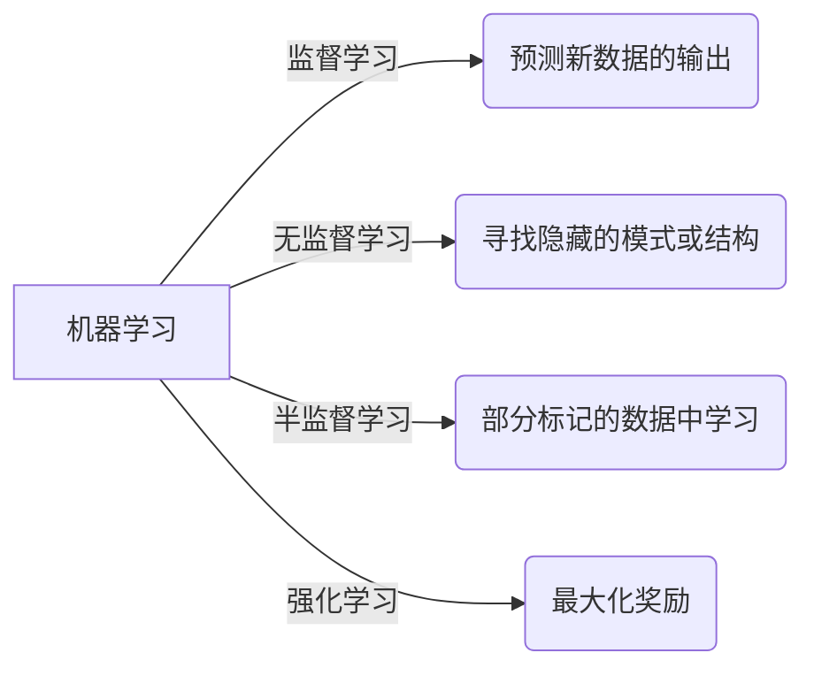

## 1.背景介绍

机器学习，作为人工智能的一个重要分支，日益引起全球科技领域的广泛关注。机器学习的核心思想是，通过算法使计算机可以从数据中学习信息，而无需进行明确的编程。从自动驾驶汽车，到用于预测疾病的健康应用，再到用于推荐音乐的流媒体服务，我们生活中的许多方面都开始受益于机器学习。

## 2.核心概念与联系

机器学习的核心概念包括监督学习、无监督学习、半监督学习和强化学习。这些概念是根据机器学习算法的学习方式进行分类的。

- **监督学习**是最常见的机器学习类型，算法从标记的训练数据中学习，目标是预测新数据的输出。

- **无监督学习**算法从未标记的数据中寻找隐藏的模式或结构，例如聚类和关联。

- **半监督学习**介于监督学习和无监督学习之间，算法从部分标记的数据中学习。

- **强化学习**是一种动态的，能实时调整决策和预测的机器学习类型，算法通过试错法在环境中进行学习，目标是最大化奖励。

这些概念之间的关系可以通过下面的Mermaid流程图进行表示：



## 3.核心算法原理具体操作步骤

在本节中，我们将深入探讨一个典型的监督学习算法——线性回归。线性回归是一种预测性的建模技术，用于确定两种或两种以上变量之间的关系。这种关系通常是由一个因变量和一个或多个自变量之间的回归线定义的。

线性回归的操作步骤如下：

1. **数据收集**：收集相关的数据，这可以是实验数据，也可以是公开的数据集。

2. **数据处理**：对数据进行预处理，包括数据清洗，数据归一化，以及处理缺失数据。

3. **模型构建**：选择适当的模型，对于线性回归，模型是一个线性函数。

4. **模型训练**：使用梯度下降等优化算法，根据训练数据调整模型的参数，使模型的预测值和真实值的差距（也就是损失函数）最小。

5. **模型评估**：使用测试数据评估模型的性能，常用的评估指标有均方误差（Mean Squared Error）和决定系数（R-squared）。

6. **模型应用**：将训练好的模型应用于实际问题，进行预测。

## 4.数学模型和公式详细讲解举例说明

在线性回归中，我们的目标是找到一条直线，这条直线最好地解释了自变量（X）和因变量（Y）之间的关系。

一个简单的线性回归模型可以表示为：

$$
Y = aX + b
$$

其中，Y是因变量，X是自变量，a是斜率，b是截距。

为了找到最佳的直线，我们需要找到斜率a和截距b，使得所有数据点到直线的距离（即残差）的平方和最小，这就是最小二乘法。这可以通过以下公式得到：

$$
a = \frac{n(\sum xy) - (\sum x)(\sum y)}{n(\sum x^2) - (\sum x)^2}
$$

$$
b = \frac{(\sum y) - a(\sum x)}{n}
$$

其中，n是数据点的数量，x和y是相应的数据点。

## 4.项目实践：代码实例和详细解释说明

在Python中，我们可以使用scikit-learn库进行线性回归。以下是一段简单的代码示例：

```python
from sklearn.linear_model import LinearRegression
from sklearn.model_selection import train_test_split
import pandas as pd

# load the data
data = pd.read_csv('data.csv')

# define the data and target
X = data['x'].values.reshape(-1,1)
Y = data['y'].values.reshape(-1,1)

# split the data into training set and test set
X_train, X_test, Y_train, Y_test = train_test_split(X, Y, test_size=0.2, random_state=0)

# create a linear regression model
model = LinearRegression()

# training the model
model.fit(X_train, Y_train)

# make a prediction
predictions = model.predict(X_test)
```

在这段代码中，我们首先加载了数据，然后定义了数据和目标。我们将数据分成了训练集和测试集，然后创建了一个线性回归模型，并用训练数据进行了训练，最后对测试数据进行了预测。

## 5.实际应用场景

机器学习在许多实际应用中都发挥了巨大作用，其中一些例子包括：

- **医疗诊断**：机器学习可用于预测疾病并帮助医生制定治疗方案。

- **金融风险管理**：金融机构使用机器学习来预测和减少风险。

- **自动驾驶**：自动驾驶汽车使用机器学习来感知环境并做出决策。

- **个性化推荐**：许多在线平台使用机器学习来推荐用户可能感兴趣的内容。

## 6.工具和资源推荐

以下是一些进行机器学习的工具和资源推荐：

- **Scikit-learn**：这是一个用于Python的机器学习库，它包含了许多常见的机器学习算法。

- **TensorFlow**：这是一个强大的深度学习库，它由Google开发。

- **Keras**：这是一个基于Python的深度学习库，它可以运行在TensorFlow之上。

- **Coursera的机器学习课程**：这是一门由斯坦福大学的Andrew Ng教授开设的在线课程，适合初学者。

## 7.总结：未来发展趋势与挑战

机器学习是一种强大的工具，它已经在许多领域产生了深远的影响。然而，机器学习也面临着许多挑战，包括如何处理大规模数据，如何保证算法的公平性和透明性，以及如何保护用户的隐私。随着技术的发展，我们期待找到解决这些问题的新方法。

## 8.附录：常见问题与解答

- **Q: 机器学习和人工智能有什么区别？**  
  A: 人工智能是一种广泛的概念，它包括使机器能够像人一样思考和学习的所有尝试。机器学习是实现人工智能的一种方法，它通过让机器从数据中学习，而不是进行明确的编程。

- **Q: 我需要什么样的背景才能开始学习机器学习？**  
  A: 学习机器学习需要一些基础知识，包括线性代数，概率论，统计学，以及一些编程知识，特别是Python。

- **Q: 我可以在哪里找到机器学习的数据集？**  
  A: 有许多在线平台提供机器学习数据集，包括UCI机器学习库，Kaggle，以及Google的数据集搜索引擎。