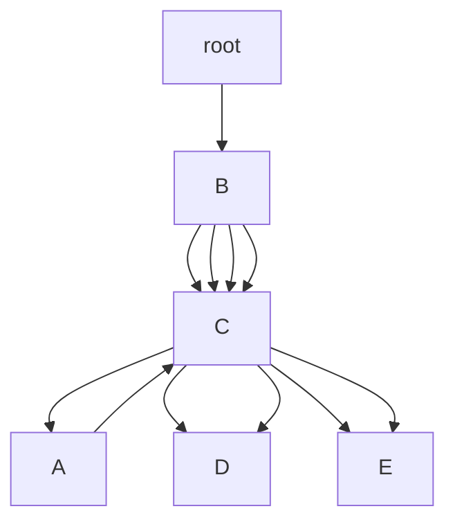

# Mahout频繁项挖掘原理与代码实例讲解

作者：禅与计算机程序设计艺术

## 1. 背景介绍

### 1.1 什么是频繁项挖掘

频繁项挖掘是数据挖掘中的一个重要任务，它旨在发现数据集中频繁出现的项集。频繁项集可以帮助我们理解数据的内在结构，揭示隐藏在数据中的模式和关联。在市场篮子分析、推荐系统、入侵检测等多个领域，频繁项挖掘都有着广泛的应用。

### 1.2 Apache Mahout简介

Apache Mahout是一个开源的机器学习库，专注于大规模数据处理和分布式计算。Mahout提供了多种机器学习算法，包括分类、聚类、推荐系统和频繁项挖掘。它基于Apache Hadoop和Apache Spark，能够处理海量数据，适合大数据分析。

### 1.3 频繁项挖掘在Mahout中的实现

在Mahout中，频繁项挖掘主要通过FP-Growth算法实现。FP-Growth是一种高效的频繁项集挖掘算法，通过构建FP树来压缩数据集，避免了生成候选项集的过程，极大地提高了挖掘效率。

## 2. 核心概念与联系

### 2.1 频繁项集

频繁项集是指在数据集中频繁出现的项的集合。一个项集的支持度（Support）是指该项集在数据集中出现的次数。频繁项集的支持度需要超过用户设定的最小支持度阈值（Minimum Support Threshold）。

### 2.2 FP-Growth算法

FP-Growth算法是频繁项挖掘的一种高效算法。它通过构建FP树（Frequent Pattern Tree）来压缩数据集，避免了生成候选项集的过程。FP树是一种紧凑的数据结构，它能够有效地表示频繁项集。

### 2.3 FP树

FP树是一种树形结构，用于存储频繁项集。FP树的每个节点代表一个项，节点之间的路径表示项集。FP树通过共享相同前缀的路径来压缩数据集。

### 2.4 关联规则

关联规则是从频繁项集中挖掘出来的规则，用于揭示项集之间的关联关系。关联规则由前件（Antecedent）和后件（Consequent）组成，表示“如果前件发生，那么后件也很可能发生”。

## 3. 核心算法原理具体操作步骤

### 3.1 构建FP树

#### 3.1.1 扫描数据集

首先，扫描数据集，计算每个项的支持度。将支持度大于等于最小支持度阈值的项保留，其他项丢弃。

#### 3.1.2 生成频繁项头表

根据项的支持度降序排列，生成频繁项头表（Frequent Item Header Table）。频繁项头表记录了每个项的支持度和在FP树中的位置。

#### 3.1.3 构建FP树

再次扫描数据集，根据频繁项头表中的顺序插入项，构建FP树。FP树通过共享相同前缀的路径来压缩数据集。

### 3.2 挖掘频繁项集

#### 3.2.1 生成条件模式基

对于每个频繁项，生成其条件模式基（Conditional Pattern Base）。条件模式基是以该频繁项为后缀的频繁项集。

#### 3.2.2 构建条件FP树

根据条件模式基，构建条件FP树。条件FP树是以条件模式基为数据集构建的FP树。

#### 3.2.3 挖掘条件FP树

递归地挖掘条件FP树，生成频繁项集。将条件FP树中的频繁项集与后缀项组合，得到完整的频繁项集。

### 3.3 生成关联规则

#### 3.3.1 计算置信度

对于每个频繁项集，生成所有可能的关联规则。计算每条关联规则的置信度（Confidence），即前件和后件同时发生的概率除以前件发生的概率。

#### 3.3.2 筛选关联规则

将置信度大于等于用户设定的最小置信度阈值（Minimum Confidence Threshold）的关联规则保留，其他规则丢弃。

## 4. 数学模型和公式详细讲解举例说明

### 4.1 支持度计算

一个项集的支持度（Support）定义为该项集在数据集中出现的次数除以数据集的总记录数。用公式表示为：

$$
\text{Support}(X) = \frac{\text{Count}(X)}{N}
$$

其中，$\text{Count}(X)$表示项集$X$在数据集中出现的次数，$N$表示数据集的总记录数。

### 4.2 置信度计算

关联规则$X \rightarrow Y$的置信度（Confidence）定义为项集$X$和$Y$同时出现的概率除以项集$X$出现的概率。用公式表示为：

$$
\text{Confidence}(X \rightarrow Y) = \frac{\text{Support}(X \cup Y)}{\text{Support}(X)}
$$

其中，$\text{Support}(X \cup Y)$表示项集$X$和$Y$同时出现的支持度，$\text{Support}(X)$表示项集$X$的支持度。

### 4.3 FP树构建示例

假设我们有如下数据集：

| 事务ID | 项目         |
|--------|--------------|
| 1      | A, B, C      |
| 2      | A, B, D      |
| 3      | A, C, E      |
| 4      | B, C, D      |
| 5      | B, C, E      |

最小支持度阈值设为2。首先，计算每个项的支持度：

- A: 3
- B: 4
- C: 4
- D: 2
- E: 2

然后，生成频繁项头表：

| 项目 | 支持度 |
|------|--------|
| B    | 4      |
| C    | 4      |
| A    | 3      |
| D    | 2      |
| E    | 2      |

根据频繁项头表的顺序构建FP树：

1. 插入事务1: B -> C -> A
2. 插入事务2: B -> C -> D
3. 插入事务3: A -> C -> E
4. 插入事务4: B -> C -> D
5. 插入事务5: B -> C -> E

最终的FP树结构如下：



### 4.4 频繁项集挖掘示例

根据FP树挖掘频繁项集：

1. 条件模式基：以E为后缀的频繁项集为{C, A}, {C, B}。
2. 条件FP树：以{C, A}, {C, B}为数据集构建条件FP树。
3. 递归挖掘：从条件FP树中挖掘频繁项集。

## 5. 项目实践：代码实例和详细解释说明

### 5.1 Mahout环境配置

首先，确保你已经安装了Apache Mahout和Hadoop。可以通过以下命令安装Mahout：

```bash
sudo apt-get install mahout
```

### 5.2 数据准备

准备一个样例数据集，存储在HDFS上。假设数据集文件名为`transactions.txt`，内容如下：

```
1 A B C
2 A B D
3 A C E
4 B C D
5 B C E
```

将数据集上传到HDFS：

```bash
hadoop fs -put transactions.txt /user/hadoop/transactions.txt
```

### 5.3 运行FP-Growth算法

使用Mahout的FP-Growth算法挖掘频繁项集：

```bash
mahout fpg -i /user/hadoop/transactions.txt -o /user/hadoop/output -k 50 -method mapreduce -s 2
```

参数解释：

- `-i`: 输入数据集路径
- `-o`: 输出结果路径
- `-k`: 最大频繁项集数
- `-method`: 使用的计算方法（mapreduce或spark）
- `-s`: 最小支持度阈值

### 5.4 