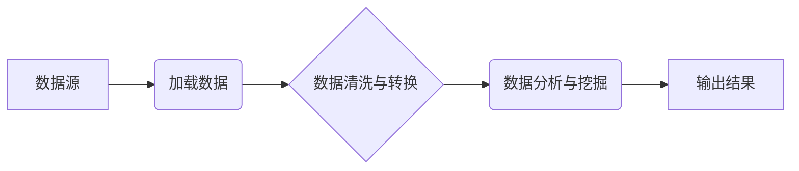

## Pig原理与代码实例讲解

作者：禅与计算机程序设计艺术

##  1. 背景介绍

### 1.1 大数据与并行计算的兴起
随着互联网和移动设备的普及，全球数据量呈爆炸式增长。传统的单机处理模式已经无法满足海量数据的处理需求，并行计算应运而生。Hadoop作为开源的分布式计算框架，凭借其高可靠性、高扩展性和高容错性，成为了大数据处理领域的事实标准。

### 1.2 Hadoop生态系统与数据处理流程
Hadoop生态系统包含众多组件，例如HDFS用于存储海量数据，MapReduce作为底层计算模型，YARN负责资源管理等。一个典型的大数据处理流程通常包括数据采集、数据清洗、数据转换、数据分析和数据可视化等环节。

### 1.3 Pig的诞生背景与优势
在Hadoop生态系统中，MapReduce作为底层计算模型，需要开发者编写大量的Java代码才能完成数据处理任务。为了简化编程模型，提高开发效率，Pig诞生了。Pig是一种高级数据流语言和执行框架，它提供了一套简洁易懂的语法，可以方便地进行数据ETL（Extract-Transform-Load）操作。

## 2. 核心概念与联系

### 2.1 数据模型：关系、包、元组
Pig采用关系型数据模型，将数据组织成关系（Relation）。关系可以理解为一张二维表，表中的每一行称为元组（Tuple），每一列称为字段（Field）。Pig支持多种数据类型，例如int、long、float、double、chararray、bytearray等。

### 2.2 脚本结构：语句、操作符、表达式
Pig脚本由一系列语句组成，每个语句以分号（;）结尾。Pig提供丰富的操作符和表达式，用于对数据进行操作。例如，`LOAD`操作符用于加载数据，`FILTER`操作符用于过滤数据，`GROUP`操作符用于分组数据等。

### 2.3 执行模式：本地模式与MapReduce模式
Pig支持本地模式和MapReduce模式两种执行模式。本地模式下，Pig脚本在本地计算机上执行；MapReduce模式下，Pig脚本会被转换成MapReduce作业，提交到Hadoop集群上执行。

## 3. 核心算法原理具体操作步骤

### 3.1 数据加载与存储
Pig提供`LOAD`操作符用于从各种数据源加载数据，例如HDFS、本地文件系统、HBase等。`STORE`操作符用于将处理后的数据存储到指定的目标位置。

```pig
-- 从HDFS加载数据
data = LOAD 'hdfs://path/to/data' USING PigStorage(',');

-- 将数据存储到HDFS
STORE data INTO 'hdfs://path/to/output' USING PigStorage(',');
```

### 3.2 数据清洗与转换
Pig提供丰富的操作符用于数据清洗和转换，例如：

*   **FILTER**: 过滤符合条件的数据
*   **FOREACH**: 遍历数据并进行操作
*   **GROUP**: 按指定字段分组数据
*   **JOIN**: 连接两个关系
*   **DISTINCT**: 去重
*   **ORDER**: 排序
*   **LIMIT**: 限制输出结果数量

```pig
-- 过滤年龄大于18岁的数据
filtered_data = FILTER data BY age > 18;

-- 对每个元组计算平均值
avg_data = FOREACH grouped_data GENERATE group, AVG(data);
```

### 3.3 数据分析与挖掘
Pig支持一些基本的数据分析和挖掘操作，例如：

*   **COUNT**: 统计数量
*   **SUM**: 求和
*   **AVG**: 求平均值
*   **MIN**: 求最小值
*   **MAX**: 求最大值

```pig
-- 统计每个分组的数量
count_data = FOREACH grouped_data GENERATE group, COUNT(data);
```

## 4. 数学模型和公式详细讲解举例说明

### 4.1 词频统计示例
假设我们有一份文本数据，需要统计每个单词出现的频率。可以使用Pig脚本实现如下：

```pig
-- 加载数据
lines = LOAD 'input.txt' AS (line:chararray);

-- 将每行文本分割成单词
words = FOREACH lines GENERATE FLATTEN(TOKENIZE(line)) AS word;

-- 按单词分组
grouped_words = GROUP words BY word;

-- 统计每个单词出现的次数
word_counts = FOREACH grouped_words GENERATE group, COUNT(words);

-- 按频率排序
sorted_word_counts = ORDER word_counts BY $1 DESC;

-- 输出结果
DUMP sorted_word_counts;
```

### 4.2 PageRank算法实现
PageRank算法是一种用于评估网页重要性的算法。可以使用Pig脚本实现PageRank算法的核心迭代计算过程：

```pig
-- 初始化页面权重
pages = LOAD 'pages.txt' AS (page:chararray);
ranks = FOREACH pages GENERATE page, 1.0 AS rank;

-- 迭代计算页面权重
for i in range(10):
    -- 计算每个页面的贡献值
    contributions = FOREACH links GENERATE from, rank / COUNT(to);
    
    -- 按页面分组贡献值
    grouped_contributions = GROUP contributions BY to;
    
    -- 计算每个页面的新权重
    new_ranks = FOREACH grouped_contributions GENERATE group AS page, 
                                                        0.15 + 0.85 * SUM(contributions.rank) AS rank;
    
    -- 更新页面权重
    ranks = new_ranks;

-- 输出最终页面权重
DUMP ranks;
```

## 5. 项目实践：代码实例和详细解释说明

### 5.1 电商网站用户行为分析
假设我们是一家电商网站，需要分析用户的购买行为。我们可以使用Pig脚本对用户访问日志进行分析，例如统计每个用户的访问次数、购买次数、平均消费金额等。

```pig
-- 加载用户访问日志
logs = LOAD 'user_logs.txt' USING PigStorage('\t') AS (user_id:int, item_id:int, action:chararray, timestamp:long);

-- 过滤购买行为
purchases = FILTER logs BY action == 'purchase';

-- 按用户分组购买记录
grouped_purchases = GROUP purchases BY user_id;

-- 计算每个用户的购买次数和平均消费金额
user_stats = FOREACH grouped_purchases GENERATE group AS user_id,
                                                 COUNT(purchases) AS purchase_count,
                                                 AVG(purchases.price) AS avg_purchase_amount;

-- 输出结果
DUMP user_stats;
```

### 5.2 社媒体平台话题趋势分析
假设我们是一家社交媒体平台，需要分析平台上的话题趋势。我们可以使用Pig脚本对用户发布的帖子进行分析，例如统计每个话题的讨论热度、情感倾向等。

```pig
-- 加载用户帖子数据
posts = LOAD 'posts.txt' USING PigStorage('\t') AS (user_id:int, post_id:int, content:chararray, timestamp:long);

-- 对帖子内容进行分词
words = FOREACH posts GENERATE FLATTEN(TOKENIZE(content)) AS word;

-- 统计每个单词出现的次数
word_counts = FOREACH (GROUP words BY word) GENERATE group, COUNT(words);

-- 过滤停用词
filtered_word_counts = FILTER word_counts BY NOT word IN ('a', 'an', 'the', 'is', 'are', ...);

-- 按词频排序
sorted_word_counts = ORDER filtered_word_counts BY $1 DESC;

-- 输出结果
DUMP sorted_word_counts;
```

## 6. 工具和资源推荐

### 6.1 开发工具
*   **PigPen**: PigLatin的可视化编辑器，提供语法高亮、代码提示、调试等功能。
*   **Hue**: Hadoop生态系统的Web UI，包含Pig编辑器和监控工具。

### 6.2 学习资源
*   **Pig官方文档**: [https://pig.apache.org/docs/](https://pig.apache.org/docs/)
*   **Hadoop权威指南**: Tom White 著
*   **Hadoop实战**: Chuck Lam 著

## 7. 总结：未来发展趋势与挑战

### 7.1 Pig的优势与局限性
Pig作为一种高级数据流语言，具有以下优势：

*   **易于学习和使用**: Pig提供简洁易懂的语法，可以快速上手进行数据处理。
*   **高效的数据处理**: Pig脚本会被转换成MapReduce作业，可以在Hadoop集群上并行执行，处理海量数据。
*   **丰富的功能**: Pig提供丰富的操作符和表达式，可以满足各种数据处理需求。

Pig也存在一些局限性：

*   **表达能力有限**: Pig主要用于数据ETL操作，不适合复杂的算法实现。
*   **调试困难**: Pig脚本的调试比较困难，需要借助日志和监控工具。

### 7.2 未来发展趋势
随着大数据技术的不断发展，Pig也在不断改进和完善。未来，Pig将朝着以下方向发展：

*   **更强大的表达能力**: 支持更复杂的数据结构和算法。
*   **更高的性能**: 优化执行引擎，提高数据处理效率。
*   **更易用**: 提供更友好的开发工具和调试工具。

### 7.3 面临的挑战
Pig面临着来自其他大数据处理技术的竞争，例如Spark、Flink等。这些技术提供了更强大的功能和更高的性能。Pig需要不断创新才能保持竞争力。

## 8. 附录：常见问题与解答

### 8.1 Pig和Hive的区别是什么？
Pig和Hive都是基于Hadoop的数据仓库工具，但它们的设计理念和使用场景有所不同。Pig是一种数据流语言，适用于数据ETL操作；Hive是一种数据仓库查询语言，适用于数据分析和报表生成。

### 8.2 Pig如何处理数据倾斜问题？
数据倾斜是指某些键值的数据量远远大于其他键值，导致MapReduce作业执行效率低下。Pig提供了一些机制来处理数据倾斜问题，例如：

*   **使用Combiner**: 在Map阶段对数据进行局部聚合，减少数据传输量。
*   **使用SkewJoin**: 对倾斜的数据进行特殊处理，避免数据倾斜对性能的影响。

### 8.3 Pig如何与其他Hadoop组件集成？
Pig可以与其他Hadoop组件无缝集成，例如：

*   **HDFS**: Pig可以从HDFS加载数据，并将处理后的数据存储到HDFS。
*   **HBase**: Pig可以使用`HBaseStorage`加载和存储HBase数据。
*   **Hive**: Pig可以使用`HiveStorer`将数据存储到Hive表中。


##  Mermaid流程图



**说明:**

*   A 表示数据源，例如 HDFS、本地文件系统等。
*   B 表示数据加载操作，使用 `LOAD` 操作符。
*   C 表示数据清洗与转换操作，使用 `FILTER`、`FOREACH`、`GROUP` 等操作符。
*   D 表示数据分析与挖掘操作，使用 `COUNT`、`SUM`、`AVG` 等操作符。
*   E 表示输出结果，使用 `STORE` 操作符将结果存储到指定位置，或使用 `DUMP` 操作符将结果输出到控制台。
