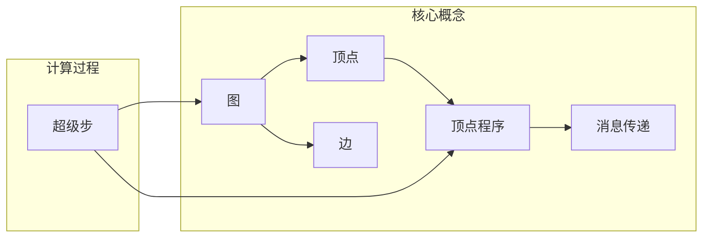

# Pregel原理与代码实例讲解

作者：禅与计算机程序设计艺术

## 1. 背景介绍

### 1.1 图计算的兴起

近年来，随着互联网、社交网络、物联网等技术的快速发展，图数据规模呈爆炸式增长，如何高效地存储、处理和分析这些海量图数据成为了一个巨大的挑战。传统的数据库管理系统难以胜任这项任务，而图计算作为一种专门针对图数据的计算模型应运而生。

### 1.2  Pregel：大规模图处理的利器

Pregel 是 Google 于 2010 年提出的一种分布式图计算框架，它以其简单易用、高效可扩展等优点，迅速成为处理大规模图数据的首选方案。Pregel 的设计灵感来源于图算法中的批量同步并行 (BSP) 模型，其核心思想是将整个图计算任务分解成若干个迭代，每个迭代中，每个顶点都会收到来自邻居节点的消息，并根据消息更新自身状态，最终通过不断迭代收敛到全局最优解。

### 1.3 本文目标

本文旨在深入浅出地介绍 Pregel 的原理、架构以及编程模型，并结合代码实例，帮助读者快速掌握 Pregel 的使用方法，并将其应用到实际的图计算问题中。

## 2. 核心概念与联系

### 2.1  图 (Graph)

图是由顶点 (Vertex) 和边 (Edge) 组成的一种数据结构，用于表示事物之间的关系。在 Pregel 中，图通常表示为一个有向图，每个顶点都有一个唯一的 ID，每条边都有一个方向，表示从源顶点指向目标顶点。

### 2.2  消息传递 (Message Passing)

消息传递是 Pregel 中最重要的概念之一，它指的是顶点之间通过发送和接收消息来进行通信和数据交换。每个顶点都可以向其邻居节点发送消息，也可以接收来自邻居节点的消息。

### 2.3  顶点程序 (Vertex Program)

每个顶点都运行着一个相同的用户自定义函数，称为顶点程序。顶点程序定义了顶点如何接收消息、更新自身状态以及发送消息。

### 2.4  超级步 (Superstep)

Pregel 将整个图计算过程划分为若干个迭代，每个迭代称为一个超级步。在每个超级步中，所有顶点都会并行地执行一次顶点程序。

### 2.5  关系图



## 3. 核心算法原理具体操作步骤

### 3.1 初始化阶段

在 Pregel 计算开始之前，需要完成以下初始化工作：

* 将图数据加载到分布式文件系统中，并将其划分成多个子图，每个子图分配给一个计算节点处理。
* 为每个顶点创建一个对应的顶点对象，并初始化其状态。
* 创建消息队列，用于存储顶点之间发送的消息。

### 3.2  迭代计算阶段

Pregel 的迭代计算阶段包含以下步骤：

1. **消息发送阶段**: 每个顶点根据自身状态和接收到的消息，计算需要发送给邻居节点的消息，并将消息写入消息队列。
2. **消息合并阶段**: 系统将发往同一个目标顶点的消息进行合并，并将合并后的消息发送给目标顶点。
3. **顶点程序执行阶段**: 每个顶点接收到消息后，执行用户自定义的顶点程序，更新自身状态。
4. **检查终止条件**: 系统检查是否满足终止条件，如果满足，则结束计算；否则，进入下一个超级步。

### 3.3  终止条件

Pregel 的终止条件可以是以下几种之一：

* **达到预设的迭代次数**: 用户可以预先设定最大的迭代次数，当达到最大迭代次数时，计算结束。
* **所有顶点都处于非活跃状态**: 当所有顶点的状态都不再发生变化时，计算结束。
* **满足自定义的终止条件**: 用户可以自定义终止条件，例如当某个全局变量达到某个阈值时，计算结束。

## 4. 数学模型和公式详细讲解举例说明

### 4.1 PageRank 算法

PageRank 算法是一种用于评估网页重要性的算法，其基本思想是：一个网页的重要性与其链接到的网页的重要性成正比。

#### 4.1.1  数学模型

PageRank 算法的数学模型可以表示为以下迭代公式：

$$
PR(A) = (1-d) + d \sum_{i=1}^{n} \frac{PR(T_i)}{L(T_i)}
$$

其中：

* $PR(A)$ 表示网页 A 的 PageRank 值。
* $d$ 表示阻尼系数，通常取值为 0.85。
* $T_i$ 表示链接到网页 A 的网页。
* $L(T_i)$ 表示网页 $T_i$ 的出链接数量。

#### 4.1.2 Pregel 实现

```python
class PageRankVertex(Vertex):
    def compute(self, messages):
        # 初始化 PageRank 值
        if self.superstep == 0:
            self.setValue(1.0 / self.getNumVertices())
        else:
            # 计算新的 PageRank 值
            new_pr = (1 - DAMPING_FACTOR) + DAMPING_FACTOR * sum(
                messages.values()
            )
            self.setValue(new_pr)

        # 发送 PageRank 值给邻居节点
        for neighbor in self.getEdges():
            self.sendMessageTo(
                neighbor.target(), self.getValue() / self.getNumEdges()
            )
```

### 4.2 单源最短路径算法

单源最短路径算法用于计算图中从一个源顶点到所有其他顶点的最短路径。

#### 4.2.1 数学模型

单源最短路径算法的数学模型可以表示为以下迭代公式：

$$
dist(v) = min\{dist(u) + w(u, v)\}
$$

其中：

* $dist(v)$ 表示从源顶点到顶点 $v$ 的最短距离。
* $u$ 表示顶点 $v$ 的邻居节点。
* $w(u, v)$ 表示边 $(u, v)$ 的权重。

#### 4.2.2 Pregel 实现

```python
class ShortestPathVertex(Vertex):
    def compute(self, messages):
        # 初始化距离
        if self.superstep == 0:
            if self.getId() == SOURCE_VERTEX:
                self.setValue(0)
            else:
                self.setValue(float("inf"))
        else:
            # 计算新的最短距离
            min_distance = self.getValue()
            for message in messages:
                min_distance = min(min_distance, message)
            if min_distance < self.getValue():
                self.setValue(min_distance)
                # 发送新的最短距离给邻居节点
                for edge in self.getEdges():
                    self.sendMessageTo(
                        edge.target(), min_distance + edge.getValue()
                    )
```

## 5. 项目实践：代码实例和详细解释说明

### 5.1  安装 Pregel

```bash
pip install pydoop
```

### 5.2  编写 Pregel 程序

```python
from pydoop.mapreduce.api import Mapper, Reducer
from pydoop.mapreduce.pipes import Factory, run_task

# 定义顶点类
class MyVertex(Vertex):
    def compute(self, messages):
        # 顶点逻辑
        pass

# 定义 Mapper 类
class MyMapper(Mapper):
    def map(self, context):
        # 读取输入数据
        # 创建顶点对象
        # 将顶点写入输出
        pass

# 定义 Reducer 类
class MyReducer(Reducer):
    def reduce(self, context):
        # 读取输入数据
        # 执行 Pregel 计算
        # 将结果写入输出
        pass

# 定义 Pregel 工厂类
class MyFactory(Factory):
    def create_mapper(self):
        return MyMapper()

    def create_reducer(self):
        return MyReducer()

# 运行 Pregel 程序
if __name__ == "__main__":
    run_task(MyFactory())
```

### 5.3 运行 Pregel 程序

```bash
python my_pregel_program.py <input_path> <output_path>
```

## 6. 实际应用场景

### 6.1 社交网络分析

* **好友推荐**: 根据用户的社交关系，推荐可能认识的朋友。
* **社区发现**: 将社交网络划分为不同的社区，每个社区内的用户具有更高的相似度。
* **影响力分析**: 识别社交网络中的关键节点，例如意见领袖。

### 6.2  网络安全

* **欺诈检测**: 识别网络中的异常行为，例如虚假账户、信用卡欺诈等。
* **入侵检测**: 检测网络中的恶意攻击行为。

### 6.3  推荐系统

* **商品推荐**: 根据用户的购买历史和浏览记录，推荐可能感兴趣的商品。
* **个性化推荐**: 根据用户的兴趣爱好，推荐个性化的内容。

## 7. 总结：未来发展趋势与挑战

### 7.1  发展趋势

* **图数据库**: 将图数据存储在专门的数据库中，提供更高效的查询和分析能力。
* **图神经网络**: 将深度学习技术应用于图数据，提升图计算的性能和效果。
* **实时图计算**: 支持对实时产生的图数据进行处理和分析。

### 7.2  挑战

* **图数据的规模和复杂性**:  图数据的规模和复杂性不断增加，对图计算系统的性能和可扩展性提出了更高的要求。
* **图数据的动态变化**:  图数据通常是动态变化的，如何处理图数据的增删改查是一个挑战。
* **图计算算法的效率**:  许多图计算算法的复杂度较高，如何设计高效的算法是一个挑战。

## 8.  附录：常见问题与解答

### 8.1  Pregel 与 Hadoop 的区别是什么？

Pregel 和 Hadoop 都是分布式计算框架，但它们的设计目标和应用场景有所不同。

* **设计目标**:  Hadoop 的设计目标是处理大规模数据的批处理任务，而 Pregel 的设计目标是处理大规模图数据的迭代计算任务。
* **数据模型**:  Hadoop 使用键值对 (Key-Value) 的数据模型，而 Pregel 使用图 (Graph) 的数据模型。
* **编程模型**:  Hadoop 使用 MapReduce 编程模型，而 Pregel 使用  "Think Like A Vertex" 的编程模型。

### 8.2  Pregel 的优缺点是什么？

**优点**:

* **简单易用**:  Pregel 提供了简单易用的编程接口，用户只需要编写顶点程序即可。
* **高效可扩展**:  Pregel 可以运行在大型集群上，处理数十亿个顶点和边。
* **容错性好**:  Pregel 可以容忍节点故障，保证计算的可靠性。

**缺点**:

* **不适合所有图算法**:  Pregel 主要适用于迭代计算的图算法，对于其他类型的图算法，可能效率不高。
* **需要一定的编程经验**:  使用 Pregel 需要用户具有一定的编程经验，特别是分布式编程经验。


### 8.3 如何学习 Pregel？

学习 Pregel 可以参考以下资料：

* **Pregel 论文**:  [http://dl.acm.org/citation.cfm?id=1807184](http://dl.acm.org/citation.cfm?id=1807184)
* **Pregel 官方网站**:  [https://github.com/apache/giraph](https://github.com/apache/giraph)
* **Pregel 教程**:  [https://spark.apache.org/docs/latest/graphx-programming-guide.html](https://spark.apache.org/docs/latest/graphx-programming-guide.html)

希望本文能够帮助读者更好地理解 Pregel 的原理和应用，并能够将其应用到实际的图计算问题中。
