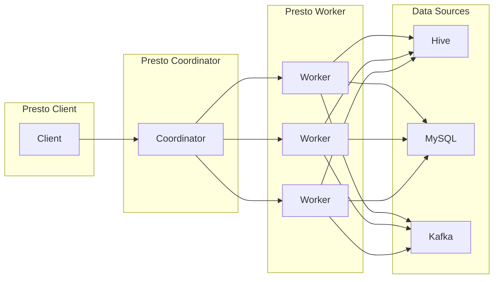

##  Presto原理与代码实例讲解

作者：禅与计算机程序设计艺术

## 1. 背景介绍

### 1.1 大数据时代的数据查询挑战

随着互联网、物联网等技术的飞速发展，全球数据量呈爆炸式增长，传统的关系型数据库已难以满足海量数据的存储和查询需求。为了应对这一挑战，各种新型分布式数据库系统应运而生，其中包括 Presto。

### 1.2 Presto的诞生背景

Presto 最初由 Facebook 开发，用于解决其内部数据仓库的交互式查询需求。Facebook 拥有海量的用户数据，需要对这些数据进行快速、灵活的分析。传统的 MapReduce 系统在处理这类查询时效率低下，无法满足 Facebook 的需求。因此，Facebook 开发了 Presto，它是一种基于内存的分布式 SQL 查询引擎，能够快速地对 PB 级数据进行交互式查询。

### 1.3 Presto的特点和优势

Presto 具有以下特点和优势：

* **高性能:** Presto 基于内存计算，并采用了许多优化技术，例如管道化执行、代码生成、数据本地化等，能够快速地处理海量数据。
* **可扩展性:** Presto 采用分布式架构，可以轻松地扩展到数百个节点，处理 PB 级数据。
* **易用性:** Presto 支持标准的 ANSI SQL 语法，用户可以使用熟悉的 SQL 语句进行查询。
* **开放性:** Presto 是一个开源项目，拥有活跃的社区支持。

## 2. 核心概念与联系

### 2.1 架构概述

Presto 采用典型的 Master-Slave 架构，主要由以下三个组件组成：

* **Coordinator:** 负责接收查询请求、解析 SQL 语句、生成执行计划、调度任务执行、收集查询结果等。
* **Worker:** 负责执行 Coordinator 分配的任务，读取数据、执行计算、返回结果等。
* **Connector:** 负责连接不同的数据源，例如 Hive、MySQL、Kafka 等。

**架构图:**



### 2.2 数据模型

Presto 使用关系模型来组织数据，支持常见的数据库对象，例如表、视图、列等。

### 2.3 查询执行流程

1. 用户提交查询请求到 Coordinator。
2. Coordinator 解析 SQL 语句，生成逻辑执行计划。
3. Coordinator 根据逻辑执行计划和数据分布信息，生成物理执行计划，并将任务调度到不同的 Worker 节点执行。
4. Worker 节点读取数据、执行计算、返回结果。
5. Coordinator 收集所有 Worker 节点的结果，并返回最终结果给用户。

### 2.4 核心概念之间的联系

* Coordinator 负责接收查询请求，解析 SQL 语句，生成执行计划，并将任务调度到不同的 Worker 节点执行。
* Worker 负责执行 Coordinator 分配的任务，读取数据、执行计算、返回结果等。
* Connector 负责连接不同的数据源，为 Presto 提供统一的数据访问接口。

## 3. 核心算法原理具体操作步骤

### 3.1 基于代价的查询优化

Presto 使用基于代价的查询优化器，根据统计信息和预估的执行代价，选择最优的执行计划。

**具体步骤:**

1. 解析 SQL 语句，生成逻辑执行计划。
2. 收集统计信息，例如表的大小、列的基数等。
3. 根据统计信息和预估的执行代价，枚举不同的物理执行计划。
4. 选择代价最低的物理执行计划作为最终的执行计划。

### 3.2  管道化执行

Presto 使用管道化执行模型，不同阶段的操作可以并行执行，提高查询效率。

**具体步骤:**

1. 将查询计划分解成多个阶段。
2. 每个阶段包含多个操作符。
3. 不同阶段的操作符可以并行执行。
4. 数据在管道中流动，避免了中间结果的物化。

### 3.3 代码生成

Presto 使用代码生成技术，将查询计划转换成字节码，提高查询效率。

**具体步骤:**

1. 将查询计划转换成 Java 代码。
2. 使用 Java 编译器将 Java 代码编译成字节码。
3. 在运行时加载字节码并执行。

## 4. 数学模型和公式详细讲解举例说明

### 4.1 数据分布模型

Presto 使用数据分布模型来描述数据的存储位置。

**公式:**

```
Data Distribution = {
  <Table Name>: {
    <Partition Key>: [<Node Id>, ...],
    ...
  },
  ...
}
```

**举例说明:**

假设有一个名为 `orders` 的表，按照 `order_date` 进行分区，数据分布如下：

```
Data Distribution = {
  "orders": {
    "2023-05-23": [1, 2],
    "2023-05-24": [2, 3],
    "2023-05-25": [1, 3]
  }
}
```

表示 `orders` 表的数据分布在三个节点上，其中 `2023-05-23` 分区的数据存储在节点 1 和节点 2 上，`2023-05-24` 分区的数据存储在节点 2 和节点 3 上，`2023-05-25` 分区的数据存储在节点 1 和节点 3 上。

### 4.2  成本模型

Presto 使用成本模型来估算查询的执行代价。

**公式:**

```
Cost = f(CPU Cost, Memory Cost, Network Cost)
```

**举例说明:**

假设一个查询需要读取 100GB 数据，网络传输速率为 10Gbps，CPU 处理速度为 1000MIPS，内存访问速度为 100ns/次，则该查询的成本可以估算为：

```
CPU Cost = 100GB * 1000MIPS = 10^5 s
Memory Cost = 100GB * 100ns/次 = 10^4 s
Network Cost = 100GB / 10Gbps = 80 s
Cost = f(10^5 s, 10^4 s, 80 s)
```

## 5. 项目实践：代码实例和详细解释说明

### 5.1 安装和配置 Presto

```
# 下载 Presto
wget https://repo.prestosql.io/dist/release/presto-server-351.tar.gz

# 解压 Presto
tar -xzvf presto-server-351.tar.gz

# 配置 Presto
cd presto-server-351
cp etc/catalog/jmx.properties etc/catalog/hive.properties

# 修改 hive.properties 文件
connector.type=hive
hive.metastore.uri=thrift://<hive_metastore_host>:<hive_metastore_port>

# 启动 Presto
bin/launcher start
```

### 5.2 使用 Presto 连接 Hive

```sql
-- 创建 Hive 表
CREATE TABLE orders (
  order_id BIGINT,
  customer_id BIGINT,
  order_date DATE,
  total_amount DOUBLE
)
PARTITIONED BY (order_date)
STORED AS ORC;

-- 插入数据
INSERT INTO orders VALUES
(1, 1, '2023-05-23', 100.00),
(2, 2, '2023-05-24', 200.00),
(3, 3, '2023-05-25', 300.00);

-- 使用 Presto 查询 Hive 表
SELECT * FROM orders;
```

### 5.3 使用 Presto 进行数据分析

```sql
-- 计算每天的订单总额
SELECT order_date, SUM(total_amount) AS total_revenue
FROM orders
GROUP BY order_date;

-- 查找订单金额最高的客户
SELECT customer_id, SUM(total_amount) AS total_purchase
FROM orders
GROUP BY customer_id
ORDER BY total_purchase DESC
LIMIT 10;
```

## 6. 实际应用场景

### 6.1  交互式查询

Presto 可以用于快速地对 PB 级数据进行交互式查询，例如：

* 电商网站的用户行为分析
* 金融机构的风险控制
* 物联网设备的实时监控

### 6.2  批处理查询

Presto 也可以用于执行批处理查询，例如：

* 数据仓库的 ETL 处理
* 报表生成
* 机器学习模型训练

### 6.3  联邦查询

Presto 支持连接不同的数据源，可以用于进行联邦查询，例如：

* 查询 Hive 和 MySQL 中的数据
* 查询 Kafka 和 Elasticsearch 中的数据

## 7. 工具和资源推荐

### 7.1  Presto 官网

https://prestosql.io/

### 7.2  Presto 文档

https://prestodb.io/docs/current/

### 7.3  Presto 社区

https://prestosql.slack.com/

## 8. 总结：未来发展趋势与挑战

### 8.1  未来发展趋势

* 云原生化：Presto 将更加紧密地与云计算平台集成，例如 AWS、Azure、GCP 等。
* 更强大的查询能力：Presto 将支持更多的 SQL 语法和函数，例如窗口函数、机器学习函数等。
* 更高的性能和可扩展性：Presto 将继续优化查询引擎，提高查询性能和可扩展性。

### 8.2  挑战

* 数据安全和隐私保护：随着 Presto 应用的普及，数据安全和隐私保护将变得越来越重要。
* 生态系统建设：Presto 需要建立更加完善的生态系统，包括工具、库、插件等。
* 人才培养：Presto 需要培养更多的专业人才，以满足市场需求。

## 9. 附录：常见问题与解答

### 9.1  如何查看 Presto 的运行状态？

可以使用 Presto CLI 连接到 Coordinator，执行 `show stats for query <query_id>` 命令查看查询的运行状态。

### 9.2  如何优化 Presto 查询性能？

* 调整 Presto 集群的配置参数。
* 优化 SQL 语句。
* 使用合适的 Connector。
* 对数据进行预处理。

### 9.3  如何解决 Presto 查询报错？

* 查看 Presto 日志文件。
* 使用 Presto CLI 执行 `explain <query>` 命令查看查询计划。
* 在 Presto 社区寻求帮助。