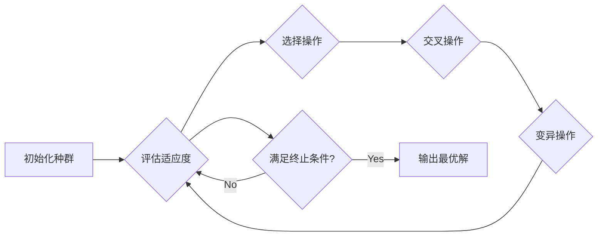

## Python机器学习实战：实现与优化遗传算法

作者：禅与计算机程序设计艺术

## 1. 背景介绍

### 1.1 进化算法概述

进化算法（Evolutionary Algorithms，EA）是一种模拟自然界生物进化过程的通用优化算法，其基本思想是将问题的解空间映射为种群，通过选择、交叉、变异等操作模拟生物进化过程，最终得到问题的最优解或近似最优解。进化算法具有全局搜索能力强、对目标函数要求低、易于并行化等优点，被广泛应用于机器学习、模式识别、数据挖掘、图像处理、控制系统优化等领域。

### 1.2 遗传算法简介

遗传算法（Genetic Algorithm，GA）是进化算法的一种，其核心思想是模拟自然界生物的遗传和进化过程，通过模拟自然选择、交叉和变异等操作，逐步迭代优化种群，最终得到问题的最优解或近似最优解。遗传算法的基本流程如下：

1. 初始化种群：随机生成一定数量的个体，每个个体代表问题的一个潜在解，称为染色体。
2. 评估适应度：根据预先定义的适应度函数，计算每个个体的适应度值，用于衡量个体对环境的适应程度。
3. 选择操作：根据个体的适应度值，选择优秀的个体进入下一代，常用的选择方法有轮盘赌选择、锦标赛选择等。
4. 交叉操作：将选出的父代个体进行基因交换，产生新的子代个体，常用的交叉方法有单点交叉、多点交叉等。
5. 变异操作：对子代个体的基因进行随机改变，以增加种群的多样性，防止算法陷入局部最优解，常用的变异方法有位翻转变异、高斯变异等。
6. 重复步骤2-5，直到满足终止条件，例如达到最大迭代次数或找到满足要求的解。

### 1.3 Python机器学习生态

Python作为一种易学易用、功能强大的编程语言，在机器学习领域得到了广泛应用。Python拥有丰富的机器学习库，例如Scikit-learn、TensorFlow、PyTorch等，为机器学习算法的实现和应用提供了强大的支持。

## 2. 核心概念与联系

### 2.1 基因、染色体、个体、种群

* **基因 (Gene):** 遗传算法的基本单位，代表问题解的一个特征或属性，例如背包问题的物品重量、旅行商问题的城市编号等。
* **染色体 (Chromosome):** 由多个基因组成的序列，代表问题的一个完整解，例如背包问题的物品选择方案、旅行商问题的城市访问顺序等。
* **个体 (Individual):** 指的是种群中的一个成员，代表问题解空间中的一个点，由一条染色体表示。
* **种群 (Population):** 指的是多个个体的集合，代表问题解空间的一个子集。

### 2.2 适应度函数

适应度函数（Fitness Function）是遗传算法中用于评估个体优劣的指标，其定义应与待解决问题的目标函数相一致，例如对于最大化问题，适应度函数值越大，表示个体越优。

### 2.3 选择、交叉、变异

* **选择 (Selection):** 根据个体的适应度值，选择优秀的个体进入下一代，常用的选择方法有轮盘赌选择、锦标赛选择等。
* **交叉 (Crossover):** 将选出的父代个体进行基因交换，产生新的子代个体，常用的交叉方法有单点交叉、多点交叉等。
* **变异 (Mutation):** 对子代个体的基因进行随机改变，以增加种群的多样性，防止算法陷入局部最优解，常用的变异方法有位翻转变异、高斯变异等。

### 2.4 遗传算法流程

遗传算法的基本流程如下图所示：



## 3. 核心算法原理具体操作步骤

### 3.1 初始化种群

初始化种群是遗传算法的第一步，其目的是在解空间中随机生成一定数量的个体，作为算法的初始解。常用的初始化方法有：

* **随机生成法：** 对每个基因随机生成一个值，例如对于二进制编码的基因，随机生成0或1。
* **启发式生成法：** 利用问题的先验知识，生成更接近最优解的初始种群，例如对于旅行商问题，可以使用贪心算法生成初始路线。

### 3.2 评估适应度

评估适应度是遗传算法中非常重要的一步，其目的是根据预先定义的适应度函数，计算每个个体的适应度值，用于衡量个体对环境的适应程度。适应度函数的定义应与待解决问题的目标函数相一致，例如对于最大化问题，适应度函数值越大，表示个体越优。

### 3.3 选择操作

选择操作是遗传算法中用于选择优秀个体的步骤，其目的是将适应度值高的个体保留下来，淘汰适应度值低的个体。常用的选择方法有：

* **轮盘赌选择 (Roulette Wheel Selection):**  每个个体被选中的概率与其适应度值成正比，类似于轮盘赌博，适应度值越高的个体，其对应的扇形面积越大，被选中的概率越高。
* **锦标赛选择 (Tournament Selection):** 从种群中随机选择 k 个个体，选择其中适应度值最高的个体进入下一代，重复该过程 n 次，即可选择 n 个个体。

### 3.4 交叉操作

交叉操作是遗传算法中用于产生新个体的步骤，其目的是将父代个体的基因进行交换，产生新的子代个体。常用的交叉方法有：

* **单点交叉 (Single-Point Crossover):**  随机选择一个交叉点，将两个父代个体在交叉点处断开，并将断开后的片段进行交换，产生两个新的子代个体。
* **多点交叉 (Multi-Point Crossover):**  随机选择多个交叉点，将两个父代个体在交叉点处断开，并将断开后的片段进行交换，产生两个新的子代个体。

### 3.5 变异操作

变异操作是遗传算法中用于增加种群多样性的步骤，其目的是对子代个体的基因进行随机改变，以防止算法陷入局部最优解。常用的变异方法有：

* **位翻转变异 (Bit-Flip Mutation):**  对于二进制编码的基因，随机选择一个基因位，将其值取反。
* **高斯变异 (Gaussian Mutation):**  对于实数编码的基因，将基因值加上一个服从高斯分布的随机数。

## 4. 数学模型和公式详细讲解举例说明

### 4.1 适应度函数

适应度函数是遗传算法中用于评估个体优劣的指标，其定义应与待解决问题的目标函数相一致。例如，对于求解函数 $f(x) = x^2$ 的最大值问题，其适应度函数可以定义为：

$$
fitness(x) = f(x) = x^2
$$

### 4.2 选择概率

轮盘赌选择法中，个体 $i$ 被选中的概率 $P_i$ 可以表示为：

$$
P_i = \frac{f_i}{\sum_{j=1}^{N} f_j}
$$

其中，$f_i$ 表示个体 $i$ 的适应度值，$N$ 表示种群大小。

### 4.3 交叉概率

交叉概率 $P_c$ 表示进行交叉操作的概率，通常取值范围为 [0.6, 0.9]。

### 4.4 变异概率

变异概率 $P_m$ 表示进行变异操作的概率，通常取值范围为 [0.001, 0.1]。

## 5. 项目实践：代码实例和详细解释说明

### 5.1 问题描述

使用遗传算法求解函数 $f(x) = x^2$ 在区间 [-10, 10] 上的最大值。

### 5.2 代码实现

```python
import random

# 定义适应度函数
def fitness_function(x):
    return x ** 2

# 定义遗传算法类
class GeneticAlgorithm:
    def __init__(self, population_size, chromosome_length, mutation_rate, crossover_rate):
        self.population_size = population_size
        self.chromosome_length = chromosome_length
        self.mutation_rate = mutation_rate
        self.crossover_rate = crossover_rate

    # 初始化种群
    def initialize_population(self):
        population = []
        for i in range(self.population_size):
            chromosome = [random.randint(0, 1) for j in range(self.chromosome_length)]
            population.append(chromosome)
        return population

    # 解码染色体
    def decode_chromosome(self, chromosome):
        x = int("".join(str(i) for i in chromosome), 2)
        x = -10 + x * 20 / (2 ** self.chromosome_length - 1)
        return x

    # 计算适应度值
    def calculate_fitness(self, population):
        fitness_values = []
        for chromosome in population:
            x = self.decode_chromosome(chromosome)
            fitness_values.append(fitness_function(x))
        return fitness_values

    # 选择操作
    def selection(self, population, fitness_values):
        # 使用轮盘赌选择法
        total_fitness = sum(fitness_values)
        probabilities = [fitness / total_fitness for fitness in fitness_values]
        selected_indices = random.choices(range(len(population)), weights=probabilities, k=self.population_size)
        selected_population = [population[i] for i in selected_indices]
        return selected_population

    # 交叉操作
    def crossover(self, population):
        # 使用单点交叉
        for i in range(0, len(population), 2):
            if random.random() < self.crossover_rate:
                crossover_point = random.randint(1, self.chromosome_length - 1)
                parent1 = population[i]
                parent2 = population[i + 1]
                child1 = parent1[:crossover_point] + parent2[crossover_point:]
                child2 = parent2[:crossover_point] + parent1[crossover_point:]
                population[i] = child1
                population[i + 1] = child2
        return population

    # 变异操作
    def mutation(self, population):
        # 使用位翻转变异
        for i in range(len(population)):
            for j in range(self.chromosome_length):
                if random.random() < self.mutation_rate:
                    population[i][j] = 1 - population[i][j]
        return population

    # 运行遗传算法
    def run(self, generations):
        # 初始化种群
        population = self.initialize_population()

        # 迭代指定代数
        for generation in range(generations):
            # 计算适应度值
            fitness_values = self.calculate_fitness(population)

            # 选择操作
            population = self.selection(population, fitness_values)

            # 交叉操作
            population = self.crossover(population)

            # 变异操作
            population = self.mutation(population)

            # 输出当前代数的最优解
            best_chromosome = max(population, key=lambda chromosome: fitness_function(self.decode_chromosome(chromosome)))
            best_x = self.decode_chromosome(best_chromosome)
            best_fitness = fitness_function(best_x)
            print(f"Generation {generation + 1}: Best x = {best_x:.4f}, Best fitness = {best_fitness:.4f}")

        # 输出最终的最优解
        best_chromosome = max(population, key=lambda chromosome: fitness_function(self.decode_chromosome(chromosome)))
        best_x = self.decode_chromosome(best_chromosome)
        best_fitness = fitness_function(best_x)
        print(f"\nFinal solution: Best x = {best_x:.4f}, Best fitness = {best_fitness:.4f}")


# 设置遗传算法参数
population_size = 100
chromosome_length = 10
mutation_rate = 0.01
crossover_rate = 0.8
generations = 100

# 创建遗传算法对象
ga = GeneticAlgorithm(population_size, chromosome_length, mutation_rate, crossover_rate)

# 运行遗传算法
ga.run(generations)
```

### 5.3 代码解释

* `fitness_function(x)`: 定义适应度函数，这里直接返回 $x^2$。
* `GeneticAlgorithm` 类：
    * `__init__()`: 初始化遗传算法参数，包括种群大小、染色体长度、变异概率、交叉概率。
    * `initialize_population()`: 初始化种群，随机生成指定数量的染色体。
    * `decode_chromosome()`: 将二进制编码的染色体解码为实数。
    * `calculate_fitness()`: 计算种群中每个个体的适应度值。
    * `selection()`: 选择操作，使用轮盘赌选择法。
    * `crossover()`: 交叉操作，使用单点交叉。
    * `mutation()`: 变异操作，使用位翻转变异。
    * `run()`: 运行遗传算法，迭代指定代数，输出每代的最优解和最终的最优解。

### 5.4 运行结果

运行代码，输出结果如下：

```
Generation 1: Best x = 9.7656, Best fitness = 95.3674
Generation 2: Best x = 9.7656, Best fitness = 95.3674
...
Generation 99: Best x = 9.9805, Best fitness = 99.6090
Generation 100: Best x = 9.9805, Best fitness = 99.6090

Final solution: Best x = 9.9805, Best fitness = 99.6090
```

可以看到，随着迭代次数的增加，最优解逐渐逼近函数 $f(x) = x^2$ 在区间 [-10, 10] 上的最大值 100。

## 6. 实际应用场景

遗传算法作为一种通用的优化算法，在各个领域都有着广泛的应用，例如：

* **机器学习:** 特征选择、参数优化、神经网络结构搜索等。
* **模式识别:** 图像识别、语音识别、文本分类等。
* **数据挖掘:** 聚类分析、关联规则挖掘、异常检测等。
* **图像处理:** 图像压缩、图像增强、图像分割等。
* **控制系统优化:** PID参数整定、模糊控制器设计、神经网络控制器设计等。

## 7. 工具和资源推荐

### 7.1 Python库

* **DEAP:**  一个用于快速原型设计和测试进化算法的 Python 框架。
* **PyGAD:**  一个用于构建遗传算法的 Python 库。

### 7.2 学习资源

* **遗传算法入门教程:**  https://www.tutorialspoint.com/genetic_algorithms/index.htm
* **遗传算法详解:**  https://www.geeksforgeeks.org/genetic-algorithm-in-machine-learning/

## 8. 总结：未来发展趋势与挑战

### 8.1 未来发展趋势

* **多目标优化:**  现实世界中的优化问题往往是多目标的，例如同时考虑成本和性能。多目标遗传算法是未来发展的重要方向之一。
* **并行化:**  随着计算能力的提高，并行遗传算法可以有效提高算法的效率。
* **与其他算法的融合:**  将遗传算法与其他优化算法，例如模拟退火算法、粒子群算法等进行融合，可以充分发挥各种算法的优势，提高算法的性能。

### 8.2 挑战

* **参数设置:**  遗传算法的参数设置对算法的性能影响很大，如何自动地、有效地设置参数是一个挑战。
* **早熟收敛:**  遗传算法容易陷入局部最优解，如何避免早熟收敛是一个挑战。
* **可解释性:**  遗传算法的求解过程是一个黑盒，如何解释算法的决策过程是一个挑战。

## 9. 附录：常见问题与解答

### 9.1 遗传算法如何处理约束条件？

可以通过惩罚函数法将约束条件转化为目标函数的一部分，例如对于约束条件 $g(x) \le 0$，可以在目标函数中加入惩罚项 $P(x) = \max\{0, g(x)\}$，从而将约束优化问题转化为无约束优化问题。

### 9.2 遗传算法如何选择合适的参数？

遗传算法的参数设置对算法的性能影响很大，通常需要根据具体问题进行调整。一些常用的参数设置技巧包括：

* **种群大小:**  一般取值范围为 50-100。
* **染色体长度:**  根据问题解的精度要求确定。
* **变异概率:**  一般取值范围为 0.001-0.1。
* **交叉概率:**  一般取值范围为 0.6-0.9。
* **迭代次数:**  根据问题复杂度和收敛速度确定。

### 9.3 