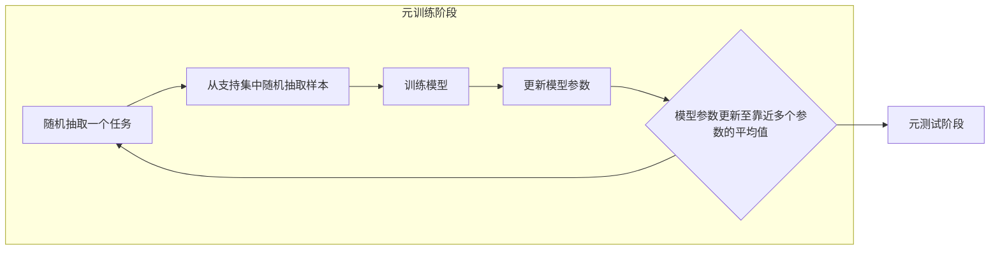

# Reptile原理与代码实例讲解

作者：禅与计算机程序设计艺术

## 1. 背景介绍

### 1.1 元学习与少样本学习

近年来，深度学习在诸多领域取得了突破性进展，然而，传统深度学习方法通常需要大量的标注数据才能获得良好的泛化性能。为了解决这一问题，**元学习 (Meta-Learning)** 应运而生。元学习旨在让模型学会如何学习，使其能够从少量样本中快速学习新任务。

**少样本学习 (Few-shot Learning)** 是元学习的一个重要分支，其目标是利用极少的标记样本训练模型，并将其泛化到新的类别。少样本学习在图像分类、目标检测、自然语言处理等领域具有广泛的应用前景。

### 1.2 Reptile算法的提出背景

Reptile 算法是 OpenAI 于 2018 年提出的一种简单而有效的元学习算法，其灵感来源于动物界爬行动物的学习方式。爬行动物通常能够从少量样本中快速学习新的技能，例如，蜥蜴可以通过观察其他蜥蜴捕食来学习如何捕食。Reptile 算法模拟了这种学习方式，旨在训练一个能够快速适应新任务的模型。

## 2. 核心概念与联系

### 2.1 元学习中的关键概念

* **任务 (Task):**  一个学习问题，例如图像分类任务。
* **元训练集 (Meta-training set):**  由多个任务组成的训练集，用于训练元学习模型。
* **元测试集 (Meta-test set):**  由多个未见过的任务组成的测试集，用于评估元学习模型的泛化性能。
* **支持集 (Support set):**  每个任务中用于训练模型的少量标记样本。
* **查询集 (Query set):**  每个任务中用于评估模型性能的样本。

### 2.2 Reptile算法的核心思想

Reptile 算法的核心思想是通过在多个任务上进行训练，使模型的参数逐渐逼近一个能够快速适应新任务的“最佳点”。具体来说，Reptile 算法采用以下步骤进行训练：

1. 从元训练集中随机抽取一个任务。
2. 从该任务的支持集中随机抽取一部分样本，用于训练模型。
3. 更新模型参数，使模型在该任务上的损失函数最小化。
4. 重复步骤 2-3 多次。
5. 将模型参数更新至靠近步骤 3 中获得的多个参数的平均值。
6. 重复步骤 1-5 多次。

## 3. 核心算法原理具体操作步骤

### 3.1 算法流程图



### 3.2 算法步骤

1. **初始化模型参数** $\theta$。
2. **进行多轮元训练：**
    * 从元训练集中随机抽取一个任务 $T_i$。
    * 从任务 $T_i$ 的支持集中随机抽取 $k$ 个样本，构成训练集 $D_{train}$。
    * 使用训练集 $D_{train}$ 训练模型，得到更新后的模型参数 $\theta'_i$。
    * 将模型参数 $\theta$ 更新至靠近 $\theta'_i$ 的位置：
        $$
        \theta \leftarrow \theta + \alpha (\theta'_i - \theta)
        $$
        其中，$\alpha$ 为学习率。
3. **重复步骤 2 多次，直到模型收敛。**

### 3.3 参数更新策略

Reptile 算法的参数更新策略可以理解为模型参数在多个任务上的“爬行”。每次迭代，模型参数都会向当前任务的最优解方向移动一小步，最终逼近一个能够快速适应新任务的“最佳点”。

## 4. 数学模型和公式详细讲解举例说明

### 4.1 损失函数

Reptile 算法可以使用任意的损失函数，例如交叉熵损失函数、均方误差损失函数等。假设我们使用交叉熵损失函数，则模型在任务 $T_i$ 上的损失函数为：

$$
L(\theta, D_{train}) = -\frac{1}{|D_{train}|} \sum_{(x,y) \in D_{train}} y \log(f_\theta(x)) + (1-y) \log(1-f_\theta(x))
$$

其中，$f_\theta(x)$ 表示模型对输入样本 $x$ 的预测结果，$y$ 表示样本 $x$ 的真实标签。

### 4.2 参数更新公式推导

Reptile 算法的参数更新公式可以从泰勒展开的角度进行推导。假设模型在任务 $T_i$ 上的损失函数 $L(\theta, D_{train})$ 可以用以下二阶泰勒展开式近似表示：

$$
L(\theta + \Delta \theta, D_{train}) \approx L(\theta, D_{train}) + \nabla_\theta L(\theta, D_{train})^T \Delta \theta + \frac{1}{2} \Delta \theta^T \nabla^2_\theta L(\theta, D_{train}) \Delta \theta
$$

其中，$\Delta \theta = \theta'_i - \theta$。为了最小化 $L(\theta + \Delta \theta, D_{train})$，我们可以令其关于 $\Delta \theta$ 的导数为 0，得到：

$$
\Delta \theta = -\nabla^2_\theta L(\theta, D_{train})^{-1} \nabla_\theta L(\theta, D_{train})
$$

由于 Hessian 矩阵 $\nabla^2_\theta L(\theta, D_{train})$ 通常难以计算，因此 Reptile 算法使用一阶梯度 $\nabla_\theta L(\theta, D_{train})$ 来近似 Hessian 矩阵，得到：

$$
\Delta \theta \approx -\alpha \nabla_\theta L(\theta, D_{train})
$$

将 $\Delta \theta = \theta'_i - \theta$ 代入上式，得到 Reptile 算法的参数更新公式：

$$
\theta \leftarrow \theta + \alpha (\theta'_i - \theta)
$$

### 4.3 举例说明

假设我们有一个图像分类任务，元训练集中包含 1000 个任务，每个任务包含 5 个类别，每个类别有 10 张训练图片。我们可以使用 Reptile 算法训练一个能够快速适应新类别的图像分类模型。

## 5. 项目实践：代码实例和详细解释说明

### 5.1 Python 代码实现

```python
import torch
import torch.nn as nn
import torch.optim as optim

class Reptile(nn.Module):
    def __init__(self, model, lr=1e-3):
        super(Reptile, self).__init__()
        self.model = model
        self.optimizer = optim.Adam(self.model.parameters(), lr=lr)

    def forward(self, x):
        return self.model(x)

    def train_step(self, task, inner_steps=5, inner_lr=1e-2):
        # 从任务中采样数据
        support_x, support_y, query_x, query_y = task.sample()

        # 保存模型参数
        weights = self.model.state_dict()

        # 内循环：在支持集上训练模型
        for _ in range(inner_steps):
            # 前向传播
            output = self.model(support_x)

            # 计算损失函数
            loss = nn.CrossEntropyLoss()(output, support_y)

            # 反向传播和参数更新
            self.optimizer.zero_grad()
            loss.backward()
            self.optimizer.step()

        # 外循环：更新元学习器参数
        with torch.no_grad():
            for name, param in self.model.named_parameters():
                # 计算参数更新量
                delta = param - weights[name]

                # 更新元学习器参数
                param.copy_(weights[name] + delta)

        # 返回查询集上的损失函数
        output = self.model(query_x)
        loss = nn.CrossEntropyLoss()(output, query_y)
        return loss
```

### 5.2 代码解释

* `Reptile` 类是 Reptile 算法的实现，它包含一个模型 `model` 和一个优化器 `optimizer`。
* `forward()` 方法用于模型的前向传播。
* `train_step()` 方法用于执行 Reptile 算法的一个训练步骤，它包含以下几个步骤：
    * 从任务中采样数据。
    * 保存模型参数。
    * 内循环：在支持集上训练模型。
    * 外循环：更新元学习器参数。
    * 返回查询集上的损失函数。

## 6. 实际应用场景

Reptile 算法可以应用于各种少样本学习场景，例如：

* **图像分类：**  例如，识别不同种类的花卉、动物等。
* **目标检测：**  例如，在图像中检测出特定类型的物体。
* **自然语言处理：**  例如，进行文本分类、情感分析等。

## 7. 总结：未来发展趋势与挑战

### 7.1 未来发展趋势

* **与其他元学习算法的结合：**  例如，将 Reptile 算法与 MAML、Meta-SGD 等算法结合，进一步提升少样本学习的性能。
* **应用于更复杂的学习任务：**  例如，将 Reptile 算法应用于强化学习、机器人控制等领域。
* **理论分析与改进：**  对 Reptile 算法进行更深入的理论分析，并提出改进算法。

### 7.2 面临的挑战

* **计算效率：**  Reptile 算法需要在多个任务上进行训练，计算量较大。
* **过拟合问题：**  当训练数据量较少时，Reptile 算法容易出现过拟合问题。

## 8. 附录：常见问题与解答

### 8.1 Reptile 算法与 MAML 算法的区别是什么？

Reptile 算法和 MAML 算法都是元学习算法，它们的主要区别在于参数更新策略。MAML 算法在每个任务上进行多次梯度下降，然后将所有任务上的梯度加和，更新元学习器的参数。而 Reptile 算法只在每个任务上进行一次梯度下降，然后将模型参数更新至靠近多个参数的平均值。

### 8.2 Reptile 算法如何解决过拟合问题？

为了解决过拟合问题，可以采用以下方法：

* **增加训练数据量：**  收集更多的训练数据可以有效地缓解过拟合问题。
* **正则化：**  例如，使用 L2 正则化、Dropout 等方法。
* **早停法：**  当验证集上的性能不再提升时，停止训练。