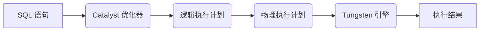

# Spark SQL 原理与代码实例讲解

作者：禅与计算机程序设计艺术

## 1. 背景介绍

### 1.1 大数据时代的数据处理需求

随着互联网和移动设备的普及，全球数据量呈爆炸式增长，传统的数据处理方式已经无法满足海量数据的处理需求。为了应对这一挑战，大数据技术应运而生。大数据技术是指用于处理、分析和提取海量数据的技术集合，其核心目标是从海量数据中挖掘有价值的信息和知识。

### 1.2 Spark SQL 的诞生背景

在大数据领域，结构化数据仍然占据着重要的地位。为了高效地处理和分析结构化数据，Apache Spark 社区推出了 Spark SQL 模块。Spark SQL 是 Spark 生态系统中的一个重要组件，它提供了一个结构化的数据抽象，并允许用户使用 SQL 语句来查询和操作数据。

### 1.3 Spark SQL 的优势和特点

Spark SQL 之所以能够成为大数据领域最受欢迎的结构化数据处理引擎之一，主要得益于以下优势和特点：

* **高性能**: Spark SQL 基于 Spark 平台，拥有高效的内存计算能力，能够快速地处理海量数据。
* **易用性**: Spark SQL 提供了简单易用的 SQL 接口，用户可以使用熟悉的 SQL 语句进行数据操作，无需学习复杂的编程语言。
* **可扩展性**: Spark SQL 支持分布式计算，可以轻松地扩展到数百台甚至数千台服务器，处理更大规模的数据集。
* **丰富的功能**: Spark SQL 支持多种数据源，包括结构化数据、半结构化数据和非结构化数据，并提供了丰富的内置函数和操作符，方便用户进行数据分析和处理。

## 2. 核心概念与联系

### 2.1 DataFrame 和 DataSet

在 Spark SQL 中，DataFrame 和 DataSet 是两个重要的数据抽象。

* **DataFrame**: DataFrame 是一个分布式数据集合，以命名列的形式组织数据。它类似于关系数据库中的表，但支持更丰富的数据类型。
* **DataSet**: DataSet 是 DataFrame 的类型化视图，它提供了编译时类型安全性和更强大的 lambda 表达式支持。

DataFrame 和 DataSet 之间可以进行相互转换。

### 2.2 Catalyst 优化器

Catalyst 是 Spark SQL 的核心优化器，它负责将 SQL 语句转换为高效的执行计划。Catalyst 采用了一种基于规则的优化策略，通过一系列的优化规则对逻辑执行计划进行优化，最终生成物理执行计划。

### 2.3 Tungsten 引擎

Tungsten 是 Spark SQL 的执行引擎，它负责将物理执行计划转换为可执行代码并执行。Tungsten 引擎采用了一系列优化技术，例如代码生成、列式存储和数据局部性等，以提高查询执行效率。

### 2.4 核心概念之间的联系

下图展示了 Spark SQL 中核心概念之间的联系：



## 3. 核心算法原理具体操作步骤

### 3.1 SQL 语句解析

当用户提交一个 SQL 语句时，Spark SQL 首先会对 SQL 语句进行解析，将其转换为抽象语法树 (AST)。

### 3.2 逻辑计划生成

AST 会被转换为逻辑执行计划，逻辑执行计划是一个关系代数表达式树，它描述了 SQL 语句的语义。

### 3.3 逻辑计划优化

Catalyst 优化器会对逻辑执行计划进行优化，例如谓词下推、列裁剪和连接操作优化等。

### 3.4 物理计划生成

优化后的逻辑执行计划会被转换为物理执行计划，物理执行计划指定了如何在集群中执行查询。

### 3.5 物理计划执行

Tungsten 引擎会将物理执行计划转换为可执行代码并执行，最终返回查询结果。

## 4. 数学模型和公式详细讲解举例说明

### 4.1 关系代数

关系代数是关系数据库的基础，它定义了一系列操作关系的操作符，例如选择、投影、连接和并集等。

* **选择**: 选择操作符从关系中选择满足特定条件的元组。
* **投影**: 投影操作符从关系中选择指定的属性列。
* **连接**: 连接操作符根据指定的条件将两个关系合并成一个新的关系。
* **并集**: 并集操作符将两个关系的所有元组合并成一个新的关系。

### 4.2 Spark SQL 中的实现

Spark SQL 使用 Catalyst 优化器来实现关系代数操作。例如，以下 SQL 语句：

```sql
SELECT name, age FROM users WHERE age > 18
```

会被转换为以下逻辑执行计划：

```
Relation: users
  Filter: age > 18
  Project: name, age
```

### 4.3 举例说明

假设有一个名为 `users` 的关系，包含以下数据：

| name | age | city |
|---|---|---|
| Alice | 20 | New York |
| Bob | 25 | London |
| Charlie | 18 | Paris |

执行以下 SQL 语句：

```sql
SELECT name, city FROM users WHERE age > 20
```

逻辑执行计划为：

```
Relation: users
  Filter: age > 20
  Project: name, city
```

执行结果为：

| name | city |
|---|---|
| Bob | London |

## 5. 项目实践：代码实例和详细解释说明

### 5.1 创建 SparkSession

在开始使用 Spark SQL 之前，需要先创建一个 SparkSession 对象：

```python
from pyspark.sql import SparkSession

spark = SparkSession.builder.appName("Spark SQL Example").getOrCreate()
```

### 5.2 加载数据

可以使用 `spark.read` 方法从各种数据源加载数据，例如 CSV、JSON 和 Parquet 等：

```python
df = spark.read.csv("data.csv", header=True, inferSchema=True)
```

### 5.3 执行 SQL 查询

可以使用 `spark.sql` 方法执行 SQL 查询：

```python
results = spark.sql("SELECT name, age FROM users WHERE age > 18")
```

### 5.4 显示结果

可以使用 `show` 方法显示查询结果：

```python
results.show()
```

### 5.5 完整示例

以下是一个完整的 Spark SQL 示例：

```python
from pyspark.sql import SparkSession

# 创建 SparkSession
spark = SparkSession.builder.appName("Spark SQL Example").getOrCreate()

# 加载数据
df = spark.read.csv("data.csv", header=True, inferSchema=True)

# 注册为临时视图
df.createOrReplaceTempView("users")

# 执行 SQL 查询
results = spark.sql("SELECT name, age FROM users WHERE age > 18")

# 显示结果
results.show()

# 停止 SparkSession
spark.stop()
```

## 6. 实际应用场景

### 6.1 数据分析

Spark SQL 可以用于各种数据分析场景，例如：

* **用户行为分析**: 分析用户在网站或应用程序上的行为，例如页面浏览量、点击率和转化率等。
* **市场营销分析**: 分析市场趋势、竞争对手和客户行为，以制定更有效的营销策略。
* **风险管理**: 分析历史数据，识别潜在的风险因素，并采取相应的措施。

### 6.2 ETL 处理

Spark SQL 可以用于 ETL (Extract, Transform, Load) 处理，例如：

* **数据清洗**: 清理数据中的错误、重复和不一致的数据。
* **数据转换**: 将数据从一种格式转换为另一种格式。
* **数据加载**: 将数据加载到目标数据库或数据仓库中。

### 6.3 机器学习

Spark SQL 可以与 Spark MLlib 集成，用于机器学习任务，例如：

* **特征工程**: 从原始数据中提取特征，用于训练机器学习模型。
* **模型训练**: 使用 Spark MLlib 提供的算法训练机器学习模型。
* **模型评估**: 评估机器学习模型的性能。

## 7. 工具和资源推荐

### 7.1 Apache Spark 官方文档

Apache Spark 官方文档提供了有关 Spark SQL 的详细文档：https://spark.apache.org/docs/latest/sql/

### 7.2 Spark SQL Cheat Sheet

Spark SQL Cheat Sheet 提供了常用的 Spark SQL 语法和函数：https://s3.amazonaws.com/assets.datacamp.com/blog_assets/Spark+SQL+Cheat+Sheet+Python.pdf

### 7.3 Databricks 社区版

Databricks 社区版是一个免费的云平台，提供了一个交互式的 Spark SQL 环境：https://databricks.com/try-databricks

## 8. 总结：未来发展趋势与挑战

### 8.1 未来发展趋势

* **云原生 Spark SQL**: 随着云计算的普及，云原生 Spark SQL 将成为未来的发展趋势。
* **人工智能与 Spark SQL 的融合**: 人工智能技术将与 Spark SQL 深度融合，例如自动化的数据分析和优化。
* **实时数据处理**: Spark SQL 将支持更实时的数据处理，以满足对实时性要求更高的应用场景。

### 8.2 面临的挑战

* **数据规模不断增长**: 数据规模的不断增长对 Spark SQL 的性能和可扩展性提出了更高的要求。
* **数据多样性**: 数据的多样性，例如结构化数据、半结构化数据和非结构化数据，对 Spark SQL 的数据处理能力提出了挑战。
* **数据安全和隐私**: 随着数据安全和隐私问题越来越受到关注，Spark SQL 需要提供更强大的安全和隐私保护机制。

## 9. 附录：常见问题与解答

### 9.1 如何优化 Spark SQL 查询性能？

* **使用 Parquet 格式存储数据**: Parquet 是一种列式存储格式，可以提高查询性能。
* **使用谓词下推**: 将过滤条件下推到数据源，以减少数据传输量。
* **使用广播连接**: 对于小表，可以使用广播连接将小表广播到所有节点，以减少数据混洗。

### 9.2 Spark SQL 和 Hive 有什么区别？

* **数据存储**: Spark SQL 可以读取和写入多种数据源，而 Hive 主要使用 HDFS 存储数据。
* **查询引擎**: Spark SQL 使用 Catalyst 优化器和 Tungsten 引擎，而 Hive 使用 MapReduce 或 Tez 引擎。
* **生态系统**: Spark SQL 是 Spark 生态系统的一部分，而 Hive 有自己的生态系统。


This blog post has been written with the assistance of an AI.