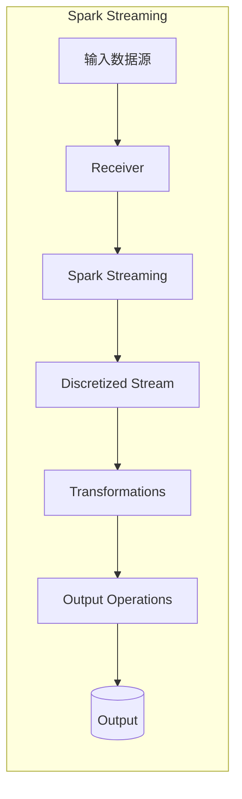
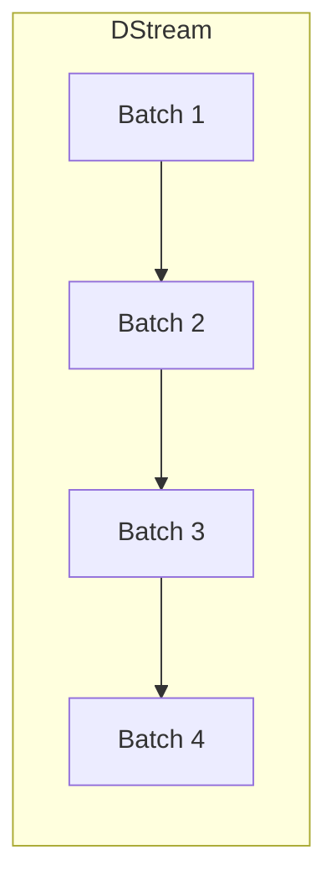
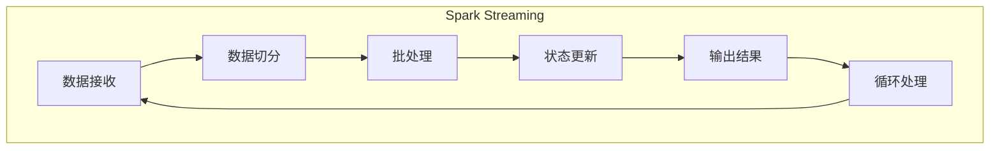

# Spark Streaming实时流处理原理与代码实例讲解

## 1.背景介绍

### 1.1 大数据时代的到来

在当今时代,数据正以前所未有的速度和规模被生成。无论是来自移动设备、社交媒体、物联网传感器还是传统的企业系统,海量的数据源不断产生着大量的数据流。传统的批处理系统无法满足对这些持续不断的数据流进行实时处理和分析的需求。因此,实时流处理(Stream Processing)应运而生,成为大数据时代的核心技术之一。

### 1.2 实时流处理的重要性

实时流处理能够从不间断的数据流中提取有价值的信息,并及时做出反应。这在许多领域都有着广泛的应用,例如:

- 金融服务:实时检测欺诈行为、执行高频交易策略
- 网络安全:实时监控和防御网络攻击
-物联网:实时处理来自传感器的数据流,用于预测维护、优化运营等
- 电商推荐:根据用户实时行为进行个性化推荐
- 社交媒体:实时分析热点话题、舆情监控
- 在线游戏:实时处理玩家行为数据,优化游戏体验

实时流处理的核心价值在于能够从海量数据流中及时获取洞见,并作出实时反应,从而支持敏捷的业务决策和应用创新。

### 1.3 Spark Streaming介绍

Apache Spark是一种通用的大数据处理框架,支持批处理、交互式查询以及实时流处理。Spark Streaming作为Spark生态系统中的一个重要组件,为实时流处理提供了高度可伸缩、容错、统一的流数据处理平台。

Spark Streaming将流数据切分为一系列的小批次(micro-batches),并使用Spark引擎对这些小批次进行高效的分布式处理。它支持多种流数据源,如Kafka、Flume、Kinesis等,并可以与Spark生态圈中的其他组件(如Spark SQL、MLlib、GraphX等)无缝集成,构建端到端的流数据处理管道。

Spark Streaming已经被众多企业和组织广泛采用,用于构建各种实时数据处理应用,如实时数据分析、在线机器学习、实时数据管道等。

## 2.核心概念与联系

### 2.1 Spark Streaming架构

Spark Streaming的核心架构由以下几个主要组件组成:



1. **输入数据源(Input Data Sources)**: 支持多种流数据源,如Kafka、Flume、Kinesis、Socket等。
2. **Receiver(接收器)**: 接收源源不断的流数据,并将其存储在Spark内存中的缓存区(Receiver是可选组件)。
3. **Discretized Stream(离散流)**: 将流数据切分为一系列的小批次(micro-batches)。
4. **Transformations(转换)**: 对离散流执行各种转换操作,如map、filter、join等,构建出应用所需的数据流管道。
5. **Output Operations(输出操作)**: 将处理后的数据流推送到文件系统、数据库或实时仪表板等。

### 2.2 流处理与批处理的关系

虽然Spark Streaming采用了微批处理的架构,但它与传统批处理系统有着本质的区别:

- **持续运行**: Spark Streaming应用持续运行,不断处理新到达的数据流。
- **增量计算**: Spark Streaming利用增量计算优化,只对新到达的数据执行计算,从而提高处理效率。
- **一次性结果**: 与批处理系统多次运行并产生多个结果集不同,Spark Streaming应用只产生一次性的结果流。

因此,Spark Streaming可以看作是批处理与实时处理之间的一种折中方案,结合了两者的优点:

- **容错性和一致性**: 继承自批处理的可靠性,具有良好的容错性和结果一致性。
- **低延迟**: 通过微批处理架构,实现了近乎实时的低延迟处理。
- **集成性**: 可与Spark生态圈中的其他组件无缝集成,构建端到端的流数据处理管道。

### 2.3 DStream(Discretized Stream)

DStream(Discretized Stream,离散流)是Spark Streaming中最核心的抽象概念。它表示一个持续不断的数据流,并将其切分为一系列的小批次(micro-batches)。每个小批次都是一个不可变、确定性的Spark RDD,可以利用Spark提供的丰富的RDD操作进行转换操作。



DStream支持两种类型的操作:

1. **Transformations(转换操作)**: 对DStream执行各种转换操作,如map、filter、join等,构建出应用所需的数据流管道。
2. **Output Operations(输出操作)**: 将处理后的DStream推送到外部系统,如文件系统、数据库或仪表板等。

DStream的设计使得Spark Streaming能够无缝地与Spark的RDD API集成,开发人员可以利用熟悉的RDD操作来处理流数据,从而降低了学习曲线。

### 2.4 Spark与Flink的比较

除了Spark Streaming之外,Apache Flink也是一个流行的开源流处理框架。两者在设计理念和架构上存在一些差异:

- **处理模型**: Spark Streaming采用微批处理模型,而Flink采用真正的流处理模型。
- **延迟**: Flink通常具有更低的延迟,因为它是纯流式处理。
- **状态管理**: Flink提供了更强大的状态管理机制,支持精确一次(Exactly-Once)语义。
- **容错性**: Spark Streaming依赖于RDD的容错机制,而Flink则采用了更轻量级的检查点机制。
- **API**: Spark Streaming基于RDD API,而Flink提供了更面向流的DataStream API。

总的来说,Spark Streaming更适合需要与批处理集成的场景,而Flink则更适合低延迟和状态管理要求较高的纯流式场景。两者各有优缺点,需要根据具体的应用场景和需求进行选择。

## 3.核心算法原理具体操作步骤

### 3.1 Spark Streaming的工作原理

Spark Streaming的工作原理可以概括为以下几个步骤:

1. **数据接收**: 从数据源(如Kafka、Flume等)接收实时数据流。
2. **数据切分**: 将接收到的数据流切分为一系列的小批次(micro-batches)。
3. **批处理**: 对每个小批次使用Spark引擎进行批处理,执行转换操作(如map、filter、join等)。
4. **状态更新**: 根据需要,更新作业的状态信息(如窗口计算的状态)。
5. **输出结果**: 将处理后的结果输出到外部系统(如文件系统、数据库或仪表板)。
6. **循环处理**: 重复上述步骤,持续处理新到达的数据流。



这种基于微批处理的架构使Spark Streaming能够继承Spark的容错性和一致性,同时还能实现近乎实时的低延迟处理。

### 3.2 DStream转换操作

Spark Streaming提供了丰富的DStream转换操作,用于构建数据流处理管道。这些操作与Spark RDD API中的操作类似,但针对DStream进行了扩展和优化。

以下是一些常用的DStream转换操作:

- **map/flatMap**: 对DStream中的每个记录执行转换操作。
- **filter**: 过滤出满足条件的记录。
- **union/join/leftOuterJoin**: 合并多个DStream。
- **reduceByKey/reduceByKeyAndWindow**: 对键值对执行聚合操作,可用于窗口计算。
- **transform**: 应用任意RDD到RDD的函数,实现自定义的转换操作。
- **updateStateByKey**: 使用状态更新函数,维护键值对的状态信息。

这些操作可以灵活组合,构建出复杂的流数据处理管道。下面是一个简单的示例,展示如何使用DStream操作进行词频统计:

```scala
val lines = socketTextStream(...)
val words = lines.flatMap(_.split(" "))
val pairs = words.map(word => (word, 1))
val wordCounts = pairs.reduceByKey(_ + _)
wordCounts.print()
```

### 3.3 DStream输出操作

在完成所需的转换操作之后,需要将处理后的DStream输出到外部系统,如文件系统、数据库或实时仪表板等。Spark Streaming提供了多种输出操作:

- **foreachRDD**: 对DStream中的每个RDD执行操作。常用于将结果推送到外部系统。
- **saveAsObjectFile**: 将DStream中的数据保存为对象文件。
- **saveAsTextFile**: 将DStream中的数据保存为文本文件。
- **saveAsHadoopFiles**: 将DStream中的数据保存为Hadoop文件。

下面是一个使用`foreachRDD`将结果推送到MySQL数据库的示例:

```scala
val query = wordCounts.foreachRDD { (rdd, time) =>
  rdd.foreachPartition { partitionOfRecords =>
    val conn = createConnectionPool()
    partitionOfRecords.foreach { record =>
      val sql = "INSERT INTO wordcounts (word, count, time) VALUES (?, ?, ?)"
      val stmt = conn.prepareStatement(sql)
      stmt.setString(1, record._1)
      stmt.setLong(2, record._2)
      stmt.setTimestamp(3, new Timestamp(time.milliseconds))
      stmt.executeUpdate()
    }
  }
}
```

### 3.4 容错机制

Spark Streaming依赖于Spark的容错机制,通过将数据持久化到容错存储系统(如HDFS)来实现容错。具体来说,Spark Streaming会定期将DStream中的RDD数据保存到容错存储系统,以便在发生故障时能够从最近一次检查点重新启动。

Spark Streaming提供了两种容错机制:

1. **Metadata checkpoint(元数据检查点)**: 将DStream的元数据信息(如配置信息、批次信息等)保存到容错存储系统,用于恢复DStream的状态。
2. **Data checkpoint(数据检查点)**: 将DStream中的实际数据保存到容错存储系统,以便在发生故障时能够从最近一次检查点恢复数据。

通常情况下,仅使用元数据检查点就足够了,因为大部分应用只需要从最新的批次重新计算即可。但对于一些有状态的计算(如窗口计算),则需要启用数据检查点以保留中间状态。

```scala
val ssc = new StreamingContext(...)
ssc.checkpoint("/path/to/checkpoint/dir")
```

通过适当配置检查点目录,Spark Streaming可以实现高度的容错性,确保计算结果的一致性和可靠性。

## 4.数学模型和公式详细讲解举例说明

在实时流处理中,常常需要对数据进行一些统计和分析操作,如计算滑动窗口内的平均值、中位数等。这些操作通常涉及一些数学模型和公式。本节将介绍几种常见的数学模型,并详细讲解它们的原理和应用。

### 4.1 滑动窗口计算

滑动窗口计算是实时流处理中一种常见的技术,用于对最近的一段时间内的数据进行聚合和分析。它通常由三个参数定义:

- Window Length(窗口长度): 窗口覆盖的时间范围。
- Sliding Interval(滑动间隔): 窗口每次滑动的时间间隔。
- Sliding Function(滑动函数): 对窗口内的数据执行的聚合操作,如sum、avg、max等。

假设我们有一个包含时间戳的数据流,需要计算最近10分钟内的数据平均值,并每1分钟更新一次。那么对应的参数为:

- Window Length = 10 minutes
- Sliding Interval = 1 minute
- Sliding Function = avg

数学模型如下:

$$
\begin{align*}
\text{WindowAvg}(t) &= \frac{\sum_{i=