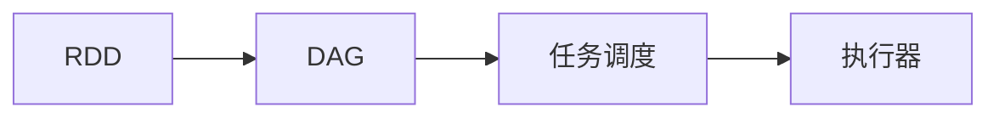

## 1. 背景介绍

### 1.1 大数据时代的数据处理挑战

随着互联网和物联网的飞速发展，全球数据量呈爆炸式增长，传统的基于磁盘的数据处理方式已经难以满足日益增长的数据处理需求。海量数据的存储、处理和分析成为了大数据时代亟待解决的关键挑战。

### 1.2 基于内存计算的解决方案

为了应对大数据带来的挑战，基于内存计算的技术应运而生。与传统的基于磁盘的计算方式相比，内存计算将数据加载到内存中进行处理，极大地提高了数据处理速度。

### 1.3 Spark内存计算引擎的优势

Apache Spark作为一款开源的分布式内存计算引擎，凭借其高效性、易用性和通用性等优势，迅速成为了大数据处理领域的主流技术之一。Spark的核心优势在于：

* **快速的数据处理速度:** Spark将数据加载到内存中进行处理，避免了频繁的磁盘IO操作，极大地提高了数据处理速度。
* **易于使用的编程接口:** Spark提供了丰富的API接口，支持Java、Scala、Python和R等多种编程语言，方便开发者进行应用程序开发。
* **通用的计算框架:** Spark支持多种计算模型，包括批处理、流处理、机器学习和图计算等，能够满足不同场景下的数据处理需求。

## 2. 核心概念与联系

### 2.1 RDD：弹性分布式数据集

RDD（Resilient Distributed Dataset，弹性分布式数据集）是Spark的核心抽象，它代表一个不可变的、可分区的数据集，分布在集群的多个节点上进行并行计算。

RDD的特点：

* **不可变性:** RDD一旦创建就不能修改，只能通过转换操作生成新的RDD。
* **分区性:** RDD可以被分成多个分区，每个分区可以存储在不同的节点上，实现数据的并行处理。
* **容错性:** RDD具有容错机制，当某个节点发生故障时，Spark可以根据血缘关系自动恢复丢失的数据。

### 2.2 DAG：有向无环图

DAG（Directed Acyclic Graph，有向无环图）是Spark用于描述计算任务执行流程的数据结构。每个节点代表一个RDD或一个计算操作，边代表RDD之间的依赖关系。

### 2.3 任务调度

Spark的任务调度器负责将DAG分解成多个任务，并将任务分配到集群中的不同节点上执行。Spark支持多种任务调度策略，例如FIFO、FAIR等。

### 2.4 核心概念之间的联系

RDD是Spark进行数据处理的基础，DAG描述了RDD之间的依赖关系和计算流程，任务调度器负责将计算任务分配到集群中执行。



## 3. 核心算法原理具体操作步骤

### 3.1 Transformation和Action

Spark提供了两种类型的操作：Transformation和Action。

* **Transformation:** Transformation操作用于对RDD进行转换，生成新的RDD。常见的Transformation操作包括map、filter、flatMap、reduceByKey等。
* **Action:** Action操作用于触发计算，并将结果返回给驱动程序或写入外部存储系统。常见的Action操作包括count、collect、saveAsTextFile等。

### 3.2 窄依赖和宽依赖

RDD之间的依赖关系分为窄依赖和宽依赖两种。

* **窄依赖:** 父RDD的每个分区最多被子RDD的一个分区使用。
* **宽依赖:** 父RDD的每个分区可能被子RDD的多个分区使用。

### 3.3 Shuffle操作

Shuffle操作是指将数据重新分布到不同的节点上进行处理的操作。Shuffle操作通常发生在宽依赖的情况下，例如reduceByKey、groupByKey等。

### 3.4 核心算法执行流程

1. 用户提交Spark应用程序，SparkContext初始化。
2. SparkContext构建DAG，描述RDD之间的依赖关系和计算流程。
3. 任务调度器将DAG分解成多个Stage，每个Stage包含多个Task。
4. 任务调度器将Task分配到集群中的不同节点上执行。
5. 执行器节点读取数据，执行计算任务，并将结果写入缓存或磁盘。
6. 所有Task执行完成后，SparkContext返回结果给用户或将结果写入外部存储系统。

## 4. 数学模型和公式详细讲解举例说明

### 4.1 WordCount案例分析

WordCount是Spark中最经典的案例之一，用于统计文本文件中每个单词出现的次数。

#### 4.1.1 算法原理

WordCount算法的原理是将文本文件按行切分成单词，然后对单词进行分组计数。

#### 4.1.2 数学模型

假设文本文件的内容为：

```
Spark is a fast and general engine for large-scale data processing.
Spark is built on top of Hadoop and can be run independently.
```

则WordCount的数学模型可以表示为：

```
wordCount = count(groupBy(flatMap(textFile, line => line.split(" "))))
```

其中：

* `textFile` 表示文本文件RDD。
* `flatMap` 操作将每行文本切分成单词。
* `groupBy` 操作将单词分组。
* `count` 操作统计每个单词出现的次数。

#### 4.1.3 公式推导

```
wordCount = count(groupBy(flatMap(textFile, line => line.split(" "))))

// 将flatMap操作展开
wordCount = count(groupBy([Spark, is, a, fast, and, general, engine, for, large-scale, data, processing., Spark, is, built, on, top, of, Hadoop, and, can, be, run, independently.]))

// 将groupBy操作展开
wordCount = count({
  Spark: [Spark, Spark],
  is: [is, is],
  a: [a],
  fast: [fast],
  and: [and, and],
  general: [general],
  engine: [engine],
  for: [for],
  large-scale: [large-scale],
   [data],
  processing.: [processing.],
  built: [built],
  on: [on, on],
  top: [top],
  of: [of, of],
  Hadoop: [Hadoop],
  can: [can],
  be: [be],
  run: [run],
  independently.: [independently.]
})

// 将count操作展开
wordCount = {
  Spark: 2,
  is: 2,
  a: 1,
  fast: 1,
  and: 2,
  general: 1,
  engine: 1,
  for: 1,
  large-scale: 1,
   1,
  processing.: 1,
  built: 1,
  on: 2,
  top: 1,
  of: 2,
  Hadoop: 1,
  can: 1,
  be: 1,
  run: 1,
  independently.: 1
}
```

## 5. 项目实践：代码实例和详细解释说明

### 5.1 WordCount代码实现

```scala
import org.apache.spark.SparkConf
import org.apache.spark.SparkContext

object WordCount {
  def main(args: Array[String]): Unit = {
    // 创建Spark配置
    val conf = new SparkConf().setAppName("WordCount")
    // 创建Spark上下文
    val sc = new SparkContext(conf)

    // 读取文本文件
    val textFile = sc.textFile("hdfs://path/to/textfile")

    // 计算单词出现次数
    val wordCounts = textFile
      .flatMap(line => line.split(" "))
      .map(word => (word, 1))
      .reduceByKey((a, b) => a + b)

    // 打印结果
    wordCounts.foreach(println)

    // 停止Spark上下文
    sc.stop()
  }
}
```

### 5.2 代码解释

1. 导入Spark相关的包。
2. 创建Spark配置和Spark上下文。
3. 使用`sc.textFile`方法读取文本文件，生成RDD。
4. 使用`flatMap`操作将每行文本切分成单词。
5. 使用`map`操作将每个单词映射成(word, 1)的形式。
6. 使用`reduceByKey`操作对相同单词的计数进行合并。
7. 使用`foreach`操作打印结果。
8. 停止Spark上下文。

## 6. 实际应用场景

### 6.1 数据清洗和预处理

Spark可以用于大规模数据的清洗和预处理，例如数据格式转换、数据去重、数据过滤等。

### 6.2 机器学习

Spark提供了MLlib机器学习库，可以用于构建各种机器学习模型，例如分类、回归、聚类等。

### 6.3 图计算

Spark提供了GraphX图计算库，可以用于处理大规模图数据，例如社交网络分析、推荐系统等。

### 6.4 实时数据分析

Spark Streaming是Spark的流处理框架，可以用于实时数据分析，例如网站流量分析、用户行为分析等。

## 7. 工具和资源推荐

### 7.1 Spark官方文档

Spark官方文档提供了丰富的学习资料，包括编程指南、API文档、示例代码等。

### 7.2 Spark书籍

* 《Spark快速大数据分析》
* 《Spark机器学习》
* 《Spark图计算》

### 7.3 Spark社区

Spark拥有活跃的社区，开发者可以在社区中交流技术问题、分享经验。

## 8. 总结：未来发展趋势与挑战

### 8.1 未来发展趋势

* **更快的处理速度:** 随着硬件技术的不断发展，Spark的处理速度将会越来越快。
* **更广泛的应用场景:** Spark将会应用到更广泛的领域，例如人工智能、物联网等。
* **更易用的开发体验:** Spark的开发工具和API将会更加完善，降低开发者的学习成本。

### 8.2 面临的挑战

* **数据安全和隐私保护:** 随着数据量的不断增长，数据安全和隐私保护成为了一个重要的问题。
* **集群管理和资源调度:** Spark集群的管理和资源调度是一个复杂的问题，需要不断优化。
* **与其他技术的融合:** Spark需要与其他技术进行融合，例如深度学习、云计算等。

## 9. 附录：常见问题与解答

### 9.1 Spark与Hadoop的区别是什么？

Spark和Hadoop都是大数据处理框架，但它们的设计理念和应用场景有所不同。Hadoop主要用于批处理，而Spark支持批处理、流处理、机器学习和图计算等多种计算模型。Spark的处理速度比Hadoop更快，因为它将数据加载到内存中进行处理。

### 9.2 Spark如何保证数据可靠性？

Spark通过RDD的容错机制来保证数据可靠性。当某个节点发生故障时，Spark可以根据血缘关系自动恢复丢失的数据。

### 9.3 Spark如何进行性能调优？

Spark性能调优是一个复杂的过程，需要考虑多个方面，例如数据分区、任务并行度、内存管理等。