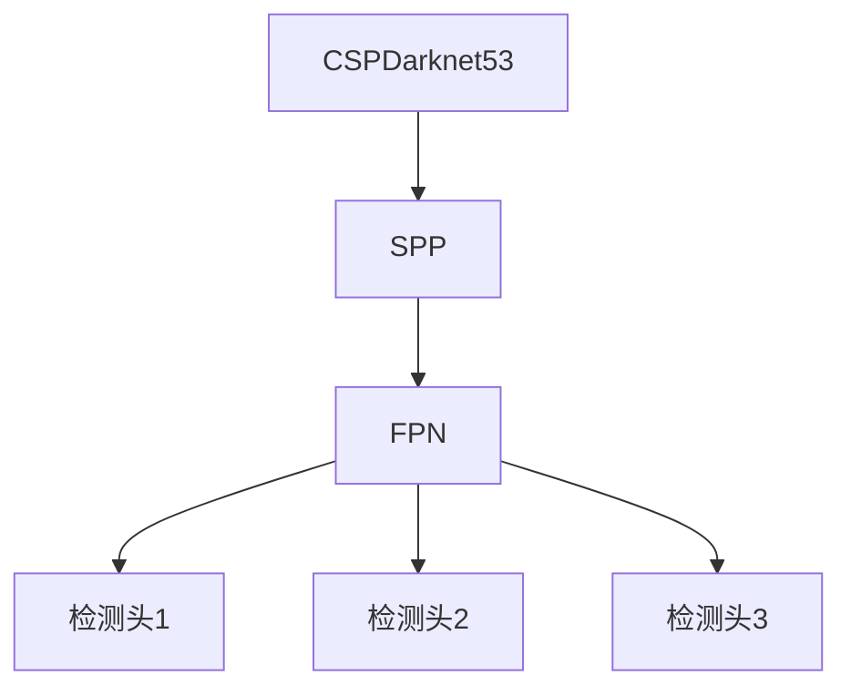

# YOLOv4原理与代码实例讲解

## 1. 背景介绍

### 1.1 目标检测任务概述

目标检测是计算机视觉领域的一个核心任务,旨在从图像或视频中找出感兴趣目标的位置并识别其类别。准确高效的目标检测技术在诸多领域有着广泛的应用,例如安防监控、自动驾驶、机器人视觉等。

### 1.2 目标检测发展历程

早期的目标检测算法主要基于传统的机器学习方法,如滑动窗口+手工特征+分类器的管道。该类算法存在计算复杂度高、泛化能力差等缺陷。2012年AlexNet的提出促进了深度学习在计算机视觉领域的发展,基于深度卷积神经网络(CNN)的目标检测算法逐渐占据主导地位。

### 1.3 YOLO系列算法简介  

YOLO(You Only Look Once)是一种基于端到端的单阶段目标检测算法。相比于两阶段目标检测算法(如Faster R-CNN),YOLO在检测速度上有明显优势,被广泛应用于实时目标检测任务。YOLO系列算法经过不断改进和优化,目前最新版本为YOLOv4。

## 2. 核心概念与联系

### 2.1 单阶段目标检测

单阶段目标检测算法将目标定位和目标分类作为一个回归问题同时解决,整个过程只包含一个神经网络,因此具有很高的计算效率。YOLOv4作为单阶段算法的代表,其核心思想是:

1. 将输入图像划分为S×S个网格
2. 每个网格需要预测B个边界框以及相应的置信度
3. 置信度由边界框置信度和类别置信度组成

### 2.2 锚框机制

为了更好地匹配不同形状和大小的目标,YOLOv4采用了先验锚框(anchor box)的概念。每个网格预测的边界框都是基于预先设定的一系列锚框进行调整得到的。合理设置锚框尺寸和形状有助于提高检测精度。

### 2.3 特征金字塔

为了检测不同尺度的目标,YOLOv4使用了特征金字塔网络(FPN)结构,在不同尺度的特征层上同时进行预测。这种多尺度特征融合的方式有利于提高小目标和大目标的检测能力。

## 3. 核心算法原理具体操作步骤

### 3.1 网络架构

YOLOv4的主干网络采用了CSPDarknet53,通过结构化的设计实现了高效的特征提取。CSPDarknet53由多个残差模块和CSP(Cross Stage Partial)模块组成,能够有效提取丰富的语义信息。

### 3.2 特征金字塔网络(FPN)

YOLOv4在CSPDarknet53的输出特征上构建了FPN结构,如下图所示:



其中SPP(Spatial Pyramid Pooling)模块用于增强感受野,FPN则负责融合不同尺度的特征。YOLOv4在三个不同尺度的FPN层上并行预测,从而增强了对不同尺度目标的检测能力。

### 3.3 检测头

每个检测头会为每个网格预测以下内容:

- B个边界框 
- 每个边界框对应的置信度和类别概率

置信度由两部分组成:

1. 边界框置信度(objectness score),表示该边界框内是否存在目标
2. 类别置信度(class score),表示目标属于每个类别的概率

边界框的坐标和尺寸通过预测的偏移量与锚框相结合得到。

### 3.4 损失函数

YOLOv4的损失函数由三部分组成:

1. 边界框坐标损失 $L_{box}$
2. 目标置信度损失 $L_{obj}$  
3. 类别概率损失 $L_{cls}$

总损失函数为:

$$L = L_{box} + L_{obj} + L_{cls}$$

通过最小化总损失,网络可以学习到准确的边界框坐标、目标置信度和类别概率。

### 3.5 训练策略

除了网络结构优化,YOLOv4还采用了一些训练技巧提升性能,包括:

- 数据增强:混合精度训练、Mosaic数据增强等
- 正则化:DropBlock正则化、CIoU损失等
- 自适应锚框聚类

## 4. 数学模型和公式详细讲解举例说明

### 4.1 边界框编码

YOLOv4采用了一种高效的边界框编码方式。对于第i个网格的第j个锚框,其预测的边界框 $\hat{y}$ 由以下4个值编码:

$$\hat{y} = (t_x, t_y, t_w, t_h)$$

其中 $(t_x, t_y)$ 表示预测框中心相对于网格的偏移量, $(t_w, t_h)$ 表示预测框的宽高比例。具体计算公式为:

$$
\begin{aligned}
t_x &= (x - x_i)/w_i \\
t_y &= (y - y_i)/h_i \\
t_w &= \log(w/w_a) \\
t_h &= \log(h/h_a)
\end{aligned}
$$

其中 $(x, y, w, h)$ 为预测框的中心坐标、宽高, $(x_i, y_i, w_i, h_i)$ 为第i个网格的坐标和宽高, $(w_a, h_a)$ 为与预测框最匹配的锚框的宽高。

通过这种编码方式,网络只需要预测小的偏移量,从而简化了优化目标。

### 4.2 CIoU损失

传统的IoU(Intersection over Union)损失函数存在不足,例如对于相同IoU值,无法区分两个框的包围程度。为了解决这一问题,YOLOv4采用了CIoU(Complete IoU)损失,其定义为:

$$
\text{CIoU} = \text{IoU} - \frac{\rho^2(b, b^{gt})}{c^2} - \alpha v
$$

其中:

- $\rho^2(b, b^{gt})$ 表示预测框 $b$ 和真实框 $b^{gt}$ 的中心距离
- $c^2$ 是两个框的最小闭包区域的对角线长度
- $\alpha$ 是一个正则化常数
- $v$ 表示长宽比的一致性,即 $4/\pi^2(arctan(w^{gt}/h^{gt}) - arctan(w/h))^2$

CIoU损失不仅考虑了两个框的重叠程度,还纳入了中心距离和长宽比一致性,从而更好地反映了两个框的差异。

### 4.3 锚框聚类

为了得到合适的先验锚框,YOLOv4采用了k-means++聚类算法对训练集中的真实框进行聚类。具体步骤如下:

1. 计算训练集中所有真实框的宽高比 $r = w/h$
2. 将宽高比 $r$ 作为特征,使用k-means++聚类算法将其分为k个簇
3. 每个簇的中心点即为一个锚框的宽高比
4. 根据每个簇中真实框的宽高,计算出锚框的绝对尺寸

通过这种方式,可以得到能够较好匹配训练集真实框的锚框集合。

## 4. 项目实践:代码实例和详细解释说明

以下是使用PyTorch实现YOLOv4目标检测的简化示例代码,并对关键部分进行了详细解释。完整代码请参考 [官方实现](https://github.com/AlexeyAB/darknet)。

### 4.1 模型定义

```python
import torch
import torch.nn as nn

# 残差模块
class ResBlock(nn.Module):
    ...

# CSPDarknet53主干网络  
class CSPDarknet(nn.Module):
    ...
    
# YOLOv4模型
class YOLOv4(nn.Module):
    def __init__(self, num_classes=80):
        super().__init__()
        
        # 主干网络
        self.backbone = CSPDarknet()
        
        # FPN结构
        self.fpn = FPN(...)
        
        # 三个检测头
        self.head1 = YOLOHead(...)
        self.head2 = YOLOHead(...)
        self.head3 = YOLOHead(...)
        
    def forward(self, x):
        # 主干网络提取特征
        x = self.backbone(x)
        
        # FPN融合多尺度特征
        x = self.fpn(x)
        
        # 三个检测头并行预测
        out1 = self.head1(x[0])
        out2 = self.head2(x[1]) 
        out3 = self.head3(x[2])
        
        return out1, out2, out3
        
# 检测头        
class YOLOHead(nn.Module):
    def __init__(self, ...):
        ...
        
    def forward(self, x):
        # 预测边界框、置信度和类别概率
        ...
        return x
```

在 `YOLOv4` 模型中,`CSPDarknet` 充当主干网络提取特征, `FPN` 模块融合不同尺度的特征,三个 `YOLOHead` 在不同尺度上并行预测边界框、置信度和类别概率。

### 4.2 损失函数计算

```python
import torch.nn.functional as F

def ciou_loss(boxes1, boxes2):
    # 计算CIoU损失
    ...
    return ciou

def yolov4_loss(pred, target, anchors):
    # 准备
    num_anchors = pred.shape[1] // (5 + num_classes)
    anchors = anchors.to(pred.device)
    ...
    
    # 遍历每个网格和锚框
    for i in range(pred.shape[0]):
        for j in range(pred.shape[2]):
            for k in range(num_anchors):
                # 解码预测的边界框
                box = decode_boxes(pred[i, k*5:k*5+4, j, ...], anchors[k])
                
                # 计算边界框损失
                if obj[i, j, k]:
                    box_loss += ciou_loss(box, gt_box)
                    
                # 计算置信度损失    
                obj_loss += ...
                
                # 计算类别损失
                cls_loss += ...
                
    # 合并总损失
    total_loss = box_loss + obj_loss + cls_loss
    
    return total_loss
```

`yolov4_loss` 函数根据网络预测和真实标签计算总损失。首先利用 `decode_boxes` 函数从预测值解码出边界框坐标,然后遍历每个网格和锚框,分别计算边界框损失 `box_loss`、置信度损失 `obj_loss` 和类别损失 `cls_loss`。其中,边界框损失使用了 CIoU 损失函数。最后,将三部分损失相加得到总损失 `total_loss`。

### 4.3 模型推理

```python
def yolov4_inference(model, img, conf_thres=0.5, iou_thres=0.5):
    # 预处理输入
    img = preprocess(img)
    
    # 模型推理
    with torch.no_grad():
        outputs = model(img)
    
    # 非极大值抑制
    boxes = []
    for output in outputs:
        boxes.append(nms(output, conf_thres, iou_thres))
        
    # 后处理
    boxes = postprocess(boxes)
    
    return boxes
```

`yolov4_inference` 函数实现了 YOLOv4 模型的推理过程。首先对输入图像进行预处理,然后将其输入模型进行前向推理,得到三个检测头的输出 `outputs`。对于每个输出,使用非极大值抑制 `nms` 过滤掉置信度较低和重叠较多的边界框。最后,对剩余的边界框进行后处理,得到最终的检测结果 `boxes`。

## 5. 实际应用场景

YOLOv4作为高效准确的实时目标检测算法,可以广泛应用于以下场景:

1. **安防监控**: 在视频监控系统中,YOLOv4可以实时检测出可疑人员、车辆等目标,提高监控效率。

2. **自动驾驶**: 在自动驾驶汽车的视觉感知系统中,YOLOv4可以实时检测路面上的行人、车辆、障碍物等,为决策和控制提供重要输入。

3. **机器人视觉**: 在工业机器人和服务机器人