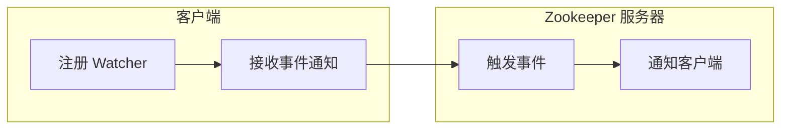

# Zookeeper Watcher机制原理与代码实例讲解

作者：禅与计算机程序设计艺术

## 1. 背景介绍

### 1.1 分布式系统中的挑战

随着互联网的快速发展，单体应用已经无法满足日益增长的业务需求。分布式系统应运而生，它将一个大型系统拆分成多个独立的服务模块，通过网络进行协同工作。然而，分布式系统也带来了许多挑战，例如：

* **数据一致性：**如何保证分布式系统中各个节点的数据一致性？
* **服务发现：**服务提供者如何将自己的地址信息注册到服务注册中心，服务消费者如何从服务注册中心获取服务提供者的地址信息？
* **配置管理：**如何实现分布式系统中配置信息的动态更新？
* **分布式锁：**如何实现分布式系统中的互斥访问控制？

### 1.2 Zookeeper 简介

Zookeeper 是一个开源的分布式协调服务，它可以帮助我们解决上述问题。Zookeeper 提供了一种简单易用的接口，可以用于：

* **数据发布/订阅：**客户端可以将数据发布到 Zookeeper 节点上，其他客户端可以订阅该节点的数据变化通知。
* **分布式协调：**Zookeeper 可以用于实现分布式锁、选举领导者等功能。
* **命名服务：**Zookeeper 可以作为分布式系统的命名服务，用于存储和管理服务地址信息。

### 1.3 Zookeeper Watcher机制

Zookeeper 的 Watcher 机制是其核心功能之一，它允许客户端注册监听器，以便在 Zookeeper 节点数据发生变化时收到通知。Watcher 机制是 Zookeeper 实现数据发布/订阅、分布式协调等功能的基础。

## 2. 核心概念与联系

### 2.1 Znode

Zookeeper 中的数据存储结构类似于文件系统，以树形结构组织。树中的每个节点称为 Znode，每个 Znode 可以存储数据，也可以作为其他 Znode 的父节点。

### 2.2 Watcher

Watcher 是一个接口，它定义了当 Zookeeper 节点数据发生变化时要执行的回调方法。

```java
public interface Watcher {
    void process(WatchedEvent event);
}
```

### 2.3 WatchedEvent

WatchedEvent 对象包含了 Zookeeper 节点数据变化的详细信息，例如：

* 事件类型：节点创建、节点删除、节点数据修改、子节点变化等。
* 事件状态：连接、断开连接、会话过期等。
* 节点路径：发生变化的节点路径。

### 2.4 Watcher机制的工作流程

1. 客户端向 Zookeeper 服务器注册 Watcher，并指定要监听的 Znode。
2. 当被监听的 Znode 发生变化时，Zookeeper 服务器会触发 Watcher 事件，并通知所有注册了该 Watcher 的客户端。
3. 客户端收到 Watcher 事件后，可以执行相应的业务逻辑。

**Mermaid流程图：**



## 3. 核心算法原理具体操作步骤

### 3.1 Watcher 注册

客户端可以通过以下方法注册 Watcher：

* `getData(String path, Watcher watcher, Stat stat)`：获取节点数据，并注册 Watcher。
* `getChildren(String path, Watcher watcher, Stat stat)`：获取子节点列表，并注册 Watcher。
* `exists(String path, Watcher watcher)`：检查节点是否存在，并注册 Watcher。

### 3.2 Watcher 触发

当被监听的 Znode 发生变化时，Zookeeper 服务器会触发 Watcher 事件。Watcher 事件分为以下几种类型：

* `NodeCreated`：节点创建事件。
* `NodeDeleted`：节点删除事件。
* `NodeDataChanged`：节点数据修改事件。
* `NodeChildrenChanged`：子节点变化事件。

### 3.3 Watcher 通知

Zookeeper 服务器会将 Watcher 事件异步通知给客户端。客户端可以通过实现 `Watcher` 接口，并在 `process()` 方法中处理事件通知。

### 3.4 Watcher 特点

* **一次性：**Watcher 是一次性的，触发后就会被移除。如果需要继续监听，需要重新注册。
* **异步：**Watcher 事件是异步触发的，客户端不需要阻塞等待事件通知。
* **轻量级：**Watcher 的注册和触发都非常轻量级，不会对 Zookeeper 服务器造成太大负担。

## 4. 数学模型和公式详细讲解举例说明

Zookeeper Watcher 机制没有复杂的数学模型和公式。

## 5. 项目实践：代码实例和详细解释说明

### 5.1 Maven 依赖

```xml
<dependency>
    <groupId>org.apache.zookeeper</groupId>
    <artifactId>zookeeper</artifactId>
    <version>3.7.0</version>
</dependency>
```

### 5.2 代码实例

```java
import org.apache.zookeeper.*;
import org.apache.zookeeper.data.Stat;

import java.io.IOException;
import java.util.List;
import java.util.concurrent.CountDownLatch;

public class ZookeeperWatcherExample {

    private static final String CONNECT_STRING = "localhost:2181";
    private static final int SESSION_TIMEOUT = 5000;

    public static void main(String[] args) throws IOException, InterruptedException, KeeperException {
        // 创建 ZooKeeper 连接
        CountDownLatch connectedSignal = new CountDownLatch(1);
        ZooKeeper zk = new ZooKeeper(CONNECT_STRING, SESSION_TIMEOUT, new Watcher() {
            @Override
            public void process(WatchedEvent event) {
                if (event.getState() == Event.KeeperState.SyncConnected) {
                    connectedSignal.countDown();
                }
            }
        });
        connectedSignal.await();

        // 创建节点
        String nodePath = "/my_node";
        zk.create(nodePath, "hello".getBytes(), ZooDefs.Ids.OPEN_ACL_UNSAFE, CreateMode.PERSISTENT);

        // 获取节点数据并注册 Watcher
        Stat stat = new Stat();
        byte[] data = zk.getData(nodePath, new Watcher() {
            @Override
            public void process(WatchedEvent event) {
                System.out.println("Node data changed: " + event);
            }
        }, stat);
        System.out.println("Node  " + new String(data));

        // 修改节点数据
        zk.setData(nodePath, "world".getBytes(), stat.getVersion());

        // 获取子节点列表并注册 Watcher
        List<String> children = zk.getChildren("/", new Watcher() {
            @Override
            public void process(WatchedEvent event) {
                System.out.println("Children changed: " + event);
            }
        }, stat);
        System.out.println("Children: " + children);

        // 创建子节点
        zk.create("/my_node/child", "child".getBytes(), ZooDefs.Ids.OPEN_ACL_UNSAFE, CreateMode.PERSISTENT);

        // 关闭连接
        zk.close();
    }
}
```

### 5.3 代码解释

1. **创建 ZooKeeper 连接：**使用 `ZooKeeper` 构造函数创建 ZooKeeper 连接，并注册连接状态监听器。
2. **创建节点：**使用 `create()` 方法创建节点。
3. **获取节点数据并注册 Watcher：**使用 `getData()` 方法获取节点数据，并注册 `Watcher` 监听节点数据变化。
4. **修改节点数据：**使用 `setData()` 方法修改节点数据。
5. **获取子节点列表并注册 Watcher：**使用 `getChildren()` 方法获取子节点列表，并注册 `Watcher` 监听子节点变化。
6. **创建子节点：**使用 `create()` 方法创建子节点。
7. **关闭连接：**使用 `close()` 方法关闭 ZooKeeper 连接。

## 6. 实际应用场景

* **配置中心：**Zookeeper 可以作为分布式系统的配置中心，客户端可以监听配置节点的变化，实现配置信息的动态更新。
* **服务发现：**服务提供者可以将自己的地址信息注册到 Zookeeper 节点上，服务消费者可以监听该节点的变化，实现服务发现。
* **分布式锁：**Zookeeper 可以用于实现分布式锁，例如使用临时顺序节点实现公平锁。
* **Master 选举：**Zookeeper 可以用于实现 Master 选举，例如使用临时节点实现 Master 选举。

## 7. 工具和资源推荐

* **ZooKeeper 官网：**https://zookeeper.apache.org/
* **Curator：**Netflix 开源的 ZooKeeper 客户端框架，提供了更高级的 API 和功能。

## 8. 总结：未来发展趋势与挑战

Zookeeper 作为一款成熟的分布式协调服务，在未来仍将扮演重要角色。未来发展趋势包括：

* **更高的性能和可扩展性：**随着分布式系统的规模越来越大，Zookeeper 需要不断提升性能和可扩展性。
* **更丰富的功能：**Zookeeper 可以扩展更多功能，例如分布式事务、消息队列等。
* **与云原生技术的融合：**Zookeeper 需要更好地与云原生技术融合，例如 Kubernetes、Service Mesh 等。

## 9. 附录：常见问题与解答

### 9.1 Watcher 丢失问题

由于 Watcher 是一次性的，如果在 Watcher 触发之前网络发生中断，客户端可能会丢失 Watcher 事件。解决方法：

* 使用 Curator 等客户端框架，它们提供了 Watcher 丢失自动重连机制。
* 在业务逻辑中处理 Watcher 丢失的情况，例如重新注册 Watcher。

### 9.2 Zookeeper 集群脑裂问题

Zookeeper 集群脑裂是指集群中出现了多个 Master 节点，导致数据不一致。解决方法：

* 正确配置 Zookeeper 集群，确保集群中只有一个 Master 节点。
* 使用 Zookeeper 的选举机制，自动解决脑裂问题。
