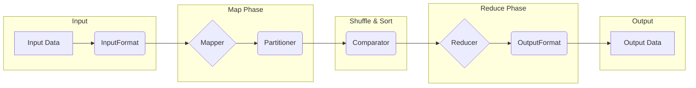

# 【AI大数据计算原理与代码实例讲解】MapReduce

作者：禅与计算机程序设计艺术

## 1. 背景介绍

### 1.1 大数据时代的数据处理挑战

随着互联网、物联网、社交媒体等技术的快速发展，全球数据量呈爆炸式增长，我们已步入大数据时代。海量数据的出现为各行各业带来了前所未有的机遇，同时也带来了巨大的挑战，尤其是在数据处理方面。传统的单机处理模式已经无法满足大数据处理的需求，主要体现在以下几个方面：

* **数据量巨大:**  PB 级甚至 EB 级的数据量对存储和处理能力提出了严峻挑战。
* **数据类型多样:**  除了传统的结构化数据，大数据还包括文本、图像、视频等非结构化数据，处理难度更大。
* **数据价值密度低:**  大数据中蕴含着巨大的价值，但价值密度相对较低，需要高效的分析工具才能挖掘其价值。

### 1.2  MapReduce：一种并行计算框架

为了应对大数据带来的挑战，Google 在 2004 年提出了一种基于分布式计算的并行编程模型——MapReduce。MapReduce 的核心思想是将一个大规模的计算任务分解成多个小的子任务，并将这些子任务分配到集群中的多个节点上并行执行，最终将所有节点的计算结果汇总得到最终结果。这种分布式计算模式可以有效地解决大数据处理中的存储和计算瓶颈问题，大大提高了数据处理效率。

### 1.3 MapReduce 的优势

MapReduce 作为一种通用的并行计算框架，具有以下优势：

* **易于编程:**  MapReduce 提供了简单易用的编程接口，用户只需编写 Map 和 Reduce 两个函数即可实现复杂的并行计算逻辑。
* **高容错性:**  MapReduce 框架能够自动处理节点故障，保证任务的可靠执行。
* **良好的可扩展性:**  用户可以根据数据规模和计算需求灵活地调整集群规模，实现水平扩展。
* **广泛的适用性:**  MapReduce 可以应用于各种数据处理场景，例如数据清洗、数据分析、机器学习等。

## 2. 核心概念与联系

### 2.1 MapReduce 计算模型

MapReduce 计算模型的核心思想是将一个大规模的计算任务分解成 Map 和 Reduce 两个阶段：

* **Map 阶段:**  将输入数据切片成多个独立的数据块，每个数据块由一个 Map 任务并行处理。Map 任务对输入数据进行处理，并生成键值对作为中间结果输出。
* **Reduce 阶段:**  将 Map 阶段生成的中间结果按照键进行分组，每个键对应一个 Reduce 任务。Reduce 任务对相同键的多个值进行汇总计算，并输出最终结果。

### 2.2  核心概念

* **InputFormat:**  定义了如何将输入数据切片成多个数据块，并为每个数据块创建一个 Map 任务。
* **Mapper:**  用户自定义的 Map 函数，用于处理输入数据并生成键值对作为中间结果。
* **Partitioner:**  根据键的哈希值将中间结果划分到不同的 Reduce 任务。
* **Comparator:**  用于对 Reduce 任务的输入数据进行排序。
* **Reducer:**  用户自定义的 Reduce 函数，用于对相同键的多个值进行汇总计算，并输出最终结果。
* **OutputFormat:**  定义了如何将 Reduce 任务的输出结果写入到存储系统中。

### 2.3  概念间联系

下图展示了 MapReduce 各个核心概念之间的联系：




## 3. 核心算法原理具体操作步骤

### 3.1  Map 阶段

1. **数据切片:**  InputFormat 将输入数据切片成多个数据块，每个数据块对应一个 Map 任务。
2. **数据读取:**  每个 Map 任务从对应的数据块中读取数据。
3. **数据处理:**  Map 任务调用用户自定义的 Map 函数对读取到的数据进行处理，并生成键值对作为中间结果。
4. **数据写入:**  Map 任务将生成的中间结果写入到本地磁盘。

### 3.2  Shuffle & Sort 阶段

1. **数据分区:**  Partitioner 根据键的哈希值将 Map 任务输出的中间结果划分到不同的 Reduce 任务。
2. **数据传输:**  Map 任务将属于同一个 Reduce 任务的中间结果传输到该 Reduce 任务所在的节点。
3. **数据合并:**  Reduce 任务接收到所有 Map 任务传输过来的中间结果后，将它们合并成一个大的数据集。
4. **数据排序:**  Comparator 对 Reduce 任务合并后的数据集按照键进行排序。

### 3.3  Reduce 阶段

1. **数据分组:**  Reduce 任务根据键将排序后的数据集分组，每个键对应一个组。
2. **数据处理:**  Reduce 任务对每个组调用用户自定义的 Reduce 函数进行处理，并将处理结果输出。
3. **数据写入:**  Reduce 任务将最终结果写入到 OutputFormat 指定的存储系统中。


## 4. 数学模型和公式详细讲解举例说明

### 4.1 词频统计

词频统计是 MapReduce 的一个经典应用场景，用于统计文本文件中每个单词出现的频率。

#### 4.1.1 Map 函数

Map 函数的输入是文本文件中的一行内容，输出是多个键值对，键是单词，值是该单词在该行内容中出现的次数，例如：

```
输入: "hello world hello"
输出: ("hello", 1), ("world", 1), ("hello", 1)
```

#### 4.1.2 Reduce 函数

Reduce 函数的输入是相同单词的所有键值对，输出是该单词在整个文本文件中出现的总次数，例如：

```
输入: ("hello", [1, 1]), ("world", [1])
输出: ("hello", 2), ("world", 1)
```

#### 4.1.3 数学模型

假设文本文件中有 $n$ 行内容，单词 $w$ 在第 $i$ 行内容中出现的次数为 $c_i$，则单词 $w$ 在整个文本文件中出现的总次数为：

$$
count(w) = \sum_{i=1}^n c_i
$$


## 5. 项目实践：代码实例和详细解释说明

### 5.1  WordCount 程序

以下是用 Java 编写的 WordCount 程序示例：

```java
import org.apache.hadoop.conf.Configuration;
import org.apache.hadoop.fs.Path;
import org.apache.hadoop.io.IntWritable;
import org.apache.hadoop.io.Text;
import org.apache