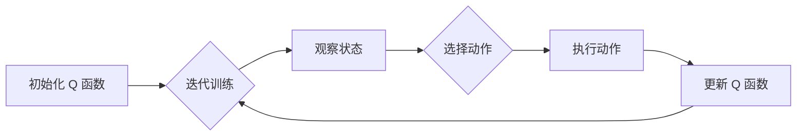

# 一切皆是映射：AI Q-learning在图片分割中的应用

作者：禅与计算机程序设计艺术

## 1. 背景介绍

### 1.1 图片分割：计算机视觉的基石

图片分割是计算机视觉领域的一项基础性任务，其目标是将图像分割成多个具有语义意义的区域，每个区域代表一个对象或场景的一部分。这项技术在许多领域都有着广泛的应用，例如：

* **自动驾驶**:  识别道路、车辆、行人等，为自动驾驶系统提供决策依据。
* **医学影像分析**:  分割肿瘤、器官等，辅助医生进行诊断和治疗。
* **机器人视觉**:  识别物体、场景，帮助机器人理解环境并执行任务。
* **增强现实**:  将虚拟对象与现实场景融合，提供更具沉浸感的体验。

### 1.2  深度学习驱动下的技术革新

近年来，深度学习技术在图像分割领域取得了突破性进展，特别是卷积神经网络（CNN）的出现，使得图像分割的精度和效率都得到了显著提升。然而，传统的基于CNN的图像分割方法通常需要大量的标注数据进行训练，这在实际应用中往往成本高昂且难以获取。

### 1.3 强化学习：从交互中学习分割

强化学习（Reinforcement Learning, RL）作为一种新兴的机器学习范式，为解决上述问题提供了新的思路。与传统的监督学习不同，强化学习不需要预先提供大量的标注数据，而是让智能体（Agent）通过与环境的交互来学习最优策略。

**Q-learning** 作为强化学习的一种经典算法，在很多领域都取得了成功应用。将 Q-learning 应用于图像分割，可以使智能体在与图像环境交互的过程中，逐步学习到最优的分割策略，从而减少对标注数据的依赖。

## 2. 核心概念与联系

### 2.1 Q-learning：价值迭代的艺术

Q-learning 是一种基于价值迭代的强化学习算法，其核心思想是通过学习一个状态-动作值函数 (Q 函数) 来评估在特定状态下采取特定动作的长期价值。Q 函数的更新公式如下：

$$Q(s_t, a_t) \leftarrow Q(s_t, a_t) + \alpha [r_{t+1} + \gamma \max_{a} Q(s_{t+1}, a) - Q(s_t, a_t)]$$

其中：

* $s_t$ 表示 t 时刻的状态
* $a_t$ 表示 t 时刻采取的动作
* $r_{t+1}$ 表示在状态 $s_t$ 下采取动作 $a_t$ 后获得的奖励
* $s_{t+1}$ 表示 t+1 时刻的状态
* $\alpha$ 为学习率
* $\gamma$ 为折扣因子，用于平衡当前奖励和未来奖励之间的权衡

### 2.2 图片分割中的状态、动作与奖励

在将 Q-learning 应用于图像分割时，需要将图像分割问题建模成一个强化学习问题。

* **状态**:  可以将图像的像素或区域作为状态。例如，可以使用图像的像素坐标、颜色、纹理特征等信息来表示状态。
* **动作**:  可以将分割操作作为动作。例如，可以定义“将当前像素标记为前景”或“将当前像素标记为背景”等动作。
* **奖励**:  可以根据分割结果的质量来定义奖励函数。例如，可以使用分割结果与 ground truth 之间的 IoU (Intersection over Union) 作为奖励。

### 2.3  一切皆是映射：Q 函数的表征

在 Q-learning 中，Q 函数通常使用表格或函数逼近器来表示。

* **表格**:  适用于状态和动作空间都比较小的情况。
* **函数逼近器**:  适用于状态和动作空间较大或连续的情况，例如可以使用神经网络作为函数逼近器。

在图像分割中，由于状态和动作空间通常都比较大，因此通常使用神经网络来表示 Q 函数。

## 3. 核心算法原理具体操作步骤

### 3.1  基于 Q-learning 的图像分割算法流程

基于 Q-learning 的图像分割算法的基本流程如下：

1. **初始化 Q 函数**:  随机初始化 Q 函数，或者使用预训练的模型进行初始化。
2. **迭代训练**:
   *  **观察状态**:  从环境中观察当前状态 $s_t$。
   *  **选择动作**:  根据当前状态 $s_t$ 和 Q 函数，选择一个动作 $a_t$。常见的动作选择策略包括 ε-greedy 策略和 softmax 策略。
   *  **执行动作**:  执行选择的动作 $a_t$，并观察环境的反馈，得到奖励 $r_{t+1}$ 和下一个状态 $s_{t+1}$。
   *  **更新 Q 函数**:  根据 Q 函数更新公式，更新 Q 函数的值。
3. **重复步骤 2，直到 Q 函数收敛**。

### 3.2  动作选择策略

* **ε-greedy 策略**:  以概率 ε 选择一个随机动作，以概率 1-ε 选择 Q 值最大的动作。
* **softmax 策略**:  根据 Q 值计算每个动作的概率，并根据概率选择动作。

### 3.3  Q 函数更新

Q 函数的更新可以使用梯度下降等优化算法来实现。

### 3.4  算法流程图




## 4. 数学模型和公式详细讲解举例说明

### 4.1  Q 函数的数学表达

在图像分割中，可以使用深度神经网络来表示 Q 函数，例如：

$$Q(s, a; \theta) = f_{\theta}(s, a)$$

其中：

* $s$ 表示图像的特征表示，例如可以使用 CNN 提取的特征图。
* $a$ 表示分割动作，例如可以使用 one-hot 编码表示。
* $\theta$ 表示神经网络的参数。
* $f_{\theta}$ 表示神经网络。

### 4.2  奖励函数的设计

奖励函数的设计对于 Q-learning 的性能至关重要。在图像分割中，可以使用分割结果与 ground truth 之间的 IoU 作为奖励：

$$r = IoU(S, S_{gt})$$

其中：

* $S$ 表示智能体预测的分割结果。
* $S_{gt}$ 表示 ground truth 分割结果。

### 4.3  损失函数的设计

可以使用 Q-learning 的目标函数作为损失函数：

$$L(\theta) = \mathbb{E}[(r + \gamma \max_{a'} Q(s', a'; \theta) - Q(s, a; \theta))^2]$$

其中：

* $s$ 表示当前状态。
* $a$ 表示当前动作。
* $r$ 表示当前奖励。
* $s'$ 表示下一个状态。
* $\gamma$ 表示折扣因子。

### 4.4  举例说明

假设要对一张包含猫和狗的图像进行分割，可以使用 Q-learning 来训练一个智能体，使其能够自动将图像分割成猫和狗两个区域。

* **状态**:  可以使用图像的像素坐标和颜色信息来表示状态。
* **动作**:  可以定义“将当前像素标记为猫”和“将当前像素标记为狗”两个动作。
* **奖励**:  可以使用分割结果与 ground truth 之间的 IoU 作为奖励。

智能体通过与图像环境交互，不断尝试不同的分割策略，并根据奖励信号来更新 Q 函数。最终，智能体将学习到一个最优的分割策略，能够以较高的 IoU 将图像分割成猫和狗两个区域。


## 5. 项目实践：代码实例和详细解释说明

```python
import torch
import torch.nn as nn
import torch.optim as optim

# 定义 Q 网络
class QNetwork(nn.Module):
    def __init__(self, input_dim, output_dim):
        super(QNetwork, self).__init__()
        # 定义网络结构
        self.fc1 = nn.Linear(input_dim, 128)
        self.fc2 = nn.Linear(128, 64)
        self.fc3 = nn.Linear(64, output_dim)

    def forward(self, x):
        # 前向传播
        x = torch.relu(self.fc1(x))
        x = torch.relu(self.fc2(x))
        x = self.fc3(x)
        return x

# 定义智能体
class Agent:
    def __init__(self, state_dim, action_dim, learning_rate, gamma, epsilon):
        self.state_dim = state_dim
        self.action_dim = action_dim
        self.learning_rate = learning_rate
        self.gamma = gamma
        self.epsilon = epsilon

        # 初始化 Q 网络
        self.q_network = QNetwork(state_dim, action_dim)
        # 定义优化器
        self.optimizer = optim.Adam(self.q_network.parameters(), lr=learning_rate)

    def select_action(self, state):
        # ε-greedy 策略选择动作
        if torch.rand(1) < self.epsilon:
            # 随机选择动作
            action = torch.randint(self.action_dim, (1,))
        else:
            # 选择 Q 值最大的动作
            with torch.no_grad():
                q_values = self.q_network(state)
                action = torch.argmax(q_values)
        return action

    def update_q_network(self, state, action, reward, next_state, done):
        # 计算目标 Q 值
        with torch.no_grad():
            if done:
                target_q_value = reward
            else:
                next_q_values = self.q_network(next_state)
                max_next_q_value = torch.max(next_q_values)
                target_q_value = reward + self.gamma * max_next_q_value

        # 计算当前 Q 值
        current_q_value = self.q_network(state)[action]

        # 计算损失函数
        loss = (target_q_value - current_q_value).pow(2)

        # 更新 Q 网络
        self.optimizer.zero_grad()
        loss.backward()
        self.optimizer.step()

# 设置超参数
state_dim = 100  # 状态维度
action_dim = 2  # 动作维度
learning_rate = 0.001
gamma = 0.99
epsilon = 0.1

# 创建智能体
agent = Agent(state_dim, action_dim, learning_rate, gamma, epsilon)

# 训练智能体
for episode in range(num_episodes):
    # 初始化状态
    state = ...

    # 迭代训练
    while not done:
        # 选择动作
        action = agent.select_action(state)

        # 执行动作，获取奖励和下一个状态
        next_state, reward, done = ...

        # 更新 Q 网络
        agent.update_q_network(state, action, reward, next_state, done)

        # 更新状态
        state = next_state
```

### 5.1 代码解释

* **QNetwork**:  定义了 Q 网络的结构，包括三个全连接层。
* **Agent**:  定义了智能体的行为，包括选择动作、更新 Q 网络等。
* **select_action**:  使用 ε-greedy 策略选择动作。
* **update_q_network**:  计算目标 Q 值和当前 Q 值，并使用 MSE 损失函数更新 Q 网络。

### 5.2 实际应用

在实际应用中，需要根据具体的图像分割任务来设计状态、动作和奖励函数，并选择合适的超参数。例如，在医学图像分割中，可以使用图像的像素灰度值、纹理特征等信息来表示状态，使用“将当前像素标记为肿瘤”和“将当前像素标记为背景”等动作，使用 Dice 系数作为奖励函数。


## 6. 实际应用场景

### 6.1  医学影像分析

Q-learning 可以用于医学影像分析中的各种分割任务，例如：

* **肿瘤分割**:  将肿瘤区域从医学影像中分割出来，辅助医生进行诊断和治疗。
* **器官分割**:  将器官从医学影像中分割出来，用于手术规划、放射治疗等。
* **细胞分割**:  将细胞从显微镜图像中分割出来，用于疾病诊断、药物研发等。

### 6.2  自动驾驶

Q-learning 可以用于自动驾驶中的各种感知任务，例如：

* **车道线检测**:  检测道路上的车道线，为车辆提供行驶轨迹规划的依据.
* **车辆检测**:  检测道路上的车辆，为车辆提供避障、跟车等功能的依据。
* **行人检测**:  检测道路上的行人，为车辆提供安全保障。

### 6.3  其他应用场景

除了医学影像分析和自动驾驶，Q-learning 还被应用于其他领域，例如：

* **遥感图像分析**:  例如土地覆盖分类、目标识别等。
* **工业检测**:  例如缺陷检测、产品分类等。
* **机器人视觉**:  例如物体识别、场景理解等。


## 7. 工具和资源推荐

### 7.1  深度学习框架

* **TensorFlow**:  由 Google 开发的开源机器学习平台，提供了丰富的深度学习工具和资源。
* **PyTorch**:  由 Facebook 开发的开源机器学习平台，以其灵活性和易用性著称。

### 7.2  强化学习库

* **Stable Baselines3**:  一个基于 PyTorch 的强化学习库，提供了多种强化学习算法的实现，包括 Q-learning。
* **Dopamine**:  由 Google AI 开发的强化学习库，专注于研究，提供了多种经典强化学习算法的实现。

### 7.3  数据集

* **Cityscapes**:  一个用于城市场景理解的大规模数据集，包含了大量的语义分割标注数据。
* **Pascal VOC**:  一个用于物体识别和图像分割的经典数据集。
* **ImageNet**:  一个包含了大量图像数据的数据集，可以用于预训练深度学习模型。


## 8. 总结：未来发展趋势与挑战

### 8.1 未来发展趋势

* **与其他深度学习技术的结合**:  例如将 Q-learning 与生成对抗网络 (GAN) 相结合，可以提高分割结果的质量和泛化能力。
* **迁移学习**:  将预训练的 Q-learning 模型迁移到新的分割任务中，可以减少训练时间和数据需求。
* **元强化学习**:  学习如何学习，从而能够更快地适应新的分割任务。

### 8.2  挑战

* **训练效率**:  Q-learning 的训练效率通常比较低，需要大量的计算资源和时间。
* **泛化能力**:  Q-learning 模型的泛化能力通常不如监督学习模型，容易在未见过的图像上出现错误。
* **可解释性**:  Q-learning 模型的可解释性较差，难以理解模型的决策过程。


## 9.  附录：常见问题与解答

### 9.1  Q-learning 与其他强化学习算法的区别？

Q-learning 是一种基于价值迭代的强化学习算法，而其他强化学习算法，例如策略梯度算法，则是直接优化策略函数。

### 9.2  如何选择 Q-learning 的超参数？

Q-learning 的超参数包括学习率、折扣因子、探索率等。超参数的选择通常需要根据具体的任务和数据集进行调整。

### 9.3  如何评估 Q-learning 模型的性能？

可以使用 IoU、Dice 系数等指标来评估 Q-learning 模型的分割性能。
