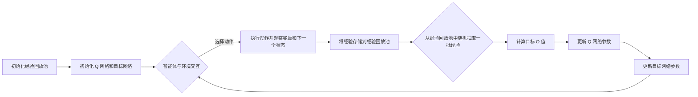

# 一切皆是映射：DQN算法改进历程与关键技术点

作者：禅与计算机程序设计艺术

## 1. 背景介绍

### 1.1 强化学习的崛起

近年来，随着算力的提升和数据的爆炸式增长，人工智能领域迎来了新的春天。作为人工智能的核心技术之一，强化学习（Reinforcement Learning, RL）也逐渐走入了大众的视野。从 AlphaGo 击败世界围棋冠军，到 OpenAI Five 战胜 Dota2 职业战队，强化学习在各个领域都展现出了惊人的实力。究其原因，强化学习能够模拟人类学习和决策的过程，通过与环境交互，不断试错和优化，最终找到最优策略。

### 1.2 DQN 算法的诞生

在强化学习的早期研究中，Q-learning 算法凭借其简单性和有效性，占据了主导地位。然而，Q-learning 算法只能处理离散状态和动作空间的问题，无法应用于复杂的现实场景。为了解决这个问题，DeepMind 在 2013 年提出了深度 Q 网络（Deep Q-Network, DQN）算法，成功将深度学习与强化学习结合起来，开启了深度强化学习的新篇章。

### 1.3 DQN 算法的意义

DQN 算法的出现，标志着强化学习领域的一座里程碑。它不仅突破了传统 Q-learning 算法的局限性，将强化学习的应用范围扩展到连续状态和动作空间，而且为后续的深度强化学习算法研究奠定了基础。如今，DQN 算法及其变体已经广泛应用于游戏、机器人控制、推荐系统等领域，并取得了令人瞩目的成果。

## 2. 核心概念与联系

### 2.1 强化学习的基本要素

在深入探讨 DQN 算法之前，我们需要先了解强化学习的基本要素。强化学习主要由以下几个部分组成：

* **Agent（智能体）**:  执行动作并与环境交互的学习者。
* **Environment（环境）**:  智能体所处的外部世界，它会根据智能体的动作给出相应的反馈。
* **State（状态）**:  描述环境当前情况的变量。
* **Action（动作）**:  智能体可以采取的操作。
* **Reward（奖励）**:  环境对智能体动作的评价信号，用于指导智能体学习。

### 2.2 马尔可夫决策过程（MDP）

马尔可夫决策过程（Markov Decision Process, MDP）是强化学习的数学基础。它描述了一个智能体与环境交互的过程。在这个过程中，智能体根据当前状态选择动作，环境根据动作更新状态并给出奖励。智能体的目标是找到一个最优策略，使得在与环境交互的过程中获得最大的累积奖励。

### 2.3 Q-learning 算法

Q-learning 是一种基于值函数的强化学习算法。它通过学习一个 Q 函数来评估在某个状态下采取某个动作的价值。Q 函数的更新公式如下：

$$Q(s,a) \leftarrow Q(s,a) + \alpha [r + \gamma \max_{a'} Q(s',a') - Q(s,a)]$$

其中：

* $Q(s,a)$ 表示在状态 $s$ 下采取动作 $a$ 的价值。
* $\alpha$ 是学习率，控制每次更新的幅度。
* $r$ 是环境在状态 $s$ 下采取动作 $a$ 后给出的奖励。
* $\gamma$ 是折扣因子，用于平衡当前奖励和未来奖励的重要性。
* $s'$ 是状态 $s$ 下采取动作 $a$ 后的下一个状态。
* $a'$ 是在状态 $s'$ 下可以采取的所有动作。

### 2.4 深度 Q 网络（DQN）

DQN 算法是 Q-learning 算法的深度学习版本。它使用神经网络来近似 Q 函数。DQN 算法的主要贡献在于引入了经验回放机制和目标网络，解决了 Q-learning 算法在使用神经网络近似 Q 函数时出现的稳定性和收敛性问题。

## 3. 核心算法原理具体操作步骤

### 3.1 DQN 算法流程

DQN 算法的流程图如下所示：



### 3.2 算法步骤详解

1. **初始化经验回放池:** 创建一个存储智能体与环境交互经验的缓冲区。经验通常以四元组的形式存储 $(s, a, r, s')$，表示在状态 $s$ 下采取动作 $a$，获得奖励 $r$，并转移到下一个状态 $s'$。

2. **初始化 Q 网络和目标网络:** 创建两个相同结构的神经网络，分别作为 Q 网络和目标网络。Q 网络用于估计当前状态下采取不同动作的价值，目标网络用于计算目标 Q 值。

3. **智能体与环境交互:** 在每个时间步，智能体根据当前状态，使用 ε-greedy 策略选择动作。ε-greedy 策略是指以 ε 的概率随机选择动作，以 1-ε 的概率选择 Q 网络预测的价值最高的动作。

4. **执行动作并观察奖励和下一个状态:** 智能体执行选择的动作，并观察环境返回的奖励和下一个状态。

5. **将经验存储到经验回放池:** 将当前时间步的经验 $(s, a, r, s')$ 存储到经验回放池中。

6. **从经验回放池中随机抽取一批经验:** 从经验回放池中随机抽取一批经验，用于更新 Q 网络参数。

7. **计算目标 Q 值:** 使用目标网络计算目标 Q 值。目标 Q 值的计算公式如下：

   $$y_i = 
   \begin{cases}
   r_i, & \text{if episode terminates at step } i+1 \\
   r_i + \gamma \max_{a'} Q(s'_{i+1}, a'; \theta^-), & \text{otherwise}
   \end{cases}$$

   其中：

   * $y_i$ 是第 $i$ 个经验的目标 Q 值。
   * $r_i$ 是第 $i$ 个经验的奖励。
   * $\gamma$ 是折扣因子。
   * $s'_{i+1}$ 是第 $i$ 个经验的下一个状态。
   * $\theta^-$ 是目标网络的参数。

8. **更新 Q 网络参数:** 使用梯度下降算法更新 Q 网络参数，使得 Q 网络的预测值接近目标 Q 值。

9. **更新目标网络参数:**  定期将 Q 网络的参数复制到目标网络中，通常每隔一定的步数更新一次。

## 4. 数学模型和公式详细讲解举例说明

### 4.1 Bellman 方程

DQN 算法的理论基础是 Bellman 方程。Bellman 方程描述了状态值函数和动作值函数之间的关系。

状态值函数 $V^{\pi}(s)$ 表示在状态 $s$ 下，按照策略 $\pi$ 行动，所能获得的期望累积奖励。

$$V^{\pi}(s) = \mathbb{E}_{\pi}[G_t | S_t = s]$$

动作值函数 $Q^{\pi}(s, a)$ 表示在状态 $s$ 下，采取动作 $a$，然后按照策略 $\pi$ 行动，所能获得的期望累积奖励。

$$Q^{\pi}(s, a) = \mathbb{E}_{\pi}[G_t | S_t = s, A_t = a]$$

Bellman 方程可以表示为：

$$V^{\pi}(s) = \sum_{a \in A} \pi(a|s) Q^{\pi}(s, a)$$

$$Q^{\pi}(s, a) = R(s, a) + \gamma \sum_{s' \in S} P(s'|s, a) V^{\pi}(s')$$

其中：

* $\pi(a|s)$ 表示在状态 $s$ 下，策略 $\pi$ 选择动作 $a$ 的概率。
* $R(s, a)$ 表示在状态 $s$ 下，采取动作 $a$，获得的奖励。
* $P(s'|s, a)$ 表示在状态 $s$ 下，采取动作 $a$，转移到状态 $s'$ 的概率。

### 4.2 值迭代算法

值迭代算法是一种基于 Bellman 方程的动态规划算法，用于求解状态值函数。

值迭代算法的迭代公式如下：

$$V_{k+1}(s) = \max_{a \in A} \left[ R(s, a) + \gamma \sum_{s' \in S} P(s'|s, a) V_k(s') \right]$$

其中：

* $V_k(s)$ 表示在第 $k$ 次迭代时，状态 $s$ 的值函数。

### 4.3 Q-learning 算法的推导

Q-learning 算法可以看作是值迭代算法的异步版本。它通过迭代更新 Q 函数来逼近最优动作值函数。

Q-learning 算法的更新公式可以从 Bellman 方程推导出来。将 Bellman 方程中的状态值函数用动作值函数表示，得到：

$$Q^{\pi}(s, a) = R(s, a) + \gamma \sum_{s' \in S} P(s'|s, a) \sum_{a' \in A} \pi(a'|s') Q^{\pi}(s', a')$$

将上式中的期望用样本均值代替，得到：

$$Q(s, a) \leftarrow Q(s, a) + \alpha [r + \gamma \max_{a'} Q(s', a') - Q(s, a)]$$

## 5. 项目实践：代码实例和详细解释说明

### 5.1 使用 TensorFlow 实现 DQN 算法

```python
import tensorflow as tf
import numpy as np
import gym

# 定义超参数
learning_rate = 0.01
discount_factor = 0.99
epsilon = 0.1
batch_size = 32
memory_size = 10000

# 创建环境
env = gym.make('CartPole-v1')

# 定义 Q 网络
class QNetwork(tf.keras.Model):
    def __init__(self, state_size, action_size):
        super(QNetwork, self).__init__()
        self.dense1 = tf.keras.layers.Dense(64, activation='relu')
        self.dense2 = tf.keras.layers.Dense(64, activation='relu')
        self.output = tf.keras.layers.Dense(action_size)

    def call(self, state):
        x = self.dense1(state)
        x = self.dense2(x)
        return self.output(x)

# 定义 DQN 智能体
class DQNAgent:
    def __init__(self, state_size, action_size):
        self.state_size = state_size
        self.action_size = action_size
        self.memory = []
        self.q_network = QNetwork(state_size, action_size)
        self.target_network = QNetwork(state_size, action_size)
        self.optimizer = tf.keras.optimizers.Adam(learning_rate)

    def remember(self, state, action, reward, next_state, done):
        self.memory.append((state, action, reward, next_state, done))
        if len(self.memory) > memory_size:
            self.memory.pop(0)

    def act(self, state):
        if np.random.rand() <= epsilon:
            return np.random.randint(self.action_size)
        else:
            q_values = self.q_network(state[np.newaxis, :])
            return np.argmax(q_values[0])

    def replay(self):
        if len(self.memory) < batch_size:
            return

        batch = random.sample(self.memory, batch_size)
        states, actions, rewards, next_states, dones = zip(*batch)

        states = np.array(states)
        actions = np.array(actions)
        rewards = np.array(rewards)
        next_states = np.array(next_states)
        dones = np.array(dones)

        with tf.GradientTape() as tape:
            q_values = self.q_network(states)
            next_q_values = self.target_network(next_states)
            target_q_values = rewards + (1 - dones) * discount_factor * np.max(next_q_values, axis=1)
            q_values = tf.reduce_sum(tf.one_hot(actions, self.action_size) * q_values, axis=1)
            loss = tf.keras.losses.mse(target_q_values, q_values)

        gradients = tape.gradient(loss, self.q_network.trainable_variables)
        self.optimizer.apply_gradients(zip(gradients, self.q_network.trainable_variables))

    def update_target_network(self):
        self.target_network.set_weights(self.q_network.get_weights())

# 创建 DQN 智能体
agent = DQNAgent(env.observation_space.shape[0], env.action_space.n)

# 训练智能体
for episode in range(1000):
    state = env.reset()
    total_reward = 0

    while True:
        action = agent.act(state)
        next_state, reward, done, _ = env.step(action)
        agent.remember(state, action, reward, next_state, done)
        agent.replay()
        total_reward += reward

        if done:
            break

    if episode % 10 == 0:
        agent.update_target_network()
        print('Episode: {}, Total Reward: {}'.format(episode, total_reward))

# 测试智能体
state = env.reset()
total_reward = 0

while True:
    env.render()
    action = agent.act(state)
    next_state, reward, done, _ = env.step(action)
    total_reward += reward

    if done:
        break

print('Total Reward: {}'.format(total_reward))
```

### 5.2 代码解释

* **定义超参数:** 设置学习率、折扣因子、ε-greedy 策略的 ε 值、批处理大小、经验回放池大小等超参数。

* **创建环境:** 使用 OpenAI Gym 创建 CartPole-v1 环境。

* **定义 Q 网络:** 定义一个包含两个隐藏层和一个输出层的全连接神经网络作为 Q 网络。

* **定义 DQN 智能体:** 定义一个 DQN 智能体类，包含以下方法：
    * `remember(self, state, action, reward, next_state, done)`: 将经验存储到经验回放池中。
    * `act(self, state)`: 根据当前状态选择动作。
    * `replay(self):` 从经验回放池中随机抽取一批经验，更新 Q 网络参数。
    * `update_target_network(self)`: 更新目标网络参数。

* **创建 DQN 智能体:** 创建一个 DQN 智能体，并传入状态空间大小和动作空间大小。

* **训练智能体:** 在每个 episode 中，智能体与环境交互，并将经验存储到经验回放池中。每隔一定的步数，更新目标网络参数。

* **测试智能体:** 测试训练好的智能体在环境中的表现。

## 6. 实际应用场景

DQN 算法及其变体已经广泛应用于各个领域，例如：

* **游戏 AI:** DQN 算法可以用于开发游戏 AI，例如 AlphaGo、AlphaZero、OpenAI Five 等。

* **机器人控制:** DQN 算法可以用于控制机器人的运动，例如机械臂控制、无人机导航等。

* **推荐系统:** DQN 算法可以用于构建个性化推荐系统，例如电商网站的商品推荐、视频网站的电影推荐等。

* **金融交易:** DQN 算法可以用于开发自动交易系统，例如股票交易、期货交易等。

## 7. 工具和资源推荐

* **OpenAI Gym:** 一个用于开发和比较强化学习算法的工具包。

* **TensorFlow:** 一个开源的机器学习平台，可以用于实现 DQN 算法。

* **PyTorch:** 另一个开源的机器学习平台，也可以用于实现 DQN 算法。

* **Deep Reinforcement Learning:**  Richard S. Sutton 和 Andrew G. Barto 编写的强化学习领域的经典教材。

## 8. 总结：未来发展趋势与挑战

DQN 算法是深度强化学习领域的开创性工作，它为后续的深度强化学习算法研究奠定了基础。未来，DQN 算法及其变体将在以下几个方向继续发展：

* **提高样本效率:**  DQN 算法需要大量的训练数据才能达到较好的性能，如何提高样本效率是未来研究的重点之一。

* **处理高维状态空间:**  DQN 算法在处理高维状态空间时，容易出现维度灾难问题，如何有效地处理高维状态空间是未来研究的另一个重点。

* **解决稀疏奖励问题:**  在很多实际应用场景中，奖励信号非常稀疏，如何有效地解决稀疏奖励问题是未来研究的难点之一。

## 9. 附录：常见问题与解答

