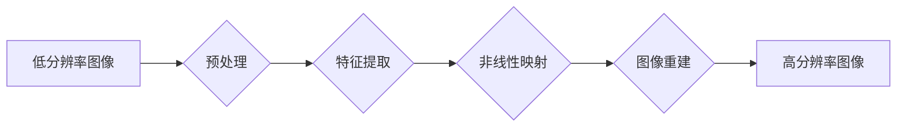

# 一切皆是映射：超分辨率图像重建与深度学习

作者：禅与计算机程序设计艺术

## 1. 背景介绍

### 1.1 图像分辨率的追求

从胶片相机到数码相机，再到如今的智能手机，图像分辨率的提升一直是人们追求的目标。更高的分辨率意味着更清晰的图像、更丰富的细节，以及更佳的视觉体验。然而，受限于光学硬件、传感器技术等因素，直接获取高分辨率图像往往成本高昂或难以实现。

### 1.2 超分辨率图像重建技术的兴起

为了突破硬件限制，超分辨率图像重建技术应运而生。这项技术旨在从低分辨率图像中恢复高频细节，生成更高分辨率的图像，从而提升图像质量、改善视觉效果。近年来，随着深度学习技术的飞速发展，基于深度学习的超分辨率图像重建方法取得了突破性进展，成为该领域的研究热点。

### 1.3 本文目标

本文将深入探讨超分辨率图像重建技术，特别是基于深度学习的方法。我们将从核心概念、算法原理、数学模型、代码实例、应用场景、工具资源、未来趋势等多个方面进行全面的阐述，旨在帮助读者全面了解该领域的技术发展现状和未来方向。

## 2. 核心概念与联系

### 2.1 图像退化模型

超分辨率图像重建可以看作是图像退化的逆过程。一般而言，图像退化模型可以用以下公式表示：

$$
y = D(x, k) + n
$$

其中：

* $y$ 表示低分辨率图像
* $x$ 表示高分辨率图像
* $D$ 表示退化函数，例如模糊、下采样等
* $k$ 表示退化函数的参数
* $n$ 表示噪声

超分辨率图像重建的目标就是从低分辨率图像 $y$ 中恢复出高分辨率图像 $x$。

### 2.2 超分辨率重建方法分类

传统的超分辨率重建方法主要分为以下几类：

* **基于插值的方法：**例如最近邻插值、双线性插值、双三次插值等。这类方法简单直观，但容易造成图像模糊、锯齿等问题。
* **基于重建的方法：**例如迭代反投影法、最大后验概率法等。这类方法试图从退化模型中恢复出高分辨率图像，但计算复杂度较高。
* **基于学习的方法：**例如稀疏表示、字典学习等。这类方法通过学习图像的先验信息来重建高分辨率图像，取得了一定的效果。

### 2.3 深度学习在超分辨率重建中的应用

近年来，深度学习在图像识别、目标检测等领域取得了巨大成功。深度学习模型能够从海量数据中学习复杂的非线性映射关系，因此也被引入到超分辨率图像重建领域，并取得了突破性进展。

## 3. 核心算法原理具体操作步骤

### 3.1 基于深度学习的超分辨率重建网络结构

目前，基于深度学习的超分辨率重建网络结构主要可以分为以下几类：

* **基于卷积神经网络的方法：**例如 SRCNN、FSRCNN、ESPCN 等。这类方法利用卷积神经网络强大的特征提取能力，从低分辨率图像中学习到高频细节信息，从而重建出高分辨率图像。
* **基于生成对抗网络的方法：**例如 SRGAN、ESRGAN 等。这类方法利用生成器和判别器之间的对抗训练，生成更加逼真、细节更加丰富的超分辨率图像。
* **基于Transformer的方法：**例如 SwinIR、EDTASR 等。这类方法利用 Transformer 网络强大的全局建模能力，能够更好地捕捉图像的全局上下文信息，从而提升超分辨率重建效果。

### 3.2 具体操作步骤

以 SRCNN 为例，其具体操作步骤如下：

1. **图像预处理：**将低分辨率图像进行预处理，例如去噪、归一化等。
2. **特征提取：**利用多层卷积神经网络对低分辨率图像进行特征提取。
3. **非线性映射：**利用非线性激活函数对提取的特征进行非线性映射，学习低分辨率图像到高分辨率图像之间的映射关系。
4. **图像重建：**利用反卷积网络将特征映射回图像空间，得到高分辨率图像。

### 3.3 算法流程图



## 4. 数学模型和公式详细讲解举例说明

### 4.1 SRCNN 数学模型

SRCNN 的目标函数可以表示为：

$$
L(\theta) = \frac{1}{N} \sum_{i=1}^{N} || F(Y_i; \theta) - X_i ||^2
$$

其中：

* $Y_i$ 表示第 $i$ 张低分辨率图像
* $X_i$ 表示第 $i$ 张高分辨率图像
* $F(Y_i; \theta)$ 表示 SRCNN 网络对 $Y_i$ 的预测结果
* $\theta$ 表示 SRCNN 网络的参数
* $N$ 表示训练样本的数量

### 4.2 损失函数

SRCNN 使用均方误差（MSE）作为损失函数，用于衡量预测结果与真实值之间的差异。

### 4.3 优化算法

SRCNN 使用随机梯度下降（SGD）算法对网络参数进行优化。

## 5. 项目实践：代码实例和详细解释说明

### 5.1 使用 PyTorch 实现 SRCNN

```python
import torch
import torch.nn as nn

class SRCNN(nn.Module):
    def __init__(self, num_channels=3, upscale_factor=2):
        super(SRCNN, self).__init__()
        self.conv1 = nn.Conv2d(num_channels, 64, kernel_size=9, padding=4)
        self.conv2 = nn.Conv2d(64, 32, kernel_size=1, padding=0)
        self.conv3 = nn.Conv2d(32, num_channels, kernel_size=5, padding=2)
        self.upscale = nn.Upsample(scale_factor=upscale_factor, mode='bicubic')

    def forward(self, x):
        x = self.upscale(x)
        x = torch.relu(self.conv1(x))
        x = torch.relu(self.conv2(x))
        x = self.conv3(x)
        return x
```

### 5.2 代码解释

* `__init__` 函数定义了 SRCNN 网络的结构，包括三个卷积层和一个上采样层。
* `forward` 函数定义了 SRCNN 网络的前向传播过程。
* `upscale` 层使用双三次插值对输入图像进行上采样。
* `conv1`、`conv2`、`conv3` 层分别使用 9x9、1x1、5x5 的卷积核进行特征提取。
* `relu` 函数用于对卷积层的输出进行非线性激活。

## 6. 实际应用场景

### 6.1 医学影像分析

超分辨率图像重建技术可以用于提升医学影像的分辨率，例如 X 光片、CT 图像、MRI 图像等，从而帮助医生更准确地诊断疾病。

### 6.2 视频监控

超分辨率图像重建技术可以用于提升视频监控图像的分辨率，例如人脸识别、车牌识别等，从而提高监控系统的效率和准确性。

### 6.3 娱乐产业

超分辨率图像重建技术可以用于提升电影、电视剧、游戏等娱乐产品的画质，为用户带来更佳的视觉体验。

## 7. 工具和资源推荐

### 7.1 深度学习框架

* TensorFlow
* PyTorch

### 7.2 数据集

* DIV2K
* Set5
* Set14

### 7.3 开源项目

* EDSR (Enhanced Deep Residual Networks for Single Image Super-Resolution)
* SRGAN (Photo-Realistic Single Image Super-Resolution Using a Generative Adversarial Network)

## 8. 总结：未来发展趋势与挑战

### 8.1 未来发展趋势

* **更加轻量级的网络结构：**随着移动设备的普及，轻量级的超分辨率重建网络结构将成为未来的发展趋势。
* **更加逼真的图像生成：**生成对抗网络等技术将推动超分辨率图像重建技术 towards 生成更加逼真、细节更加丰富的图像。
* **多模态超分辨率重建：**将图像、视频、文本等多模态信息融合到超分辨率重建中，将成为未来的研究热点。

### 8.2 挑战

* **训练数据的缺乏：**高质量的超分辨率图像重建数据集仍然缺乏，这限制了模型的性能提升。
* **模型的泛化能力：**目前的超分辨率重建模型在处理不同类型的图像时，泛化能力仍然不足。
* **计算复杂度：**超分辨率图像重建模型的计算复杂度较高，这限制了其在实际应用中的推广。

## 9. 附录：常见问题与解答

### 9.1 什么是超分辨率图像重建？

超分辨率图像重建技术旨在从低分辨率图像中恢复高频细节，生成更高分辨率的图像，从而提升图像质量、改善视觉效果。

### 9.2 深度学习如何应用于超分辨率图像重建？

深度学习模型能够从海量数据中学习复杂的非线性映射关系，因此被引入到超分辨率图像重建领域，并取得了突破性进展。

### 9.3 超分辨率图像重建有哪些应用场景？

超分辨率图像重建技术在医学影像分析、视频监控、娱乐产业等领域有着广泛的应用。
