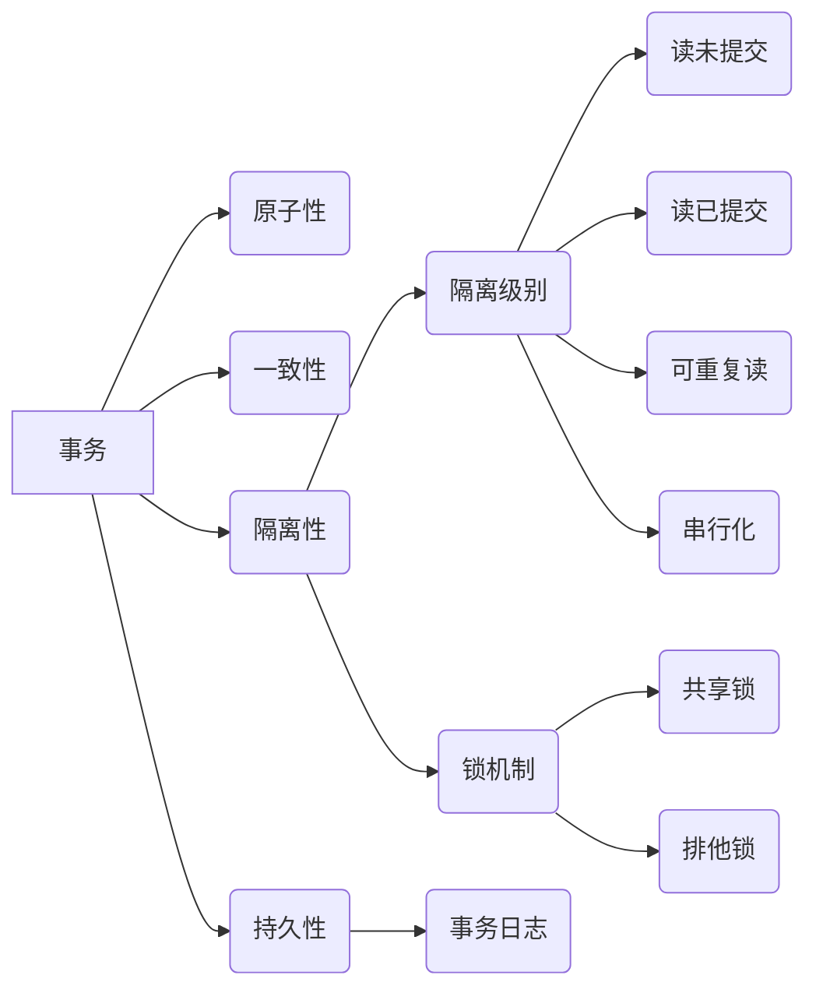

# 事务 原理与代码实例讲解

作者：禅与计算机程序设计艺术

## 1. 背景介绍

在信息时代，数据的重要性不言而喻。无论是企业级应用还是互联网应用，都离不开对数据的持久化操作。而在数据库管理系统（DBMS）中，事务作为一种机制，能够确保数据操作的可靠性和一致性，是保证数据完整性的重要手段。

### 1.1 什么是事务？

事务是指作为单个逻辑工作单元执行的一系列操作，要么完全地执行，要么完全地不执行。事务具有四个特性，通常称为 ACID 属性：

- **原子性（Atomicity）**: 事务是一个不可分割的工作单元，事务中的所有操作要么全部成功，要么全部失败回滚。
- **一致性（Consistency）**: 事务执行的结果必须是使数据库从一个一致性状态变到另一个一致性状态。
- **隔离性（Isolation）**: 多个事务并发执行时，各个事务之间互不干扰，一个事务的执行不能被其他事务干扰。
- **持久性（Durability）**: 一旦事务提交，则其所做的修改就会永久保存到数据库中，即使系统发生崩溃，修改也不会丢失。

### 1.2 为什么需要事务？

在没有事务机制的情况下，数据很容易出现不一致的情况。例如，假设有两个操作，一个是将账户 A 的余额减少 100 元，另一个是将账户 B 的余额增加 100 元。如果没有事务机制，这两个操作可能会因为各种原因（例如系统崩溃）而只执行了一个，导致数据不一致。

而使用事务机制，可以将这两个操作放在一个事务中执行。如果两个操作都成功执行，则事务提交，数据更新到数据库中；如果其中任何一个操作失败，则事务回滚，数据库恢复到执行事务前的状态，从而保证了数据的一致性。

## 2. 核心概念与联系

为了更好地理解事务，我们需要了解一些核心概念：

### 2.1 事务隔离级别

事务的隔离级别定义了一个事务可能受其他并发事务影响的程度。SQL 标准定义了四种隔离级别：

- **读未提交（Read Uncommitted）**:  最低的隔离级别，允许读取尚未提交的数据更改。
- **读已提交（Read Committed）**:  只能读取已提交的数据更改。
- **可重复读（Repeatable Read）**:  在一个事务内多次读取同一数据时，可以保证看到相同的值，即使其他事务已经提交了更改。
- **串行化（Serializable）**:  最高的隔离级别，所有事务都按顺序执行，就像只有一个事务在执行一样。

### 2.2 锁机制

锁机制是实现事务隔离性的重要手段。当一个事务需要访问数据库中的数据时，它会先获取该数据的锁。根据锁的类型不同，其他事务对该数据的访问可能会被阻塞或延迟。

常见的锁类型包括：

- **共享锁（Shared Lock）**:  允许多个事务同时读取数据，但不允许任何事务修改数据。
- **排他锁（Exclusive Lock）**:  只允许一个事务访问数据，其他事务必须等待该事务释放锁才能访问。

### 2.3 事务日志

事务日志记录了所有对数据库的修改操作。当事务提交时，数据库会将事务日志中的修改操作写入到磁盘中，以保证数据的持久性。如果系统发生崩溃，数据库可以根据事务日志恢复到崩溃前的状态。

### 2.4  概念联系图



## 3. 核心算法原理具体操作步骤

### 3.1 事务的执行流程

一个典型的事务执行流程如下：

1. **开始事务**:  使用 `BEGIN TRANSACTION` 语句显式开启一个事务，或者数据库默认开启一个事务。
2. **执行操作**:  在事务中执行一系列数据操作，例如插入、更新、删除等。
3. **提交事务**:  如果所有操作都执行成功，则使用 `COMMIT` 语句提交事务，将所有更改持久化到数据库中。
4. **回滚事务**:  如果任何一个操作执行失败，则使用 `ROLLBACK` 语句回滚事务，撤销所有已执行的操作，数据库恢复到执行事务前的状态。

### 3.2 并发控制

为了保证事务的隔离性，数据库管理系统需要采用一定的并发控制机制。常见的并发控制机制包括：

- **乐观锁**:  在读取数据时不加锁，但在更新数据时，会检查数据是否被其他事务修改过。如果数据被修改过，则更新失败，事务回滚。
- **悲观锁**:  在读取数据时就加锁，防止其他事务修改数据。
- **时间戳排序**:  为每个事务分配一个时间戳，按照时间戳的顺序执行事务。
- **多版本并发控制（MVCC）**:  为每个事务维护多个数据版本，每个事务只能看到自己版本的数据。

## 4. 数学模型和公式详细讲解举例说明

事务的 ACID 属性可以用一些数学模型和公式来描述。

### 4.1 原子性

原子性可以用状态机模型来描述。一个事务可以看作是一个状态机，它有初始状态、中间状态和最终状态。事务的执行过程就是状态机从初始状态到最终状态的转换过程。原子性要求事务的状态转换必须是原子的，即要么所有状态转换都成功，要么所有状态转换都失败。

### 4.2 一致性

一致性可以用谓词逻辑来描述。数据库的一致性可以用一组断言（assertion）来定义。事务的一致性要求事务执行前后，数据库的状态都必须满足这些断言。

### 4.3 隔离性

隔离性可以用并发控制理论中的串行等价性来描述。串行等价性是指多个事务并发执行的结果与这些事务按某个顺序串行执行的结果相同。

### 4.4 持久性

持久性可以用数据恢复模型来描述。数据恢复模型描述了数据库如何在系统崩溃后恢复到一致性状态。

## 5. 项目实践：代码实例和详细解释说明

下面以 Java 中的 Spring 事务为例，演示如何使用事务机制。

### 5.1 添加依赖

在 `pom.xml` 文件中添加 Spring 事务管理器的依赖：

```xml
<dependency>
  <groupId>org.springframework</groupId>
  <artifactId>spring-tx</artifactId>
  <version>5.3.18</version>
</dependency>
```

### 5.2 配置事务管理器

在 Spring 配置文件中配置事务管理器：

```xml
<bean id="transactionManager"
    class="org.springframework.jdbc.datasource.DataSourceTransactionManager">
  <property name="dataSource" ref="dataSource" />
</bean>
```

### 5.3 使用注解声明事务

在需要进行事务管理的方法上添加 `@Transactional` 注解：

```java
@Service
public class UserServiceImpl implements UserService {

  @Autowired
  private UserDao userDao;

  @Transactional
  public void transferMoney(String fromUserId, String toUserId, BigDecimal amount) {
    userDao.decreaseBalance(fromUserId, amount);
    userDao.increaseBalance(toUserId, amount);
  }
}
```

在上面的代码中，`transferMoney()` 方法使用 `@Transactional` 注解声明为一个事务。当该方法被调用时，Spring 会自动开启一个事务，并在方法执行完成后提交事务。如果方法执行过程中出现异常，Spring 会自动回滚事务。

## 6. 实际应用场景

事务机制在各种应用场景中都有广泛的应用，例如：

- **银行转账**:  保证转账操作的原子性和一致性。
- **电商下单**:  保证订单创建、库存扣减、支付等操作的一致性。
- **社交网络**:  保证用户关系、消息发送等操作的一致性。
- **游戏**:  保证游戏数据的一致性。

## 7. 工具和资源推荐

- **数据库管理系统**:  MySQL、PostgreSQL、Oracle 等。
- **Spring Framework**:  Java 开发框架，提供了强大的事务管理功能。
- **Hibernate**:  Java 持久化框架，支持事务管理。

## 8. 总结：未来发展趋势与挑战

随着数据规模的不断增长和应用场景的不断扩展，事务机制面临着新的挑战：

- **分布式事务**:  如何保证跨多个数据库节点的事务一致性。
- **高并发事务**:  如何提高高并发场景下事务的吞吐量和性能。
- **新型数据库**:  如何在新兴的 NoSQL 数据库中实现事务机制。


## 9. 附录：常见问题与解答

### 9.1 事务失效的常见原因有哪些？

- 方法不是public的
- 方法被定义为final的
- 方法调用发生在类内部，而不是通过代理
- 数据源没有配置事务管理器
- 传播行为设置错误
- 回滚规则配置错误

### 9.2 如何避免事务失效？

- 确保方法是public的
- 不要将方法定义为final
- 确保方法调用是通过代理进行的
- 正确配置数据源和事务管理器
- 正确设置传播行为和回滚规则
