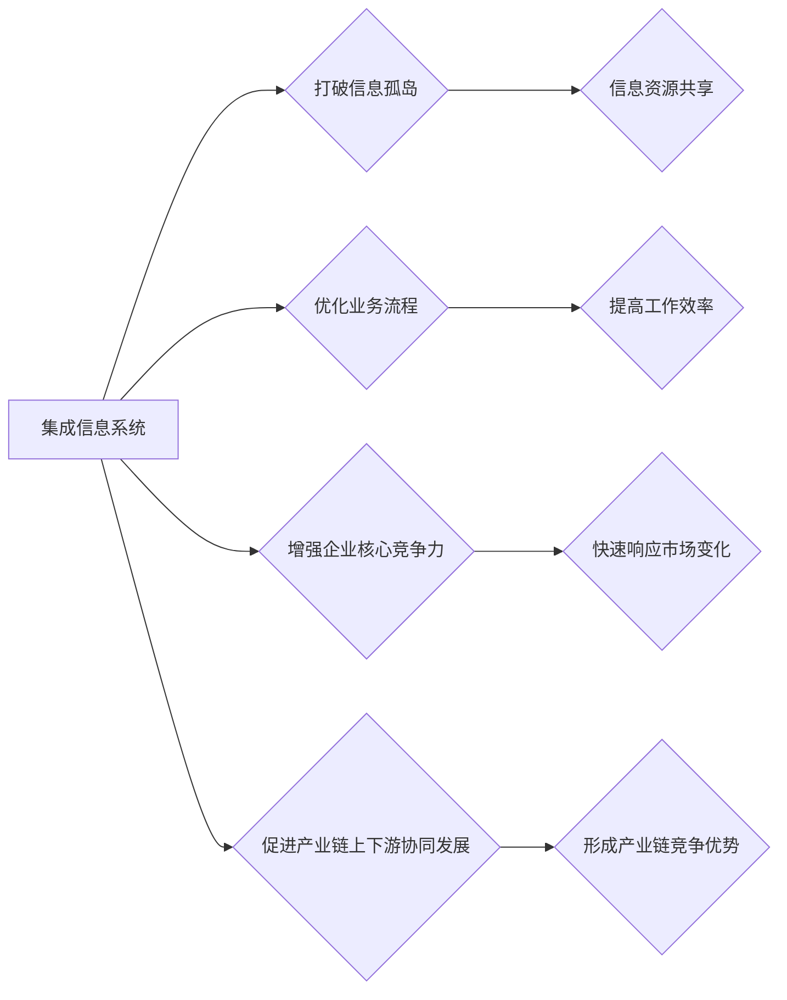

# 产业板块集成信息系统总体构架

作者：禅与计算机程序设计艺术

## 1. 背景介绍

### 1.1 产业板块信息化发展现状

随着信息技术的快速发展和应用，各行各业都在积极推进信息化建设，以提高生产效率、降低成本、增强竞争力。产业板块作为国民经济的重要组成部分，其信息化水平直接影响到整个行业的转型升级和可持续发展。近年来，我国产业板块信息化建设取得了显著成效，但仍存在一些问题：

* **信息孤岛现象严重:** 各企业、部门之间信息系统独立建设，数据难以共享，形成信息孤岛，制约了产业链上下游协同发展。
* **业务流程难以整合:** 传统业务流程与信息系统脱节，导致信息化建设难以真正服务于业务发展需求。
* **缺乏统一的技术标准:** 各企业、部门信息系统建设缺乏统一的技术标准，导致系统难以互联互通，数据难以共享和交换。
* **信息安全问题突出:** 随着信息化程度的提高，信息安全问题日益突出，网络攻击、数据泄露等事件时有发生，严重威胁着企业的正常运营和发展。

### 1.2 集成信息系统的必要性

为了解决上述问题，构建产业板块集成信息系统势在必行。集成信息系统可以打破信息孤岛，实现信息资源共享，优化业务流程，提高工作效率，增强企业核心竞争力。具体而言，构建产业板块集成信息系统具有以下几方面的必要性:

* **打破信息孤岛，实现信息资源共享：** 集成信息系统可以将分散在各个企业、部门的信息系统连接起来，实现数据共享和业务协同，避免信息孤岛现象。
* **优化业务流程，提高工作效率：** 通过业务流程再造和信息化手段，可以优化企业内部的业务流程，提高工作效率，降低运营成本。
* **增强企业核心竞争力：** 集成信息系统可以帮助企业更好地掌握市场信息，快速响应市场变化，提高企业的市场竞争力。
* **促进产业链上下游协同发展：** 集成信息系统可以促进产业链上下游企业之间的信息共享和业务协同，形成产业链竞争优势。

## 2. 核心概念与联系

### 2.1 集成信息系统

集成信息系统是指将不同来源、不同格式、不同用途的信息系统进行整合，形成一个统一的信息化平台，为用户提供全面、准确、及时的信息服务。

### 2.2 产业板块

产业板块是指国民经济中具有相同或相似产业特征的企业群体，例如：制造业、金融业、服务业等。

### 2.3 信息孤岛

信息孤岛是指不同部门、不同企业之间信息系统独立建设，数据难以共享，形成信息壁垒的现象。

### 2.4 业务流程再造

业务流程再造 (Business Process Reengineering，BPR) 是一种以业务流程为中心的组织变革方法，旨在通过对现有业务流程进行根本性的重新思考和彻底的重新设计，以实现成本、质量、服务和速度等方面的突破性改进。

### 2.5 关系图



## 3. 核心算法原理具体操作步骤

### 3.1 系统架构设计

产业板块集成信息系统通常采用多层架构设计，例如：

* **表示层:** 负责与用户交互，提供友好的用户界面。
* **业务逻辑层:** 负责处理业务逻辑，实现业务功能。
* **数据访问层:** 负责与数据库交互，进行数据的读写操作。
* **数据层:** 存储系统数据。

### 3.2 数据集成

数据集成是集成信息系统的核心环节，常用的数据集成方式包括：

* **数据库复制:** 将源数据库的数据复制到目标数据库中。
* **数据仓库:** 将多个数据源的数据抽取、转换、加载到数据仓库中，进行统一管理和分析。
* **企业服务总线 (ESB):**  通过消息中间件实现不同系统之间的数据交换。

### 3.3 应用集成

应用集成是指将不同的应用系统连接起来，实现数据共享和业务协同。常用的应用集成方式包括：

* **接口调用:** 通过 API 接口实现不同系统之间的数据交互。
* **消息队列:** 通过消息中间件实现异步消息传递，实现系统解耦。
* **工作流引擎:** 通过工作流引擎定义和管理业务流程，实现跨系统协同。

### 3.4 安全保障机制

集成信息系统需要建立完善的安全保障机制，例如：

* **身份认证:** 验证用户身份，防止非法访问。
* **访问控制:** 控制用户对系统资源的访问权限。
* **数据加密:** 对敏感数据进行加密存储和传输，防止数据泄露。
* **安全审计:** 记录用户操作日志，便于事后追溯。

### 3.5 流程图


## 4. 数学模型和公式详细讲解举例说明

### 4.1 数据一致性模型

数据一致性是指多个数据副本之间保持一致的状态，常用的数据一致性模型包括：

* **强一致性:** 任何时刻，所有节点上的数据副本都是一致的。
* **最终一致性:** 当数据更新停止后，最终所有节点上的数据副本都会达到一致状态。

### 4.2 数据一致性算法

为了保证数据一致性，常用的数据一致性算法包括：

* **两阶段提交 (2PC):**  通过协调器节点协调多个参与者节点进行事务提交，保证事务的原子性。
* **三阶段提交 (3PC):**  在 2PC 的基础上增加了预提交阶段，提高了容错性。
* **Paxos 算法:**  一种基于消息传递的分布式一致性算法，可以容忍节点故障和网络分区。

### 4.3 举例说明

假设有两个节点 A 和 B，它们都需要维护一个数据项 x 的值。初始时，x 的值为 0。

**场景一：** 节点 A 将 x 的值更新为 1，然后节点 B 读取 x 的值。

* **强一致性：** 节点 B 读取到的 x 的值为 1。
* **最终一致性：** 节点 B 读取到的 x 的值可能为 0，也可能为 1，但最终会变成 1。

**场景二：** 节点 A 将 x 的值更新为 1，同时节点 B 将 x 的值更新为 2。

* **强一致性：** 需要使用数据一致性算法来保证最终只有一个节点的更新操作生效。
* **最终一致性：** 最终 x 的值可能为 1，也可能为 2，取决于哪个节点的更新操作最后生效。

## 5. 项目实践：代码实例和详细解释说明

### 5.1 数据集成代码示例 (Python)

```python
import pandas as pd

# 读取数据源 1
df1 = pd.read_csv('data_source_1.csv')

# 读取数据源 2
df2 = pd.read_csv('data_source_2.csv')

# 合并两个数据源
merged_df = pd.merge(df1, df2, on='key_column')

# 将合并后的数据写入目标数据库
merged_df.to_sql('target_table', engine, if_exists='replace')
```

### 5.2 应用集成代码示例 (Java)

```java
// 调用远程 API 接口
RestTemplate restTemplate = new RestTemplate();
String url = "http://remote-service/api/data";
ResponseEntity<String> response = restTemplate.getForEntity(url, String.class);

// 解析响应数据
String data = response.getBody();

// 处理业务逻辑
// ...
```

## 6. 实际应用场景

产业板块集成信息系统可以应用于各种行业和领域，例如：

* **制造业：** 实现生产计划、物料管理、质量控制、设备管理等系统集成，提高生产效率和产品质量。
* **金融业：** 实现银行、证券、保险等系统集成，提供一站式金融服务。
* **服务业：** 实现电商平台、物流系统、支付系统等集成，提供便捷的在线服务。
* **政府部门：** 实现各部门信息系统集成，提高政府工作效率和服务水平。

## 7. 总结：未来发展趋势与挑战

### 7.1 未来发展趋势

* **云计算、大数据、人工智能等新技术的应用：** 云计算可以提供弹性可扩展的计算资源，大数据可以提供海量数据分析服务，人工智能可以实现智能化决策支持，这些新技术将推动集成信息系统向更加智能化、自动化方向发展。
* **微服务架构的应用：** 微服务架构可以将大型应用拆分成多个小型服务，每个服务独立部署和扩展，提高系统的灵活性和可维护性。
* **数据安全和隐私保护问题日益突出：** 随着数据量的不断增长和数据价值的日益凸显，数据安全和隐私保护问题将变得越来越重要，集成信息系统需要采取更加严格的安全措施来保护用户数据。

### 7.2 面临的挑战

* **技术复杂性高：** 集成信息系统涉及的技术领域广泛，需要具备多方面的技术能力才能完成系统建设和维护。
* **项目实施周期长：** 集成信息系统通常规模较大，涉及多个部门和企业，项目实施周期较长。
* **成本投入高：** 集成信息系统需要投入大量的资金和人力资源，才能保证系统成功上线和稳定运行。

## 8. 附录：常见问题与解答

### 8.1 如何选择合适的数据集成方式？

选择数据集成方式需要考虑以下因素：

* **数据量大小：** 对于数据量较小的场景，可以选择数据库复制的方式；对于数据量较大的场景，可以选择数据仓库的方式。
* **数据实时性要求：** 如果对数据实时性要求较高，可以选择企业服务总线 (ESB) 的方式；如果对数据实时性要求不高，可以选择数据仓库的方式。
* **系统复杂度：** 如果系统比较复杂，涉及多个异构系统，可以选择企业服务总线 (ESB) 的方式；如果系统比较简单，可以选择接口调用或消息队列的方式。

### 8.2 如何保证集成信息系统的安全性？

保证集成信息系统的安全性需要采取多方面的措施：

* **建立完善的安全管理制度：** 制定安全策略、安全操作规程等，明确安全责任和义务。
* **采用安全的技术手段：** 例如，使用防火墙、入侵检测系统、防病毒软件等安全设备，对系统进行安全加固。
* **加强安全意识教育：** 对员工进行安全意识教育，提高员工的安全防范意识。

### 8.3 如何评估集成信息系统的效果？

评估集成信息系统的效果可以从以下几个方面入手：

* **系统功能是否满足需求：** 集成后的系统是否能够满足用户的业务需求。
* **系统性能是否满足要求：** 系统的响应速度、并发能力等是否满足用户的性能要求。
* **数据质量是否得到提高：** 集成后的数据是否准确、完整、一致。
* **工作效率是否得到提高：** 集成后的系统是否能够帮助用户提高工作效率。
