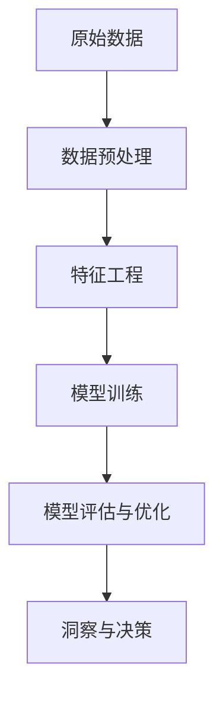

# 从数据到洞察：AI代理工作流中的分析引擎

作者：禅与计算机程序设计艺术

## 1.背景介绍

在当今数据驱动的世界中，数据分析和人工智能（AI）已经成为企业和研究机构获取洞察和做出决策的核心工具。AI代理作为一种智能化的软件代理，能够自主学习和执行任务，极大地提升了数据处理和分析的效率。然而，如何从海量数据中提取有价值的洞察，仍然是一个复杂且具有挑战性的过程。本文将深入探讨AI代理工作流中的分析引擎，揭示其核心概念、算法原理、数学模型、实际应用及未来发展趋势。

### 1.1 数据驱动的决策

数据驱动决策是通过分析数据来指导业务战略和操作的过程。传统的决策过程依赖于经验和直觉，而数据驱动决策则依托于量化的数据和分析方法。AI代理在这一过程中发挥着至关重要的作用，它们能够自动收集、处理和分析数据，为决策提供科学依据。

### 1.2 AI代理的定义和功能

AI代理是一种能够自主执行任务的软件实体，具备感知、推理、学习和行动的能力。它们可以在复杂的环境中执行多种任务，如数据收集、数据清洗、特征提取、模型训练和预测等。AI代理的核心在于其分析引擎，它是实现从数据到洞察的关键组件。

### 1.3 分析引擎的重要性

分析引擎是AI代理的核心组件，负责将原始数据转化为有意义的洞察。它包括数据预处理、特征工程、模型训练、评估和优化等多个环节。一个高效的分析引擎能够显著提升数据处理和分析的效率，帮助企业快速获取洞察并做出明智的决策。

## 2.核心概念与联系

### 2.1 数据预处理

数据预处理是分析引擎的第一步，旨在清理和转换原始数据，使其适合后续的分析和建模。主要包括数据清洗、数据归一化、缺失值处理和数据变换等步骤。

### 2.2 特征工程

特征工程是从原始数据中提取和构建特征的过程。特征是用于训练模型的输入变量，好的特征能够显著提升模型的性能。特征工程包括特征选择、特征提取和特征构造。

### 2.3 模型训练

模型训练是使用预处理后的数据和特征来训练机器学习模型的过程。常用的模型包括线性回归、决策树、支持向量机和神经网络等。训练过程通常涉及参数估计、超参数调优和模型评估。

### 2.4 模型评估与优化

模型评估是对训练好的模型进行性能评估，常用的评估指标包括准确率、精确率、召回率和F1分数等。模型优化是对模型进行调整和改进，以提高其性能，常用的方法包括交叉验证、正则化和集成学习等。

### 2.5 从数据到洞察的流程图



## 3.核心算法原理具体操作步骤

### 3.1 数据预处理步骤

#### 3.1.1 数据清洗

数据清洗包括处理缺失值、异常值和重复数据。常用的方法有删除缺失值、用均值或中位数填补缺失值、删除或修正异常值等。

#### 3.1.2 数据归一化

数据归一化是将数据缩放到相同的范围内，以消除不同尺度之间的影响。常用的方法有最小-最大归一化和Z-score标准化。

#### 3.1.3 数据变换

数据变换包括对数据进行各种数学变换，如对数变换、平方根变换和Box-Cox变换，以使数据更符合模型的假设。

### 3.2 特征工程步骤

#### 3.2.1 特征选择

特征选择是从原始特征集中选择最有用的特征，常用的方法有过滤法、包裹法和嵌入法。

#### 3.2.2 特征提取

特征提取是从原始数据中提取新的特征，常用的方法有主成分分析（PCA）、线性判别分析（LDA）和独立成分分析（ICA）。

#### 3.2.3 特征构造

特征构造是通过组合现有特征来创建新的特征，如多项式特征、交互特征和时间特征等。

### 3.3 模型训练步骤

#### 3.3.1 选择模型

根据数据的特点和分析目标选择合适的模型，如回归模型、分类模型和聚类模型等。

#### 3.3.2 模型训练

使用训练数据来估计模型参数，常用的方法有梯度下降法、随机梯度下降法和批量梯度下降法等。

#### 3.3.3 超参数调优

通过网格搜索、随机搜索和贝叶斯优化等方法来调优模型的超参数，以提高模型的性能。

### 3.4 模型评估与优化步骤

#### 3.4.1 模型评估

使用验证数据集对模型进行评估，常用的评估指标有准确率、精确率、召回率和F1分数等。

#### 3.4.2 模型优化

通过交叉验证、正则化和集成学习等方法来优化模型，以提高其泛化能力和稳定性。

## 4.数学模型和公式详细讲解举例说明

### 4.1 线性回归模型

线性回归模型是最简单的回归模型之一，用于预测目标变量与一个或多个自变量之间的线性关系。其数学表达式为：

$$
y = \beta_0 + \beta_1 x_1 + \beta_2 x_2 + \cdots + \beta_n x_n + \epsilon
$$

其中，$y$ 是目标变量，$x_1, x_2, \ldots, x_n$ 是自变量，$\beta_0, \beta_1, \ldots, \beta_n$ 是回归系数，$\epsilon$ 是误差项。

### 4.2 支持向量机（SVM）

支持向量机是一种用于分类和回归的监督学习模型，其核心思想是找到一个最佳的超平面来分离不同类别的数据点。其数学表达式为：

$$
f(x) = \text{sign}(\sum_{i=1}^{n} \alpha_i y_i K(x_i, x) + b)
$$

其中，$x$ 是输入数据，$y_i$ 是类别标签，$\alpha_i$ 是拉格朗日乘子，$K(x_i, x)$ 是核函数，$b$ 是偏置项。

### 4.3 神经网络

神经网络是一种模拟人脑结构和功能的模型，由多个神经元组成。每个神经元通过加权和激活函数来处理输入数据。其数学表达式为：

$$
y = f(Wx + b)
$$

其中，$y$ 是输出，$W$ 是权重矩阵，$x$ 是输入，$b$ 是偏置，$f$ 是激活函数。

### 4.4 交叉验证

交叉验证是一种用于评估模型性能的技术，通过将数据集划分为多个子集，依次使用其中一个子集作为验证集，其他子集作为训练集。其数学表达式为：

$$
\text{CV}(k) = \frac{1}{k} \sum_{i=1}^{k} \text{Error}(D_i)
$$

其中，$k$ 是子集的数量，$\text{Error}(D_i)$ 是第 $i$ 个验证集的误差。

## 5.项目实践：代码实例和详细解释说明

### 5.1 数据预处理代码实例

```python
import pandas as pd
from sklearn.preprocessing import StandardScaler

# 读取数据
data = pd.read_csv('data.csv')

# 数据清洗
data.dropna(inplace=True)

# 数据归一化
scaler = StandardScaler()
data_scaled = scaler.fit_transform(data)
```

### 5.2 特征工程代码实例

```python
from sklearn.decomposition import PCA

# 特征提取
pca = PCA(n_components=2)
data_pca = pca.fit_transform(data_scaled)
```

### 5.3 模型训练代码实例

```python
from sklearn.model